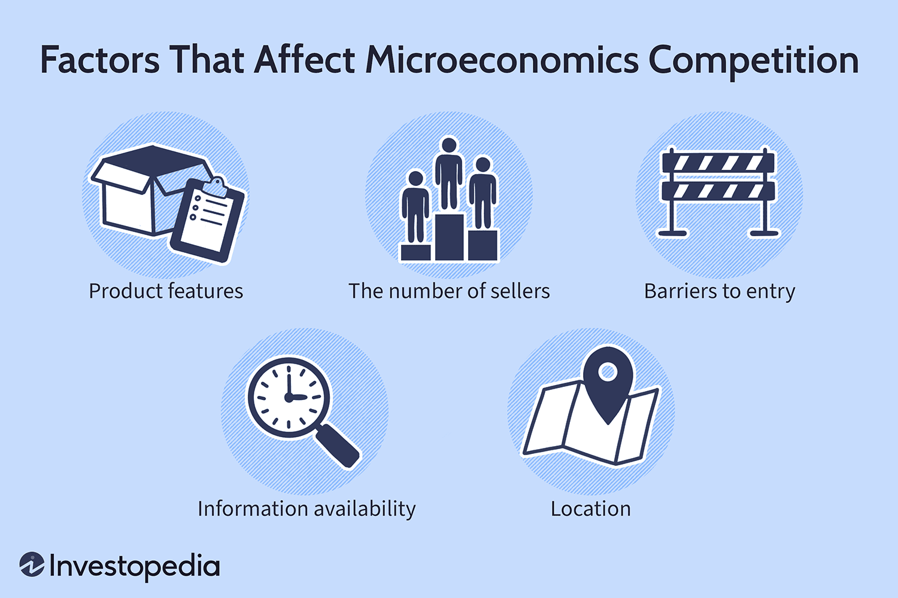

## Table of Contents

## What is competition in the context of microeconomics?

Competition in microeconomics refers to the way businesses and sellers try to attract customers and sell their products or services. In a competitive market, there are many buyers and sellers, and they all try to offer the best prices and quality to get more customers. This competition can lead to lower prices and better products for consumers because businesses have to work hard to stay ahead of their rivals.

There are different types of competition, like perfect competition, monopolistic competition, oligopoly, and monopoly. In perfect competition, many small businesses sell similar products, and no single business can control the market price. On the other hand, a monopoly happens when there is only one seller in the market, and they can set prices higher because customers have no other options. Understanding these types helps us see how businesses behave and how markets work.

## How do different market structures affect competition?

Different market structures change how businesses compete with each other. In perfect competition, there are many small businesses selling the same thing, like farmers selling wheat. No single business can set a higher price because customers can easily buy from someone else. This makes businesses focus on keeping costs low and being efficient, which is good for customers because they get lower prices.

In monopolistic competition, businesses sell similar but not exactly the same products, like different brands of shampoo. Each business tries to make their product seem special through advertising or adding new features. This type of market allows businesses to have some control over prices, but they still need to compete hard to keep customers. An oligopoly is when just a few big businesses dominate the market, like in the car industry. These businesses watch each other closely and might even work together to set prices, which can lead to less competition and higher prices for customers.

In a monopoly, there's only one business selling a product or service, like a local utility company. Without any competition, this business can set high prices because customers have nowhere else to go. This can be bad for customers because they have to pay more and might not get the best service. Each market structure shows a different level of competition, which affects how businesses behave and how much choice and good prices customers get.

## What role do barriers to entry play in influencing competition?

Barriers to entry are things that make it hard for new businesses to start selling in a market. These can be things like high costs to start a business, government rules, or the need for special technology. When barriers to entry are high, it's tough for new businesses to come in and compete. This means fewer businesses in the market, and the ones already there can keep their prices high because they don't have to worry much about new competition.

For example, if starting a new airline company costs a lot of money for planes and airport fees, it's hard for new airlines to start. This can lead to less competition and higher prices for plane tickets. On the other hand, if barriers to entry are low, it's easier for new businesses to join the market. This can lead to more competition, which is good for customers because more businesses means more choices and often lower prices. So, barriers to entry are really important in deciding how much competition there is in a market.

## How does the number of firms in a market impact competitive dynamics?

The number of firms in a market really changes how businesses compete. When there are lots of firms, like in perfect competition, each business has to work hard to keep prices low and quality high. They can't set high prices because customers can easily go to another firm. This makes the market very competitive, and it's good for customers because they get more choices and better deals.

On the other hand, when there are only a few firms, like in an oligopoly, things are different. These firms might watch each other closely and even work together to keep prices high. With fewer firms, it's easier for them to agree on prices and not compete too much. This can be bad for customers because they have fewer choices and might have to pay more. So, the number of firms in a market is a big deal when it comes to how much competition there is.

## What is the significance of product differentiation in competitive markets?

Product differentiation is when businesses make their products different from others to stand out in the market. This is really important in competitive markets because it helps businesses attract customers. If a business can make its product seem special, like by adding new features or using better materials, it can charge more money. This is because customers might think the product is worth the extra cost. For example, one company might sell a phone with a better camera, and customers who care about taking good photos might choose that phone even if it costs more.

In markets where products are similar, like in monopolistic competition, product differentiation is key. Businesses use advertising and branding to make their products seem unique. This way, they can keep customers loyal to their brand and not just choose the cheapest option. For instance, different brands of cereal might look similar, but through clever marketing and packaging, one brand might convince customers that it tastes better or is healthier. Product differentiation helps businesses compete better and can lead to more choices for customers, even if it sometimes means higher prices.

## How do cost structures influence a firm's competitive position?

Cost structures are important for how well a business can compete in the market. They include all the costs a business has to pay, like making the product, paying workers, and running the business. If a business can keep its costs lower than others, it can sell its products for less money or make more profit. This gives the business a big advantage because it can attract more customers with lower prices or use the extra profit to improve its products or grow.

For example, if a company can make cars cheaper than its competitors, it can sell those cars for less and still make money. This might make more people want to buy from that company, helping it to grow bigger and stronger. On the other hand, if a business has high costs, it might have to charge more for its products. This can make it hard to compete, especially if other businesses can offer similar products for less money. So, managing costs well is a key part of staying competitive in the market.

## What impact does government policy have on competition?

Government policies can have a big effect on how much competition there is in a market. Sometimes, the government makes rules that help competition. For example, they might stop big companies from working together to keep prices high, which is called antitrust laws. These laws make sure that businesses have to compete fairly and that customers can get good prices. The government might also give money or other help to small businesses to help them start and grow, which can lead to more competition in the market.

But sometimes, government policies can make competition less. For example, if the government gives special rights to just one company, like letting only one company run the trains in a city, it creates a monopoly. This means there's no competition, and the company can charge high prices. Also, if the government makes strict rules about who can start a business, it can be hard for new businesses to enter the market. This can keep competition low and make it harder for customers to get good deals.

## How do technological advancements affect competition within industries?

Technological advancements can change how businesses compete in their industries. When new technology comes out, it can make it easier for businesses to make their products better or cheaper. For example, if a new machine helps a company make cars faster and with less waste, they can sell those cars for less money. This can help them take customers away from other companies that don't have the new technology. Also, new technology can help businesses reach more customers, like using the internet to sell things all over the world. This can make the market more competitive because more businesses can join in and try to get customers.

But sometimes, new technology can make it harder for some businesses to compete. If the new technology is really expensive, only big companies might be able to afford it. This can make it tough for smaller businesses to keep up. For example, if a new computer system costs a lot of money, small shops might not be able to buy it, while big stores can. This can make the big stores even stronger and leave the small shops struggling to compete. So, while technology can help make things better and cheaper, it can also create bigger gaps between big and small businesses.

## What are the effects of globalization on competition in microeconomics?

Globalization means that businesses from different countries can now compete with each other more easily. This happens because it's easier to move goods and money around the world, and because the internet lets businesses sell to people everywhere. When businesses from different countries compete, it can make prices go down because they all want to attract customers. It can also make products better because businesses have to work harder to be the best. For example, a car company in one country might start making better cars because it has to compete with car companies from other countries.

But globalization can also make things harder for some businesses. If a big company from another country can make things cheaper because they have lower costs, they might take customers away from smaller local businesses. This can make it tough for those local businesses to keep going. Also, when businesses move to other countries to make things cheaper, it can mean fewer jobs in their home country. So, while globalization can help make things cheaper and better for customers, it can also make competition tougher for some businesses and change where jobs are.

## How do consumer preferences and behaviors influence market competition?

Consumer preferences and behaviors play a big role in how businesses compete in the market. When customers like certain things, like organic food or fast delivery, businesses have to pay attention. If more people want organic food, stores that sell it might get more customers. This can make other stores start selling organic food too, so they don't lose out. Businesses have to keep up with what customers want, or they might lose customers to other businesses that do a better job at meeting those wants.

Also, how customers act can change how businesses compete. If customers like to shop online and look for the best deals, businesses might have to lower their prices or offer free shipping to attract those customers. If customers are loyal to certain brands, businesses might focus on making their brand stronger through advertising. Understanding what customers like and how they act helps businesses decide how to compete, whether it's by offering better products, lower prices, or better service.

## What advanced economic models are used to analyze competition in microeconomics?

In microeconomics, one advanced model used to analyze competition is the game theory model. This model looks at how businesses make decisions when they know that other businesses are making decisions too. It's like a game where each business tries to guess what the others will do and then decides what's best for them. For example, if two phone companies are thinking about lowering their prices, they might use game theory to figure out if it's a good idea. They think about what the other company might do if they lower their prices, and then decide whether to do it or not. This helps economists understand how businesses compete and make choices in real life.

Another model is the contestable market theory. This model says that even if there aren't many businesses in a market, competition can still be strong if it's easy for new businesses to enter. If a business knows that new competitors could come in and take away customers, it has to keep its prices fair and its service good. For example, if there's only one airline flying a certain route, but it's easy for other airlines to start flying that route too, the first airline will be careful not to charge too much. This model helps economists see that competition isn't just about how many businesses are in the market, but also about how easy it is for new ones to join in.

## How can game theory be applied to understand strategic competition among firms?

Game theory helps us understand how businesses compete by looking at their decisions like moves in a game. Each business tries to guess what the others will do and then makes the best choice for itself. For example, if two companies are thinking about lowering their prices, they use game theory to figure out if it's a good idea. They think about what the other company might do if they lower their prices, and then decide whether to do it or not. This way, game theory shows us how businesses can make smart choices to stay ahead of their competition.

In real life, businesses often face situations where their success depends on what their competitors do. Game theory helps them plan for these situations. For instance, if a company is thinking about launching a new product, it will consider how its competitors might react. Will they launch a similar product? Will they lower their prices? By thinking through these scenarios, the company can decide the best time to launch the product and how to price it. Game theory gives businesses a way to think strategically and make better decisions in a competitive market.

## What are the key aspects of understanding microeconomic market forces?

Microeconomic market forces are primarily driven by the dynamics of supply and demand, which serve as the foundational mechanisms for the allocation of goods and services. These forces dictate market behavior and influence economic decisions at individual, household, and firm levels.

**Supply and Demand Dynamics**

The interplay between supply and demand is fundamental to understanding market forces. The supply curve illustrates the relationship between the price of a good and the quantity that producers are willing to supply. Typically, as the price of a good increases, suppliers are more willing to offer greater quantities, resulting in an upward-sloping supply curve. Conversely, the demand curve shows how much of a good consumers are willing and able to purchase at various price points. Generally, as the price decreases, consumers tend to purchase more, leading to a downward-sloping demand curve.

The intersection of the supply and demand curves denotes the market equilibrium, a state where the quantity supplied equals the quantity demanded. At this point, the market price stabilizes because there is no incentive for price change due to excess supply or demand. A formulaic approach to this equilibrium can be represented by solving the equations of the supply and demand curves:

$$
Q_s = Q_d
$$

where $Q_s$ is the quantity supplied and $Q_d$ is the quantity demanded. Solving these equations yields the equilibrium price and quantity.

**Role of Elasticity**

Elasticity is a pivotal concept that measures the responsiveness of the quantity supplied or demanded to changes in price or other economic variables. Price elasticity of demand, for instance, is calculated as:

$$
E_d = \frac{\%\ \Delta Q_d}{\%\ \Delta P}
$$

where $E_d$ denotes the price elasticity of demand, $\Delta Q_d$ is the change in quantity demanded, and $\Delta P$ is the change in price.

High elasticity suggests that a small price change leads to a significant change in the quantity demanded or supplied, a crucial [factor](/wiki/factor-investing) for pricing strategies and forecasting economic outcomes. Conversely, inelastic goods are less responsive to price changes, indicating that consumers will buy similar quantities regardless of price alterations, typically seen in essential goods.

Understanding supply and demand dynamics, along with elasticity, allows economists and businesses to predict market trends, devise strategic pricing, and make informed decisions regarding production and investment, all of which are essential to navigating the economic landscape efficiently.

## What is the impact of competition on algorithmic trading strategies?

The level of competition within financial markets significantly shapes the design and effectiveness of algorithmic trading strategies. In highly competitive markets, firms often employ high-frequency trading ([HFT](/wiki/high-frequency-trading-strategies)) algorithms to secure advantages in price efficiency and execution speed. HFT algorithms are designed to process and execute a large number of orders at extremely high speeds, often within milliseconds. This rapid execution is crucial in these environments, where even the smallest delay can lead to significant financial losses.

Mathematically, this can be understood through the concept of latency [arbitrage](/wiki/arbitrage). High-frequency traders capitalize on the small time difference between receiving market information and executing trades faster than other participants. The profit ΔP obtained through latency arbitrage can be represented as:

$$
\Delta P = V \times (\Delta T \times \sigma)
$$

where $V$ is the volume traded, $\Delta T$ is the latency (time advantage), and $\sigma$ is the volatility of the asset.

In markets characterized by oligopolistic structures or monopolistic competition, algorithmic trading strategies often focus on exploiting the strategic interactions among the few dominant market players. Firms may use game theoretical models to predict competitors' behaviors and adjust their strategies accordingly. For example, Nash Equilibrium concepts can help traders determine optimal bid and ask prices by considering the potential responses of other market participants.

Moreover, sophisticated algorithms are developed to accommodate differentiated strategies that account for market power, barriers to entry, and product differentiation inherent in less competitive market structures. These algorithms analyze historical market data to identify patterns and trends that suggest strategic moves by competitors.

Efficient competition analysis is crucial for algorithmic traders to adapt to rapid changes in market conditions and regulatory landscapes. This includes monitoring market fragmentation, where orders are distributed across multiple trading venues. Traders utilize algorithms to ensure effective order routing, achieving the best possible execution.

Algorithmic traders must also stay attuned to shifts in regulatory frameworks, as authorities may impose constraints on certain trading practices or enhance transparency requirements, impacting how strategies are formulated. Adaptive algorithms that modify their parameters in real-time based on feedback from market conditions can help maintain agility.

In summary, competition significantly impacts algorithmic trading strategies by dictating whether firms prioritize speed or strategic decision-making. Whether operating in highly competitive markets with high-frequency trading or navigating the complexities of monopolistic and oligopolistic environments, successful algorithmic trading hinges on leveraging technology to anticipate and respond to competitive dynamics efficiently.

## References & Further Reading

[1]: ["Microeconomic Theory"](https://ocw.mit.edu/courses/14-121-microeconomic-theory-i-fall-2015/) by Andreu Mas-Colell, Michael D. Whinston, and Jerry R. Green

[2]: Varian, H. R. (1992). ["Microeconomic Analysis,"](https://archive.org/details/microeconomicana00vari_0) 3rd Edition, W.W. Norton & Company.

[3]: Hasbrouck, J. (2007). ["Empirical Market Microstructure: The Institutions, Economics, and Econometrics of Securities Trading."](https://academic.oup.com/book/52241) Oxford University Press.

[4]: Aldridge, I. (2013). ["High-Frequency Trading: A Practical Guide to Algorithmic Strategies and Trading Systems."](https://www.ahmetbeyefendi.com/wp-content/uploads/2020/07/High-Frequency-Trading-Irene-Aldridge.pdf) John Wiley & Sons.

[5]: Lo, A. W. (2008). ["Hedge Funds: An Analytic Perspective."](https://www.jstor.org/stable/j.ctt7rq28) Princeton University Press.

[6]: Goolsbee, A., Levitt, S., & Syverson, C. (2020). ["Microeconomics."](https://www.macmillanlearning.com/ed/uk/product/Microeconomics--4th-edition/p/1319544290) Worth Publishers.