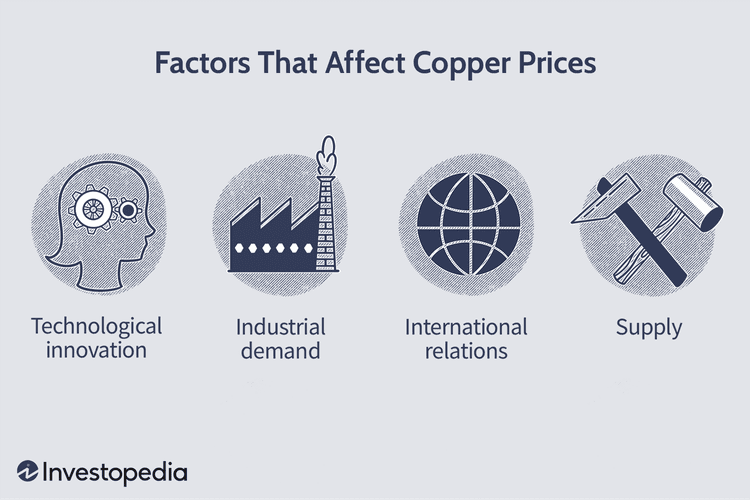

## Table of Contents

## What is copper and why is it important?

Copper is a metal that is reddish-orange in color. It is found in the earth and people have been using it for thousands of years. Copper is soft and easy to shape, which makes it useful for making things like wires, pipes, and coins. It is also a good conductor of electricity and heat, which means it can move electricity and heat very well.

Copper is important for many reasons. It is used in many things we use every day, like electrical wires in our homes and cars, and pipes that carry water. Without copper, many of our modern technologies would not work. Copper is also important for our health. Our bodies need a small amount of copper to stay healthy. It helps our bodies use iron and make energy. So, copper is a very useful and important metal.

## How do global supply and demand affect copper prices?

Global supply and demand have a big impact on copper prices. When there is more copper available than people want to buy, the price goes down. This happens because sellers need to lower their prices to sell all the copper they have. On the other hand, when there is not enough copper to meet everyone's needs, the price goes up. This is because buyers are willing to pay more to get the copper they need.

Many things can affect the supply and demand of copper. For example, if new copper mines open, more copper can be produced, which might increase the supply and lower prices. If a big factory that uses a lot of copper closes, the demand for copper might go down, which can also lower prices. On the other hand, if a country starts building a lot of new buildings and needs more copper for wiring and pipes, the demand can go up and push prices higher. So, the balance between how much copper is available and how much people want to buy is always changing, and this affects the price.

## What role do mining production levels play in copper pricing?

Mining production levels are very important for copper pricing. When miners produce a lot of copper, there is more copper available to buy. This usually makes the price go down because there is more copper than people need. If miners can't produce as much copper, maybe because a mine closes or there is a problem, there will be less copper available. This can make the price go up because people still need copper but there is not enough to go around.

Also, if new copper mines open up, it can change how much copper is produced. More mines mean more copper, which can lower prices. But starting a new mine takes a lot of time and money, so it doesn't happen quickly. Sometimes, mining companies might decide to slow down production if they think prices will go up later. This can affect how much copper is available and change the price. So, the amount of copper that miners produce is a big part of what makes copper prices go up or down.

## How do economic cycles impact the price of copper?

Economic cycles can have a big effect on the price of copper. During good times, when the economy is growing, people build more houses and factories. They also buy more cars and electronics. All these things need copper, so the demand for copper goes up. When more people want copper, the price usually goes up too. This is because there is not enough copper to go around, and buyers are willing to pay more to get what they need.

On the other hand, during bad economic times, like a recession, people don't build as much and they buy fewer things that use copper. This means the demand for copper goes down. When fewer people want copper, the price usually goes down too. This is because there is more copper available than people need, so sellers have to lower their prices to sell it all. So, the ups and downs of the economy can make copper prices go up and down too.

## What influence do currency fluctuations have on copper prices?

Currency fluctuations can affect copper prices because copper is traded all over the world. When the value of a country's money goes up compared to other countries, it can make copper cheaper for that country to buy from other places. But for countries where the money is worth less, copper becomes more expensive. This is because they need more of their money to buy the same amount of copper.

For example, if the U.S. dollar gets stronger, it means Americans can buy more copper with the same amount of dollars. This can increase the demand for copper and push the price up. But for countries with weaker currencies, like the euro or yen, the price of copper in their money goes up. This might make them buy less copper, which can lower the overall demand and affect the price in the global market. So, changes in currency values can make copper prices go up or down.

## How do geopolitical events affect the copper market?

Geopolitical events can shake up the copper market a lot. If there is a war or a big political problem in a country that makes a lot of copper, it can make it hard to get copper from that place. This can lower the supply of copper and make the price go up. For example, if a country puts new rules on copper mining or stops copper from leaving the country, it can change how much copper is available around the world. This can make the price go up because there is not enough copper to go around.

Also, if countries fight over who gets to sell copper, it can change the price too. Sometimes, countries might try to control the copper market by working together or fighting each other. This can make the price go up or down depending on what they do. For example, if a big group of countries that make copper decide to produce less, it can make the price go up because there is less copper available. So, big political events can make the copper market go up and down.

## What is the impact of trade policies and tariffs on copper prices?

Trade policies and tariffs can change the price of copper a lot. When a country puts a tariff on copper, it means they are adding a tax to copper that comes from other countries. This makes copper more expensive for people in that country to buy. If a lot of countries start putting tariffs on copper, it can make the price go up everywhere because it is harder and more expensive to move copper around the world.

Also, trade policies can change how much copper is available. If a country decides to stop trading copper with another country, it can lower the supply of copper. This can make the price go up because there is not enough copper to go around. So, what countries do with their trade rules can make copper prices go up or down depending on whether it is easier or harder to buy and sell copper.

## How does the recycling of copper influence its market price?

Recycling copper can help keep its price from going up too much. When people recycle copper, they take old copper and turn it into new things. This means there is more copper available to buy without having to dig up new copper from the ground. If there is more copper to go around, the price usually goes down because sellers don't have to charge as much to sell it all.

But recycling copper can also keep the price from going down too much. When the price of copper is low, it might not be worth it for people to recycle it because they won't make much money. So, less copper gets recycled, and there might not be enough copper to meet everyone's needs. This can make the price go up again because people still need copper but there is not enough of it. So, recycling copper helps keep the price of copper stable by balancing how much copper is available.

## What are the effects of technological advancements on copper demand and pricing?

Technological advancements can change how much copper people need. When new technology comes out, like electric cars or new kinds of electronics, it often uses a lot of copper. For example, electric cars need more copper for their batteries and motors than regular cars. When more people start using these new technologies, the demand for copper goes up. This can make the price of copper go up too because there is not enough copper to meet everyone's needs.

But technology can also help make copper cheaper. New ways of mining and processing copper can make it easier and less expensive to get copper out of the ground. Also, new technology can help find new places to mine copper. When it is easier and cheaper to produce copper, there is more copper available. This can make the price go down because there is more copper than people need. So, technology can make the price of copper go up or down depending on whether it makes people need more copper or makes it easier to get copper.

## How do inventory levels and stockpiles influence copper prices?

Inventory levels and stockpiles can have a big effect on copper prices. When there is a lot of copper stored in warehouses and stockpiles, it means there is more copper available than people need. This can make the price go down because sellers have to lower their prices to sell all the copper they have. If everyone knows there is a lot of copper stored away, they might wait to buy it until the price goes down even more.

On the other hand, when inventory levels are low and there is not much copper in stockpiles, it can make the price go up. This happens because there is not enough copper to go around, and buyers are willing to pay more to get the copper they need. If people think there will not be enough copper soon, they might buy more now, which can push the price up even higher. So, how much copper is stored away can change the price a lot.

## What role do speculative trading and futures markets play in copper price volatility?

Speculative trading and futures markets can make copper prices go up and down a lot. When people buy and sell copper on futures markets, they are making bets on what the price of copper will be in the future. If a lot of people think the price will go up, they might buy a lot of copper now, which can make the price go up right away. On the other hand, if people think the price will go down, they might sell their copper, which can make the price go down.

This kind of trading can make copper prices move around a lot because it is not just about how much copper people need right now. It is also about what people think will happen later. If there is a lot of guessing and betting going on, it can make the price of copper change quickly and unpredictably. So, speculative trading and futures markets can add a lot of ups and downs to copper prices.

## How do environmental regulations and sustainability trends affect the copper industry and its pricing?

Environmental regulations and sustainability trends can change how much it costs to mine and use copper. When governments make new rules to protect the environment, mining companies might have to spend more money to follow them. They might need to use special equipment or do things in a different way to make sure they don't harm the environment. This can make the cost of getting copper out of the ground go up, which can make the price of copper go up too. Also, if people start caring more about the environment, they might want to buy copper from places that are more sustainable. This can make the demand for certain kinds of copper go up and change the price.

Sustainability trends can also change how much copper people need. As more people try to live in a way that is good for the environment, they might buy more things like electric cars and solar panels. These things need a lot of copper, so the demand for copper can go up. When more people want copper, the price can go up too because there is not enough copper to go around. But if new technology helps find new ways to use less copper or recycle more copper, it can help keep the price from going up too much. So, what people do to help the environment can change how much copper is needed and how much it costs.

## What is the Role of Commodity Pricing?

Commodity pricing mechanisms are integral to determining the global price of copper, primarily through exchanges like the London Metal Exchange (LME) and the New York Mercantile Exchange's COMEX division. These platforms facilitate the buying and selling of copper futures and options, providing a mechanism for price discovery based on current trades and future market expectations.

The pricing of copper is heavily influenced by both current and forecasted demand. Significant global events and overarching trends, such as the transition towards renewable energy and the increasing demand for electric vehicles, play pivotal roles. For instance, policies promoting clean energy technologies increase the demand for copper, as it is a fundamental component in electric vehicle batteries, wind turbines, and solar panels.

Market reports predicting supply shortages or surpluses also critically impact copper pricing, alongside investor sentiment. A report indicating a forthcoming supply deficit due to reduced mining outputs can lead to increased buying activity, driving prices up. Conversely, forecasts of surplus supply might trigger selling, reducing prices. The interconnectedness of geographic markets enhances this effect; disruptions in supply from major copper-producing regions like Chile or Peru can ripple through global markets, affecting prices on exchanges worldwide.

Exchanges utilize specific mechanisms to set daily closing prices, such as the LME's "official prices," determined during live trading periods known as the ring. These official prices serve as benchmarks for contracts globally. Moreover, the use of cash-settled contracts versus physical delivery contracts can have implications on how the physical market reacts to changes in futures prices.

In practice, pricing formulae like the following might be used to evaluate potential hedge positions on exchanges:

$$
\text{Hedge Price} = \text{Spot Price} + (\text{Futures Price} - \text{Expected Spot Price})
$$

Where:
- The Spot Price reflects the current market value.
- The Futures Price is set by the exchange based on anticipated future changes.
- The Expected Spot Price estimates the future cash market price.

Overall, commodity pricing on exchanges impacts how producers, consumers, and traders strategize their engagements in the copper market, influencing financial decisions and risk management approaches globally.

## References & Further Reading

[1]: ["The Copper Market"](https://www.reuters.com/markets/commodities/main-facts-about-copper-market-prices-hit-record-highs-2024-05-20/) - London Metal Exchange. 

[2]: Solis, I. D., & Ponce, J. Economic and Political Risk Factors in Copper Production: Insights from Chile and Peru. Journal of Commodity Markets. 

[3]: ["Algorithmic Trading: Winning Strategies and Their Rationale"](https://www.amazon.com/Algorithmic-Trading-Winning-Strategies-Rationale-ebook/dp/B00CY5HC0U) by Ernest P. Chan

[4]: Bai, J., & Perron, P. (2003). Critical markets for copper and the factors that affect pricing. Journal of Applied Econometrics.

[5]: ["A Beginner's Guide to the Futures and Options Trading"](https://www.stockbrokers.com/education/how-to-trade-options) - Investopedia. 

[6]: Cassidy, J. (2010). Who influences copper prices? The impact of China and the global market. The China Quarterly.