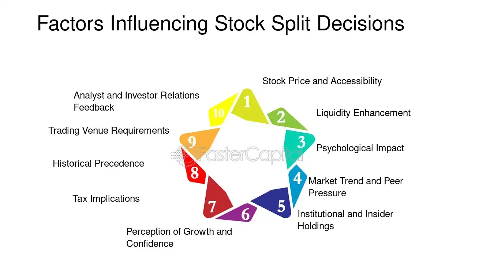

## Table of Contents

## What is a corporate stock split?

A corporate stock split is when a company decides to divide its existing shares into more shares. This means if you own one share, after the split, you might own two or more shares, but the total value of your investment stays the same. Companies do this to make their stock price lower, which can make it easier for more people to buy their stock.

For example, if a company's stock is trading at $100 per share and they do a 2-for-1 split, the price per share will drop to $50. You would then have twice as many shares, but the total value of your investment would still be the same. This can attract more investors because the lower price seems more affordable, even though the company's overall value hasn't changed.

## Why do companies decide to perform a stock split?

Companies decide to perform a stock split mainly to make their stock more attractive to investors. When a company's stock price is very high, it might seem too expensive for some people to buy. By splitting the stock, the price per share goes down, making it easier for more people to afford it. This can increase the demand for the stock, which might help the company's stock price go up over time.

Another reason for a stock split is to keep the stock in a certain price range that is seen as more accessible. Many investors and traders prefer stocks that are priced within a certain range, often under $100 per share. By doing a stock split, a company can keep its stock price in this range, which can make it more appealing to these investors. This can also make the stock more liquid, meaning it's easier to buy and sell, which is good for both the company and the shareholders.

## How does a stock split affect the stock price?

When a company does a stock split, the price of each share goes down. For example, if a company's stock is $100 per share and they do a 2-for-1 split, the price will drop to $50 per share. This happens because the total value of the company doesn't change, but now there are more shares. So, if you owned one share before the split, you would own two shares after, but the total value of your investment would stay the same.

The lower price after a stock split can make the stock seem more affordable to new investors. This might make more people want to buy the stock, which could increase demand and possibly push the stock price up over time. However, the stock split itself doesn't change the company's value; it just changes how the value is divided among more shares.

## What is the impact of a stock split on shareholders?

When a company does a stock split, it doesn't change the total value of what shareholders own. If you had one share worth $100 and the company did a 2-for-1 split, you would have two shares, but each would be worth $50. So, the total value of your investment stays the same. This means you are not richer or poorer just because of the split.

However, a stock split can make it easier for you to sell your shares if you want to. With more shares at a lower price, it might be easier to find buyers. Also, if more people start buying the stock because it's cheaper, the price might go up over time. But remember, the stock split itself doesn't make the company worth more; it just changes how the value is split into more shares.

## Can you explain the difference between a forward and a reverse stock split?

A forward stock split is when a company decides to split its shares into more pieces. For example, in a 2-for-1 forward split, if you own one share, you get another one for free. This makes the price of each share go down, but the total value of your investment stays the same. Companies do this to make their stock seem cheaper and attract more investors. It's like cutting a pizza into more slices; the pizza doesn't get bigger, but each slice is smaller.

A reverse stock split is the opposite. Here, the company takes multiple shares and combines them into fewer shares. For example, in a 1-for-2 reverse split, if you own two shares, they become one share. This makes the price of each share go up, but again, the total value of your investment doesn't change. Companies might do this if their stock price is too low and they want to make it look more valuable. It's like combining pizza slices to make fewer, bigger slices; the pizza stays the same size, but each slice is larger.

## What are the psychological effects of a stock split on investors?

When a company does a stock split, it can make investors feel more excited about the stock. This is because the price of each share goes down, which makes the stock seem cheaper and more affordable. People often think that a lower price means a better deal, even if the total value of the company doesn't change. This can make more people want to buy the stock, which might make them feel good about their investment.

Also, a stock split can make investors feel more confident about the company. When a company decides to split its stock, it's often seen as a sign that the company is doing well and expects to keep growing. This can make investors feel more positive and hopeful about their investment. They might think that if the company is confident enough to split its stock, then the future looks bright, and this can make them feel more secure about holding onto their shares.

## How do stock splits influence a company's market liquidity?

When a company does a stock split, it can make the stock easier to buy and sell. This is because the price of each share goes down, which can attract more people to buy the stock. More buyers and sellers mean that the stock can be traded more easily. This is called increasing the market liquidity of the stock. It's like having more people at a market; it's easier to find someone to trade with.

A stock split doesn't change how much the company is worth, but it can make the stock seem more affordable. When more people think they can afford the stock, they are more likely to buy it. This can lead to more trading happening, which makes the stock more liquid. So, even though the company's value stays the same, the stock becomes easier to trade because of the lower price per share.

## What role do stock splits play in a company's long-term strategy?

Stock splits can be a part of a company's long-term strategy to keep their stock attractive to investors. When a company's stock price gets very high, it might seem too expensive for some people to buy. By doing a stock split, the company can lower the price per share, making it easier for more people to afford it. This can help the company attract new investors and keep the stock in a price range that many people like. Over time, this can help the company grow by increasing the number of people who own its stock.

Another way stock splits fit into a company's long-term strategy is by signaling confidence to the market. When a company decides to split its stock, it often shows that the company believes in its future growth. This can make investors feel more positive about the company and more likely to hold onto their shares or buy more. By keeping the stock price in a range that feels good to investors, the company can help maintain a strong and stable stock price over the long term, which is good for the company's overall health and growth.

## How do stock splits affect a company's valuation metrics like P/E ratio?

When a company does a stock split, it doesn't change the company's overall value. So, the price-to-earnings (P/E) ratio, which is a way to see how much investors are willing to pay for a dollar of the company's earnings, stays the same right after the split. The P/E ratio is calculated by dividing the stock price by the earnings per share. Since a stock split changes both the stock price and the number of shares in the same way, the P/E ratio doesn't change.

However, over time, a stock split might affect the P/E ratio indirectly. If more people start buying the stock because it's cheaper, the demand might go up, and the stock price could increase. If the stock price goes up faster than the company's earnings, the P/E ratio could go up too. But this isn't because of the stock split itself; it's because of how people react to the lower price and what happens to the stock price after the split.

## What are the tax implications of a stock split for investors?

A stock split does not have any immediate tax implications for investors. This means you don't have to pay taxes just because a company splits its stock. When a stock splits, you get more shares, but the total value of your investment stays the same. So, the IRS (Internal Revenue Service) doesn't see this as a taxable event.

However, if you decide to sell your shares after a stock split, you might have to pay capital gains tax. The tax depends on how much your shares have gone up in value since you bought them, not on the stock split itself. If you sell your shares for more than you paid for them, you'll owe taxes on the profit. But the stock split doesn't change how much you originally paid for the shares or how much you sell them for; it just changes how many shares you have.

## How do stock splits impact options and other derivative securities?

When a company does a stock split, it changes the number of shares and the price of each share, which can affect options and other derivative securities. Options are contracts that give you the right to buy or sell a stock at a certain price. If a company does a 2-for-1 stock split, the number of options you have will double, but the price at which you can buy or sell the stock (called the strike price) will be cut in half. This keeps the total value of your options the same, but it can make them easier to trade because the price per share is lower.

Other derivative securities, like futures or warrants, are also affected by stock splits. Just like with options, the number of these securities will change to match the new number of shares after the split, and their prices will adjust accordingly. This means that the overall value of your investment in these securities doesn't change right away because of the stock split. However, if the stock becomes more popular and the price goes up after the split, the value of your derivatives might increase too.

## What historical data exists on stock splits and their effects on stock performance?

Looking at history, stock splits often make a company's stock go up right after the split. This is because when the price of each share goes down, more people think they can buy it. They feel like they are getting a good deal. For example, when Apple did a 7-for-1 stock split in 2014, the stock price went up a lot in the months after the split. Studies show that, on average, stocks do better in the year after a split than they did in the year before. But, this isn't always true for every company.

Over the long term, stock splits don't change how much a company is worth. The total value stays the same, just spread out over more shares. But, stock splits can make more people want to buy the stock, which can push the price up. A study by David Ikenberry and Sundaresh Ramnath found that stocks that split did better than the market for up to three years after the split. This shows that splits can have a good effect on stock prices for a while, but it's not a sure thing and depends on many other things like how the company is doing and what's happening in the economy.

## References & Further Reading

[1]: Bergstra, J., Bardenet, R., Bengio, Y., & Kégl, B. (2011). ["Algorithms for Hyper-Parameter Optimization."](https://dl.acm.org/doi/10.5555/2986459.2986743) Advances in Neural Information Processing Systems 24.

[2]: ["Advances in Financial Machine Learning"](https://www.amazon.com/Advances-Financial-Machine-Learning-Marcos/dp/1119482089) by Marcos Lopez de Prado

[3]: ["Evidence-Based Technical Analysis: Applying the Scientific Method and Statistical Inference to Trading Signals"](https://www.amazon.com/Evidence-Based-Technical-Analysis-Scientific-Statistical/dp/0470008741) by David Aronson

[4]: ["Machine Learning for Algorithmic Trading"](https://github.com/stefan-jansen/machine-learning-for-trading) by Stefan Jansen

[5]: ["Quantitative Trading: How to Build Your Own Algorithmic Trading Business"](https://www.amazon.com/Quantitative-Trading-Build-Algorithmic-Business/dp/1119800064) by Ernest P. Chan