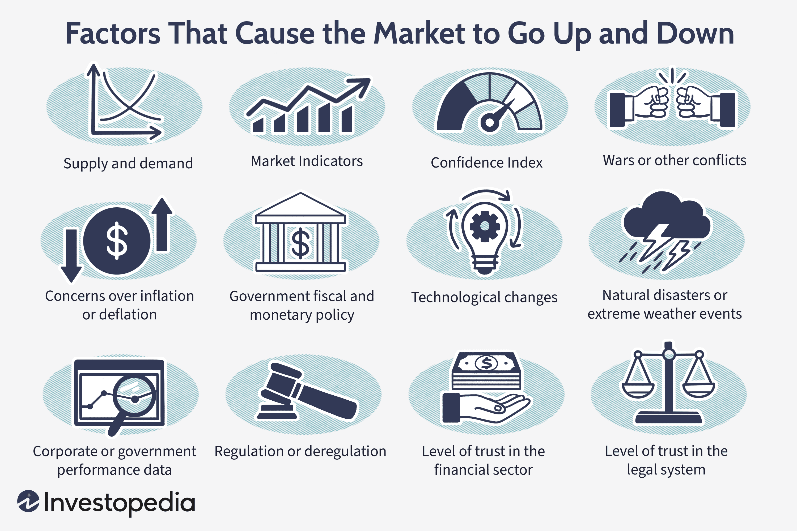

Investing encompasses various strategies and technologies, among which stock splits and algorithmic trading are key components that shape financial outcomes. Stock splits, where a company adjusts the number of its shares without changing overall market value, serve as strategic corporate actions with implications for liquidity and investor perception. Algorithmic trading employs computer programs to execute trades at optimal speeds and conditions, enhancing decision-making in markets responding to such corporate maneuvers.

By understanding the impact of stock splits and incorporating algorithmic trading, investors can better navigate financial markets to achieve enhanced returns. Stock splits can increase market activity and signal corporate confidence, while algorithmic trading offers precision and efficiency, thus forming a potent combination for investment strategies.



We will examine the effects of stock splits on investments, strategic corporate finance applications, and the integration of algorithmic trading to capitalize on these events. Such an exploration will present a well-rounded understanding of these concepts' importance in current financial markets. This comprehensive overview of stock splits and algorithmic trading aims to equip investors with the knowledge needed to leverage corporate and technological strategies for optimal financial results.

## Table of Contents

## Understanding Stock Splits

A stock split is a corporate maneuver that adjusts the number of shares a company has without altering its total market capitalization. This strategic move is primarily executed in two forms: forward stock splits and reverse stock splits. 

In a forward stock split, a company increases the number of its shares. This is usually done by a specific ratio; for instance, a 2-for-1 split would result in each existing share being split into two shares. This multiplication reduces the price per share, effectively making the stock more affordable and theoretically more attractive to investors. Consequently, forward stock splits may enhance liquidity by facilitating increased trading activity and potentially drawing more investors due to the perceived affordability.

Conversely, a reverse stock split consolidates the number of shares outstanding, resulting in fewer shares. This maneuver is often implemented to increase the stock price and satisfy listing requirements of exchanges which may have minimum price thresholds. For example, in a 1-for-2 reverse split, two existing shares are merged into one, thereby doubling the share price while reducing the total share count.

Stock splits exert considerable influence over various market dynamics. They can alter stock [liquidity](/wiki/liquidity-risk-premium), change investor perception, and thereby influence trading volumes and market attractiveness. For example, a well-publicized forward split might draw retail investors aiming to capitalize on perceived value, while a reverse split may lead to investor skepticism regarding a company's financial health.

To evaluate investment opportunities effectively and predict market reactions, understanding the rationale and mechanisms behind stock splits is essential. Companies like Apple and NVIDIA have employed stock splits as strategic tools to enhance market accessibility and liquidity. Apple's 4-for-1 split in 2020 was executed to make shares more affordable to a broader base of investors, sparking increased interest and trading activity. NVIDIA's 4-for-1 split in 2021 operated similarly, aiming to appeal to a broader investor demographic and improve trading fluidity. Such examples underscore the potential strategic benefits that well-executed stock splits can drive in bolstering a company's market presence and investor engagement.

## Stock Split Investment Strategy

Investing in stock splits can yield significant returns by strategically aligning portfolios with these corporate actions. When a company announces a stock split, it can lead to price adjustments and heightened market activity. Here are some strategies investors can employ:

1. **Monitoring Split Announcements**: Vigilance in tracking companies' split announcements is crucial. Publicly traded companies are required to disclose any stock split plans, which can be accessed via press releases or financial news outlets. Engaging with this information allows investors to anticipate shifts in stock valuation and trading volumes. Utilizing automated alerts from financial platforms can ensure timely awareness of such announcements.

2. **Analyzing Historical Performance**: Historical data play an invaluable role in predicting potential outcomes post-split. Investors should examine previous performance patterns of a stock following past splits, as well as industry-wide trends. Historical analysis can reveal insights into how splits have influenced stock prices and volatility. For example, a stock split could lead to a temporary price surge due to increased demand as shares become more affordable.

3. **Understanding Industry-Specific Impacts**: The impact of a stock split can vary across different industries. Some sectors might respond more positively to stock splits due to industry norms or investor behavior. It's important to consider the competitive landscape and market conditions that might influence investor sentiment. For instance, technology companies like Apple have frequently used stock splits to make their high-priced shares more accessible to a broader range of investors.

4. **Leveraging Technical Analysis and Historical Data**: Investors should employ technical analysis tools to assess potential post-split price movements. By examining charts and patterns, investors can identify key indicators that suggest favorable entry and exit points. Technical analysis, combined with historical performance data, helps in formulating a robust strategy that anticipates market behavior post-split.

5. **Signal of Management Confidence**: A stock split often indicates management's confidence in the company's future performance. This signal can attract more investors, creating a perception of stability and growth potential. Recognizing this can lead to timely investments that capitalize on the ensuing investor interest and price appreciation.

By integrating these strategies, investors can optimize their approach to stock splits, enhancing their market positioning and potential financial returns. A well-considered investment strategy that incorporates timely information, historical data, and technical analysis is key to successfully navigating the opportunities presented by stock splits.

## Corporate Finance and Stock Splits

Incorporating stock splits into corporate finance strategies requires a meticulous examination of several key factors including market conditions, investor perceptions, and the implications on capital structure. Stock splits, which can take the form of either forward or reverse splits, are primarily used by companies to enhance stock liquidity and increase market participation among retail investors by making shares more affordable. 

For example, a forward stock split increases the number of shares while reducing the price per share, without affecting the company's overall market capitalization. This perception of affordability can attract a wider shareholder base, thereby potentially improving demand for the stock. Conversely, a reverse stock split consolidates shares, often used to meet stock exchange listing requirements or to project stability and value in a volatile market.

From a strategic perspective, stock splits can signal a company’s confidence in its continued growth and stability. They convey a positive message regarding the firm's prospects, which can enhance investor interest and potentially boost stock prices post-split. Furthermore, by broadening the shareholder base, companies often aim to foster greater market engagement and loyalty, which could translate into more stable shareholding patterns.

Understanding the motivation behind a company's decision to enact a stock split provides valuable insights into its financial health and strategic intentions. This includes analyzing the company's historical performance, growth trajectory, and competitive positioning within the industry. Companies like Apple and NVIDIA have historically implemented stock splits to maintain or increase their stocks' market liquidity and accessibility, thereby aligning their corporate actions with long-term strategic goals.

Corporate finance professionals must also assess how stock splits influence a firm's valuation and investor relations. Precise calculations and models are utilized to predict the impact of a stock split on metrics such as earnings per share (EPS) and price-to-earnings (P/E) ratios, both crucial for evaluating a company's market standing post-split. Additionally, maintaining effective communication with investors during these corporate actions is essential to manage expectations and uphold transparency, thereby preserving confidence and trust in the firm's management.

To align stock splits with broader corporate objectives, a comprehensive evaluation of financial metrics and market trends is indispensable. This involves leveraging quantitative models and analytical tools to simulate how stock splits might affect the company’s position within the market. By systematically analyzing historical data, market conditions, and investor behavior, companies can better strategize their stock management tactics to enhance shareholder value and achieve sustainable growth.

## Algorithmic Trading and Stock Splits

Algorithmic trading involves the use of sophisticated computer algorithms to automatically execute trades, optimizing both the speed and efficiency of financial transactions. The dynamic financial landscapes created by stock splits present unique opportunities for [algorithmic trading](/wiki/algorithmic-trading). Algorithmic systems can be optimized to adapt quickly to price changes and shifts in liquidity that accompany stock splits.

Stock splits, by altering share prices and affecting liquidity, provide a fertile ground for algorithmic traders. Algorithms can be programmed to respond to these changes using pre-defined conditions. For instance, when a forward stock split occurs, the reduction in individual share price can increase liquidity, prompting algorithms to either buy or sell shares based on pre-set thresholds. Algorithms can exploit this enhanced liquidity to enter or [exit](/wiki/exit-strategy) positions rapidly, potentially achieving better execution prices due to the increased trading activity.

By utilizing historical data and advanced predictive models, algorithms can identify trends and patterns in post-split market behavior. For example, [machine learning](/wiki/machine-learning) algorithms might analyze prior stock splits to predict price trajectory and [volatility](/wiki/volatility-trading-strategies) adjustments in similar current scenarios. This predictive capability allows for the optimization of trading strategies, enhancing the probability of making profitable trades. 

Adjustments to existing algorithms are crucial to account for stock split events. This involves recalibrating the parameters that govern trade execution, such as volatility thresholds and liquidity conditions. As stock splits often result in temporary changes in market dynamics, maintaining robust systems capable of adapting to these fluctuations is necessary for maximizing trading returns. Algorithmic traders must ensure their systems are resilient to the increased volatility that can accompany stock splits, allowing them to manage risk effectively.

Machine learning and predictive analytics introduce a further layer of sophistication in adapting algorithmic strategies to stock splits. Implementing models that learn over time from a growing dataset of split events can enhance the responsiveness and accuracy of algorithmic trading systems. For instance, a Python-based machine learning model could be employed to continuously refine predictions on stock behavior post-split, using libraries such as scikit-learn or TensorFlow.

Incorporating these technological advancements, algorithmic trading not only solves traditional trading inefficiencies but also leverages the opportunities created by corporate actions like stock splits. This integration helps traders maintain an edge in today's fast-paced and complex financial markets.

## Real-World Examples and Case Studies

Examining real-world instances of stock splits, such as those conducted by NVIDIA and Apple, reveals significant insights into market reactions and strategic benefits that companies aim to achieve through these corporate actions.

NVIDIA, a leader in the semiconductor industry, executed a 4-for-1 stock split on July 20, 2021. This move was driven by the intention to make the stock more accessible to a broader range of investors, thereby enhancing market liquidity and attracting additional retail investment. The announcement of NVIDIA's stock split resulted in an immediate positive market reaction, with the company's stock price appreciating in anticipation of improved accessibility and potential future growth. Post-split, there was a significant uptick in trading volumes, indicating increased investor activity and interest. This case demonstrates how aligning the strategic intentions of a stock split with market accessibility goals can lead to favorable investor perceptions.

Apple, known for its consumer electronics and innovative technology, has conducted several stock splits, with its most recent being a 4-for-1 split on August 31, 2020. Apple's decision was aligned with its strategy to make stock ownership more affordable and accessible, reinforcing investor confidence in the company's growth prospects. Historically, Apple's stock splits have been followed by a substantial increase in shareholder base and trading volumes, reinforcing the perception of stability and growth potential. The company's performance post-split often reflected an upward trend, underlining management's confidence in Apple's long-term growth trajectory.

Analyzing these case studies sheds light on the importance of timing and strategic alignment in executing stock splits. Successful stock splits often signal management's positive outlook on future performance, thereby attracting increased investor participation and driving market liquidity. Conversely, analyzing less successful stock splits can provide valuable lessons in understanding potential pitfalls, such as misalignment with market conditions or inadequate communication strategies, which may lead to adverse market reactions.

These examples highlight the necessity for companies to not only forecast market trends accurately but also align their strategic intentions with investor expectations. By integrating the lessons learned from these real-world scenarios, traders and investors can refine their approaches to stock splits, optimizing their investment strategies to capitalize on market positioning, liquidity enhancement, and broader investor engagement.

## Challenges and Risks

Investors often encounter significant challenges when dealing with stock splits, primarily due to increased market volatility, execution risks, and algorithmic complexities. Stock splits can cause fluctuations in market perception, leading to speculative trading behaviors that may amplify volatility. This can skew the perceived value of a company, as traders might interpret splits as signals for company strength or upcoming growth, regardless of actual financial health.

Algorithmic trading introduces another layer of complexity, particularly in managing technical challenges such as data accuracy, latency, and system scalability. Ensuring data accuracy is crucial, as flawed data can lead to incorrect predictions and suboptimal trading decisions. Latency, or the delay before a transfer of data begins, can drastically affect trading outcomes, especially when algorithms react to split announcements in milliseconds. Scalability issues may arise as trading volumes surge post-split, requiring robust infrastructure to handle increased data flow and transaction processing.

Regulatory compliance and market fairness also play critical roles in algorithmic trading. Algorithms must adhere to trading regulations to prevent market manipulation and ensure equality in transaction processes. Traders must implement robust risk management frameworks to navigate these legal waters, ensuring that their strategies do not inadvertently breach regulatory boundaries.

To address these risks, investors and algorithmic traders need to adopt adaptive strategies, allowing them to respond to the dynamic market environment surrounding stock splits. This includes deploying machine learning models to continuously adjust to new data patterns and market conditions. A Python-based approach utilizing libraries such as TensorFlow or PyTorch can optimize predictive modeling. For example:

```python
import numpy as np
import tensorflow as tf

# Example of a simple neural network model to predict post-split stock movements
model = tf.keras.models.Sequential([
    tf.keras.layers.Dense(128, activation='relu', input_shape=(input_shape,)),
    tf.keras.layers.Dense(64, activation='relu'),
    tf.keras.layers.Dense(1, activation='linear')])

model.compile(optimizer='adam', loss='mean_squared_error')

# Assuming X_train and y_train are preprocessed dataset components
model.fit(X_train, y_train, epochs=50, batch_size=32)
predictions = model.predict(X_test)
```

This strategy models market behavior and pre-split trends, enabling informed decisions amid the challenges posed by stock splits and algorithmic trading dynamics. By preparing for potential pitfalls and embracing advanced analytics, investors can effectively navigate the complexities of this multifaceted investment landscape.

## Conclusion

Stock splits and algorithmic trading are integral components of contemporary investment strategies, offering both significant opportunities and inherent challenges. Understanding the dynamics of stock splits is crucial for investors aiming to optimize their strategies by leveraging the potential for price adjustments and shifts in market behavior. When a company announces a stock split, it often signals confidence in its growth prospects, potentially leading to increased investor interest and improved liquidity. By anticipating these movements, investors can position their portfolios to benefit from subsequent price appreciation.

Algorithmic trading, on the other hand, provides a technological advantage, enabling investors to execute trades with precision and speed in response to corporate actions like stock splits. Algorithms can be designed to detect patterns in market data, allowing for efficient and effective trade execution. This approach minimizes human error and maximizes the ability to react to rapid market changes, a critical [factor](/wiki/factor-investing) when dealing with the volatility that can accompany stock splits.

A comprehensive investment strategy should integrate both financial insights and technological advancements. By combining an understanding of the financial implications of stock splits with the technical capabilities of algorithmic trading, investors can more effectively navigate today’s complex financial environment. This dual approach not only aids in managing risks but also enhances the potential for returns.

Investors are encouraged to remain vigilant, continuously educating themselves about new trends and refining their strategies as the financial landscape evolves. By doing so, they can maintain competitive market positions and achieve superior investment returns, adapting to both the challenges and opportunities presented by stock splits and advanced trading technologies.

## References & Further Reading

[1]: Bergstra, J., Bardenet, R., Bengio, Y., & Kégl, B. (2011). ["Algorithms for Hyper-Parameter Optimization."](https://dl.acm.org/doi/10.5555/2986459.2986743) Advances in Neural Information Processing Systems 24.

[2]: ["Advances in Financial Machine Learning"](https://www.amazon.com/Advances-Financial-Machine-Learning-Marcos/dp/1119482089) by Marcos Lopez de Prado

[3]: ["Evidence-Based Technical Analysis: Applying the Scientific Method and Statistical Inference to Trading Signals"](https://www.amazon.com/Evidence-Based-Technical-Analysis-Scientific-Statistical/dp/0470008741) by David Aronson

[4]: ["Machine Learning for Algorithmic Trading"](https://github.com/stefan-jansen/machine-learning-for-trading) by Stefan Jansen

[5]: ["Quantitative Trading: How to Build Your Own Algorithmic Trading Business"](https://www.amazon.com/Quantitative-Trading-Build-Algorithmic-Business/dp/1119800064) by Ernest P. Chan