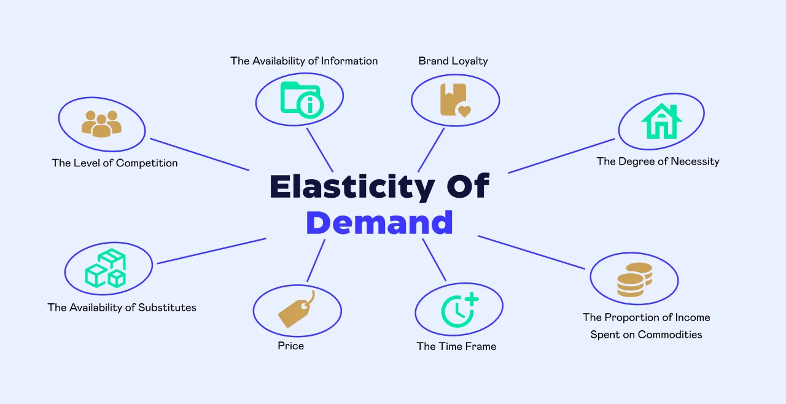

## Table of Contents

## What is demand elasticity?

Demand elasticity is a measure that shows how much the quantity demanded of a good or service changes when its price changes. It helps businesses and economists understand how sensitive consumers are to price changes. If the demand for a product is elastic, it means that a small change in price can lead to a big change in the quantity demanded. On the other hand, if the demand is inelastic, the quantity demanded doesn't change much even if the price changes a lot.

For example, think about gasoline. Even if the price of gas goes up, people still need to drive to work or school, so they might not buy much less gas. This makes the demand for gasoline inelastic. Now think about luxury items like fancy watches. If the price of a fancy watch goes up, people might decide not to buy it and choose a cheaper watch instead. This makes the demand for fancy watches elastic. Understanding demand elasticity helps companies set prices that will maximize their profits.

## What are the main types of demand elasticity?

There are a few main types of demand elasticity that help us understand how people react to changes in price. The first type is price elasticity of demand. This measures how much the quantity of a product people want to buy changes when its price changes. If a small price change makes people buy a lot more or a lot less of the product, we say the demand is elastic. If the price change doesn't affect how much people buy very much, we say the demand is inelastic.

Another type is income elasticity of demand. This looks at how the quantity demanded changes when people's income changes. If people buy more of a product when they have more money, that product has positive income elasticity. If they buy less of it when they have more money, it has negative income elasticity. This helps businesses understand if their products are seen as necessities or luxuries.

The last main type is cross elasticity of demand. This measures how the quantity demanded of one product changes when the price of another product changes. If the price of one product goes up and people start buying more of another product instead, those two products are substitutes and have positive cross elasticity. If the price of one product goes up and people buy less of another product, those products are complements and have negative cross elasticity. This helps companies see how their products relate to others in the market.

## How does the availability of substitutes affect demand elasticity?

The availability of substitutes has a big impact on how elastic demand is for a product. If there are a lot of other products that people can choose instead of the one you're selling, then the demand for your product will be more elastic. This means that if you raise the price of your product, people will easily switch to one of the substitutes, and you'll sell a lot less of your product. For example, if you sell a certain brand of soda and there are many other soda brands available, people might just buy a different brand if your soda gets too expensive.

On the other hand, if there aren't many substitutes for your product, then the demand will be more inelastic. This means that even if you raise the price, people won't have many other options, so they'll keep buying your product. For example, if you sell a medicine that treats a rare disease and there's no other medicine like it, people will still buy it even if the price goes up because they need it. So, the more substitutes there are, the more elastic the demand will be, and the fewer substitutes there are, the more inelastic the demand will be.

## What role does the proportion of income spent on the good play in demand elasticity?

The amount of money people spend on a product compared to their total income affects how much they care about price changes. If a product takes up a big part of someone's income, like buying a car or paying rent, people will be very sensitive to price changes. They will look for cheaper options if the price goes up because it makes a big difference in their budget. This means the demand for these kinds of products is usually more elastic.

On the other hand, if a product is cheap and doesn't take much of someone's income, like buying a candy bar or a pen, people won't care as much if the price changes a little. They can still afford it even if the price goes up a bit, so they will keep buying it. This makes the demand for these small, inexpensive items more inelastic because people are less likely to change their buying habits over small price changes.

## How does the necessity of a product influence its demand elasticity?

The necessity of a product plays a big role in how elastic its demand is. If a product is a necessity, like medicine or basic food items, people will keep buying it even if the price goes up. They need these things to live and stay healthy, so they don't have much choice. This makes the demand for necessities more inelastic because people will still buy them no matter the price.

On the other hand, if a product is not a necessity, like a luxury item or a non-essential good, people can easily choose not to buy it if the price goes up. They can live without these things, so if they get too expensive, people will just stop buying them. This makes the demand for non-necessities more elastic because people are more sensitive to price changes for things they don't really need.

## What is the impact of time on demand elasticity?

Time affects how people react to price changes. In the short term, people might not be able to change their habits quickly. For example, if the price of gas goes up, people still need to drive to work, so they might keep buying the same amount of gas for a while. This makes demand seem more inelastic in the short term because people can't adjust right away.

But over time, people can make bigger changes. They might start carpooling, taking public transport, or buying a more fuel-efficient car. As people find ways to use less gas or switch to other options, the demand becomes more elastic. So, the longer people have to adjust to a price change, the more elastic the demand for a product can become.

## How does consumer awareness and understanding of the product affect demand elasticity?

When people know a lot about a product, they can make better choices about whether to buy it or not. If they understand the product well, they might be more likely to switch to something else if the price goes up. This is because they know about other options that might be cheaper or just as good. For example, if someone knows a lot about different brands of smartphones, they might choose a different brand if their usual one gets too expensive. So, when consumers are well-informed, demand can be more elastic because they are more likely to change what they buy based on price.

On the other hand, if people don't know much about a product, they might not realize there are other choices. They might keep buying the same thing even if the price goes up because they don't know about cheaper options. For instance, if someone doesn't know much about different kinds of coffee, they might keep buying the same brand even if it gets more expensive. This makes demand more inelastic because people are less likely to switch to something else when they're not aware of other options. So, how much people know about a product can really change how they react to price changes.

## What is the relationship between the elasticity of demand and the market definition?

The way we define a market can change how elastic the demand for a product seems. If we think of a market as very narrow, like only one brand of cereal, then there might be a lot of other cereals that people can switch to if the price goes up. This makes the demand for that one brand seem more elastic because people have a lot of other choices. But if we think of the market more broadly, like all breakfast foods, then there might not be as many options that people can easily switch to. This can make the demand seem more inelastic because people don't have as many other things to choose from.

So, how we define the market really matters. If we look at a smaller part of the market, the demand can seem more elastic because there are more substitutes. But if we look at a bigger part of the market, the demand might seem more inelastic because there are fewer substitutes. This is important for businesses to understand because it can help them set prices that will work best for their products.

## How do changes in consumer preferences impact demand elasticity?

Changes in what people like can make demand more or less elastic. If people start to really like a product and see it as a must-have, they might not care as much if the price goes up. They'll still want to buy it because they like it so much. This makes the demand for that product more inelastic because people are less likely to stop buying it even if it gets more expensive. For example, if a new type of smartphone becomes really popular, people might keep buying it even if the price goes up because they want the latest and coolest phone.

On the other hand, if people start to like a product less, they might be more willing to switch to something else if the price goes up. This makes the demand more elastic because people are more likely to look for cheaper options or different products. For instance, if people start to think that a certain brand of sneakers is not as cool anymore, they might choose a different brand if the price of the first one goes up. So, how much people like a product can really change how they react to price changes.

## What econometric models are used to measure demand elasticity?

Economists use different models to figure out how much people's buying habits change when prices change. One common model is the regression model. In this model, economists collect data on the price of a product and how much of it people buy over time. They then use this data to see how changes in price affect the amount people buy. This helps them calculate the elasticity of demand, which tells them how sensitive people are to price changes. If a small price change leads to a big change in how much people buy, the demand is elastic. If the price change doesn't affect how much people buy very much, the demand is inelastic.

Another model economists use is the log-log model. This model is a special type of regression where both the price and the quantity demanded are turned into logarithms. Using logarithms makes it easier to see how a percentage change in price affects the percentage change in quantity demanded. This is helpful because it gives a direct measure of elasticity. For example, if the log-log model shows that a 1% increase in price leads to a 2% decrease in quantity demanded, the elasticity is -2, meaning the demand is elastic. These models help businesses and economists understand how to set prices to maximize profits.

## How does the price elasticity of demand vary across different demographic groups?

Price elasticity of demand can be different for different groups of people. For example, people with more money might not care as much if the price of a product goes up. They can still afford it, so they might keep buying the same amount. But people with less money might be more sensitive to price changes. If the price goes up, they might have to buy less of the product or switch to a cheaper option. This means that the demand for a product might be more elastic for people with less money and more inelastic for people with more money.

Age can also affect how people react to price changes. Younger people might be more willing to try new things and switch to different products if the price goes up. This makes demand more elastic for them. Older people might be more set in their ways and less likely to change what they buy, even if the price changes. So, demand might be more inelastic for older people. Understanding how different groups of people react to price changes can help businesses set prices that work best for their customers.

## What advanced statistical techniques can be used to forecast changes in demand elasticity?

To forecast changes in demand elasticity, economists often use advanced statistical techniques like time series analysis. This method looks at data over time to see how the demand for a product changes with its price. By using time series models, like ARIMA (AutoRegressive Integrated Moving Average), economists can predict how demand might change in the future based on past patterns. These models take into account things like seasonality, trends, and random changes, helping to make more accurate predictions about how sensitive people will be to price changes.

Another technique is panel data analysis, which looks at data from different groups of people or different places over time. This can help economists see how demand elasticity changes across different demographic groups or regions. For example, they might find that demand for a product is more elastic in one city than another. By using panel data, economists can make better forecasts about how demand elasticity might change in the future for different groups of people. These advanced methods help businesses and policymakers make smarter decisions about pricing and other strategies.

## What is Understanding Demand Elasticity?

Demand elasticity is a fundamental concept in economics that helps understand the responsiveness of demand for a good or service to changes in its price. It is expressed mathematically as the percentage change in quantity demanded divided by the percentage change in price:

$$

E_d = \frac{\%\Delta Q_d}{\%\Delta P} 
$$

where $E_d$ is the price elasticity of demand, $\%\Delta Q_d$ is the percentage change in quantity demanded, and $\%\Delta P$ is the percentage change in price. This elasticity reflects how sensitive consumers are to price changes, thus offering crucial insights for businesses and traders when setting pricing strategies and forecasting demand.

Several types of demand elasticity exist:

1. **Price Elasticity of Demand (PED)**: This is the most common type and relates directly to price changes. Goods and services with high price elasticity witness significant changes in demand with even minor price changes. Conversely, inelastic goods see little change in demand when prices shift. The elasticity coefficient helps determine whether a product is elastic or inelastic; a coefficient greater than one indicates elasticity, less than one indicates inelasticity, and equal to one demonstrates unitary elasticity.

2. **Income Elasticity of Demand (YED)**: This measures how changes in consumer income affect the demand for a good or service. It is calculated by dividing the percentage change in quantity demanded by the percentage change in income. Normal goods have positive income elasticity, while inferior goods display negative income elasticity.

3. **Cross-Elasticity of Demand (XED)**: This captures how the demand for one good changes in response to the price change of another good. For substitute goods, the cross-elasticity is positive, meaning an increase in the price of one leads to an increase in demand for the other. Conversely, complementary goods exhibit negative cross-elasticity.

Understanding the elasticity of goods and services is pivotal for strategic planning and revenue management. For instance, a company selling a product with elastic demand might opt for competitive pricing to avoid losing customers. In contrast, if the demand is inelastic, the same company might increase prices to boost revenue without significantly impacting sales [volume](/wiki/volume-trading-strategy).

Examples of elastic goods include luxury items, which people buy more of when their prices decrease, and laptop computers, which tend to have many substitutes. In contrast, inelastic goods often encompass necessities such as gasoline or insulin, where demand remains consistent despite price variations.

In practice, identifying whether goods are elastic or inelastic enables businesses to optimize their pricing strategies, allowing them to align their supply with market sensitivity, maximize revenues, and sustain competitive advantages.

## References & Further Reading

[1]: ["Economics of Demand Elasticity"](https://open.lib.umn.edu/principleseconomics/chapter/5-1-the-price-elasticity-of-demand/) by John Houghton

[2]: ["Algorithmic Trading: Winning Strategies and Their Rationale"](https://onlinelibrary.wiley.com/doi/pdf/10.1002/9781118676998.fmatter) by Ernie Chan

[3]: ["The Economics of Money, Banking, and Financial Markets"](https://www.pearsonhighered.com/assets/preface/0/1/3/4/0134855388.pdf) by Frederic Mishkin

[4]: ["Advances in Economic Theory"](https://www.cambridge.org/core/books/advances-in-economic-theory/8CA30241C43A18FC0990D605699553CB) by Truman F. Bewley

[5]: Lo, Andrew W. and MacKinlay A. Craig, ["A Non-Random Walk Down Wall Street"](https://www.amazon.com/Non-Random-Walk-Down-Wall-Street/dp/0691092567)