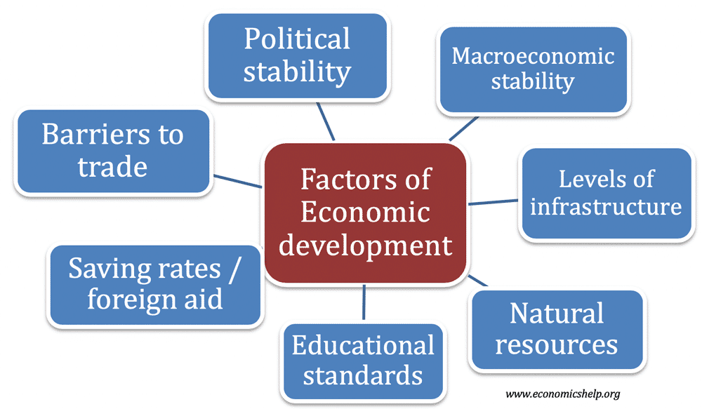

## Table of Contents

## What is economic growth?

Economic growth is when a country's economy gets bigger over time. It means that the total amount of goods and services produced in a country increases. This is usually measured by something called Gross Domestic Product, or GDP. When GDP goes up, it means the economy is growing. This is important because it can lead to more jobs, higher incomes, and better living standards for people.

However, economic growth isn't always good for everyone. Sometimes, it can lead to problems like pollution or inequality. For example, if factories produce more goods, they might also pollute the air and water. Also, the benefits of growth might not be shared equally. Some people might get richer while others stay poor. So, while economic growth can help a country, it's important to think about how it affects different people and the environment.

## Why is economic growth important for a country?

Economic growth is important for a country because it means more money and resources are available. When the economy grows, businesses make more products and services, which can lead to more jobs. More jobs mean more people can work and earn money. This can help people buy things they need, like food, clothes, and homes. It also means the government can collect more taxes, which can be used to build schools, hospitals, and roads.

However, economic growth is not always good for everyone. Sometimes, it can harm the environment. For example, more factories might mean more pollution. Also, the benefits of growth might not be shared fairly. Some people might get richer while others stay poor or even get poorer. So, it's important for a country to think about how to grow the economy in a way that helps everyone and protects the environment.

## What are the basic factors that influence economic growth?

Economic growth depends on many things. One big thing is having enough workers. When more people can work, they can make more things and provide more services. Another important thing is having good technology. Good technology helps workers do their jobs better and faster. For example, a farmer with a tractor can grow more food than a farmer with just a hoe. Also, having enough money to invest in businesses and new projects is important. This money can come from people saving and banks lending it out.

Another [factor](/wiki/factor-investing) is having good rules and laws. When the government makes fair rules, it helps businesses grow. For example, if the government protects people's rights to own things, people might feel safer to start a business. Also, being able to trade with other countries can help. If a country can sell its goods to other countries, it can make more money. Finally, education is very important. When people are educated, they can do more complex jobs and come up with new ideas.

These factors all work together to help a country's economy grow. But it's not just about making the economy bigger. It's also important to make sure that the growth helps everyone and doesn't harm the environment.

## How does the labor force affect economic growth?

The labor force is really important for economic growth. It's made up of all the people who can work and want to work. When there are more people in the labor force, the economy can produce more goods and services. This is because more workers mean more hands to do the work. For example, if a factory hires more workers, it can make more products. Also, if the labor force is growing because more people are joining it, like young people finishing school, the economy can keep growing.

But it's not just about having more people. It's also about how good the workers are at their jobs. If workers are well-educated and have good skills, they can do their jobs better and faster. This means they can produce more and better quality goods and services. For example, a well-trained engineer can design better machines that help factories produce more efficiently. So, having a strong and skilled labor force is key to making the economy grow.

## What role does capital investment play in economic growth?

Capital investment is when money is used to buy things that help businesses grow, like new machines, buildings, or technology. This is important for economic growth because it helps businesses make more stuff or provide better services. For example, if a factory buys a new machine, it can make more products faster. This means the factory can sell more and make more money. When businesses invest in new things, it helps the whole economy grow because it leads to more jobs and more goods and services.

But capital investment is not just about buying things. It's also about putting money into new projects or ideas. For example, a company might invest in research to come up with a new product. If the new product is successful, it can help the company grow and create more jobs. This kind of investment can also lead to new technology that makes everyone's life better. So, capital investment is a big part of making the economy grow because it helps businesses do more and do it better.

## How do technological advancements contribute to economic growth?

Technological advancements help the economy grow by making it easier and faster for people to do their jobs. When new technology comes out, like better computers or machines, workers can make more things in less time. For example, a farmer with a new tractor can plant and harvest more crops than before. This means more food can be produced, which is good for the economy. Also, new technology can help businesses come up with new products or services. If a company makes a new phone that everyone wants, it can sell a lot of them and make more money. This helps the economy grow because more money is being made and spent.

But technology doesn't just help businesses. It also helps people in their everyday lives. When people have better technology, like faster internet or new apps, they can do things more easily. This can make people happier and more productive. For example, if someone can work from home because of good technology, they might be able to spend more time with their family or start a new business. This can lead to more jobs and more money being spent in the economy. So, technological advancements are important for economic growth because they help both businesses and people do more and do it better.

## What impact does government policy have on economic growth?

Government policy can have a big impact on how fast a country's economy grows. One way is through rules and laws that make it easier for businesses to start and grow. For example, if the government makes it simple to start a new business, more people might try to do it. This can lead to more jobs and more money being made. Also, if the government keeps taxes fair and not too high, businesses might have more money to invest in new projects or hire more workers. On the other hand, if the government makes a lot of rules that are hard to follow, it might make it harder for businesses to grow, which can slow down the economy.

Another way government policy affects economic growth is through spending and investment. When the government spends money on things like building roads, schools, and hospitals, it can help the economy grow. This is because these projects create jobs and make it easier for businesses to operate. For example, a new highway can help a factory get its products to customers faster. Also, if the government invests in education, people can learn new skills and get better jobs, which helps the economy. But if the government spends too much money and goes into debt, it might have to raise taxes later, which could slow down the economy. So, the government needs to find a balance to help the economy grow in a healthy way.

## How does education and human capital influence economic growth?

Education and human capital are really important for making the economy grow. Human capital means all the skills, knowledge, and experience that people have. When people are well-educated, they can do their jobs better and come up with new ideas. For example, a well-educated engineer can design new machines that help factories make more stuff. Also, if more people go to school and learn new skills, there will be more people who can work in good jobs. This means more people can earn money and spend it, which helps the whole economy.

But it's not just about going to school. It's also about learning throughout life. When people keep learning new things, they can keep improving their skills. This can help them get better jobs or start their own businesses. For example, someone might learn how to use a new computer program and then use that skill to start a new company. When more people are learning and improving, the whole economy can grow because there are more skilled workers and more new ideas. So, education and human capital are key to making the economy bigger and better.

## What is the effect of natural resources on a country's economic growth?

Natural resources like oil, gas, minerals, and fertile land can help a country's economy grow. When a country has a lot of these resources, it can sell them to other countries and make money. This money can be used to build schools, hospitals, and roads, which helps the economy grow. Also, having natural resources can attract businesses that want to use them. For example, if a country has a lot of oil, oil companies might come and set up factories, which creates jobs and helps the economy.

However, relying too much on natural resources can also cause problems. Sometimes, countries that depend a lot on selling resources might not focus on other parts of the economy, like making things or providing services. This can make the economy less strong because if the price of the resource goes down, the country might have less money. Also, using natural resources can harm the environment, like causing pollution or damaging the land. So, while natural resources can help the economy grow, it's important for a country to use them carefully and think about other ways to make the economy strong.

## How do international trade and globalization affect economic growth?

International trade and globalization help a country's economy grow by letting it sell things to other countries and buy things it needs. When a country can sell its products, like cars or food, to other places, it makes more money. This money can be used to build schools, hospitals, and roads, which helps the economy. Also, when a country can buy things it needs, like technology or raw materials, from other countries, it can make its businesses work better. This means more jobs and more money for people, which helps the whole economy grow.

But international trade and globalization can also cause problems. Sometimes, businesses in one country might move to another country where it's cheaper to make things. This can lead to fewer jobs in the first country. Also, if a country depends a lot on selling things to other countries, it might have problems if those countries stop buying. For example, if a country sells a lot of oil and the price of oil goes down, it might have less money. So, while international trade and globalization can help the economy grow, it's important for a country to be careful and think about how to make its economy strong in other ways too.

## What are the long-term versus short-term factors influencing economic growth?

Short-term factors that influence economic growth are things that can change quickly and have an immediate effect on the economy. For example, when the government spends more money on projects like building roads or helping people who are out of work, it can boost the economy right away. This is because it creates jobs and puts more money in people's pockets. Another short-term factor is interest rates. If the government lowers interest rates, it can make it cheaper for people to borrow money and spend it, which can help the economy grow quickly. But these short-term boosts might not last long, and if they're not managed well, they can lead to problems like inflation or too much debt.

Long-term factors that influence economic growth are things that take time to build and have a lasting effect on the economy. Education is a big one. When more people go to school and learn new skills, it helps the economy grow over many years because they can do better jobs and come up with new ideas. Another long-term factor is technology. When new technology is developed, like better computers or machines, it can help businesses make more things and work more efficiently. Also, having good rules and laws that make it easy for businesses to start and grow can help the economy in the long run. These long-term factors are important because they help the economy grow steadily and strongly over time.

## How do economists measure and predict economic growth?

Economists measure economic growth by looking at something called Gross Domestic Product, or GDP. GDP is the total value of all the goods and services made in a country in a year. When GDP goes up, it means the economy is growing. Economists also look at other things like how many people have jobs, how much people are spending, and how much businesses are investing. By putting all this information together, they can get a good idea of how fast the economy is growing.

To predict economic growth, economists use a lot of different tools and data. They look at past trends to see how the economy has grown before and try to guess what might happen next. They also use special computer models that take in a lot of information about things like interest rates, government spending, and trade with other countries. These models help them make predictions about the future. But predicting the economy is hard because a lot of things can change, like new laws or big events like a natural disaster. So, economists always have to be ready to change their predictions if something unexpected happens.

## What are the differences between Supply-Side and Demand-Side Economics?

Supply-side and demand-side economics represent two distinct approaches to stimulating economic growth, each with its theoretical foundations and practical implications. Supply-side economics emphasizes the importance of making it easier for businesses to produce goods and services. Fundamental to this approach is the belief that reducing barriers such as taxes and regulations will incentivize production and investment, thereby increasing supply and fostering economic expansion. Historical examples include the tax cuts implemented during the Reagan administration in the United States. These supply-side strategies, guided by the principles of the Laffer Curve, suggest that lower tax rates can potentially increase overall tax revenue by expanding the economic base.

Mathematically, the Laffer Curve can be a conceptual representation of the relationship between tax rates and tax revenue. Let $T$ be the tax rate, and $R(T)$ be the revenue collected:

$$
R(T) = T \cdot \text{Tax Base}(T)
$$

Supply-side advocates argue that $\text{Tax Base}(T)$ increases as $T$ decreases, within certain limits, thus increasing $R(T)$.

On the other hand, demand-side economics, grounded in Keynesian theory, emphasizes boosting consumer demand as a path to economic growth. In this view, consumer spending drives production and employment. Policies often include government spending and infrastructure investments to directly stimulate demand. A classic example is the New Deal era in the United States, where significant public works programs were employed to combat the Great Depression.

The debate between these two schools of thought significantly influences fiscal and monetary policies around the world. While supply-side proponents argue for deregulation and reduced taxes to spur growth, demand-side economists believe in direct fiscal measures and monetary interventions to ensure adequate demand.

Evaluating historical examples can reveal the effectiveness of each approach in varying contexts. For instance, during periods of recession, Keynesian demand-side measures can help revive stagnant economies, as seen in the recovery from the Great Depression. Conversely, during times of inflation, supply-side policies might be more effective in enhancing productive capacity without raising prices. Understanding these dynamics aids policymakers in crafting balanced strategies tailored to specific economic circumstances.

## References & Further Reading

- **Books:**
  - Mankiw, N. G. "Principles of Economics." This book offers a comprehensive introduction to economic principles and theories, including aspects of economic growth.
  - Shiller, R. "Irrational Exuberance." Provides insights into economic cycles and market dynamics, relevant for understanding growth and investment behavior.
  - Lo, A. W. "Adaptive Markets: Financial Evolution at the Speed of Thought." Discusses the impact of technology and innovation in financial markets, including algorithmic trading.

- **Academic Papers:**
  - Grossman, G., & Helpman, E. (1991). "Innovation and Growth in the Global Economy." This paper highlights the role of technological innovation in driving economic growth.
  - Engle, R. F., & Russell, J. R. (1998). "Autoregressive Conditional Duration: A New Model for Irregularly Spaced Transaction Data." This paper presents models useful for understanding the patterns in high-frequency trading data.

- **Articles:**
  - "The Impact of Algorithmic Trading on Market Liquidity" in the *Journal of Financial Markets*. This article evaluates how algorithmic trading contributes to liquidity and volatility in financial markets.
  - "Supply-Side Economics: A Ten-Year Review" by Martin Feldstein in the *Journal of Economic Perspectives*. Reviews the efficacy and impact of supply-side policies on economic growth.

- **Online Courses and Educational Resources:**
  - "Introduction to Economic Growth" on Coursera, offered by Stanford University. This course provides insights into the factors driving economic growth and development.
  - "Python for Financial Analysis and Algorithmic Trading" available on Udemy. Provides practical programming skills for implementing trading algorithms and analyzing financial markets.
  - "Algorithmic Trading and Finance Models with Python, R, and Stata Essential Training" on LinkedIn Learning. This course offers a well-rounded approach to understanding trading models using various programming languages.

These resources can provide a deeper understanding of the interconnectedness of economic growth theories and the role of [algorithmic trading](/wiki/algorithmic-trading) in financial markets.

