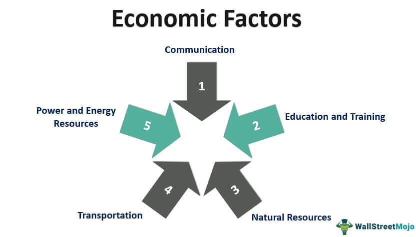

The world of economics is constantly evolving, characterized by a complex interplay of factors influencing financial systems and growth trajectories. Economic growth, typically measured by metrics such as Gross Domestic Product (GDP), signifies an increase in a nation's output and is paramount for developing policy frameworks and investment strategies. The study and understanding of economic growth are critical for economists, policymakers, and investors, as they seek mechanisms to stimulate and sustain development.

In recent years, algorithmic trading has become a noteworthy component of financial markets, introducing new dynamics and opportunities. This form of trading, governed by computer algorithms, enables transactions to be executed with precision and speed far surpassing human capabilities. The advent of algorithmic trading has not only altered market behaviors but also provided a platform for potentially significant gains through sophisticated strategies.



This article aims to explore the myriad causes of economic growth, scrutinizing the dichotomy of supply-side and demand-side economics and assessing the impact of technological innovations and policy reforms. It further examines the transformative role of algorithmic trading in modern markets and how these financial advancements intersect with economic growth. Understanding this intersection is crucial for those engaged in financial innovation, as it can drive better-informed market decisions and policies, potentially leading to enhanced economic stability and prosperity.

## Table of Contents

## Economic Growth: Understanding the Basics

Economic growth is primarily measured by gross domestic product (GDP), which quantifies the total output of goods and services in a nation over a specific period. It is an essential indicator of economic health and development. A higher GDP indicates increased productivity and economic prosperity, which can lead to improvements in living standards.

Economists have long debated the most effective strategies to stimulate economic growth, centering around two primary approaches: supply-side and demand-side economics. Supply-side economics emphasizes creating an environment conducive to business operations, advocating for policies such as deregulation and tax cuts. By reducing barriers for businesses, the theory posits that production and investment will increase, ultimately boosting economic output.

In contrast, demand-side economics focuses on enhancing consumer purchasing power to drive growth. Influenced by Keynesian economic theories, this approach argues that increasing consumer demand is vital for production and overall economic expansion. Policies may include government spending on infrastructure projects or social services to inject money into the economy and stimulate demand for goods and services.

Several key factors can stimulate economic growth, including technological innovations and policy reforms. Technological advancements improve productivity by enabling more efficient production processes and creating new products and markets. For example, the introduction of automation and digital technologies has significantly increased industrial output while simultaneously lowering costs.

Policy reforms, on the other hand, can remove structural impediments and enhance economic efficiency. These might involve changes in regulatory frameworks, trade liberalization, or enhancements in education and healthcare systems. By fostering a supportive environment for innovation and competition, such reforms can lead to sustained economic growth.

Understanding the dynamics of GDP, alongside diverse economic strategies and growth-stimulating factors, provides a comprehensive picture of how nations can enhance their economic development and ensure long-term prosperity.

## Supply-Side vs. Demand-Side Economics

Supply-side and demand-side economics represent two distinct approaches to stimulating economic growth, each with its theoretical foundations and practical implications. Supply-side economics emphasizes the importance of making it easier for businesses to produce goods and services. Fundamental to this approach is the belief that reducing barriers such as taxes and regulations will incentivize production and investment, thereby increasing supply and fostering economic expansion. Historical examples include the tax cuts implemented during the Reagan administration in the United States. These supply-side strategies, guided by the principles of the Laffer Curve, suggest that lower tax rates can potentially increase overall tax revenue by expanding the economic base.

Mathematically, the Laffer Curve can be a conceptual representation of the relationship between tax rates and tax revenue. Let $T$ be the tax rate, and $R(T)$ be the revenue collected:

$$
R(T) = T \cdot \text{Tax Base}(T)
$$

Supply-side advocates argue that $\text{Tax Base}(T)$ increases as $T$ decreases, within certain limits, thus increasing $R(T)$.

On the other hand, demand-side economics, grounded in Keynesian theory, emphasizes boosting consumer demand as a path to economic growth. In this view, consumer spending drives production and employment. Policies often include government spending and infrastructure investments to directly stimulate demand. A classic example is the New Deal era in the United States, where significant public works programs were employed to combat the Great Depression.

The debate between these two schools of thought significantly influences fiscal and monetary policies around the world. While supply-side proponents argue for deregulation and reduced taxes to spur growth, demand-side economists believe in direct fiscal measures and monetary interventions to ensure adequate demand.

Evaluating historical examples can reveal the effectiveness of each approach in varying contexts. For instance, during periods of recession, Keynesian demand-side measures can help revive stagnant economies, as seen in the recovery from the Great Depression. Conversely, during times of inflation, supply-side policies might be more effective in enhancing productive capacity without raising prices. Understanding these dynamics aids policymakers in crafting balanced strategies tailored to specific economic circumstances.

## Algorithmic Trading: Revolutionizing Financial Markets

Algorithmic trading deploys computer algorithms to execute trades with remarkable speed and efficiency, transforming financial markets. By automating the trading process, algorithms facilitate rapid decision-making and instant execution, which are essential in handling large volumes of trades and minimizing human error. These algorithms often leverage statistical models and historical data to identify optimal trading opportunities, adapting to market conditions almost instantaneously.

One of the significant contributions of [algorithmic trading](/wiki/algorithmic-trading) is its role in providing [liquidity](/wiki/liquidity-risk-premium) to financial markets. Liquidity, defined as the ability to buy or sell assets without causing significant price changes, is crucial for market stability, especially during periods of [volatility](/wiki/volatility-trading-strategies). By continuously placing buy and sell orders, algorithmic trading ensures that there are consistent counterparties for transactions, thus maintaining market fluidity. This availability of liquidity helps in reducing bid-ask spreads and contributes to efficient price discovery.

However, the transition from human to machine-driven trading alters market dynamics and introduces new considerations for risk management. While algorithmic trading enhances efficiency, it can also lead to market fragmentation and increased systemic risk. For instance, the Flash Crash of May 6, 2010, demonstrated how automated trading could exacerbate volatility. During the event, the Dow Jones Industrial Average plummeted nearly 1,000 points within minutes, primarily due to high-frequency trading algorithms reacting en masse to certain market conditions.

The ability of algorithmic trading to both stabilize and amplify market volatility reflects its dual nature. Algorithms can act as stabilizers by swiftly executing trades that balance supply and demand, thereby damping excessive price swings. Conversely, their rapid reaction to market stimuli can magnify short-term fluctuations if not well-regulated. The feedback loops created by competing algorithms may lead to erratic market behavior, particularly in low liquidity environments.

Risk management in algorithmic trading involves developing robust algorithms that can react appropriately to unforeseen market conditions. Techniques such as real-time monitoring, circuit breakers, and stress testing are utilized to mitigate potential adverse impacts. Additionally, regulatory bodies increasingly scrutinize algorithmic trading practices to prevent market abuses and ensure transparency.

In conclusion, algorithmic trading revolutionizes financial markets by significantly enhancing efficiency and liquidity, albeit with the trade-off of potential volatility and systemic risk. Understanding its mechanisms and impacts is crucial for leveraging its benefits while minimizing its drawbacks. As technology evolves, the role of algorithmic trading is expected to expand, necessitating ongoing attention to its implications on market dynamics.

## Interrelation of Economic Growth and Algorithmic Trading

Economic changes and the factors driving growth significantly impact algorithmic trading strategies and market behavior. Algorithmic trading, which relies on mathematical models and computational power, can efficiently respond to economic trends identified through macroeconomic indicators such as GDP growth rates, inflation levels, and employment figures. By rapidly analyzing vast amounts of economic data, algorithms can detect patterns and predict future market movements, enabling traders to make informed decisions quickly.

As economies expand, algorithmic trading becomes increasingly essential for managing the complexities of large-scale financial transactions. The automated nature of these trading systems allows for precise execution of trades with minimal delay, which is particularly advantageous in high-frequency trading environments where speed is critical. Additionally, as markets grow in sophistication and interconnectivity, algorithms help navigate the associated risks and opportunities with greater accuracy.

Predictive algorithms play a central role in forecasting market conditions during different phases of economic growth. By utilizing techniques such as time series analysis and [machine learning](/wiki/machine-learning), these algorithms can model potential future scenarios based on current and historical data. For instance, machine learning models, including neural networks and decision trees, analyze past economic trends to anticipate how specific sectors might react to upcoming economic shifts.

The integration of these algorithms into trading strategies can be demonstrated using a simple Python example. This code snippet illustrates how an algorithm might analyze historical economic data to make future predictions:

```python
import pandas as pd
from sklearn.ensemble import RandomForestRegressor
from sklearn.model_selection import train_test_split

# Load historical economic data
data = pd.read_csv('historical_economic_data.csv')
X = data.drop('future_trend', axis=1)
y = data['future_trend']

# Split data into training and testing sets
X_train, X_test, y_train, y_test = train_test_split(X, y, test_size=0.2, random_state=42)

# Train a Random Forest model
model = RandomForestRegressor(n_estimators=100, random_state=42)
model.fit(X_train, y_train)

# Predict future trends
predictions = model.predict(X_test)

# Evaluate model accuracy
accuracy = model.score(X_test, y_test)
print(f'Model Accuracy: {accuracy:.2f}')
```

This example trains a Random Forest model on historical economic data to predict future trends, demonstrating the capability of machine learning algorithms in enhancing trading strategies. As the economic landscape evolves, algorithmic trading, coupled with advanced analytics, remains a pivotal tool for investors and policymakers aiming to capitalize on growth opportunities and mitigate potential risks.

## Challenges and Future Prospects

Algorithmic trading has transformed financial markets by executing trades with unprecedented speed and precision. However, it brings with it a host of challenges, primarily revolving around regulatory oversight and the potential for market manipulation. As trading algorithms become more complex, the risk of algorithms behaving unpredictably or being exploited grows. This necessitates stringent regulatory measures to ensure transparency and fairness in markets. Regulations must balance the promotion of innovation with safeguarding market integrity.

Evolving technologies, particularly [artificial intelligence](/wiki/ai-artificial-intelligence) (AI) and machine learning, are reshaping algorithmic trading strategies. These technologies enable the development of adaptive algorithms capable of learning from past market data to optimize trading strategies. For example, machine learning models can enhance predictive accuracy by identifying patterns that are not evident through traditional statistical methods. The integration of AI in trading can potentially increase efficiency and profitability. Python is commonly used in developing these models due to its extensive libraries, such as TensorFlow and scikit-learn, which facilitate machine learning tasks.

The delicate balance between policy regulation and technological progress is a cornerstone for ensuring sustainable economic growth. Policymakers face the challenge of designing regulations flexible enough to accommodate technological advances yet robust enough to prevent misuse. Creating a supportive regulatory environment can foster innovation while mitigating risks associated with rapid technological changes.

Looking ahead, the future of algorithmic trading offers the potential for increased efficiency across global markets. Advancements in technology could pave the way for enhanced analytical capabilities, allowing market participants to react more swiftly and accurately to economic signals. Greater efficiency in executing trades could contribute to financial stability by reducing transaction costs and minimizing the systemic risk posed by human errors.

In conclusion, while algorithmic trading poses significant challenges, it also holds promising prospects for the future of financial markets. Addressing these challenges through effective regulation and harnessing the potential of emerging technologies will be crucial in shaping the next wave of financial innovation.

## Conclusion

Both economic growth factors and algorithmic trading present distinct insights and opportunities that can substantially influence financial markets. Economic growth, driven by technological advancements, policy reforms, and strategic investment, enhances productivity and increases a nation's overall output. As such, understanding the core drivers of growth provides a foundation for developing economic policies that can effectively stimulate and sustain expansion.

Algorithmic trading, characterized by the use of computer algorithms to execute trades at high speed and precision, introduces a novel dynamic to financial markets. It contributes to market liquidity and can stabilize markets during times of volatility. However, it also necessitates careful management to mitigate risks such as market manipulation and amplified volatility.

The integration of economic policies with trading technology stands as a promising avenue for achieving improved market outcomes. By aligning policy decisions with the capabilities of algorithmic trading, there is potential to harness economic indicators for more responsive and efficient trading strategies. This can lead to more accurate predictions of market trends and better risk management practices.

Moving forward, it is essential to understand and leverage the synergies between economic growth and algorithmic trading. Sustainable financial innovation will likely hinge on this understanding, balancing technological advancements with robust regulatory frameworks to ensure stability. These synergies can foster an environment where economic policies support technological growth, and, in turn, algorithmic trading methodologies enhance the effectiveness of such policies. 

Ultimately, the path forward involves a comprehensive approach that respects both the potential of technological innovation and the foundational principles of sound economic policy, aiming for a harmonious advancement in global financial systems.

## References & Further Reading

- **Books:**
  - Mankiw, N. G. "Principles of Economics." This book offers a comprehensive introduction to economic principles and theories, including aspects of economic growth.
  - Shiller, R. "Irrational Exuberance." Provides insights into economic cycles and market dynamics, relevant for understanding growth and investment behavior.
  - Lo, A. W. "Adaptive Markets: Financial Evolution at the Speed of Thought." Discusses the impact of technology and innovation in financial markets, including algorithmic trading.

- **Academic Papers:**
  - Grossman, G., & Helpman, E. (1991). "Innovation and Growth in the Global Economy." This paper highlights the role of technological innovation in driving economic growth.
  - Engle, R. F., & Russell, J. R. (1998). "Autoregressive Conditional Duration: A New Model for Irregularly Spaced Transaction Data." This paper presents models useful for understanding the patterns in high-frequency trading data.

- **Articles:**
  - "The Impact of Algorithmic Trading on Market Liquidity" in the *Journal of Financial Markets*. This article evaluates how algorithmic trading contributes to liquidity and volatility in financial markets.
  - "Supply-Side Economics: A Ten-Year Review" by Martin Feldstein in the *Journal of Economic Perspectives*. Reviews the efficacy and impact of supply-side policies on economic growth.

- **Online Courses and Educational Resources:**
  - "Introduction to Economic Growth" on Coursera, offered by Stanford University. This course provides insights into the factors driving economic growth and development.
  - "Python for Financial Analysis and Algorithmic Trading" available on Udemy. Provides practical programming skills for implementing trading algorithms and analyzing financial markets.
  - "Algorithmic Trading and Finance Models with Python, R, and Stata Essential Training" on LinkedIn Learning. This course offers a well-rounded approach to understanding trading models using various programming languages.

These resources can provide a deeper understanding of the interconnectedness of economic growth theories and the role of algorithmic trading in financial markets.

