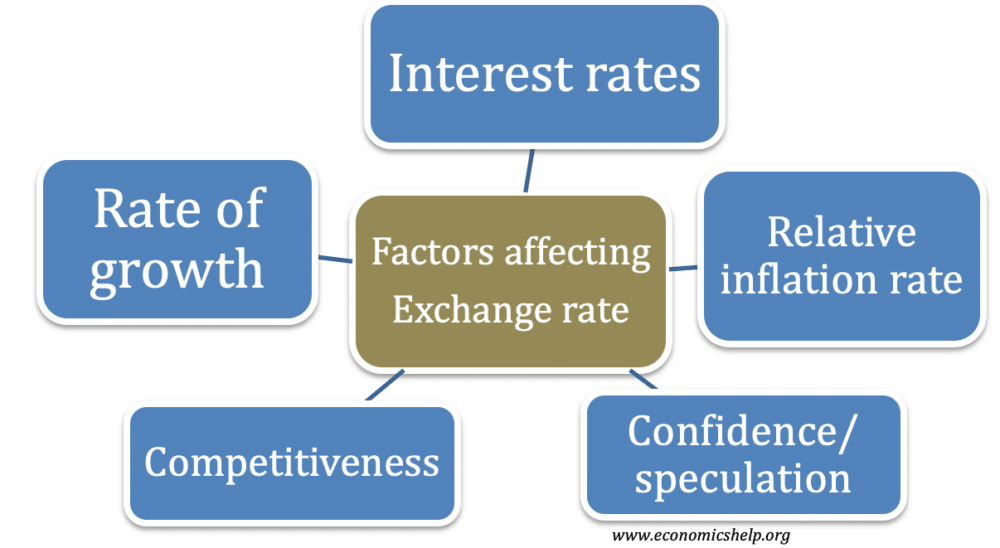

## Table of Contents

## What is an exchange rate?

An exchange rate is the value of one country's money compared to another country's money. It tells you how many units of one currency you need to buy one unit of another currency. For example, if you want to know how many US dollars you need to buy one Euro, you look at the exchange rate between the US dollar and the Euro.

Exchange rates change all the time because they are influenced by many things. These things include how well a country's economy is doing, what interest rates are, and even big events like elections or natural disasters. If a country's economy is doing well, its currency usually becomes stronger, meaning you need fewer units of that currency to buy another currency. On the other hand, if a country's economy is not doing well, its currency might become weaker.

## How do interest rates affect exchange rates?

Interest rates can have a big impact on exchange rates. When a country's central bank raises interest rates, it usually makes that country's currency stronger. This happens because higher interest rates mean that people can earn more money by keeping their savings in that country's banks. So, more people want to buy that country's currency to take advantage of the higher interest rates. This increased demand for the currency makes it more valuable compared to other currencies.

On the other hand, when a country's central bank lowers interest rates, it often makes the country's currency weaker. Lower interest rates mean that people earn less money from their savings in that country. As a result, fewer people want to buy that country's currency, and the demand for it goes down. This lower demand leads to a decrease in the value of the currency compared to other currencies. So, interest rates and exchange rates are closely linked, with changes in one often leading to changes in the other.

## What role do inflation rates play in determining exchange rates?

Inflation rates are important when it comes to exchange rates. If a country has high inflation, its money usually becomes less valuable compared to other countries' money. This happens because high inflation means prices are going up quickly, and people need more money to buy the same things. So, if one country has higher inflation than another, its currency will often be worth less. For example, if Country A has 10% inflation and Country B has 2% inflation, Country A's currency will likely get weaker compared to Country B's currency.

On the other hand, if a country has low inflation, its money can become more valuable. Low inflation means prices are not going up as fast, so people don't need as much money to buy things. This can make the country's currency stronger compared to countries with higher inflation. For instance, if Country C has very low inflation and Country D has high inflation, Country C's currency might become stronger against Country D's currency. So, inflation rates can really affect how much one country's money is worth compared to another's.

## How does the balance of trade impact exchange rates?

The balance of trade is about how much a country buys from other countries compared to how much it sells to them. If a country sells more than it buys, it has a trade surplus. This can make its currency stronger. When a country has a trade surplus, other countries need to buy its currency to pay for the goods. This higher demand for the currency can make it more valuable compared to other currencies.

On the other hand, if a country buys more than it sells, it has a trade deficit. This can make its currency weaker. When a country has a trade deficit, it has to use more of its own currency to buy things from other countries. This can lead to more of its currency being available, which can lower its value. So, the balance of trade can really affect how strong or weak a country's currency is.

## What is the effect of political stability on exchange rates?

Political stability can make a country's currency stronger. When a country is stable and its government is doing well, people feel more confident about its economy. They think the country will keep doing well, so they want to invest in it. This means more people want to buy the country's currency, which can make it more valuable compared to other currencies.

On the other hand, if a country is not stable, its currency can become weaker. When there is a lot of uncertainty because of political problems, people might worry about the country's future. They might not want to invest there, so they sell the country's currency. This can make the currency less valuable compared to other countries' money. So, political stability can really affect how much a country's money is worth.

## How do economic reports and indicators influence exchange rates?

Economic reports and indicators give us a lot of information about how a country's economy is doing. When these reports show that an economy is doing well, it can make the country's currency stronger. For example, if a report shows that more people have jobs, or that the economy is growing faster than expected, people might want to invest in that country. This means they will buy more of that country's currency, which can make it worth more compared to other countries' money.

On the other hand, if economic reports show that a country's economy is not doing well, it can make the currency weaker. For instance, if a report shows that fewer people have jobs, or that the economy is growing slower than expected, people might not want to invest there. They might sell the country's currency, which can make it worth less compared to other countries' money. So, economic reports and indicators can really affect how strong or weak a country's currency is.

## What is the impact of speculation on exchange rates?

Speculation can really change exchange rates. When people think a currency will go up in value, they buy it hoping to sell it later for more money. This buying makes the currency more valuable right away because there's more demand for it. For example, if people think the US dollar will get stronger, they might buy a lot of dollars. This can make the dollar worth more compared to other currencies, even before it actually gets stronger.

On the other hand, if people think a currency will go down in value, they might sell it to avoid losing money. This selling can make the currency less valuable right away because there's less demand for it. For instance, if people think the Euro will get weaker, they might sell their Euros. This can make the Euro worth less compared to other currencies, even before it actually gets weaker. So, speculation can make exchange rates move a lot, sometimes very quickly.

## How do central bank interventions affect exchange rates?

Central banks can change exchange rates by buying or selling their country's currency. If a central bank wants its currency to be stronger, it can buy its own currency using other countries' money. This makes the currency more valuable because there's more demand for it. For example, if the US Federal Reserve buys US dollars, it can make the dollar stronger compared to other currencies.

On the other hand, if a central bank wants its currency to be weaker, it can sell its own currency and buy other countries' money. This makes the currency less valuable because there's more of it available. For instance, if the Bank of Japan sells yen and buys US dollars, it can make the yen weaker compared to the dollar. So, central banks have a lot of power to affect how much their country's money is worth compared to other countries' money.

## What role does the purchasing power parity theory play in exchange rates?

Purchasing power parity (PPP) is a theory that says exchange rates should make the cost of goods the same in different countries. If a burger costs $5 in the US, and the exchange rate is 1 US dollar to 10 Mexican pesos, then the burger should cost 50 pesos in Mexico. If it costs more or less than 50 pesos, people might buy burgers in the cheaper country and sell them in the more expensive one, which would change the exchange rate until the prices are the same.

However, in real life, exchange rates don't always follow PPP perfectly. Things like transportation costs, taxes, and different tastes in different countries can make prices different even if the exchange rate changes. Also, short-term changes in exchange rates can be affected by things like interest rates, political stability, and speculation, which can make the actual exchange rate different from what PPP would predict. Over a long time, though, PPP can help explain why exchange rates move the way they do.

## How do different monetary policies across countries influence exchange rates?

Different monetary policies in countries can really change exchange rates. Monetary policy is about how a country's central bank controls the amount of money in the economy and the cost of borrowing money. If one country's central bank decides to make borrowing money cheaper by lowering interest rates, its currency might become weaker. This happens because people might move their money to another country where they can get higher interest rates. On the other hand, if a country's central bank raises interest rates to make borrowing more expensive, its currency can become stronger because more people want to invest there to get those higher returns.

These differences in monetary policies can make exchange rates move a lot. For example, if the US Federal Reserve raises interest rates while the European Central Bank keeps them the same, the US dollar might get stronger compared to the Euro. People would want to move their money to the US to take advantage of the higher interest rates, which means they need to buy US dollars. This increased demand for the dollar can make it worth more compared to the Euro. So, when countries have different monetary policies, it can really affect how much their currencies are worth compared to each other.

## What is the effect of global economic events on exchange rates?

Global economic events can really change exchange rates. These events can be things like big financial crises, trade wars, or even pandemics. When something big happens, it can make people worry about the future of the economy. For example, if there's a financial crisis in one country, people might sell that country's currency because they think it will become less valuable. This can make the currency weaker compared to other countries' money. On the other hand, if a country is doing well during a global event, its currency might become stronger because people want to invest there.

Another way global events affect exchange rates is through changes in trade. If countries start putting big taxes on each other's goods, like in a trade war, it can make their currencies weaker. This happens because fewer people want to buy things from those countries, so there's less demand for their money. Also, if there's a big event like a pandemic, it can change how much people buy and sell things around the world. This can make some currencies stronger and others weaker, depending on how each country's economy is doing during the event. So, global economic events can really shake up exchange rates.

## How do long-term structural changes in an economy affect exchange rates?

Long-term structural changes in an economy can really affect exchange rates. These changes are big shifts that happen over a long time, like improvements in technology, changes in how people work, or big shifts in what a country makes and sells. When a country goes through these changes, it can make its economy stronger or weaker. If the changes make the economy stronger, like if new technology makes businesses more productive, the country's currency might become more valuable. More people might want to invest in that country, so they buy its currency, which can make it stronger compared to other countries' money.

On the other hand, if the long-term changes make an economy weaker, the country's currency can become less valuable. For example, if a country's main industry starts to do badly because of new technology or because people want different things, it can hurt the economy. This might make people less interested in investing there, so they sell the country's currency. This can make the currency weaker compared to other countries' money. So, these big, long-term changes can really change how much a country's money is worth compared to other countries' money.

## What are the Basics of Currency Valuation?

Currency valuation is a critical aspect of the global financial landscape, essentially determining the value of one currency relative to another. This valuation is influenced by several key factors, including inflation, interest rates, and economic stability, each playing a vital role in shaping the dynamics of currency exchange rates.

Inflation is a significant factor in currency valuation. It measures the rate at which the general level of prices for goods and services rises, eroding purchasing power. When inflation is high, a currency typically weakens because it can purchase fewer goods and services. For instance, if a country has an inflation rate higher than its trading partners, its currency might depreciate as foreign investors seek higher purchasing power elsewhere. The formula for calculating the inflation rate is:

$$
\text{Inflation Rate} = \left( \frac{\text{CPI}_{\text{current year}} - \text{CPI}_{\text{previous year}}}{\text{CPI}_{\text{previous year}}} \right) \times 100
$$

where $\text{CPI}$ stands for Consumer Price Index.

Interest rates are another pivotal element affecting currency valuation. Central banks adjust interest rates to control inflation and stabilize the national currency. Higher interest rates offer lenders a higher return on their investments relative to other countries. As a result, foreign capital flows into countries with higher interest rates, increasing demand for that currency and potentially leading to its appreciation. The relationship can be captured through the Interest Rate Parity (IRP) theory, which asserts that differences in interest rates between two countries will equate to the expected change in exchange rates.

Economic stability, encompassing both political stability and fiscal policy, also influences currency valuation. Countries with stable governments and robust economic policies are more likely to attract foreign investment, bolstering their currency's value. Conversely, political unrest or economic mismanagement can lead to a loss of investor confidence and a subsequent depreciation of the national currency.

Understanding these driving forces is essential for traders and economists, offering insights into the potential movements in currency values. Familiarity with fundamental concepts such as inflation rates, interest rates, and economic stability can provide a comprehensive foundation for analyzing exchange rates' fluctuations. By grasping these basic principles, traders and economists can better navigate the intricate nature of currency valuation, positioning themselves to make informed decisions in the competitive world of foreign exchange.

## References & Further Reading

[1]: Bergstra, J., Bardenet, R., Bengio, Y., & Kégl, B. (2011). ["Algorithms for Hyper-Parameter Optimization."](https://papers.nips.cc/paper/4443-algorithms-for-hyper-parameter-optimization) Advances in Neural Information Processing Systems 24.

[2]: ["Advances in Financial Machine Learning"](https://www.amazon.com/Advances-Financial-Machine-Learning-Marcos/dp/1119482089) by Marcos Lopez de Prado

[3]: ["Evidence-Based Technical Analysis: Applying the Scientific Method and Statistical Inference to Trading Signals"](https://www.semanticscholar.org/paper/Evidence-Based-Technical-Analysis%3A-Applying-the-and-Aronson/3b33df8737f1772e9e14d66a08c9696f140a2ee1) by David Aronson

[4]: ["Machine Learning for Algorithmic Trading"](https://github.com/stefan-jansen/machine-learning-for-trading) by Stefan Jansen

[5]: ["Quantitative Trading: How to Build Your Own Algorithmic Trading Business"](https://books.google.com/books/about/Quantitative_Trading.html?id=j70yEAAAQBAJ) by Ernest P. Chan