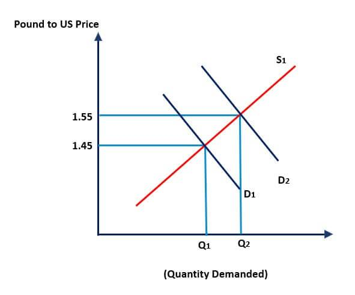

Understanding the dynamics of currency valuation is essential for anyone involved in global financial markets. Exchange rates, influenced by a myriad of economic factors, serve as crucial indicators of a country's economic health. These rates determine the relative value of currencies, influencing international trade, investment flows, and overall economic growth. In recent years, the introduction of algorithmic trading has significantly transformed how currency valuation and exchange rates are analyzed and approached within these markets. 

Algorithmic trading, which applies complex algorithms to execute trades automatically, has increased the speed and efficiency of trading, enabling market participants to better respond to fluctuations in currency values. This article examines the intricate relationships between the factors that impact exchange rates and the manner in which algorithmic trading is reshaping currency valuation. By exploring these elements, the article provides insights into the economic indicators affecting exchange rates and the influence of contemporary trading technologies. 



Ultimately, this discussion is aimed at traders, economists, and investors seeking to understand the evolving landscape of foreign exchange markets through both traditional economic factors and innovations in trading techniques. In doing so, it contributes to a more comprehensive understanding of the mechanisms driving currency valuation today.

## Table of Contents

## The Basics of Currency Valuation

Currency valuation is a critical aspect of the global financial landscape, essentially determining the value of one currency relative to another. This valuation is influenced by several key factors, including inflation, interest rates, and economic stability, each playing a vital role in shaping the dynamics of currency exchange rates.

Inflation is a significant factor in currency valuation. It measures the rate at which the general level of prices for goods and services rises, eroding purchasing power. When inflation is high, a currency typically weakens because it can purchase fewer goods and services. For instance, if a country has an inflation rate higher than its trading partners, its currency might depreciate as foreign investors seek higher purchasing power elsewhere. The formula for calculating the inflation rate is:

$$
\text{Inflation Rate} = \left( \frac{\text{CPI}_{\text{current year}} - \text{CPI}_{\text{previous year}}}{\text{CPI}_{\text{previous year}}} \right) \times 100
$$

where $\text{CPI}$ stands for Consumer Price Index.

Interest rates are another pivotal element affecting currency valuation. Central banks adjust interest rates to control inflation and stabilize the national currency. Higher interest rates offer lenders a higher return on their investments relative to other countries. As a result, foreign capital flows into countries with higher interest rates, increasing demand for that currency and potentially leading to its appreciation. The relationship can be captured through the Interest Rate Parity (IRP) theory, which asserts that differences in interest rates between two countries will equate to the expected change in exchange rates.

Economic stability, encompassing both political stability and fiscal policy, also influences currency valuation. Countries with stable governments and robust economic policies are more likely to attract foreign investment, bolstering their currency's value. Conversely, political unrest or economic mismanagement can lead to a loss of investor confidence and a subsequent depreciation of the national currency.

Understanding these driving forces is essential for traders and economists, offering insights into the potential movements in currency values. Familiarity with fundamental concepts such as inflation rates, interest rates, and economic stability can provide a comprehensive foundation for analyzing exchange rates' fluctuations. By grasping these basic principles, traders and economists can better navigate the intricate nature of currency valuation, positioning themselves to make informed decisions in the competitive world of foreign exchange.

## Economic Factors Influencing Exchange Rates

Exchange rates are primarily influenced by a variety of economic factors that act as indicators of a country's economic health and stability. Understanding these factors is crucial for investors looking to make informed decisions in the foreign exchange ([forex](/wiki/forex-system)) market.

**Inflation Rates**

Inflation, the rate at which the general level of prices for goods and services rises, erodes purchasing power. Countries with consistently lower inflation rates exhibit a rising currency value as their purchasing power increases relative to other currencies. For example, if Country A has an inflation rate of 2% while Country B's rate is 5%, Country A's currency will likely appreciate relative to Country B's currency. This is because less devaluation of the currency occurs in the country with lower inflation.

**Interest Rates**

Interest rates, set by a country's central bank, are used to control inflation and stabilize the currency. Higher interest rates offer lenders in an economy a higher return relative to other countries. Consequently, higher interest rates attract foreign capital and lead to an appreciation of the currency, provided that other factors do not change. Conversely, lower interest rates can decrease currency value as investors seek better returns elsewhere.

**Government Debt Levels**

Countries with high levels of government debt are less attractive to foreign investors due to the inflation risks and potential devaluation involved with servicing large debt loads. Investors fear that governments might print additional currency to pay off the debt, resulting in inflation. Additionally, if there is a risk of the country defaulting on its debt, the currency could depreciate. Consequently, prudent management of government debt can support a stronger currency.

**Trade Balances**

The balance of trade (BOT), which reflects the difference between a country's exports and imports, affects currency value. A country with a substantial export surplus (exports higher than imports) is likely to have a stronger currency, as foreign buyers must exchange their currency for the exporter's home currency to purchase the goods and services. Conversely, a country with a trade deficit might experience a depreciating currency as more of its currency is sold to acquire foreign goods.

**Political Stability and Economic Performance**

Political stability and strong economic performance make a currency more attractive to investors. Stable governments are considered less risky, allowing for steady economic policies, leading to better overall economic performance. A robust economy tends to attract foreign investment, boosting currency value. Political unrest, however, can lead to uncertainty, causing investors to pull back their investments, resulting in currency depreciation.

In summary, a variety of interconnected economic factors influence exchange rates: inflation rates, interest rates, government debt levels, trade balances, political stability, and overall economic performance. Understanding these elements allows investors to evaluate potential opportunities and risks, facilitating more informed and strategic decisions in the forex market.

## Algorithmic Trading: A Modern Approach to Currency Valuation

Algorithmic trading, commonly known as algo trading, leverages algorithmic systems to automatically execute trades based on predefined criteria such as price, timing, and [volume](/wiki/volume-trading-strategy). This technological advancement allows traders to quickly respond to dynamic market conditions, seizing short-lived opportunities and exploiting inefficiencies in currency valuations.

Algo trading operates by utilizing complex mathematical models and statistical analyses to make decisions about buying or selling currency pairs in the forex market. One of the core benefits of this trading method is its ability to execute high-frequency trades with speeds and accuracies unattainable by human traders. The automation of trading processes reduces human error significantly, ensures consistent execution of trading strategies, and supports enhanced market [liquidity](/wiki/liquidity-risk-premium) through a steady influx of trading activity.

### Principles of Algorithmic Trading

The principles underlying [algorithmic trading](/wiki/algorithmic-trading) involve the development and implementation of algorithms that can process vast amounts of market data, identify trading signals, and execute orders faster than a human ever could. Typically, these algorithms are based on a set of rules derived from technical analysis, historical data, or quantitative indicators:

- **Mean Reversion**: This strategy assumes that a currency's price will tend to revert to its average over time. Algorithms are programmed to detect deviations and execute trades as prices move away or towards this mean.

- **Market Making**: Involves placing both buy and sell limit orders to profit from the bid-ask spread frequently observed in forex markets.

- **Trend Following**: Utilizes technical indicators to identify and follow the direction of market momentum, automating trades as the trend progresses until it shows signs of reversing.

Python is often the preferred language for creating algorithmic trading strategies due to its robust ecosystem of libraries like NumPy, pandas, and SciPy which facilitate data manipulation and quantitative analysis. A simple example of a mean reversion strategy might look like this:

```python
import pandas as pd

# Assume 'data' is a pandas DataFrame containing currency prices with a 'Close' column
data['Moving_Average'] = data['Close'].rolling(window=20).mean()
data['Signal'] = 0

# Generate trading signals
for i in range(len(data)):
    if data['Close'].iloc[i] < data['Moving_Average'].iloc[i]:
        data['Signal'].iloc[i] = 1  # Buy signal
    elif data['Close'].iloc[i] > data['Moving_Average'].iloc[i]:
        data['Signal'].iloc[i] = -1  # Sell signal
```

### Impact on Currency Exchange Strategies

Algorithmic trading has markedly influenced traditional currency exchange strategies, chiefly by providing access to a wealth of data and sophisticated analysis tools. This allows traders to refine strategies with precision, continually [backtesting](/wiki/backtesting) them against historical data to optimize performance. The speed and volume of trades facilitated by algo trading also contribute to higher liquidity and lower spreads, redefining the forex market landscape.

### Advantages and Potential Pitfalls

**Advantages**:

1. **Speed and Precision**: Algo trading systems can analyze and execute orders within milliseconds, which can be crucial in forex markets where timing is everything.

2. **Removing Emotion**: By having trades executed based on pre-set criteria, algo trading removes the impact of human emotions, such as fear and greed, which often lead to irrational decision-making.

3. **Operational Efficiency**: Capability to simultaneously manage numerous market variables and trading accounts, which would be highly challenging manually.

**Potential Pitfalls**:

1. **System Failures**: Dependence on technology means any malfunctions or errors in the algorithm can result in substantial losses.

2. **Overfitting**: Designing algorithms based excessively on past data, tailoring strategies to past conditions which might not predict future market behavior accurately.

3. **Market Impact**: High-frequency trading can lead to unintended market movements or contribute to flash crashes if not managed carefully.

As technology continues to evolve, the role of algo trading in currency valuation is set to become even more pronounced, offering powerful tools for navigating the complexities of global financial markets, while also necessitating careful risk management practices.

## The Future of Currency Valuation and Exchange Rates

Currency valuation and exchange rates are undergoing significant transformation driven by technological advancements and global economic integration. As technology continues to evolve, so too will the methods and tools used in currency trading.

Economic globalization and the increasing interconnectedness of financial markets are key factors shaping how currencies are valued. With the reduction of trade barriers and the rise of multinational corporations, transactions across borders have become more frequent, adding complexity to currency valuation models. This integration requires traders and economists to consider diverse economic indicators from various countries when predicting currency movements. For instance, the trade balance between two countries can significantly affect exchange rates. A surplus or deficit in trade can lead to adjustments in currency demand, influencing exchange rates accordingly.

Emerging technologies such as [machine learning](/wiki/machine-learning) and [artificial intelligence](/wiki/ai-artificial-intelligence) (AI) are expected to play an increasingly significant role in currency trading. Machine learning algorithms can analyze vast datasets faster and more accurately than traditional methods, identifying patterns and trends that may not be immediately apparent to human analysts. For example, neural networks—a subset of machine learning—can use historical price data and economic indicators to predict future currency movements. Here's a simple Python code snippet using a machine learning library like TensorFlow to illustrate currency prediction:

```python
import tensorflow as tf
from tensorflow.keras.models import Sequential
from tensorflow.keras.layers import Dense
import numpy as np

# Sample data: historical exchange rates and economic indicators
X = np.array([[1.1, 2.3, 3.3],[2.1, 3.5, 1.7], ...])  # features
y = np.array([1.2, 1.3, ...])  # target variable (exchange rate)

# Define a simple neural network model
model = Sequential([
    Dense(64, activation='relu', input_shape=(X.shape[1],)),
    Dense(32, activation='relu'),
    Dense(1)
])

# Compile the model
model.compile(optimizer='adam', loss='mean_squared_error')

# Train the model
model.fit(X, y, epochs=50, batch_size=1)

# Predict future exchange rates based on new data
future_data = np.array([[2.2, 3.3, 1.9]])
prediction = model.predict(future_data)
```

Algorithmic trading, utilizing these technologies, enhances speed and precision in executing trades. By minimizing human error and leveraging real-time data analysis, traders can respond swiftly to market conditions, exploiting [arbitrage](/wiki/arbitrage) opportunities and inefficiencies in currency valuation. However, as algorithmic trading becomes more prevalent, the risk of market [volatility](/wiki/volatility-trading-strategies) due to automated feedback loops also increases, necessitating enhanced regulatory frameworks to ensure market stability.

Looking forward, the integration of blockchain technology and decentralized finance (DeFi) platforms could further revolutionize currency trading. By providing greater transparency and reducing transaction costs, these technologies can enhance trust and accessibility in forex markets.

In conclusion, the future of currency valuation and exchange rates is likely to be shaped by continued technological innovation and the deepening integration of global markets. Traders and economists must stay informed of these trends to adapt strategies and policies effectively in a rapidly evolving landscape. This proactive approach will be vital in maintaining competitiveness and capitalizing on new opportunities in the global financial ecosystem.

## Conclusion

Currency valuation and exchange rates are dynamic, continually shaped by a breadth of economic factors such as inflation, interest rates, and economic stability. These factors interact in complex ways to influence how currencies are valued in the global market. This fluidity underscores the need for traders and economists to remain agile and informed about underlying economic conditions.

Algorithmic trading has emerged as a pivotal advancement, drastically transforming how market participants engage with these systems. By leveraging sophisticated algorithms, traders can swiftly respond to market fluctuations, executing strategies that were once infeasible at the manual speed. This technological progression not only minimizes human error but enhances liquidity and efficiency in forex markets.

A comprehensive understanding of the interconnectedness between economic factors and technological advancements in trading is critical. Equipped with this knowledge, traders can secure a competitive advantage, making more informed decisions in the forex market. The potential of algorithmic trading suggests a promising future for currency trading, driven by ongoing innovation that fosters more efficient market practices.

This article sought to provide an extensive overview of the essential components impacting currency valuation and exchange rates. By highlighting these elements, we aim to equip individuals with the necessary insights to navigate the ever-evolving foreign exchange markets effectively.

## References & Further Reading

[1]: Bergstra, J., Bardenet, R., Bengio, Y., & Kégl, B. (2011). ["Algorithms for Hyper-Parameter Optimization."](https://papers.nips.cc/paper/4443-algorithms-for-hyper-parameter-optimization) Advances in Neural Information Processing Systems 24.

[2]: ["Advances in Financial Machine Learning"](https://www.amazon.com/Advances-Financial-Machine-Learning-Marcos/dp/1119482089) by Marcos Lopez de Prado

[3]: ["Evidence-Based Technical Analysis: Applying the Scientific Method and Statistical Inference to Trading Signals"](https://www.semanticscholar.org/paper/Evidence-Based-Technical-Analysis%3A-Applying-the-and-Aronson/3b33df8737f1772e9e14d66a08c9696f140a2ee1) by David Aronson

[4]: ["Machine Learning for Algorithmic Trading"](https://github.com/stefan-jansen/machine-learning-for-trading) by Stefan Jansen

[5]: ["Quantitative Trading: How to Build Your Own Algorithmic Trading Business"](https://books.google.com/books/about/Quantitative_Trading.html?id=j70yEAAAQBAJ) by Ernest P. Chan