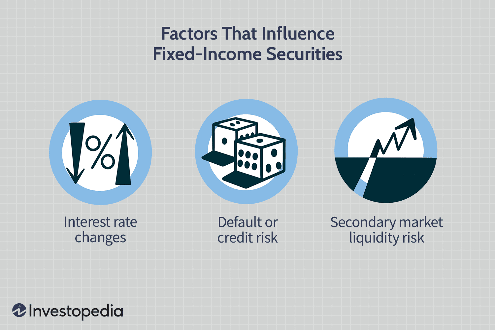

## Table of Contents

## What are fixed-income securities?

Fixed-income securities are investments that provide a steady stream of income to investors. These securities include things like bonds, which are loans that investors make to governments or companies. When you buy a bond, you are lending money to the issuer, and in return, they promise to pay you back the amount you lent, plus interest, over a set period of time. The interest payments are usually made regularly, like every six months, which gives investors a predictable income.

These securities are called "fixed-income" because the amount of interest they pay stays the same, or fixed, throughout the life of the investment. This makes them attractive to people who want a reliable source of income, such as retirees. However, the value of fixed-income securities can still go up or down based on changes in interest rates and the financial health of the issuer. So, while they offer stability, they are not without risks.

## What are the different types of fixed-income securities?

Fixed-income securities come in many different forms, but the most common type is a bond. Bonds are like IOUs from a government or a company. When you buy a bond, you're lending money to the issuer, and they promise to pay you back with interest over time. There are government bonds, which are issued by national governments, and corporate bonds, which are issued by companies. Government bonds are often seen as safer because governments are less likely to go bankrupt, but they usually offer lower interest rates. Corporate bonds can offer higher interest rates, but they also come with a higher risk because companies can fail.

Another type of fixed-income security is a municipal bond, which is issued by local governments or agencies to fund public projects like schools or roads. These bonds can be attractive because the interest you earn is often exempt from federal taxes, and sometimes from state and local taxes too. There are also asset-backed securities, which are bonds backed by loans like mortgages or car loans. These securities pay interest from the payments made on those loans. Lastly, there are preferred stocks, which are a type of stock that acts like a bond by paying a fixed dividend, but they can also offer the potential for the stock price to go up.

Each type of fixed-income security has its own risks and benefits. For example, while government bonds are generally safe, they might not keep up with inflation. Corporate bonds can offer higher returns but come with the risk of the company defaulting. Municipal bonds offer tax advantages but depend on the financial health of the local government. Asset-backed securities can be complex and their value can be affected by the performance of the underlying loans. Preferred stocks offer a mix of bond-like income and stock-like growth potential, but they can be more volatile. Understanding these differences helps investors choose the right fixed-income securities for their needs.

## How do interest rates affect fixed-income securities?

Interest rates have a big impact on fixed-income securities like bonds. When interest rates go up, the value of existing bonds goes down. This happens because new bonds that are issued will have higher interest rates, making the older bonds with lower rates less attractive to investors. So, if you want to sell your old bond, you might have to sell it for less than what you paid for it. On the other hand, if interest rates go down, the value of your existing bonds goes up because they now have higher interest rates compared to new bonds being issued.

This relationship between interest rates and bond prices is important for investors to understand. If you plan to hold onto your bond until it matures, you will still get the full amount you were promised, plus the interest payments along the way. But if you need to sell your bond before it matures, the current interest rates will affect how much you can sell it for. This is why people who invest in fixed-income securities often keep an eye on what the central bank is doing with interest rates, as changes can affect the value of their investments.

## What is the relationship between bond prices and yields?

Bond prices and yields have an inverse relationship. This means that when bond prices go up, yields go down, and when bond prices go down, yields go up. To understand why, think of a bond like a loan. When you buy a bond, you're lending money to the issuer, and they pay you back with interest over time. The yield is the interest rate you earn on your loan, shown as a percentage of the bond's price.

Let's say you have a bond that pays $50 in interest every year. If you bought the bond for $1,000, the yield would be 5% because $50 is 5% of $1,000. Now, if the price of the bond goes up to $1,250, the $50 interest payment now represents a lower yield of 4%, because $50 is 4% of $1,250. On the other hand, if the price of the bond falls to $800, the $50 interest payment now represents a higher yield of 6.25%, because $50 is 6.25% of $800. So, as the price of the bond changes, the yield changes in the opposite direction.

## How does inflation impact fixed-income investments?

Inflation can hurt fixed-income investments like bonds. When prices go up because of inflation, the money you get from your bond's interest payments is worth less. If you have a bond that pays you $50 every year, and inflation makes everything 3% more expensive, that $50 won't buy as much as it used to. This means your bond's value goes down because the money it pays you is not keeping up with the rising prices.

To protect against inflation, some bonds are made to adjust their payments. These are called inflation-linked bonds, like Treasury Inflation-Protected Securities (TIPS) in the U.S. The interest payments and the bond's value go up with inflation, so your money keeps its value even when prices rise. But, not all bonds do this, so it's important to know if your bond can fight inflation or if it might lose value over time.

## What role does credit risk play in fixed-income securities?

Credit risk is a big deal when it comes to fixed-income securities like bonds. It's the chance that the person or company you lent money to by buying their bond might not be able to pay you back. If a company runs into money troubles, they might not have enough to pay back all their debts, including the interest on your bond. This is why people who invest in bonds look at credit ratings. Credit ratings are like report cards that tell you how likely it is that the issuer will pay you back. A high credit rating means the issuer is seen as reliable, while a low credit rating means there's a bigger chance they might not pay you back.

The level of credit risk can change how much money you can make from a bond. Bonds with higher credit risk usually offer higher interest rates to make up for the extra danger. This is because investors want more reward for taking on more risk. So, if you buy a bond from a company with a low credit rating, you might get paid more in interest, but there's also a bigger chance you might not get all your money back. On the other hand, bonds from very safe issuers, like the government, usually pay less interest because they're seen as less risky. Understanding credit risk helps you decide if the potential reward is worth the risk when you're thinking about investing in fixed-income securities.

## How do maturity dates influence the value of fixed-income securities?

Maturity dates are important for fixed-income securities like bonds because they tell you when you will get your money back. If you buy a bond, the issuer promises to pay you back the full amount you lent them on the maturity date. The length of time until the bond matures can affect its price and the interest rate it pays. Bonds that mature sooner usually have lower interest rates because you don't have to wait as long to get your money back. On the other hand, bonds that take longer to mature often pay higher interest rates to make up for the fact that you have to wait longer.

The value of a bond can also change based on how close it is to its maturity date. If interest rates go up after you buy a bond, the price of your bond might go down because new bonds are being issued with higher interest rates. But if your bond is close to its maturity date, the price won't drop as much because you'll be getting your money back soon anyway. If interest rates go down, the price of your bond might go up, but again, the effect is smaller if your bond is close to maturing. So, the time left until the maturity date can make a big difference in how much a bond's value changes with interest rates.

## What are callable and putable bonds and how do they affect investment decisions?

Callable bonds and putable bonds are special types of bonds that give either the issuer or the investor extra options. A callable bond lets the issuer buy back the bond before it matures. They might do this if interest rates go down, so they can issue new bonds at a lower rate. This can be bad for investors because they might lose out on the higher interest payments they were expecting. But, callable bonds often come with higher interest rates to make up for this risk. So, when thinking about buying a callable bond, investors need to decide if the higher interest rate is worth the chance that the bond might be called back early.

Putable bonds work the other way around. They let the investor sell the bond back to the issuer before it matures. This can be good for investors if interest rates go up, because they can get their money back and invest it in new bonds with higher interest rates. Putable bonds usually have lower interest rates because they give this extra option to the investor. When deciding on putable bonds, investors need to think about whether the ability to sell the bond back early is worth the lower interest rate they'll get. Both callable and putable bonds add layers of strategy to investing, and understanding these features can help investors make better choices.

## How do macroeconomic factors influence fixed-income markets?

Macroeconomic factors like interest rates, inflation, and economic growth can really shake up the fixed-income markets. When interest rates go up, the prices of existing bonds usually go down. This is because new bonds will be issued with higher interest rates, making the old bonds less attractive. On the flip side, if interest rates drop, the prices of existing bonds go up because they now offer better interest rates than new bonds. Inflation also plays a big role. When prices rise because of inflation, the money you get from your bond's interest payments is worth less. This can make fixed-income investments less appealing unless they're the kind that adjusts for inflation, like TIPS.

Economic growth is another big factor. When the economy is doing well, companies might do better and be less likely to default on their bonds, which can make corporate bonds more attractive. But if the economy slows down, the risk of companies not being able to pay back their debts goes up, which can make investors more cautious about buying corporate bonds. Governments might also change their borrowing habits based on the economy. In tough times, they might issue more bonds to help stimulate the economy, which can affect bond prices and yields. All these factors together mean that investors in fixed-income securities need to keep an eye on the bigger economic picture to make smart investment choices.

## What is duration and how is it used to assess interest rate risk?

Duration is a way to measure how sensitive a bond's price is to changes in interest rates. It tells you how long it will take for the bond's cash flows (like interest payments and the money you get back at the end) to pay back the price you paid for the bond. Think of it like a seesaw: if interest rates go up, the price of the bond goes down, and the longer the duration, the bigger the swing in the bond's price. So, if a bond has a long duration, its price will change a lot when interest rates change, making it riskier.

Investors use duration to understand and manage the risk of their bond investments. If you're worried about interest rates going up, you might want to buy bonds with shorter durations because their prices won't drop as much. On the other hand, if you think interest rates will go down, you might choose bonds with longer durations to get bigger price increases. By looking at a bond's duration, investors can make better choices about which bonds to buy based on what they think will happen with interest rates.

## How do tax considerations affect the returns on fixed-income securities?

Tax considerations can change how much money you actually get to keep from your fixed-income investments. When you earn interest from a bond, you usually have to pay taxes on that money. The tax rate depends on where you live and what kind of bond you have. For example, if you buy a corporate bond, the interest you earn is usually taxed at your regular income tax rate. This means the more money you make from the bond, the more you might have to pay in taxes, which can cut into your overall return.

Some bonds, like municipal bonds, can offer a tax break. The interest you earn from these bonds is often free from federal taxes, and sometimes from state and local taxes too. This can make them a good choice if you're in a high tax bracket because you get to keep more of the interest you earn. When you're thinking about buying fixed-income securities, it's important to look at how taxes will affect your returns. A bond that looks like it pays a lot of interest might not be as good if you have to give a big chunk of it to the tax man.

## What advanced strategies can be used to optimize a fixed-income portfolio?

One way to optimize a fixed-income portfolio is by using a laddering strategy. This means buying bonds that mature at different times, like a ladder with steps. You might buy some bonds that mature in one year, some in two years, and so on. When a bond matures, you can use the money to buy a new bond with a longer maturity. This helps you spread out the risk of interest rate changes and gives you a steady stream of money as bonds mature at different times. It's like having a safety net because you're not putting all your eggs in one basket.

Another strategy is to use bond funds or ETFs, which are like baskets of bonds. These funds can give you more variety in your portfolio because they hold many different bonds. This can help you spread out your risk because if one bond doesn't do well, the others might make up for it. Bond funds also make it easier to buy and sell bonds because you don't have to deal with each bond separately. Plus, some bond funds are managed by experts who try to pick the best bonds for the fund, which can help you do better than if you picked bonds on your own.

Lastly, you can use interest rate swaps or other derivatives to manage interest rate risk. An interest rate swap is like a deal where you trade your bond's interest payments with someone else's. If you think interest rates are going to go up, you might swap your fixed interest payments for someone else's variable payments. This way, if rates do go up, you'll get more money from the variable payments. These strategies can be a bit tricky and might need help from a financial advisor, but they can help you protect your portfolio from big changes in interest rates.

## References & Further Reading

[1]: ["Algorithmic Trading and Quantitative Strategies"](https://www.taylorfrancis.com/books/mono/10.1201/9780429183942/algorithmic-trading-quantitative-strategies-raja-velu) by Raja Velu

[2]: ["Bond Markets, Analysis, and Strategies"](https://www.amazon.com/Bond-Markets-Analysis-Strategies-tenth/dp/026204627X) by Frank J. Fabozzi

[3]: ["Fixed Income Securities: Tools for Today's Markets"](https://www.amazon.com/Fixed-Income-Securities-Markets-Finance/dp/1119835550) by Bruce Tuckman and Angel Serrat

[4]: Andersen, T. G., & Benzoni, L. (2009). ["Realized Volatility"](https://www.semanticscholar.org/paper/Realized-Volatility-Andersen-Benzoni/83ada8ce652a91afe079f390f2e02f377d6e93e2). In Handbook of Financial Econometrics.

[5]: ["High-Frequency Trading: A Practical Guide to Algorithmic Strategies and Trading Systems"](https://www.amazon.com/High-Frequency-Trading-Practical-Algorithmic-Strategies/dp/1118343506) by Irene Aldridge