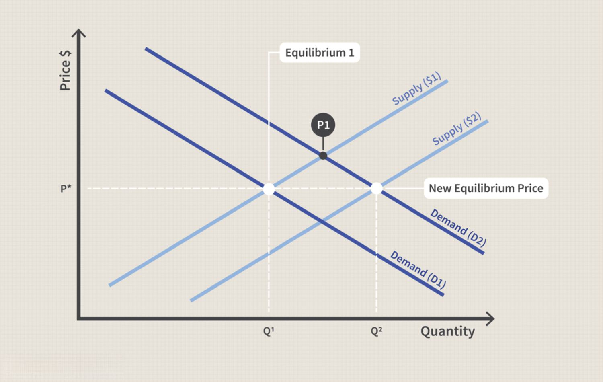

Gasoline prices are a persistent concern for consumers worldwide. They influence a broad range of economic activities, from everyday commuting expenses to the cost of goods in the market. The fluctuations in gasoline prices have a ripple effect on both personal budgets and broader economic indicators, leading to heightened sensitivity among consumers and policymakers alike. Understanding what drives these price changes is crucial for both economic planning and personal financial management.

Several key factors determine the cost of gasoline. At the forefront is the fundamental economic principle of supply and demand. The availability of gasoline and the level of consumer demand directly impact pricing. When supply is abundant and demand is stable or low, prices tend to decrease. Conversely, when supply is constrained or demand surges, prices typically increase.

Another significant factor is the cost associated with refining and distributing gasoline. The process of transforming crude oil into gasoline involves various technical and logistical expenses, which contribute to the final price at the pump. These costs are influenced by technological advances, the type of crude oil being refined, and the efficiency of distribution networks.

Government-imposed taxes and regulatory measures also play a crucial role. Federal and state taxes can significantly add to the retail price of gasoline, with variations in tax rates causing differences in prices across regions. Moreover, regulations aimed at meeting environmental standards can impact the refining process, further influencing costs.

Consumer behavior is a key element in gasoline pricing dynamics. Patterns of demand fluctuate with seasonal changes, such as increased travel during summer months, which often result in temporary price hikes. However, gasoline demand tends to be inelastic in the short term, meaning that significant price changes are sometimes necessary to alter consumption habits.

In recent years, technology has begun reshaping gasoline markets through the incorporation of algorithmic trading. This emerging influence utilizes AI and machine learning to analyze vast datasets, predict market trends, and optimize pricing strategies. While these technologies can enhance market efficiencies, they also raise questions about potential market manipulation and the ethical implications of automated pricing mechanisms.

In this article, we will examine these determinants of gasoline prices in detail, providing a comprehensive understanding of how this vital commodity is priced. We will also explore the transformative role of algorithmic trading, offering insights into the evolving interaction between technology and traditional market dynamics.

## Table of Contents

## The Role of Crude Oil in Gasoline Pricing

Crude oil serves as the primary raw material for producing gasoline, making its price a substantial determinant of gasoline costs. The intricate relationship between [crude oil](/wiki/crude-oil) and gasoline prices is primarily governed by market forces, geopolitical factors, and the complex operations of influential organizations like the Organization of the Petroleum Exporting Countries (OPEC).

Market forces such as global supply and demand dynamics are pivotal in crude oil pricing. On the supply side, factors include production levels from major oil-producing nations, technological advancements in extraction methods, and discoveries of new reserves. Conversely, demand is influenced by global economic conditions, energy consumption trends, and the shift toward sustainable energy sources. An imbalance in supply and demand — for example, a decrease in oil production or an increase in economic activities demanding more energy — can lead to significant changes in crude oil prices.

Geopolitical events also play a crucial role in determining crude oil prices. Political stability in oil-rich regions, trade negotiations, and international sanctions can impact supply chains and production capacities. For instance, political unrest in a major oil-producing country can disrupt production, leading to a decrease in supply and a consequent rise in prices. Similarly, decisions by OPEC, which coordinates oil production policies among its member countries, can influence global oil supply by setting production targets, thereby affecting crude oil prices.

The operations of OPEC are central to crude oil pricing. As a cartel, OPEC seeks to manage oil production to maintain price stability and ensure profitable margins for its members. OPEC's decisions on whether to increase or decrease oil production levels can either alleviate or exacerbate fluctuations in global oil prices. These fluctuations directly affect gasoline prices; as crude oil becomes more expensive, the cost of refining and distributing gasoline increases, thereby raising prices at the pump.

In summary, the cost of crude oil, dictated by a combination of market supply and demand, geopolitical events, and OPEC policies, has a direct and significant impact on gasoline prices. Understanding these factors helps in anticipating changes in gasoline pricing, providing a clearer picture of how global and regional forces shape everyday consumer costs.

## Refining and Distribution Costs

Refining crude oil into gasoline is an intricate and costly process influenced by various factors, including the type of crude oil and the refining technologies employed. Crude oil consists of a complex mixture of hydrocarbons, and refineries must convert these into usable fuels such as gasoline through processes like distillation, cracking, and reforming. Each of these processes incurs specific costs which can fluctuate based on the quality of crude oil input and the efficiency of the refinery operations.

Refineries operate with different types of crude oil, broadly categorized into light, medium, and heavy grades. Light crude is generally less expensive to refine into gasoline because it contains a higher proportion of hydrocarbons suitable for gasoline production. Heavier crudes, on the other hand, require more intensive processing and thereby increase production costs due to the necessary additional refining steps like catalytic cracking and hydrocracking.

Technological advancements in refining processes can impact cost efficiency. For example, modern refineries might adopt advanced catalysts and automated control systems to enhance yield and reduce energy consumption, thus lowering production costs over time.

Following the refining process, distribution costs further affect the pricing of gasoline. The transportation of gasoline from refineries to retail outlets involves significant logistical expenses, which include pipeline transport, trucking, or shipping. Pipelines, being the most cost-effective for large volumes overland, tend to offer lower transportation costs compared to trucking or shipping, which are essential for reaching areas not served by pipeline infrastructure.

Distribution logistics are also affected by geographic factors and market accessibility. Remote or less accessible regions incur higher transportation costs, which are passed on to consumers at the pump. Additionally, infrastructure constraints and regional demand can influence distribution efficiency and subsequent costs.

Both refining and distribution costs significantly contribute to the final price consumers pay at gas stations. The complexity of refining processes, coupled with the logistical challenges of distribution, underscores the intricate system behind fuel pricing. As a result, understanding these underlying costs provides a clearer picture of the fluctuations observed in gasoline pricing worldwide.

## Government Taxes and Regulations

Federal and state taxes play a substantial role in the retail pricing of gasoline. These taxes are imposed primarily in the form of excise taxes on each gallon of gasoline sold. In the United States, for instance, the federal gasoline tax is 18.4 cents per gallon, while state taxes can vary significantly. The variation in state taxes can lead to noticeable differences in gasoline prices across the country. For example, California, known for its high taxation, adds over 60 cents per gallon in state taxes [Energy Information Administration](https://www.eia.gov/tools/faqs/faq.php?id=10&t=10). In contrast, some states levy much lower taxes, contributing to a more affordable price at the pump.

On an international scale, gasoline taxation is even more variable. European countries tend to have much higher gasoline taxes compared to the United States, reflecting different government policies regarding energy consumption and environmental protection. For instance, countries like Norway and the Netherlands often impose taxes that result in a final retail price over twice as high as that in the U.S.

Regulatory frameworks, particularly those addressing environmental standards, impose significant impacts on gasoline pricing. Regulations such as the Renewable Fuel Standard in the U.S. require the incorporation of renewable fuels into the gasoline supply, which can influence refining processes and costs. Additionally, stipulations regarding emissions and fuel formulations—such as those mandated by the Clean Air Act—necessitate the use of specialized refining techniques or additives, further affecting costs. 

These regulations can introduce additional expenses for refiners, which are typically passed on to consumers. For example, requiring low-sulfur gasoline may necessitate more intensive refining processes or the use of specific crude oil types, thereby affecting the overall operational costs. Thus, while taxes directly add to the price per gallon, regulatory measures impact the underlying cost structure of gasoline production and distribution, indirectly influencing prices.

## Consumer Demand and Market Dynamics

Consumer behavior and demand patterns play crucial roles in gasoline pricing, reflecting how market dynamics respond to shifts in consumer activities and broader economic trends. One of the most prominent factors affecting gasoline demand is seasonality. Typically, during summer months in many countries, there is an increase in travel, particularly for vacations, which leads to a surge in gasoline consumption. This heightened demand often results in temporary price hikes as supply chains adjust to meet increased consumption.

Despite these fluctuations, consumer demand for gasoline tends to be relatively inelastic in the short term. Inelastic demand implies that changes in gasoline prices do not significantly influence the quantity of gasoline consumers purchase. This occurs because gasoline is a necessity for transportation, and alternative modes of transport or fuel sources may not be readily available or convenient for consumers in the short run. The concept of price elasticity of demand is essential here, commonly expressed as:

$$
E_d = \frac{\% \text{ change in quantity demanded}}{\% \text{ change in price}}
$$

For gasoline, this elasticity coefficient (E_d) is typically less than 1, indicating inelastic demand. Factors contributing to this inelasticity include the lack of immediate substitutes for gasoline-dependent transportation, the necessity of commuting to work, and habitual patterns of travel that are not easily altered by price changes. 

Moreover, changes in macroeconomic conditions can modify consumer demand patterns. During economic downturns, demand may slightly decrease as consumers reduce travel and discretionary spending. Conversely, in periods of economic growth, increased consumer confidence and disposable income can lead to higher demand for gasoline.

Understanding these dynamics is crucial for stakeholders in the gasoline market, including suppliers, policymakers, and consumers, as they navigate the complexities of price fluctuations and demand responses. Through awareness of these market and behavioral dynamics, strategies can be developed to manage the impact of price changes on consumers and ensure a stable supply-demand equilibrium in the market.

## Algorithmic Trading and Gasoline Pricing

Algorithmic trading in gasoline pricing leverages [artificial intelligence](/wiki/ai-artificial-intelligence) (AI) and [machine learning](/wiki/machine-learning) to optimize and automate decision-making processes in the petroleum markets. These sophisticated algorithms analyze extensive data sets, including historical price movements, market trends, seasonal variations, and even news sentiment, to forecast future price fluctuations and adjust pricing strategies accordingly. By doing so, [algorithmic trading](/wiki/algorithmic-trading) enhances market responsiveness and efficiency, enabling market participants to rapidly adapt to changing conditions.

The implementation of AI-driven algorithms in gasoline pricing facilitates more dynamic pricing models. These models adjust gasoline prices in real-time based on supply and demand indicators, crude oil price movements, and logistical constraints. For instance, machine learning techniques, such as neural networks and regression analysis, are employed to identify patterns in pricing data that might not be immediately apparent through traditional statistical analysis. This predictive capability allows companies to better anticipate market conditions and optimize their pricing strategies, thereby improving profit margins while maintaining competitive pricing for consumers.

However, the introduction of algorithmic trading in gasoline markets has raised concerns regarding potential collusion and market manipulation. The automation and speed of algorithmic trading could inadvertently lead to coordination among pricing algorithms, resulting in anti-competitive practices that mimic collusive behavior. This issue stems from the algorithms' capacity to rapidly adapt and react to each other's pricing decisions, potentially creating a de facto synchronized pricing pattern without explicit human intervention. Such outcomes raise important regulatory and ethical questions, as they could undermine market fairness and transparency.

To mitigate these risks, regulatory bodies and stakeholders in the gasoline market must closely monitor algorithmic pricing mechanisms. Ensuring transparency in the algorithmic processes and implementing stringent checks and balances can help prevent undesired market manipulation. Additionally, fostering a regulatory framework that promotes ethical AI use while encouraging innovation will be crucial to harnessing the full potential of algorithmic trading in gasoline pricing without compromising the integrity of the market.

## Case Studies of Algorithmic Pricing

A notable example of AI-driven pricing strategies can be observed through a study conducted in Germany, where the application of algorithms in gas stations has led to significantly increased profit margins. This study analyzed data from multiple gas stations that adopted AI-powered pricing algorithms compared to those that relied on traditional pricing methods. The AI algorithms were designed to take into account numerous variables, such as competitor prices, time of day, and historical sales data, to dynamically adjust gasoline prices in real-time.

The introduction of AI-driven pricing has sparked a debate concerning its ethical implications, particularly in terms of consumer fairness and transparency. One of the primary concerns revolves around the potential for price discrimination, where different consumers might be charged varying prices based on perceived willingness to pay. This could lead to scenarios where the same fuel type is offered at different prices within short timeframes or among different locations, which might be perceived as unfair by consumers.

Moreover, the opacity of algorithmic decision-making processes poses challenges for pricing transparency. Traditional pricing methods are generally straightforward and predictable; however, algorithmic strategies can obscure the factors leading to a particular price point. This lack of transparency can reduce consumer trust and might ultimately impact consumer satisfaction and loyalty.

The ethical debate around AI-driven pricing extends to regulatory considerations. Policymakers may find it challenging to ensure fair market practices and protect consumer interests due to the complex nature of algorithmic systems. As such, there is an ongoing discussion about the necessity of establishing technology-specific regulations to safeguard against potential abuse or manipulation of gasoline prices through algorithmic systems.

This case study illustrates both the potential benefits and the ethical challenges associated with the deployment of AI in gasoline pricing. While AI-driven strategies can optimize market efficiency and increase margins, they must be implemented with careful consideration for fairness and transparency to maintain consumer trust.

## Conclusion

Gasoline pricing is affected by a varied and intricate mix of factors. At the core are crude oil prices, which serve as the pivotal component in determining the baseline cost of gasoline. These prices are susceptible to global supply and demand fluctuations, geopolitical tensions, and decisions by influential entities like OPEC. Beyond the cost of crude oil, the refining and distribution processes further shape the final price seen by consumers. The complexity of refining technologies and the logistical challenges associated with transportation add layers of cost that contribute to regional pricing differences.

Government taxes and regulations are substantial determinants of the retail price of gasoline. These factors vary widely between locations, often leading to notable discrepancies in gasoline prices between neighboring regions or countries. Additionally, the imposition of environmental standards can introduce variations in pricing as refiners modify processes to comply with regulations.

Consumer demand, typically inelastic in the short term, also influences gasoline prices. Patterns such as increased travel during seasonal peaks can prompt temporary price surges. However, consumer behavior is gradually evolving, with emerging technologies playing a bigger role in shaping demand.

Algorithmic trading has introduced a novel dimension to gasoline pricing. Leveraging AI and machine learning, these algorithms analyze extensive data sets to predict market trends, optimize pricing strategies, and react to market dynamics more aggressively. This technological integration has prompted a significant shift, intertwining conventional market practices with advanced computational techniques. While algorithmic trading enhances market efficiency, it raises critical considerations related to potential market manipulation and fairness.

Understanding these varied determinants is essential for consumers and policymakers alike. Such knowledge equips them to address the challenges posed by fluctuating gasoline prices and aids in making informed decisions that can lead to more stable economic planning and adjustments in consumer behavior. As technology continues to evolve alongside traditional factors, staying informed about these dynamics becomes increasingly vital in navigating the complex landscape of gasoline pricing.

## References & Further Reading

[1]: ["The Economics of Oil: A Primer Including Geology, Energy Security, and Oil Price Futures"](https://link.springer.com/book/10.1007/978-3-319-47819-7) by S.W. Ayling 

[2]: ["The Prize: The Epic Quest for Oil, Money & Power"](https://en.wikipedia.org/wiki/The_Prize:_The_Epic_Quest_for_Oil,_Money,_and_Power) by Daniel Yergin

[3]: ["Oil 101"](https://www.amazon.com/Oil-101-Morgan-Downey/dp/0982039204) by Morgan Downey

[4]: ["Advances in Financial Machine Learning"](https://www.amazon.com/Advances-Financial-Machine-Learning-Marcos/dp/1119482089) by Marcos Lopez de Prado

[5]: ["Energy Information Administration: Gasoline Explained"](https://www.eia.gov/energyexplained/gasoline/)

[6]: ["Algorithmic Trading and DMA: An introduction to direct access trading strategies"](https://archive.org/details/algorithmictradi0000john) by Barry Johnson

[7]: ["Crude Volatility: The History and the Future of Boom-Bust Oil Prices"](https://www.jstor.org/stable/10.7312/mcna17814) by Robert McNally