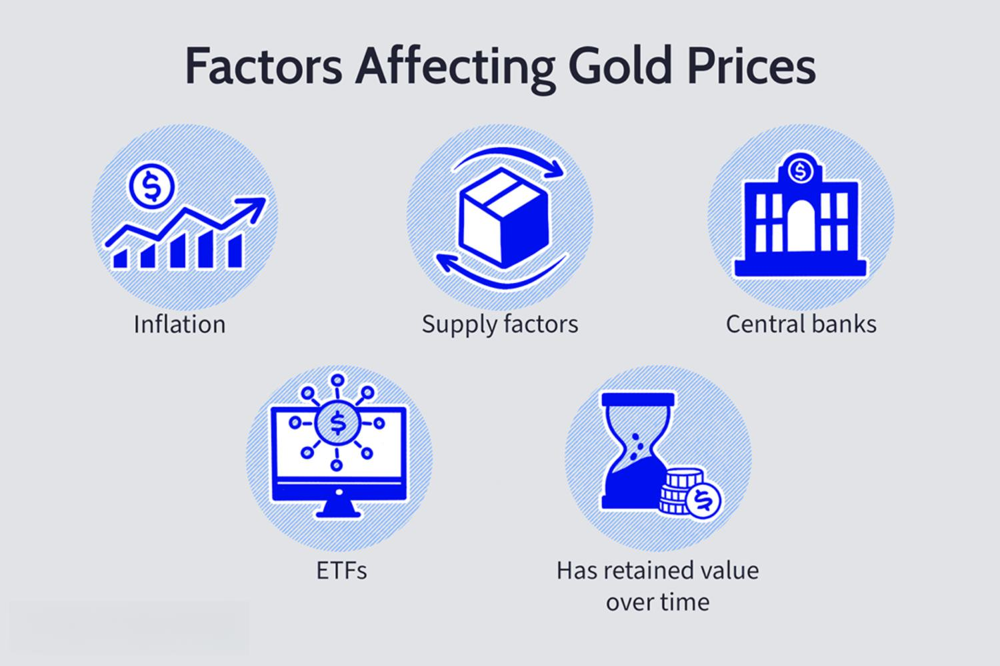

## Table of Contents

## What is gold and why is it valuable?

Gold is a shiny, yellow metal that people have loved for a long time. It is found in the ground and is very rare. People dig it out of the earth and use it to make jewelry, coins, and other things. Gold does not rust or get damaged easily, so it lasts a long time. It is also very soft and easy to shape into different forms.

Gold is valuable for a few reasons. First, because it is rare, there isn't a lot of it around, so people want it more. When something is hard to find, it usually costs more. Second, gold is used in many important things, like computers and other electronics. This makes it even more valuable. People also like gold because it looks pretty and they can use it to show they are rich or important.

## How do economic indicators affect gold prices?

Economic indicators can make gold prices go up or down. When the economy is not doing well, like during a recession, people often buy more gold. They think of gold as a safe place to keep their money because it keeps its value even when other things like stocks or money lose value. So, when bad economic news comes out, like high unemployment or low growth, gold prices usually go up.

On the other hand, when the economy is doing well, people might not buy as much gold. They might choose to invest in things like stocks or real estate instead, because these can grow and make more money. Good economic news, like low inflation or strong job growth, can make gold prices go down because people feel more confident about other investments.

Sometimes, other factors like interest rates or the value of the dollar can also affect gold prices. If interest rates go up, holding gold becomes less attractive because you could earn more money from savings accounts or bonds. If the dollar gets weaker, gold becomes cheaper for people using other currencies, which can push its price up. So, it's not just the economy itself, but also how people feel about the economy and other financial conditions that can change how much gold is worth.

## What role does inflation play in the pricing of gold?

Inflation is when the prices of things go up over time. When inflation happens, the money you have can buy less stuff. Gold is often seen as a good way to protect against inflation. This is because gold usually keeps its value even when the prices of other things go up. So, when people see that inflation is going up, they might buy more gold to keep their money safe.

When inflation is high, people might think that their money will be worth less in the future. This makes them want to buy things that will keep their value, like gold. As more people buy gold, the price of gold goes up. On the other hand, if inflation is low and stable, people might not feel the need to buy as much gold, and the price might not go up as much. So, inflation can make a big difference in how much gold costs.

## How does the strength of the US dollar influence gold prices?

The strength of the US dollar can affect how much gold costs. When the US dollar is strong, it means the dollar can buy more of other countries' money. If the dollar is strong, gold becomes more expensive for people in the US because they need more dollars to buy the same amount of gold. But for people in other countries, gold might seem cheaper because their money can buy more dollars, and then more gold.

On the other hand, when the US dollar is weak, it means the dollar can buy less of other countries' money. A weak dollar makes gold cheaper for people in the US because they need fewer dollars to buy gold. But for people in other countries, gold might seem more expensive because their money can buy fewer dollars, and then less gold. So, the strength of the US dollar can make gold prices go up or down depending on where you are.

## What impact do interest rates have on gold investment?

Interest rates can change how people feel about investing in gold. When interest rates go up, it means you can earn more money by putting your money in savings accounts or bonds. Because of this, people might not want to buy as much gold. Gold doesn't give you any interest, so when other investments are paying more, gold becomes less attractive. This can make the price of gold go down because fewer people want to buy it.

On the other hand, when interest rates are low, people might look for other places to put their money. Gold can seem like a good choice because it keeps its value and doesn't pay any interest anyway. When interest rates are low, more people might buy gold, which can push its price up. So, the level of interest rates can really affect how much people want to invest in gold.

## How do geopolitical tensions affect the gold market?

Geopolitical tensions, like wars or big disagreements between countries, can make people feel worried about the future. When this happens, they often look for safe places to keep their money. Gold is seen as a safe investment because it keeps its value even when things are uncertain. So, when there are geopolitical tensions, more people might buy gold to feel secure, which can push its price up.

For example, if two big countries are arguing and it looks like they might fight, people might start buying more gold. They do this because they think other investments like stocks could lose value if a war starts. So, the demand for gold goes up, and with more people wanting to buy it, the price of gold can go up too. Geopolitical tensions can make the gold market move a lot because people's feelings about safety and the future change quickly.

## What is the relationship between gold supply and demand?

The price of gold goes up and down based on how much people want it and how much there is to buy. When a lot of people want gold, but there isn't much to go around, the price goes up. This happens because everyone is trying to buy the same amount of gold, and they have to pay more to get it. On the other hand, if there isn't much demand for gold, and there's a lot of it available, the price can go down because people don't need to pay as much to get it.

Gold supply comes from mining and recycling old gold. Mining companies dig gold out of the ground, and people can also melt down old jewelry or other gold items to use again. If miners find a lot of new gold, it can increase the supply, which might make the price go down if the demand stays the same. But if miners can't find much new gold, or if people start using more recycled gold, the supply might stay low, which can keep the price high if a lot of people still want to buy it.

## How do central bank policies impact gold prices?

Central banks, like the ones in big countries, can change how much gold costs by what they do with money. When a central bank decides to print more money, it can make the value of that money go down. People might then buy gold to keep their money safe because gold keeps its value even when money loses value. So, if central banks make a lot of new money, it can push gold prices up because more people want to buy it.

Central banks also buy and sell gold themselves. If a central bank buys a lot of gold, it can make the price go up because there's less gold left for everyone else to buy. On the other hand, if a central bank sells a lot of gold, it can make the price go down because there's more gold available. So, what central banks do with their money and their gold can really change how much gold costs.

## What are the effects of mining production levels on gold prices?

When miners find and dig up more gold, it can change how much gold costs. If miners find a lot of new gold, there will be more gold to buy. When there's more gold, but the same number of people want to buy it, the price can go down. This is because people don't have to pay as much to get the gold they want. So, if mining production goes up a lot, it can make gold cheaper.

But if miners can't find much new gold, or if it's hard to get it out of the ground, there will be less gold to buy. When there's less gold, but the same number of people want to buy it, the price can go up. This is because people have to pay more to get the gold they want. So, if mining production goes down, it can make gold more expensive.

## How do investor sentiments and market trends influence gold prices?

Investor sentiments and market trends play a big role in how much gold costs. When investors feel worried or unsure about the economy, they often buy more gold. They see gold as a safe place to keep their money because it keeps its value even when other investments like stocks might lose value. So, if a lot of people start feeling nervous about the economy or world events, they might all want to buy gold at the same time. This increased demand can push the price of gold up.

Market trends also affect gold prices. If a lot of people start talking about gold and saying it's a good investment, more people might decide to buy it. This can create a trend where gold becomes more popular and its price goes up. On the other hand, if the trend changes and people start thinking other investments are better, they might sell their gold. When a lot of people sell gold at the same time, the price can go down because there's more gold available for others to buy. So, what people think and what's popular in the market can really change how much gold costs.

## What technical analysis tools are used to predict gold price movements?

Technical analysis is a way to guess where gold prices might go by looking at past prices and patterns. People use charts to see how gold prices have moved before. They look for patterns like "head and shoulders" or "double tops" that might show if the price will go up or down. They also use something called moving averages, which are lines on the chart that show the average price over a certain time. If the price goes above the moving average, it might mean the price will keep going up. If it goes below, it might mean the price will go down.

Another tool people use is the Relative Strength Index (RSI). This tool helps see if gold is being bought too much or sold too much. If the RSI is over 70, it might mean gold is too expensive and could go down soon. If it's under 30, it might mean gold is too cheap and could go up. People also look at something called support and resistance levels. These are prices where gold has stopped going down or up before. If the price gets close to these levels again, it might stop there again. By using these tools, people try to make better guesses about where gold prices might go next.

## How do global economic cycles and crises affect long-term gold price trends?

Global economic cycles and crises can really change how much gold costs over a long time. When the world's economy is doing well, people might not buy as much gold. They might choose to invest in things like stocks or real estate instead because these can grow and make more money. But when the economy starts to go down, like during a recession, people often buy more gold. They think of gold as a safe place to keep their money because it keeps its value even when other things lose value. So, during bad economic times, the price of gold usually goes up because more people want to buy it.

Big economic crises, like the 2008 financial crisis or the economic effects of the COVID-19 pandemic, can make gold prices go up a lot. During these times, people feel very unsure about the future and want to protect their money. Gold is seen as a good way to do that because it's been valuable for a long time and doesn't lose its worth easily. So, when there's a big crisis, more people buy gold, which pushes its price up. Over the long term, these cycles and crises can make gold prices go up and down, but often, gold does well when the economy is not doing well.

## What are the core market factors impacting gold prices?

Central bank reserves are a critical [factor](/wiki/factor-investing) impacting gold prices. Central banks hold substantial amounts of gold as part of their foreign exchange reserves. Changes in these holdings can influence gold market dynamics significantly. When central banks decide to increase their gold reserves, it often leads to a rise in gold prices due to the increased demand. Conversely, selling substantial amounts of gold can depress prices as the increased supply enters the market. For instance, central banks in countries like China and Russia have been known to bolster their gold reserves, impacting global pricing by altering total market demand and supply conditions.

The strength of the U.S. dollar is another vital component that inversely affects gold prices. The inverse relationship is primarily because gold is generally priced in U.S. dollars. As the value of the dollar increases, gold becomes more expensive for holders of other currencies, which may reduce demand and lower prices. Conversely, a weaker dollar makes gold more affordable internationally, potentially boosting demand and increasing prices. This relationship can be expressed with the formula:

$$
P_{\text{gold,local}} = P_{\text{gold,USD}} \times \text{Exchange Rate}
$$

where $P_{\text{gold,local}}$ is the local price of gold and $P_{\text{gold,USD}}$ is the price of gold in U.S. dollars. Therefore, fluctuations in currency exchange rates can significantly impact gold pricing globally.

Gold demand spans multiple sectors including jewelry, technology, and investment vehicles such as exchange-traded funds (ETFs). Each sector's demand is influenced by distinct factors. Jewelry, for instance, accounts for a substantial portion of gold consumption, especially in markets like India and China where cultural and economic factors drive purchases. In the technology sector, gold's conductive properties make it essential in electronics, with demand fluctuating based on advancements and production rates in the tech industry. Investment demand, particularly from gold ETFs, can also shift rapidly based on market sentiment and economic forecasts.

Production levels from leading gold-producing nations, such as China, Australia, and Russia, directly affect the global supply of gold. As production increases, assuming constant demand, supply-side pressures can lead to lower gold prices. However, the cost of mining and producing gold also influences market pricing. Higher extraction and processing costs generally result in higher prices to maintain profitability within the industry. Here, economic factors such as energy prices, labor costs, and regulatory environments play a role in determining the cost structure of gold production.

Overall, the interplay of central bank reserves, U.S. dollar strength, sectoral demand, and production costs forms a complex matrix influencing gold prices. Understanding these core market factors is essential for predicting and responding to changes in the gold market.

## References & Further Reading

[1]: Dressler, J. (2013). ["Central Bank Holdings of Gold and Economic Impacts."](https://www.nber.org/papers/w17894) International Monetary Fund Working Papers.

[2]: ["The Economics of Gold: The Global Gold Market"](https://www.chicagofed.org/publications/chicago-fed-letter/2021/464) by Tony Warwick-Ching

[3]: ["The Relationship between Gold and the US Dollar: Investment and Hedging Perspectives"](https://www.forbes.com/councils/forbesfinancecouncil/2024/09/12/the-gold-dollar-connection-insights-for-investors/) in The Journal of Wealth Management.

[4]: Williams, S. (2012). ["Gold and Economic Freedom."](http://www.thefinancialpanner.com/wp-content/uploads/2009/11/AlanGreenspan-GoldEconomicFreedom.pdf) Journal of Economic Perspectives.

[5]: ["Algorithmic Trading and DMA: An Introduction to Direct Access Trading Strategies"](https://www.semanticscholar.org/paper/Algorithmic-trading-%26-DMA-%3A-an-introduction-to-Johnson/aa5de1ab883d5e23b6651faa7c1807586d688e4b) by Barry Johnson