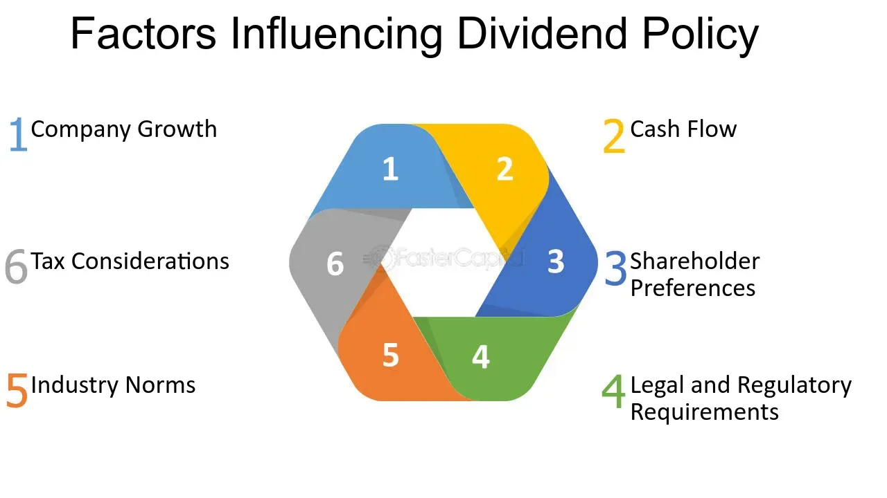

## Table of Contents

## What is a dividend per share?

A dividend per share is the amount of money a company pays out to its shareholders for each share they own. It's like a reward that companies give to their investors from their profits. When a company makes money, it can choose to share some of that money with the people who own its stock.

Companies usually pay dividends a few times a year. The amount of the dividend per share can change depending on how well the company is doing. If a company is doing really well, it might pay a bigger dividend. But if it's not doing so well, it might pay a smaller dividend or even no dividend at all. This is why investors often look at a company's dividend history to see if it's a good investment.

## Why do companies increase their dividends per share?

Companies increase their dividends per share when they are doing well and making more money. When a company earns more profit, it can decide to share some of that extra money with its shareholders. This makes the shareholders happy because they get more money for each share they own. It's like a thank you from the company for believing in it and investing in it.

Increasing dividends can also make the company look good to other people who might want to buy its stock. When a company raises its dividends, it shows that it is confident about its future and that it is doing well. This can attract more investors, which can help the company grow even more. So, by increasing dividends, a company not only rewards its current shareholders but also tries to bring in new ones.

## How does a company's profitability affect dividend increases?

A company's profitability is really important when it comes to increasing dividends. When a company makes more money, it has more to share with its shareholders. If the company is doing well and making bigger profits, it might decide to give some of that extra money to its shareholders by increasing the dividend per share. This makes shareholders happy because they get more money for each share they own.

But if a company is not making as much money, it might not be able to increase its dividends. Sometimes, if the company is struggling, it might even have to lower its dividends or stop paying them altogether. This is because the company needs to keep enough money to run its business and grow. So, a company's profitability directly affects whether it can increase its dividends or not.

## What role does cash flow play in deciding to increase dividends?

Cash flow is super important when a company decides if it can increase its dividends. It's like the money that comes in and goes out of the company. If a company has a lot of cash coming in, it might have extra money to share with its shareholders by increasing the dividend per share. This makes shareholders happy because they get more money for each share they own.

But if a company doesn't have enough cash coming in, it might not be able to increase its dividends. Sometimes, if the company is struggling to keep enough cash to run its business and grow, it might even have to lower its dividends or stop paying them altogether. So, a company needs to make sure it has enough cash flow before it can decide to increase its dividends.

## How do growth prospects influence dividend policy?

A company's growth prospects play a big role in deciding its dividend policy. If a company thinks it will grow a lot in the future, it might choose to keep more of its money to invest in new projects or expand its business. This means it might not increase its dividends or might even pay smaller dividends. The company wants to use its money to grow bigger and better, so it can make even more money down the road.

On the other hand, if a company doesn't see a lot of growth coming up, it might decide to give more money back to its shareholders through higher dividends. This is because the company might not have many good opportunities to invest its money for growth. By paying higher dividends, the company can still make its shareholders happy, even if it's not growing as fast as it used to. So, a company's growth prospects help it decide whether to keep money for growth or share it with shareholders through dividends.

## What impact does a company's debt level have on its ability to raise dividends?

A company's debt level can really affect its ability to raise dividends. When a company has a lot of debt, it has to use a big part of its money to pay back what it owes. This means it might not have enough money left over to increase dividends. If a company is struggling to pay its debts, it might even have to cut its dividends to make sure it can keep up with its payments.

On the other hand, if a company has less debt, it has more freedom with its money. It can use some of that money to raise dividends because it doesn't have to worry as much about paying back big loans. So, a company with lower debt levels is usually in a better position to increase its dividends and make its shareholders happy.

## How do economic conditions affect dividend increases?

Economic conditions can really change how a company decides to increase its dividends. When the economy is doing well, companies usually make more money. They might feel confident about their future and decide to share some of that extra money with their shareholders by raising dividends. This makes shareholders happy because they get more money for each share they own. 

But when the economy is not doing so well, companies might be more careful. They might not make as much money and could be worried about what's coming next. In these times, a company might decide not to increase its dividends or even lower them to keep enough money to run the business and stay strong. So, the health of the economy plays a big role in whether a company can raise its dividends.

## What are the tax implications of increasing dividends?

When a company increases its dividends, it can change how much tax shareholders have to pay. Dividends are usually taxed as income, so if a company pays more in dividends, shareholders might have to pay more in taxes. The exact amount of tax depends on where the shareholder lives and their personal tax situation. Some countries have different tax rates for dividends compared to other types of income, which can make a big difference.

For the company, increasing dividends doesn't directly change its taxes, but it does affect how much money it has left. If a company pays out more in dividends, it has less money to reinvest in the business or to save for future needs. This can indirectly affect the company's financial health and its ability to grow, which could impact its taxes in the long run. So, when a company thinks about increasing dividends, it has to consider both the immediate tax effects on shareholders and the longer-term financial impact on itself.

## How does shareholder composition influence dividend policy?

The people who own a company's stock, or shareholders, can really affect how the company decides to pay dividends. If a lot of the shareholders are looking for regular income, like retirees who need money to live on, the company might choose to pay higher dividends. These shareholders are happy when they get more money each time the company pays out dividends. On the other hand, if most shareholders are more interested in the company growing and getting bigger, they might prefer the company to keep more money to invest in new projects instead of paying out big dividends.

Sometimes, the company has to balance what different types of shareholders want. For example, if some shareholders want high dividends and others want the company to grow, the company might decide to pay a moderate amount of dividends and also keep some money for growth. This way, it tries to make everyone happy. So, understanding what the shareholders want is really important for the company when it's deciding on its dividend policy.

## What is the significance of a company's payout ratio when considering dividend increases?

The payout ratio is a number that shows how much of a company's profit it gives back to shareholders as dividends. It's like a percentage that tells you if a company is paying out a lot or a little of its earnings. When a company thinks about increasing its dividends, it looks at its payout ratio to see if it can afford to pay more. If the payout ratio is low, it means the company is keeping a lot of its money for other things, like growing the business. So, it might be able to raise dividends without hurting its ability to invest in the future.

On the other hand, if the payout ratio is already high, it means the company is giving away most of its profits as dividends. In this case, increasing dividends could be risky because the company might not have enough money left to run its business or grow. So, a company usually tries to keep its payout ratio at a level that lets it pay good dividends but also save enough money for the future. By looking at the payout ratio, a company can decide if it's a good time to increase dividends or if it should wait until it's making more money.

## How do regulatory environments affect a company's decision to increase dividends?

The rules and laws that a company has to follow can really affect whether it can increase its dividends. Different countries have different rules about how much money a company can pay out to its shareholders. Some places have strict rules that say a company must keep a certain amount of money in reserve before it can pay dividends. If these rules are tight, a company might not be able to increase its dividends even if it wants to, because it has to follow the law first.

Also, some industries have special rules that can impact dividend decisions. For example, banks and other financial companies often have to meet certain financial standards set by regulators. If a bank is close to these limits, it might not be able to increase its dividends because it needs to keep more money to stay safe and meet the rules. So, the regulatory environment can make a company think twice about increasing dividends, as it needs to make sure it's following all the rules while also trying to make its shareholders happy.

## What advanced financial metrics should be analyzed to predict potential increases in dividends per share?

When trying to guess if a company will increase its dividends per share, it's helpful to look at some advanced financial numbers. One important number is the free cash flow, which is the money left after the company pays for everything it needs to keep running. If a company has a lot of free cash flow, it might have extra money to pay bigger dividends. Another number to check is the earnings per share (EPS), which shows how much profit the company makes for each share of stock. If the EPS is growing, it could mean the company has more money to share with shareholders through higher dividends.

Another useful number is the return on equity (ROE), which tells you how well the company is using the money shareholders have invested to make a profit. A high ROE can be a good sign that the company is doing well and might be able to increase its dividends. Also, looking at the company's debt-to-equity ratio can help. This number shows how much the company is borrowing compared to what shareholders have invested. If the debt-to-equity ratio is low, the company might have more room to increase dividends because it doesn't have to spend as much money paying back loans. By looking at these numbers, you can get a better idea of whether a company might raise its dividends in the future.

## References & Further Reading

[1]: Asness, C. S., & Frazzini, A. (2013). ["The Devil in HML's Details."](https://www.aqr.com/Insights/Research/Journal-Article/The-Devil-in-HMLs-Details) Journal of Portfolio Management, 39(4), 49-68.

[2]: ["Dividends and Dividend Policy"](https://corporatefinanceinstitute.com/resources/equities/dividend-policy/) by H. Kent Baker and John R. Nofsinger

[3]: Fama, E. F., & French, K. R. (2001). ["Disappearing dividends: changing firm characteristics or lower propensity to pay?"](https://www.sciencedirect.com/science/article/pii/S0304405X01000381) Journal of Financial Economics, 60(1), 3-43.

[4]: Hasbrouck, J., & Saar, G. (2013). ["Low-latency trading."](https://www.sciencedirect.com/science/article/abs/pii/S1386418113000165) The Review of Financial Studies, 26(9), 2955-2998.

[5]: Hull, J. (2017). ["Risk Management and Financial Institutions"](https://books.google.com/books/about/Risk_Management_and_Financial_Institutio.html?id=1J1QDwAAQBAJ) 

[6]: O’Hara, M. (2015). ["High frequency market microstructure."](https://www.sciencedirect.com/science/article/pii/S0304405X15000045) Annual Review of Financial Economics, 7, 133-152.

[7]: ["Trading and Exchanges: Market Microstructure for Practitioners"](https://www.acsu.buffalo.edu/~keechung/MGF743/Readings/Trading-Exchanges-Market-Microstructure-Practitioners%20Draft%20Copy.pdf) by Larry Harris

[8]: Zhang, F. (2005). ["High-frequency trading, stock volatility, and price discovery."](https://papers.ssrn.com/sol3/papers.cfm?abstract_id=1691679) European Financial Management, 6(4), 490-520.