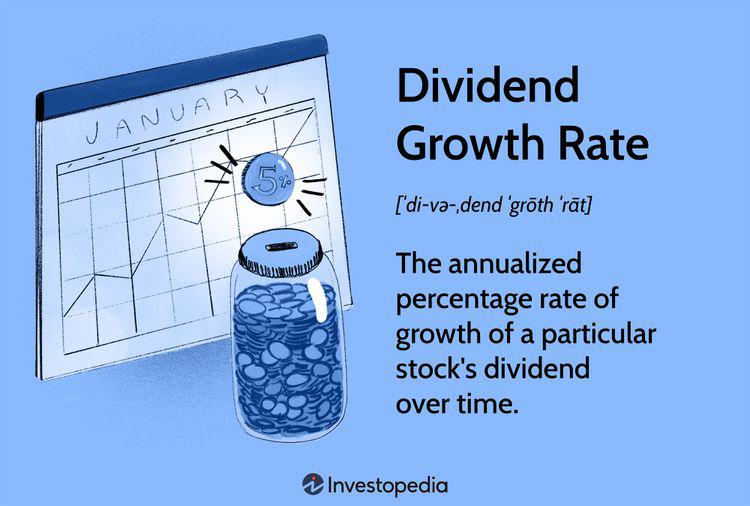

In today's fast-paced financial markets, various elements have emerged as critical drivers in shaping investment strategies. Dividends, shareholder value, corporate finance, and algorithmic trading are among the most pivotal of these elements. Together, they form a complex web of interactions that influence the decision-making processes of both investors and corporations. 

Dividends represent the portion of a company's profits that is distributed to shareholders. They serve as an indicator of a company's financial health and its commitment to rewarding those who have invested in it. On the other hand, shareholder value pertains to the overall worth delivered by a company's management, often reflected in increased earnings, dividend payouts, and the appreciation of share prices. Together, dividends and shareholder value serve as crucial metrics for evaluating corporate performance and investment attractiveness.

Corporate finance, which encompasses the management of a company's financial resources and decision-making, plays a significant role in determining dividend policies. The strategic choices made in corporate finance regarding reinvestment and profit distribution have direct implications for a company's capital structure and its ability to create shareholder value. 

As the financial landscape continues to evolve, technology's role in revolutionizing financial decision-making becomes increasingly apparent. Algorithmic trading, which employs computer algorithms to execute trades based on pre-defined criteria, has gained prominence for its speed and efficiency. This technological advancement allows for the analysis of extensive datasets, unveiling patterns previously undetectable by human traders. Consequently, algorithmic trading can influence market dynamics, affecting stock prices and liquidity, which impacts investor returns and company valuations.

Understanding the interplay between these concepts is essential, especially as more investors integrate algorithmic trading into their strategies. Recognizing the relationship between dividends and shareholder value in this technology-driven context is crucial for making informed investment decisions. This article will provide insights into how corporate finance strategies shape dividend policies and how advancements in technology are redefining financial strategies, offering value to both novice and experienced investors alike.

## Table of Contents

## Understanding Dividends and Shareholder Value

Dividends are payments distributed by corporations to their shareholders, typically sourced from the company's profits. These payments serve as indicators of a company's financial health and its commitment to generating shareholder value. Fundamentally, dividends are a reflection of a corporation’s profitability and its management's decision to allocate capital both to sustain business operations and reward shareholders.

Shareholder value encompasses the value delivered to shareholders as a consequence of management's efficiency in boosting earnings, dividends, and share price. It is a comprehensive measure of a company's effectiveness in utilizing its capital and resources to generate returns for its investors. This value is not merely the dividends received but also includes any appreciation in the stock price, making it a multifaceted indicator of a company's performance.

Understanding the balance between retaining earnings and distributing them as dividends is critical for evaluating a company’s long-term growth and sustainability. Retained earnings are reinvested in the company to fuel growth, finance research and development, or reduce debt. While retaining earnings can stimulate future expansion and increase a firm’s intrinsic value, dividend payments provide immediate, tangible returns to shareholders, thus creating a short-term value.

The decision whether to distribute dividends hinges on various factors, including the company’s growth prospects, cash flow requirements, and market conditions. Companies with robust growth opportunities might prefer to reinvest earnings rather than distribute them as dividends, whereas mature firms with stable earnings may focus on providing consistent dividends to their shareholders. This strategic decision-making requires a nuanced understanding of the company’s life cycle, the industry context, and investor expectations. 

Effective management of this balance can lead to not only sustained shareholder value but also enhanced investor confidence, ultimately reflecting in the company’s market valuation. As shareholders assess a company’s dividend policy in conjunction with financial statements and market trends, it becomes apparent that dividends play a pivotal role in shaping a comprehensive view of shareholder value.

## The Role of Corporate Finance in Dividend Policies

Corporate finance is integral to how companies manage their financial resources and strategic decision-making. A fundamental aspect of corporate finance is deciding whether to reinvest profits back into the business or distribute them as dividends to shareholders. This decision significantly impacts a company's capital structure—defined as the mix of debt and equity used to finance its operations.

When a company opts to pay dividends, it signals profitability and cash availability, reflecting its commitment to delivering shareholder value. A high dividend payout can attract income-focused investors, boosting the company's stock price. However, paying dividends reduces the amount of retained earnings, which could have been reinvested for expansion or used to repay debt, thereby affecting the company's long-term growth potential.

Corporate governance is another crucial [factor](/wiki/factor-investing) influencing dividend policy. Governance structures, comprising the board of directors and executive management, formulate these policies to balance the interests of various stakeholders. Strong governance typically strives to ensure transparency and accountability, aligning dividend policies with overall corporate objectives. For instance, a well-governed firm might adopt a stable or progressive dividend policy to instill investor confidence, while a company with weaker governance might have inconsistent dividend payouts, causing potential dips in shareholder trust.

There is often a trade-off between paying dividends and retaining earnings to fuel company growth. Companies with high growth prospects might prefer to reinvest earnings to exploit new opportunities, thus enhancing long-term shareholder value. Conversely, firms with limited growth avenues might return excess cash to shareholders through higher dividends or share buybacks.

To sum up, understanding how corporate finance strategies align with dividends offers valuable insights into a company's performance and risk profile. By assessing these strategies, investors can gauge a company's potential for long-term sustainability and value creation.

 to Algorithmic Trading

Algorithmic trading is a method of executing orders utilizing automated and pre-programmed trading instructions, which evaluate variables like timing, price, and [volume](/wiki/volume-trading-strategy). These algorithms serve to facilitate transactions in financial markets with superior speed and efficiency compared to manual trading, making [algorithmic trading](/wiki/algorithmic-trading) a favored approach for investors seeking to manage complex strategies efficiently.

One of the standout features of algorithmic trading is its ability to process vast datasets rapidly. This capacity allows algorithms to identify patterns and trends that may not be immediately apparent to human operators, which is particularly useful in assessing interactions relating to dividends and shareholder interests. By examining extensive historical and real-time data, these algorithms can predict potential market movements and adjust strategies to optimize returns.

Algorithmic trading plays a substantial role in influencing stock prices and market [liquidity](/wiki/liquidity-risk-premium). As algorithms execute trades at speeds and frequencies that human traders cannot match, they increase market activity, thereby boosting liquidity. Improved liquidity generally leads to tighter spreads and better price discovery, which are advantageous for both traders and the market as a whole. However, the influence of algorithms is not limited to mere liquidity enhancement; they also impact price formations. By executing large volumes of trades based on complex strategies, algorithmic trading can cause significant price shifts, which can affect investor returns and company valuations. Consequently, the strategies employed by algorithms can have far-reaching implications for the financial health of firms and the portfolios of investors.

## Impact of Algorithmic Trading on Dividend Strategies

Algorithmic trading has significantly reshaped investment strategies, particularly those involving dividend-paying stocks. This approach leverages complex computer algorithms to execute trades at high speeds and accuracy, which has several implications for dividend strategies.

Firstly, algorithmic trading allows investors to better anticipate dividend announcements. By analyzing historical data and market indicators, these algorithms can detect patterns that suggest when a dividend announcement is likely. For instance, an algorithm might use sentiment analysis from financial news, combined with historical dividend payout patterns, to predict an upcoming announcement. This ability to forecast dividend events enables investors to optimize their portfolios in anticipation of changes. 

With the rapid execution capabilities of algorithms, investors can respond almost instantaneously to shifts in dividend policies or corporate finance announcements. This speed is crucial in today's markets, where the time between a dividend declaration and its market impact can be minimal. For example, a major company's sudden change in dividend policy might lead to an immediate adjustment in stock prices. Algorithms can adjust trading strategies in milliseconds, capturing opportunities or mitigating risks associated with these adjustments.

Moreover, data from algorithmically executed trades can offer deep insights into market sentiment and investor expectations regarding dividends. For example, [machine learning](/wiki/machine-learning) models can be trained to classify patterns in trading volumes and price movements when a company releases dividend-related news. Analyzing these patterns allows traders to infer the collective sentiment of the market participants—whether they perceive the news as positive or negative and their expectations for future payouts.

In summary, algorithmic trading has enhanced the ability to incorporate dividend-based strategies within broader investment frameworks. Its capacity to predict, react, and analyze market activities related to dividends provides a competitive edge to investors, opening new avenues for optimizing returns and managing risks associated with dividend-fluctuating stocks.

## Challenges and Opportunities

Balancing the complexities of corporate finance, dividends, and algorithmic trading presents significant challenges for investors and firms. As the financial landscape evolves, understanding the regulatory framework and inherent market [volatility](/wiki/volatility-trading-strategies) becomes essential. Algorithms, primarily driven by quantitative models, are often sensitive to market fluctuations, potentially leading to unreliable predictions of dividend-related movements. For example, during periods of high volatility, even the most sophisticated models may misjudge market signals, leading to inaccurate trading decisions.

Despite these challenges, there are substantial opportunities for those adept at integrating data analysis from algorithmic trading with traditional financial metrics. Advanced analytics can refine investment strategies, allowing investors to anticipate dividend announcements and adjust portfolios more effectively. By leveraging technologies such as machine learning, firms can enhance their algorithms' predictive capabilities, improving the precision of dividend forecasts. 

Moreover, companies can exploit these technological advancements to optimize their dividend policies, thereby maximizing shareholder value. By tying algorithmic insights with corporate finance principles, firms can make informed decisions regarding capital structure and profit distribution. For example, an analysis of historical dividend payments can reveal trends and inform future policies, ensuring a balance between reinvestment and dividend payouts. 

In summary, while the integration of corporate finance, dividends, and algorithmic trading introduces complexities, it also opens up avenues for innovation. Firms and investors who skillfully navigate these dynamics stand to benefit substantially, harnessing technology to enhance decision-making and sustain competitive advantage.

## Conclusion

Understanding the intricate relationships between dividends, shareholder value, corporate finance, and algorithmic trading is crucial for anyone engaged in financial markets. These components collectively shape how investors gauge company potential and strategize their financial decisions. As markets become increasingly sophisticated, the strategic use of technology alongside core financial principles emerges as a catalyst for optimized investment outcomes and enhanced corporate value.

The convergence of traditional financial analysis with modern algorithmic tools empowers investors to make informed decisions. Traditional approaches, rooted in comprehensive financial evaluations and historical data analysis, provide a foundation that remains relevant even as technology evolves. By incorporating algorithmic trading capabilities, investors can efficiently process vast datasets, uncover hidden market patterns, and execute trades with precision and speed. This combination can lead to more accurate forecasting, improved risk management, and robust portfolio diversification.

Investors who adeptly balance these approaches are better positioned to navigate the complexities of today's financial environment. Algorithmic strategies can adapt to rapidly changing market conditions, while classical methods ensure a thorough understanding of fundamental financial metrics such as earnings, dividends, and market trends. This dual strategy facilitates a comprehensive view that leverages the strengths of both paradigms.

Remaining informed about developments in these fields is vital for achieving sustained success in the financial markets. Market dynamics, technological advancements, and regulatory changes continually reshape investment landscapes. Continuous learning and adaptation secure a competitive edge, enabling investors and firms to make proactive decisions that align with evolving standards and opportunities. As such, an integrated approach to technology and financial acumen presents a path to enduring success and resilience in an ever-shifting financial landscape.

## References & Further Reading

[1]: Asness, C. S., & Frazzini, A. (2013). ["The Devil in HML's Details."](https://www.aqr.com/Insights/Research/Journal-Article/The-Devil-in-HMLs-Details) Journal of Portfolio Management, 39(4), 49-68.

[2]: ["Dividends and Dividend Policy"](https://corporatefinanceinstitute.com/resources/equities/dividend-policy/) by H. Kent Baker and John R. Nofsinger

[3]: Fama, E. F., & French, K. R. (2001). ["Disappearing dividends: changing firm characteristics or lower propensity to pay?"](https://www.sciencedirect.com/science/article/pii/S0304405X01000381) Journal of Financial Economics, 60(1), 3-43.

[4]: Hasbrouck, J., & Saar, G. (2013). ["Low-latency trading."](https://www.sciencedirect.com/science/article/abs/pii/S1386418113000165) The Review of Financial Studies, 26(9), 2955-2998.

[5]: Hull, J. (2017). ["Risk Management and Financial Institutions"](https://books.google.com/books/about/Risk_Management_and_Financial_Institutio.html?id=1J1QDwAAQBAJ) 

[6]: O’Hara, M. (2015). ["High frequency market microstructure."](https://www.sciencedirect.com/science/article/pii/S0304405X15000045) Annual Review of Financial Economics, 7, 133-152.

[7]: ["Trading and Exchanges: Market Microstructure for Practitioners"](https://www.acsu.buffalo.edu/~keechung/MGF743/Readings/Trading-Exchanges-Market-Microstructure-Practitioners%20Draft%20Copy.pdf) by Larry Harris

[8]: Zhang, F. (2005). ["High-frequency trading, stock volatility, and price discovery."](https://papers.ssrn.com/sol3/papers.cfm?abstract_id=1691679) European Financial Management, 6(4), 490-520.