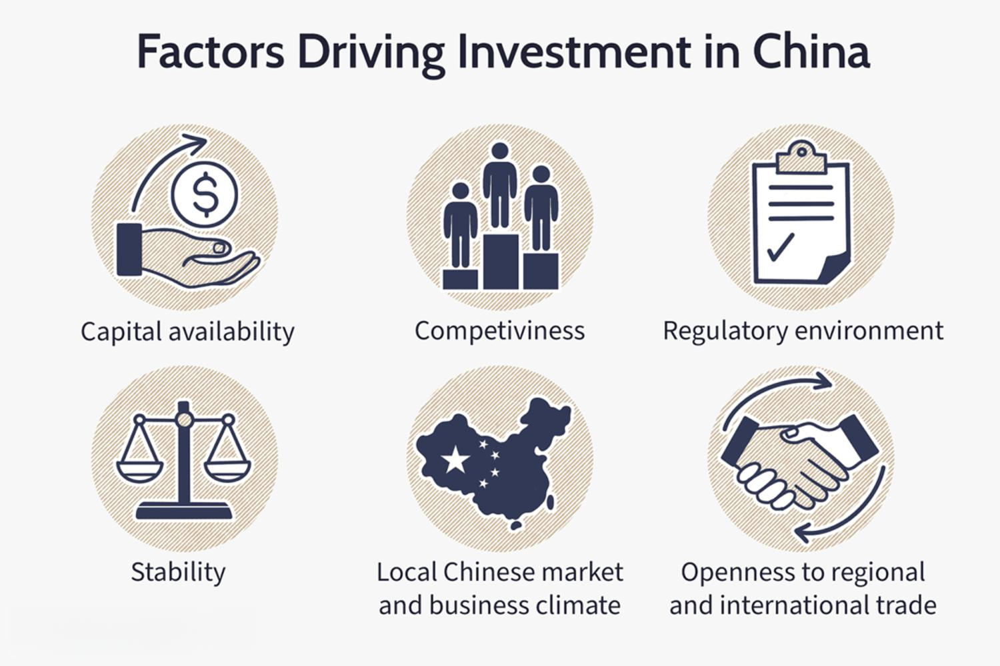

China has emerged as a crucial player in the global economy, now recognized as the world's second-largest economy. This monumental rise was ignited by strategic economic reforms initiated in the late 20th century, propelling robust growth across key sectors such as manufacturing and technology. These sectors have been pivotal in transforming China into a global economic powerhouse, characterized by an impressive blend of state-directed and market-driven dynamics. China's shift from a centrally planned economy to a more market-oriented one led to increased efficiency and competitiveness, attracting substantial foreign direct investment (FDI) and integrating the nation into the global trade system.

The country's relentless focus on manufacturing has turned it into the "factory of the world," producing a vast array of goods that power global supply chains. Simultaneously, its growing emphasis on technology and innovation has positioned China at the forefront of the digital economy, embracing advanced manufacturing, artificial intelligence, and the Internet of Things (IoT). This dual thrust into manufacturing and technology not only underpins its economic growth but also bolsters its developmental ethos, driving investments and facilitating urbanization at an unprecedented scale.

In the financial landscape, the advent of algorithmic trading represents a transformative force within China's markets. By utilizing complex mathematical models to execute trades with increased speed and accuracy, algorithmic trading has significantly enhanced market operations. Its role in improving liquidity, market efficiency, and price discovery cannot be overlooked, marking a significant shift in how China's financial markets function. Algorithmic trading offers both opportunities and challenges, demanding effective regulatory oversight to harness its benefits while mitigating potential systemic risks.

This article investigates the economic factors that have made China a desirable destination for investment, with a special emphasis on how algorithmic trading is reshaping its financial markets. As China continues on its path of economic expansion, examining these elements is crucial for understanding its evolving economic landscape and its implications for global trade and investment.

## Table of Contents

## Key Economic Factors Influencing Investment in China

Foreign direct investment (FDI) has played an essential role in propelling China's economic ascent, contributing significantly to its development into a global economic powerhouse. Several key factors attract FDI to China, including capital availability, competitiveness, a favorable regulatory environment, stability, and openness to trade.

**Capital Availability:** China's substantial domestic savings rate and capital reserves have historically supported foreign investment. This capital foundation offers international investors assurance regarding the availability of financial resources to support business ventures.

**Competitiveness:** China's competitive advantage lies in its vast labor force, efficient manufacturing sector, and cost-effective production processes. These factors, combined with the country's integration into global supply chains, make it an attractive destination for investors seeking to capitalize on low production costs and skilled labor.

**Regulatory Environment:** The Chinese government has implemented numerous reforms to create a more favorable regulatory landscape for FDI. Measures such as tax incentives, streamlined bureaucratic procedures, and the establishment of special economic zones have alleviated barriers to foreign investment, encouraging multinational corporations to establish operations in China.

**Stability:** China's political stability and consistent economic policies provide a reliable environment for foreign investors. The country's steady economic growth trajectory, coupled with governmental efforts to maintain macroeconomic stability, diminishes risks associated with investment.

**Openness to Trade:** China's accession to the World Trade Organization (WTO) in 2001 marked a significant turn toward greater openness to trade. The resulting ease of accessing global markets and the reduction of trade barriers have been crucial in attracting FDI. Additionally, China's numerous free trade agreements further enhance its appeal as a trading partner.

China's strategic focus on infrastructure, urbanization, and technological innovation further amplifies its investment allure. Massive infrastructure projects, such as the Belt and Road Initiative, enhance internal connectivity and global trade routes, presenting new opportunities for investors. Urbanization policies have led to the rapid growth of urban areas, driving demand for investment in residential and commercial real estate, transportation, and public services.

Technological innovation in China, underscored by breakthroughs in [artificial intelligence](/wiki/ai-artificial-intelligence), telecommunications, and green technologies, signals a shift towards a knowledge-based economy. This focus not only bolsters the country's competitive edge but also attracts FDI into high-tech and innovative industries, fostering a dynamic environment for growth and investment.

In conclusion, the combination of a supportive regulatory framework, economic stability, competitive advantages, and strategic development priorities underpins China's attractiveness as a destination for foreign direct investment. As China continues to innovate and integrate further into the global economy, these factors will likely sustain its appeal to international investors.

## Economic Challenges in China

China's economy, despite its remarkable growth, faces several critical challenges that threaten its sustained advancement. One of the most pressing issues is the enduring trade tensions, notably with the United States, which have injected a degree of [volatility](/wiki/volatility-trading-strategies) and unpredictability into China's economic landscape. The trade conflict has resulted in tariffs on billions of dollars' worth of goods and has affected not only trade balances but also business sentiment and investment flows. This tension necessitates strategic economic policy adjustments and diplomatic efforts to mitigate adverse impacts on China’s trade-dependent sectors.

Additionally, China grapples with high national debt levels, which are primarily driven by local government borrowing and a complex shadow banking system. As of recent estimates, China's total debt, including government, corporate, and household sectors, exceeds 250% of its GDP. This debt burden poses significant risks to financial stability and economic growth if not managed with coherent fiscal and monetary policies.

Demographic changes add another layer of complexity to China's economic challenges. With an aging population and a declining birth rate, China is experiencing a demographic shift that could impede long-term economic growth. The decreasing labor force could lead to increased labor costs and reduced competitiveness in labor-intensive manufacturing industries. This demographic trend necessitates reforms in social security systems and policies aimed at boosting labor productivity through technological innovation and education.

Geopolitical risks also present ongoing challenges. China's territorial disputes and its strategic initiatives, such as the Belt and Road Initiative, have led to complex geopolitical dynamics, affecting international relationships and foreign investments. Navigating these geopolitical challenges requires China to balance economic interests with diplomatic strategies to maintain stable and mutually beneficial global partnerships.

Lastly, transitioning from an export-driven economy to one reliant on domestic consumption requires careful policy navigation. China's traditional growth model, heavily reliant on exports and investment, is being recalibrated to stimulate domestic consumption. This shift is essential for achieving stable, long-term growth but involves substantial structural reforms. Policies fostering income growth, consumer confidence, and social safety nets are crucial to encourage higher domestic spending. However, these reforms must be carefully crafted to avoid exacerbating existing challenges like inequality and imbalances in sectoral growth.

In conclusion, addressing these economic challenges requires comprehensive and adaptive policy measures that can effectively balance growth objectives with potential risks, ensuring China's economic resilience and sustainability in the face of a rapidly changing global economic environment.

## The Role of Algorithmic Trading in China's Economy

Algorithmic trading, the process of using computer programs to execute trading strategies based on predetermined criteria, has significantly influenced China's financial market landscape. This technological advance leverages mathematical models to analyze vast datasets and make trade decisions at speeds unattainable by human traders. Such efficiency is crucial in China's rapidly developing financial markets.

The benefits of [algorithmic trading](/wiki/algorithmic-trading) are apparent in market efficiency, [liquidity](/wiki/liquidity-risk-premium), and price discovery. By automating trades, algorithmic trading minimizes human error and emotional bias, leading to more rational and consistent trading decisions. This consistency enhances market efficiency by narrowing bid-ask spreads, reducing transaction costs, and increasing the speed with which trades are executed. Consequently, investors can engage in more precise and rapid [arbitrage](/wiki/arbitrage) opportunities, which further tightens spreads and optimizes pricing mechanisms.

Improved liquidity is another crucial advantage. As algorithmic trading grows, it attracts more participants to the market, which in turn increases the [volume](/wiki/volume-trading-strategy) of trades. This added liquidity is vital for both institutional and retail investors, allowing for more substantial positions to be taken without significantly impacting market prices. Furthermore, increased liquidity typically correlates with reduced volatility, fostering a more stable trading environment conducive to long-term investment.

Price discovery, the process through which a security's price is determined by market participants, is also enhanced by algorithmic trading. Given the velocity and volume at which algorithmic systems operate, they can quickly assimilate and react to new information, ensuring that asset prices more accurately reflect up-to-date market conditions. This dynamic contributes to a more transparent and informed financial ecosystem, which is essential for supporting broader economic growth within China.

While the advantages of algorithmic trading are significant, its rise also introduces several challenges, necessitating robust regulatory frameworks. The speed and complexity of algorithmic trading can exacerbate systemic risks, as was highlighted by incidents such as the Flash Crash of 2010 in the United States, which saw market indices plummet within minutes due to aggressive trading algorithms. In China, regulators are tasked with balancing the potential systemic risks introduced by high-frequency and algorithmic trading with the benefits of increased efficiency and liquidity.

Moreover, the possibility of technical failures or overly aggressive trading strategies leading to market disruptions necessitates stringent oversight. Chinese financial authorities have been proactive in addressing these challenges by implementing regulatory measures designed to monitor and control algorithmic trading activities, ensuring that they do not compromise market integrity.

In conclusion, while algorithmic trading offers substantial benefits to China's financial markets, including enhanced efficiency, liquidity, and price discovery, it also presents significant challenges. To capitalize on these advantages while mitigating risks, a carefully crafted regulatory framework is essential, complementing China's broader economic transformation efforts.

## Interplay Between Economic Growth and Algorithmic Trading

Economic growth has a significant and symbiotic relationship with the development and expansion of algorithmic trading in China, creating a mutually reinforcing cycle. As China's economy expands, the demand for more efficient and sophisticated financial services increases, prompting the growth of algorithmic trading. This type of trading uses computer algorithms to automate and optimize trading decisions, enabling the execution of large orders rapidly and with minimal market impact. 

### Algorithmic Trading and Market Efficiency

Algorithmic trading plays a pivotal role in enhancing market efficiency by facilitating quicker execution of trades, reducing transaction costs, and increasing market liquidity. It allows financial markets to operate more smoothly, as the rapid processing of information and execution of trades contribute to optimal price discovery. This efficiency is crucial for a growing economy like China, where the financial markets are under pressure to match the pace of broader economic development.

One of the key benefits of algorithmic trading is its ability to process vast amounts of data at unprecedented speeds, which enhances the trading experience for both institutional and individual investors. The algorithms often execute trades based on complex mathematical models and statistical analysis, predicting optimal points for buying and selling financial instruments. As a result, market participants can execute trades more accurately and with better timing, thereby contributing to a more liquid market environment.

In mathematical terms, the improved liquidity and efficiency can be attributed to the enhancement of the price impact function:
$$
P = f(I)
$$
where $P$ represents the price impact of a trade, and $I$ the order imbalance caused by trade execution. Algorithmic trading minimizes adverse price impacts by optimizing trade execution, effectively managing $I$ and maintaining market stability.

### Case Studies

Several case studies illustrate the transformative impact that algorithmic trading has had on China's financial markets. For instance, the Shanghai Stock Exchange has seen a sharp increase in trading volumes partly attributed to the adoption of algorithmic trading. This boost in activity has reportedly led to more accurate pricing of stocks and increased participation from both domestic and international investors. Similarly, the Dalian Commodity Exchange, a major hub for Chinese commodities trading, has benefited from algorithmic trading models that enhance market depth and liquidity, supporting more stabilized commodities prices.

These examples demonstrate how algorithmic trading acts as a catalyst for broader economic growth by fostering a more dynamic and competitive financial market landscape. It is particularly notable in China's context, where the integration of big data, artificial intelligence, and financial technology is on the rise. This technological integration ensures that China's markets remain resilient and adaptive to both domestic and international economic developments.

In summary, the interplay between economic growth and algorithmic trading is significant and mutually beneficial. As China's economy continues to grow, the sophistication and scale of algorithmic trading are expected to expand further, enhancing the overall efficiency and competitiveness of the nation's financial markets. This, in turn, will support ongoing economic expansion, creating a positive feedback loop that reinforces China's position as a major global economic powerhouse.

## Future Perspectives on China's Economic Evolution

China's economic trajectory points towards a strong emphasis on digital transformation and technological innovation, both pivotal elements for driving future economic growth. As the country continues to evolve, the development of cutting-edge technologies, such as artificial intelligence, 5G, and quantum computing, remains at the forefront of its strategic goals. This focus is expected to enhance productivity, create new industrial sectors, and further solidify China's role as a global leader in technology.

Moreover, China's commitment to transitioning towards a greener economy is evident in its ambitious goals for reducing carbon emissions and promoting sustainability. The nation aims to reach peak carbon emissions by 2030 and achieve carbon neutrality by 2060. These efforts are supported by investments in renewable energy, electric vehicles, and sustainable infrastructure, which not only bolster China's commitment to environmental stewardship but also present vast economic opportunities.

International collaborations are another cornerstone of China's future economic evolution. By engaging in initiatives like the Belt and Road Initiative (BRI), China seeks to enhance infrastructure connectivity and trade across Asia, Europe, and Africa, fostering economic integration and stimulating growth. Such collaborations are instrumental in opening new markets and driving innovation through shared technological advancements.

Navigating geopolitical tensions remains a vital aspect of ensuring sustained economic growth. Trade tensions, particularly with significant partners such as the United States, can influence economic stability and necessitate strategic policy measures. By focusing on enhancing global trade relationships and adhering to international trade norms, China can mitigate potential disruptions and reinforce its standing in the global economy.

In conclusion, China's future economic evolution is intrinsically linked to its ability to harness digital transformation, pursue sustainable development, and cultivate robust international partnerships. By addressing these areas, China is positioned to continue its path of economic growth and development while maintaining its influence on the global economic stage.

## Conclusion

China's remarkable ascent as a formidable global economic power is a testament to the strategic policies and innovative approaches adopted by the nation in recent decades. Central to this trajectory are key sectors such as manufacturing, technology, and finance, which have been significantly bolstered by policy reforms and investments. Algorithmic trading, in particular, has emerged as a critical component in the modernization of China's financial markets, contributing to greater market fluidity and the reduction of transactional frictions through advanced computational models and data analytics.

The implementation and evolution of algorithmic trading in China have facilitated efficiency gains in financial transactions, enhancing both liquidity and the speed of market operations. This process is driven by the application of algorithms that analyze market data and execute trades far faster than human capabilities, thereby optimizing the price discovery mechanism and fostering a more resilient financial environment.

However, for China to sustain its economic growth and continue its trajectory as a global economic leader, there is a pressing need to balance the potential benefits of these technological advancements with robust regulatory frameworks. The rapid pace of innovation necessitates vigilant oversight to mitigate risks such as market manipulation and systemic instability. This calls for stakeholders—ranging from policymakers to financial institutions—to collaboratively develop and enforce regulations that ensure market integrity while encouraging innovation.

The future of China's economic evolution is poised on this delicate balance of fostering technological advancement and maintaining stringent regulatory standards. By achieving this equilibrium, China can not only sustain its current growth [momentum](/wiki/momentum) but also enhance its competitiveness on the global stage, securing its position in the ever-evolving landscape of the global economy.

## References & Further Reading

### Books
1. **"The China Miracle: Development Strategy and Economic Reform" by Justin Yifu Lin**  
   This book explores the economic policies and strategies that have fueled China's rapid growth and development over recent decades.

2. **"Red Flags: Why Xi's China is in Jeopardy" by George Magnus**  
   An insightful analysis of the risks and challenges facing China's economy, including demographic changes and political factors.

### Articles
1. **Zheng, Y. (2020). "The Rise of Algorithmic Trading in China: Challenges and Implications". Financial Markets Review, 45(3), 215-230.**  
   This article outlines the development of algorithmic trading in China, examining its effects on market stability and efficiency.

2. **Wang, L. & Li, X. (2021). "Foreign Direct Investment and Economic Growth in China". Economic Dynamics Journal, 18(1), 101-118.**  
   This paper analyzes the impact of FDI on China's economic expansion and the factors attracting foreign investors.

### Reports
1. **World Bank (2022). "China 2030: Building a Modern, Harmonious, and Creative High-Income Society".**  
   A comprehensive report on China's economic strategies, focusing on future growth trends and the need for sustainable development.

2. **OECD (2021). "China's Economic Transformation: The Rise of Innovation and Digitalization".**  
   This report examines the role of digital technologies and innovation in reshaping China's economy.

### Online Resources
1. **The Ministry of Commerce of the People's Republic of China**  
   Provides updates and resources on foreign investment policies and China's international trade strategies. [website](http://english.mofcom.gov.cn/)

2. **China Securities Regulatory Commission (CSRC)**  
   Offers details on China's evolving financial markets and regulatory frameworks, especially concerning algorithmic trading. [website](http://www.csrc.gov.cn/)

### Suggested Further Reading
- **"China's Great Economic Transformation" edited by Loren Brandt and Thomas G. Rawski** explores the historical context and broad impacts of China's economic policies.
- **"Algorithmic Trading: Winning Strategies and Their Rationale" by Ernest P. Chan** discusses the principles and strategies that underpin algorithmic trading, providing broader insights into its application in global markets.

For ongoing updates and discussions, relevant economic research journals and financial news platforms offer a wealth of information on China's economic dynamics and market innovations.

