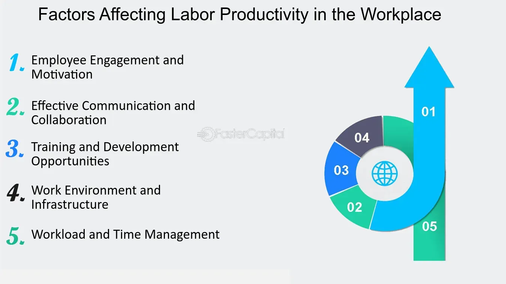

## Table of Contents

## What is labor productivity and why is it important?

Labor productivity is a measure of how much work a person can do in a certain amount of time. It's usually calculated by dividing the total output of goods or services by the total number of hours worked. For example, if a factory makes 100 toys in 10 hours, the labor productivity would be 10 toys per hour. This measure helps businesses and economists understand how efficiently workers are using their time and resources.

Understanding labor productivity is important because it can show how well an economy is doing. When labor productivity goes up, it usually means that workers are making more with the same amount of time and resources. This can lead to higher wages for workers, lower costs for businesses, and more goods and services for everyone. On the other hand, if labor productivity goes down, it might mean that an economy is struggling, which can lead to lower wages and higher prices. So, keeping an eye on labor productivity helps everyone from business owners to policymakers make better decisions.

## How does the skill level of workers affect labor productivity?

The skill level of workers plays a big role in labor productivity. Workers with higher skills can usually do their jobs faster and better than those with lower skills. For example, a skilled carpenter can build a table quicker and with better quality than someone who is just learning. This means that businesses with more skilled workers can produce more goods or services in the same amount of time, which boosts their labor productivity.

On the other hand, if workers have lower skills, they might take longer to finish tasks or make more mistakes. This slows down the whole process and can lead to lower labor productivity. Companies often invest in training and education to improve their workers' skills, which can help increase productivity over time. So, the skill level of workers is a key factor in how much a business can produce and how efficiently it can do so.

## What role does technology play in enhancing labor productivity?

Technology helps make work easier and faster, which boosts labor productivity. Machines and computers can do a lot of the hard or boring work that people used to do. For example, a robot in a factory can put together parts much quicker than a person could. Also, software can help workers keep track of their tasks and do their jobs better. When businesses use technology, they can make more stuff in less time, which means their labor productivity goes up.

But technology isn't just about machines and computers. It also includes new ways of doing things, like better ways to organize work or communicate with team members. For example, using a project management app can help everyone know what they need to do and when, so the whole team works together more smoothly. When workers use these new methods, they can get more done in the same amount of time, which also helps increase labor productivity. So, technology is a big help in making work more efficient and productive.

## How do working conditions impact labor productivity?

Working conditions can make a big difference in how much work people get done. If the workplace is safe, comfortable, and well-organized, workers are usually happier and can focus better on their tasks. For example, having good lighting and the right tools helps people work faster and make fewer mistakes. Also, if workers feel safe and respected, they are more likely to stay focused and do their best work. All of these things can lead to higher labor productivity because workers can do more in the same amount of time.

On the other hand, bad working conditions can slow things down. If the workplace is too hot, too cold, or not safe, workers might get tired or distracted easily. They might also worry about getting hurt, which can make it hard to concentrate on their job. Plus, if people don't feel respected or valued, they might not work as hard. When working conditions are not good, labor productivity can go down because workers can't do their best work. So, making sure the workplace is a good place to be is important for keeping productivity high.

## What are the effects of employee motivation and morale on labor productivity?

Employee motivation and morale have a big impact on labor productivity. When workers feel motivated and have high morale, they are more likely to work hard and do a good job. For example, if a worker feels excited about a project or believes their work makes a difference, they will put in extra effort. This means they can get more done in the same amount of time, which boosts labor productivity. Also, when people feel good about their job, they are less likely to take a lot of breaks or call in sick, so the work keeps moving smoothly.

On the other hand, if workers have low motivation and morale, it can hurt productivity. If someone feels unhappy or uninterested in their job, they might not work as hard or might make more mistakes. This can slow down the whole team and make it harder to get things done. When morale is low, people might also look for other jobs, which can lead to more turnover and make it hard for a business to keep up its productivity. So, keeping employees motivated and happy is really important for making sure work gets done efficiently.

## How does the organizational structure influence labor productivity?

The way a company is organized can really affect how much work gets done. If the structure is clear and everyone knows what they are supposed to do, it helps people work together better. For example, if there are good leaders who give clear instructions and support their teams, workers can focus on their tasks without getting confused. This makes the whole process smoother and faster, which means more work gets done in less time. A good structure also makes it easier for people to share ideas and solve problems quickly, which can lead to better ways of doing things and higher productivity.

On the other hand, if the organizational structure is messy or confusing, it can slow things down. When people don't know who to report to or what their role is, they might waste time trying to figure it out instead of working. This can lead to mistakes and delays, which hurt productivity. Also, if the structure makes it hard for people to talk to each other or share information, it can be tough to get things done efficiently. So, having a clear and well-organized structure is important for keeping labor productivity high.

## What impact do training and development programs have on labor productivity?

Training and development programs help workers learn new skills and do their jobs better. When a company offers training, it helps workers understand their tasks more clearly and do them faster. For example, if a worker learns how to use a new machine, they can make more things in less time. Training also helps workers feel more confident and motivated, which means they work harder and are less likely to make mistakes. All of these things add up to higher labor productivity because workers can do more work in the same amount of time.

But training isn't just about learning new skills. It also helps workers grow in their careers and feel valued by their company. When people feel like their company cares about their growth, they are more likely to stay with the company and work hard. This means less time and money spent on hiring new people, and more time spent on getting work done. So, training and development programs not only make workers more productive right away, but they also help keep productivity high in the long run by keeping workers happy and engaged.

## How do economic factors such as wages and inflation affect labor productivity?

Wages and inflation can really change how much work people get done. When wages go up, workers might feel happier and more motivated because they are [earning](/wiki/earning-announcement) more money. This can make them work harder and do a better job, which means more work gets done in the same amount of time. But if wages don't go up and people feel like they are not being paid enough, they might not work as hard or might look for other jobs. This can slow down work and make it harder for a business to keep up its productivity.

Inflation can also make a big difference. When prices go up because of inflation, workers might need more money just to keep up with their costs. If their wages don't go up too, they might feel stressed and worried about money, which can make it hard to focus on work. On the other hand, if wages go up along with inflation, workers might feel more secure and be able to work better. So, keeping wages in line with inflation is important for making sure workers stay productive and businesses keep running smoothly.

## What is the relationship between labor productivity and industry-specific factors?

Labor productivity can be different in different industries because each industry has its own special ways of doing things. For example, in farming, productivity might depend a lot on the weather and the machines they use. If a farmer has a good tractor and the weather is nice, they can plant and harvest more crops faster. But in a factory making cars, productivity might depend more on how well the assembly line is set up and how skilled the workers are. If the factory has a good system and trained workers, they can make more cars in less time.

Also, some industries change faster than others, which can affect productivity. In tech, new inventions and software can make big changes quickly. If a tech company uses the latest software, their workers can do more work faster. But in industries like mining, changes might happen more slowly because it takes a long time to set up new machines or methods. So, the kind of industry and how fast it changes can make a big difference in how much work gets done.

## How do global and cultural factors influence labor productivity?

Global and cultural factors can have a big impact on how much work people get done. In different parts of the world, people might have different ideas about work and time. For example, in some cultures, people might value taking breaks and spending time with family more than working long hours. This can affect how much work they do in a day. Also, some countries have laws about how many hours people can work or how much they should be paid. These rules can make a difference in how much work gets done because they change how companies and workers think about work.

Another way global and cultural factors matter is through language and communication. If people from different countries work together, they might have a hard time understanding each other because of language differences. This can slow down work and make it harder to get things done. Also, different cultures might have different ways of working together or solving problems. If people don't understand these differences, it can lead to confusion and mistakes. So, knowing about global and cultural factors can help businesses work better and keep productivity high.

## What advanced metrics and models are used to measure and predict labor productivity?

To measure and predict labor productivity, experts use advanced metrics and models that help them understand how much work people can do. One common metric is "output per hour," which looks at how much stuff workers make in an hour. This helps see if workers are getting more done over time. Another important metric is "total factor productivity," which tries to figure out how well all the resources, not just labor, are being used to make things. This can show if new technology or better ways of working are helping boost productivity. These metrics give a clear picture of how productive workers are and help businesses and economists make plans for the future.

Models are also used to predict labor productivity. One popular model is the "Cobb-Douglas production function," which looks at how labor and capital (like machines) work together to make things. This model can help predict how changes in the number of workers or the amount of technology will affect productivity. Another useful model is "econometric modeling," which uses past data to guess what will happen in the future. By looking at things like worker skills, technology, and economic conditions, these models can predict how much work will get done. Using these advanced metrics and models helps everyone understand and improve labor productivity.

## How can data analytics and AI be leveraged to optimize labor productivity?

Data analytics and AI can help make work more efficient by looking at a lot of information and finding patterns that people might miss. For example, data analytics can show which tasks take the most time or where workers might need more training. By looking at this information, businesses can find ways to make their work processes better. AI can also help by doing some of the work for people. For instance, AI can handle boring tasks like data entry or sorting emails, so workers can focus on more important things. This means they can get more done in the same amount of time, which boosts labor productivity.

AI can also help predict what might happen in the future. By looking at past data, AI can guess how much work will get done and help businesses plan better. For example, AI can predict when more workers might be needed or when it's a good time to buy new machines. This helps businesses use their resources in the best way possible. Plus, AI can help workers by giving them advice on how to do their jobs better. For instance, AI can suggest the best way to organize work or how to use tools more efficiently. All of these things together help make sure that labor productivity stays high.

## What is Understanding Labor Productivity?

Labor productivity is a critical economic metric that measures the efficiency of labor in producing goods and services. It is typically calculated as the ratio of output, often expressed in terms of Gross Domestic Product (GDP), to the input of labor hours. Mathematically, it can be expressed as:

$$
\text{Labor Productivity} = \frac{\text{Total Output}}{\text{Total Labor Hours}}
$$

A higher labor productivity ratio suggests that a workforce is effectively leveraging its labor resources, resulting in enhanced economic performance and competitiveness on a global scale.

One of the primary factors driving labor productivity is investment in physical capital. This includes expenditures on machinery, equipment, and infrastructure, which equip workers with the necessary tools to perform their tasks more effectively. Technological advancements also play a crucial role, as they can significantly enhance both the speed and quality of production processes. For instance, the integration of automation and digital technologies can streamline operations, reduce errors, and increase output.

Human capital development is another significant driver of labor productivity. This refers to the skills, knowledge, and competencies that workers acquire through education and training. By improving the quality of the workforce, businesses can increase their output per labor hour and remain competitive in a rapidly evolving market.

Governments and businesses are pivotal in fostering productivity improvements. Investment in technology and infrastructure not only modernizes the production processes but also boosts the overall economic environment by creating jobs and stimulating economic activities. Workforce training programs ensure that employees possess the latest skills and techniques required in their respective sectors.

Accurate measurement of labor productivity, using the Total Output/Total Labor Hours formula, is essential for effective policy and economic planning. It allows policymakers and business leaders to assess current productivity levels, set benchmarks, and implement strategies aimed at enhancing productivity. This measurement capability can guide decision-making processes and facilitate the allocation of resources towards initiatives that promise the highest productivity returns.

By understanding and improving labor productivity, societies can achieve robust economic growth, enhance their competitive positions internationally, and improve the living standards of their populations.

## How can productivity be calculated using various methods and formulas?

Productivity measurement involves various methods and formulas to effectively analyze the relationship between inputs and outputs. Among these, labor productivity stands out as a fundamental indicator calculated by dividing total output (such as GDP) by total labor hours. This metric assesses how efficiently labor resources are utilized to produce goods and services. The formula for labor productivity is:

$$
\text{Labor Productivity} = \frac{\text{Total Output}}{\text{Total Labor Hours}}
$$

In addition to labor productivity, multi-[factor](/wiki/factor-investing) productivity (MFP) offers a more comprehensive evaluation by incorporating multiple inputs, such as labor, capital, and materials. This approach acknowledges that productivity gains can arise from improvements across various factors, not just labor. The formula for MFP is:

$$
\text{MFP} = \frac{\text{Total Output}}{\text{Weighted Sum of Inputs}}
$$

Accurate measurement of productivity is essential for benchmarking organizational performance and guiding efforts towards improvement. It allows for the identification of inefficiencies and the formulation of strategic interventions to enhance productivity levels.

Incorporating technology into productivity calculations can further streamline the process. Using Python, businesses and policymakers can automate the computation of productivity metrics, enabling dynamic and efficient analysis. For instance, Python code can be used to calculate labor productivity as follows:

```python
def calculate_labor_productivity(total_output, total_labor_hours):
    if total_labor_hours == 0:
        raise ValueError("Total labor hours cannot be zero")
    labor_productivity = total_output / total_labor_hours
    return labor_productivity

# Example usage
total_output = 100000  # Example total output
total_labor_hours = 2000  # Example total labor hours
labor_productivity = calculate_labor_productivity(total_output, total_labor_hours)
print(f"Labor Productivity: {labor_productivity}")
```

This code snippet takes the total output and total labor hours as inputs to compute labor productivity, ensuring robust and error-free calculations. Through these methods, organizations can better understand their productivity dynamics and make informed decisions to enhance operational efficiency.

## References & Further Reading

- Syverson, C. (2011). What Determines Productivity? *Journal of Economic Literature*. This article provides a comprehensive examination of the factors influencing productivity, exploring various elements including technological advancements, organizational practices, and market structures.

- Brynjolfsson, E., & McAfee, A. (2014). *The Second Machine Age*. This book discusses the implications of digital technology on productivity and the economy, highlighting how automation and artificial intelligence are revolutionizing traditional economic models.

- Jorgenson, D. W., et al. (2005). *Productivity, Volume 3: Information Technology*. This volume investigates into the impact of information technology on productivity improvements, offering empirical analysis on how IT investments contribute to economic growth.

- Autor, D. H., et al. (1998). Computing Inequality: Have Computers Changed the Labor Market? This study investigates the effects of computerization on labor markets, addressing issues of inequality and shifts in labor demand due to technological advancements.

- Angrist, J. D., & Pischke, J-S. (2008). *Mostly Harmless Econometrics*. This text serves as a resource for understanding econometric techniques with practical applications in analyzing productivity data, providing tools for assessing causal relationships in economic research.

