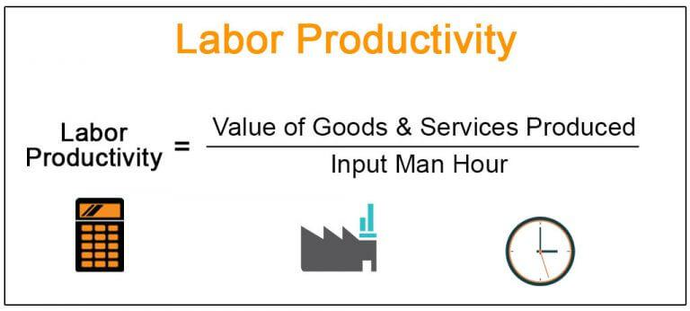

In today's fast-paced economic environment, understanding and enhancing productivity is crucial for maintaining and improving economic stability and growth. Labor productivity serves as a fundamental metric by which the efficiency of labor input in producing goods and services is measured. This metric is not only an indicator of economic health but also a driver of competitiveness among businesses and nations alike.

The exploration of labor productivity encompasses various aspects, including factors that influence its levels and dynamics. Key influences on productivity include the investment in physical capital, technological advancements, and the development of human capital. Each of these components plays a significant role in determining how effectively labor is utilized in the production process.



Algorithmic trading is one example where technology fundamentally alters productivity landscapes by enhancing work efficiency. By automating complex trading processes, algorithmic trading improves decision-making and operational efficiency within financial markets. It exemplifies how advancements in technology influence productivity, providing valuable lessons for other sectors.

Strategies to improve productivity focus on a combination of technological investments, enhancement of skill sets through workforce training, and the implementation of efficient management practices. These strategies have far-reaching implications for economic growth, influencing not just individual sectors but entire economies. 

Understanding these dynamics is vital for businesses and policymakers who aim to foster sustainable economic development. By focusing on ways to improve productivity, stakeholders can leverage emerging opportunities and address economic challenges, ensuring long-term success in a competitive global landscape.

## Table of Contents

## Understanding Labor Productivity

Labor productivity is a critical economic metric that measures the efficiency of labor in producing goods and services. It is typically calculated as the ratio of output, often expressed in terms of Gross Domestic Product (GDP), to the input of labor hours. Mathematically, it can be expressed as:

$$
\text{Labor Productivity} = \frac{\text{Total Output}}{\text{Total Labor Hours}}
$$

A higher labor productivity ratio suggests that a workforce is effectively leveraging its labor resources, resulting in enhanced economic performance and competitiveness on a global scale.

One of the primary factors driving labor productivity is investment in physical capital. This includes expenditures on machinery, equipment, and infrastructure, which equip workers with the necessary tools to perform their tasks more effectively. Technological advancements also play a crucial role, as they can significantly enhance both the speed and quality of production processes. For instance, the integration of automation and digital technologies can streamline operations, reduce errors, and increase output.

Human capital development is another significant driver of labor productivity. This refers to the skills, knowledge, and competencies that workers acquire through education and training. By improving the quality of the workforce, businesses can increase their output per labor hour and remain competitive in a rapidly evolving market.

Governments and businesses are pivotal in fostering productivity improvements. Investment in technology and infrastructure not only modernizes the production processes but also boosts the overall economic environment by creating jobs and stimulating economic activities. Workforce training programs ensure that employees possess the latest skills and techniques required in their respective sectors.

Accurate measurement of labor productivity, using the Total Output/Total Labor Hours formula, is essential for effective policy and economic planning. It allows policymakers and business leaders to assess current productivity levels, set benchmarks, and implement strategies aimed at enhancing productivity. This measurement capability can guide decision-making processes and facilitate the allocation of resources towards initiatives that promise the highest productivity returns.

By understanding and improving labor productivity, societies can achieve robust economic growth, enhance their competitive positions internationally, and improve the living standards of their populations.

## Strategies for Productivity Improvement

Investment in technology is a cornerstone for enhancing productivity across various industries. The adoption of automation and digital transformation enables businesses to streamline operations and reduce manual workloads. For instance, automation tools can handle repetitive tasks, allowing employees to focus on higher-value activities, thereby improving overall efficiency. Digital platforms facilitate better communication, data management, and customer engagement, which contribute to productivity gains.

Moreover, continuous training and development of the workforce are essential for adapting to industry changes and technological advancements. As new technologies emerge, employees need to acquire relevant skills to utilize these innovations effectively. Skill enhancement programs, such as workshops and online courses, empower employees to maintain competitive expertise, leading to higher productivity levels. By fostering a culture of learning, organizations can ensure that their workforce remains agile and capable of driving innovation.

Creating a positive work environment is equally important. Efficient management practices, such as clear communication, recognition, and feedback systems, contribute to employee satisfaction and motivation. A motivated workforce is more likely to exhibit higher productivity and creativity. Implementing flexible work arrangements and promoting work-life balance can also improve job satisfaction, further enhancing productivity.

Agile management practices, including methodologies like scrum and kanban, allow businesses to adapt quickly to market changes. These frameworks emphasize iterative development, frequent feedback, and cross-functional teamwork, enabling organizations to respond swiftly to evolving demands and challenges. By adopting agile practices, companies can enhance their ability to innovate and improve productivity through continuous adaptation.

Systematic implementation of these strategies can lead to sustainable productivity gains and competitive advantages. Organizations that invest strategically in technology and human resources, while maintaining a supportive work environment, are better positioned to navigate market dynamics and capitalize on new opportunities. These efforts not only boost individual firm performance but also contribute to the broader economic landscape by enhancing overall efficiency and competitiveness.

## Calculating Productivity: Methods and Formulas

Productivity measurement involves various methods and formulas to effectively analyze the relationship between inputs and outputs. Among these, labor productivity stands out as a fundamental indicator calculated by dividing total output (such as GDP) by total labor hours. This metric assesses how efficiently labor resources are utilized to produce goods and services. The formula for labor productivity is:

$$
\text{Labor Productivity} = \frac{\text{Total Output}}{\text{Total Labor Hours}}
$$

In addition to labor productivity, multi-[factor](/wiki/factor-investing) productivity (MFP) offers a more comprehensive evaluation by incorporating multiple inputs, such as labor, capital, and materials. This approach acknowledges that productivity gains can arise from improvements across various factors, not just labor. The formula for MFP is:

$$
\text{MFP} = \frac{\text{Total Output}}{\text{Weighted Sum of Inputs}}
$$

Accurate measurement of productivity is essential for benchmarking organizational performance and guiding efforts towards improvement. It allows for the identification of inefficiencies and the formulation of strategic interventions to enhance productivity levels.

Incorporating technology into productivity calculations can further streamline the process. Using Python, businesses and policymakers can automate the computation of productivity metrics, enabling dynamic and efficient analysis. For instance, Python code can be used to calculate labor productivity as follows:

```python
def calculate_labor_productivity(total_output, total_labor_hours):
    if total_labor_hours == 0:
        raise ValueError("Total labor hours cannot be zero")
    labor_productivity = total_output / total_labor_hours
    return labor_productivity

# Example usage
total_output = 100000  # Example total output
total_labor_hours = 2000  # Example total labor hours
labor_productivity = calculate_labor_productivity(total_output, total_labor_hours)
print(f"Labor Productivity: {labor_productivity}")
```

This code snippet takes the total output and total labor hours as inputs to compute labor productivity, ensuring robust and error-free calculations. Through these methods, organizations can better understand their productivity dynamics and make informed decisions to enhance operational efficiency.

## The Role of Algorithmic Trading in Enhancing Productivity

Algorithmic trading, a transformative force in financial markets, automates trading processes to enhance efficiency and precision in decision-making. By leveraging sophisticated mathematical models and statistical techniques, [algorithmic trading](/wiki/algorithmic-trading) systems optimize transactions and minimize the likelihood of human error, contributing to significant productivity improvements.

The core mechanism of algorithmic trading involves executing large orders by breaking them into smaller, strategically timed transactions. This is achieved using algorithms that analyze market conditions and execute trades based on predefined criteria, such as price, [volume](/wiki/volume-trading-strategy), and timing. This approach not only speeds up trading activities but also ensures execution at the best possible prices, thereby improving market [liquidity](/wiki/liquidity-risk-premium) and stability.

Real-time market analysis is a defining feature of algorithmic trading, enabled by powerful computational capabilities. With access to vast amounts of data and the ability to process it swiftly, algorithmic traders can respond instantaneously to market dynamics, capturing fleeting opportunities that occur within milliseconds. This immediacy of action is particularly advantageous in volatile markets, where rapid shifts in price and volume present both risks and opportunities.

The integration of [artificial intelligence](/wiki/ai-artificial-intelligence) (AI) and [machine learning](/wiki/machine-learning) into algorithmic trading further enhances these systems. Machine learning models can identify complex patterns and correlations in large datasets, continually refining trading strategies as new data becomes available. As these models evolve, they improve the predictive accuracy and adaptability of trading algorithms, leading to better overall performance.

For instance, algorithms can be designed to implement strategies such as statistical [arbitrage](/wiki/arbitrage), where they exploit price differentials in related financial instruments. Python, a popular language in financial technology, can be effectively used to develop and backtest such strategies. Consider a simple example of arbitrage logic written in Python:

```python
import numpy as np

def simple_arbitrage(price_A, price_B, threshold):
    if price_A - price_B > threshold:
        return "Sell A, Buy B"
    elif price_B - price_A > threshold:
        return "Buy A, Sell B"
    else:
        return "No trade"

# Example usage
price_A = np.array([100, 102, 105])
price_B = np.array([98, 101, 104])
threshold = 1.5

for a, b in zip(price_A, price_B):
    decision = simple_arbitrage(a, b, threshold)
    print(f"Price A: {a}, Price B: {b} -> Decision: {decision}")
```

This example illustrates a basic arbitrage strategy that makes trading decisions based on the price difference exceeding a specified threshold. Although simplistic, such models form the foundation upon which more complex algorithmic systems are built.

Algorithmic trading not only boosts the efficiency of individual traders and financial institutions but also contributes to the broader economy's productivity. By facilitating smoother and more reliable market functions, it helps in the efficient allocation of resources, which is a fundamental component of economic growth. As technological advancements continue to reshape the trading landscape, algorithmic trading remains a vivid example of how automation and cutting-edge analyses can drive productivity enhancements in financial markets.

## Conclusion

Productivity is integral to economic performance, influencing both individual enterprises and entire economies. It is critical for businesses to focus on continuous investment in technology, human capital, and infrastructure to drive productivity enhancements. Such investments not only streamline operations but also foster innovation and growth. For instance, advancements in automation and digital platforms have revolutionized business processes, leading to significant efficiency gains.

Algorithmic trading showcases how technological advancements can improve market efficiency and resource allocation. By utilizing complex algorithms and real-time data analysis, algorithmic trading enhances decision-making speed and accuracy, exemplifying productivity improvements in financial markets.

Prioritizing productivity enables stakeholders to capitalize on emerging opportunities and address economic challenges. By enhancing productivity, economies can increase their output without necessarily increasing input, which is beneficial in a resource-constrained environment.

Sustained productivity growth is essential for achieving long-term economic success amidst global competition. It offers a pathway to improved standards of living and economic prosperity. Continuous efforts in enhancing productivity are thus pivotal for maintaining competitive edges and ensuring economic resilience in an ever-evolving global landscape.

## References & Further Reading

- Syverson, C. (2011). What Determines Productivity? *Journal of Economic Literature*. This article provides a comprehensive examination of the factors influencing productivity, exploring various elements including technological advancements, organizational practices, and market structures.

- Brynjolfsson, E., & McAfee, A. (2014). *The Second Machine Age*. This book discusses the implications of digital technology on productivity and the economy, highlighting how automation and artificial intelligence are revolutionizing traditional economic models.

- Jorgenson, D. W., et al. (2005). *Productivity, Volume 3: Information Technology*. This volume delves into the impact of information technology on productivity improvements, offering empirical analysis on how IT investments contribute to economic growth.

- Autor, D. H., et al. (1998). Computing Inequality: Have Computers Changed the Labor Market? This study investigates the effects of computerization on labor markets, addressing issues of inequality and shifts in labor demand due to technological advancements.

- Angrist, J. D., & Pischke, J-S. (2008). *Mostly Harmless Econometrics*. This text serves as a resource for understanding econometric techniques with practical applications in analyzing productivity data, providing tools for assessing causal relationships in economic research.

