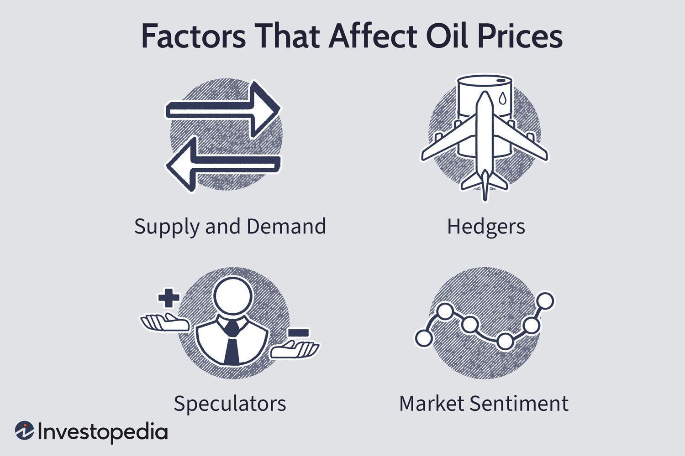

Oil prices are a pivotal element in shaping global economic stability and the cost of living. Their fluctuations carry significant implications, affecting everything from gasoline prices for consumers to input costs for businesses and investment decisions for financial institutions. Numerous factors contribute to the volatility of oil prices, making it imperative for stakeholders to comprehend these influences to navigate the complexities of the oil market effectively.

Key drivers behind oil market fluctuations include geopolitical tensions, decisions made by major oil-producing countries, and fundamental supply and demand dynamics. These factors have traditionally played a decisive role in influencing prices. However, in recent years, the advent of algorithmic trading has introduced a new layer of complexity. Algorithmic trading refers to the use of computers executing pre-programmed instructions to trade at high speeds and volumes. This method has become a double-edged sword in the oil markets by sometimes amplifying price swings that might have otherwise been moderate.



Algorithmic trading systems often react quickly to market news and data, influencing investor sentiment and market movements. This has increasingly made understanding the oil market a multifaceted challenge, particularly for new investors and non-specialists. While algorithmic trading can enhance liquidity and market efficiency, it can also lead to increased volatility as automated trades may not always reflect underlying economic fundamentals.

Given the convergence of traditional and modern market forces, this article seeks to explore the dynamics that cause oil price fluctuations and assess the impact that algorithmic trading has on these movements. By examining these elements, readers will gain a more comprehensive view of the forces shaping the oil market today.

## Table of Contents

## Key Influences on Oil Prices

Oil prices are subject to a multitude of influencing factors that collectively contribute to market fluctuations. Among the most significant influencers are the decisions made by the Organization of the Petroleum Exporting Countries (OPEC), shifts in supply and demand dynamics, geopolitical events, natural disasters, and core economic fundamentals.

OPEC, consisting of major oil-producing nations, plays a central role in the determination of global oil prices. By coordinating production levels among its member countries, OPEC can influence the supply of oil in the market, thus affecting prices. For instance, a decision by OPEC to reduce production can lead to a decrease in supply, potentially driving prices up if demand remains constant or increases.

Supply and demand are the bedrock of oil pricing mechanisms. An equilibrium between supply and demand ensures stable pricing, but disruptions can lead to significant price changes. For example, an oversupply scenario, possibly due to increased production or decreased demand, can result in reduced prices. Conversely, if demand surges, particularly from major economies like China or India, and supply cannot quickly match this increase, prices are likely to rise.

Geopolitical events also exert substantial influence on oil prices. Political instability in key oil-producing regions, particularly the Middle East, can cause supply disruptions and create uncertainty in the markets. This instability often leads to higher prices as markets react to perceived or real threats to oil supply chains. Moreover, trade restrictions and sanctions imposed on oil-producing countries can limit the available supply in the market, leading to similar price increases.

Natural events, including hurricanes, earthquakes, and other disasters, directly affect oil production and pricing. For instance, hurricanes in the Gulf of Mexico can disrupt drilling activities and refinery operations, leading to reduced supply and necessitating price adjustments. These natural interruptions highlight the vulnerability of oil production infrastructure to environmental factors.

Economic fundamentals, such as production costs and storage capabilities, directly impact oil pricing as well. The cost of extraction, refining, and transportation are key components of production costs. An increase in these costs, due to technological challenges or rising labor expenses, can elevate oil prices. Similarly, storage capabilities play a crucial role; limited storage may force producers to sell at lower prices during oversupply periods, whereas ample storage options provide greater flexibility in managing supply.

Incorporating these factors into predictive modeling and strategic planning is essential for stakeholders in the oil market. Using such models, one can assess the potential outcomes of different scenarios, such as an OPEC production cut or a sudden geopolitical conflict. For example, a simple model to estimate the change in oil price ($\Delta P$) due to change in supply ($\Delta S$) and demand ($\Delta D$) might look like:

$$
\Delta P = k (\Delta D - \Delta S)
$$

where $k$ is a proportionality constant that reflects market sensitivity.

Understanding these interrelated factors is crucial for anticipating oil price trends and making informed decisions in a volatile market landscape.

## The Role of OPEC in Price Fluctuations

OPEC, the Organization of the Petroleum Exporting Countries, plays a pivotal role in determining global oil prices through its control over production levels. Founded in 1960 by countries including Iran, Iraq, Kuwait, Saudi Arabia, and Venezuela, OPEC's primary objective has been to coordinate and unify petroleum policies among member countries to secure fair and stable prices for petroleum producers. The consortium has since expanded, and its decisions wield significant influence over international oil markets.

OPEC's capacity to influence oil prices largely stems from its control over a substantial portion of the world's oil supply. As of the latest data, OPEC member countries collectively account for about 40% of global oil production and hold over 80% of the world's proven oil reserves. This significant market share enables OPEC to affect global oil prices by altering its production output, commonly referred to as production quotas.

Historically, OPEC has utilized its ability to adjust production levels as a strategic tool to influence oil prices. By increasing production, OPEC can alleviate high prices caused by supply shortages or increased demand. Conversely, reducing production can elevate prices by constricting supply in the face of lower demand or market oversupply. For instance, during the oil crisis of the 1970s, OPEC's decision to cut oil production significantly contributed to the quadrupling of oil prices, demonstrating the organization's capacity to create price [volatility](/wiki/volatility-trading-strategies) through coordinated supply adjustments.

A more recent example is the decision made by OPEC+ (which includes non-OPEC oil-producing nations, notably Russia) in 2020 during the COVID-19 pandemic. Faced with a dramatic drop in demand and plummeting oil prices, OPEC+ swiftly enacted substantial production cuts to stabilize the market. These cuts were the most substantial in OPEC's history, illustrating the agility of the organization to respond to abrupt market changes. 

The strategic use of production quotas also allows OPEC to stabilize long-term market conditions. By forecasting trends in global demand, OPEC adjusts its output to ensure balanced market conditions, aiming to provide a buffer against extreme price volatility that could negatively impact both oil-dependent economies and the global economy at large.

While OPEC's influence is robust, it is not absolute. The rise of non-OPEC oil producers, particularly in the United States with its shale oil revolution, has introduced new dynamics to the oil market, presenting challenges to OPEC's traditional mechanisms of price control. Additionally, geopolitical pressures and internal discord among member nations can occasionally hinder its ability to reach consensus on production targets, impacting its effectiveness.

In conclusion, OPEC remains a central figure in the global oil market, with its decisions on production levels having a profound impact on oil prices. Through its strategic manipulation of supply, OPEC continues to manage price stability, striving to balance the interests of oil producers and consumers alike. However, it must navigate an increasingly complex landscape influenced by new market players and evolving geopolitical scenarios.

## Supply and Demand: The Fundamental Dynamics

Supply and demand are key determinants in the oil markets, serving as the basic framework for understanding price dynamics. The relationship between supply and demand is straightforward: when supply exceeds demand, prices decrease, and when demand surpasses supply, prices increase. This fundamental economic principle plays a significant role in dictating oil market trends.

Oversupply situations typically occur when oil production outstrips global consumption. For instance, advancements in technology, such as hydraulic fracturing and horizontal drilling, have enabled the extraction of previously inaccessible reserves, leading to increased output. When such supply surges are not met with corresponding demand increases, the result is a downward pressure on prices. A notable example of this was observed in 2014 when the U.S. shale boom contributed to an oversupply that caused global prices to plummet.

Conversely, when demand increases without a matching rise in supply, prices tend to rise. This scenario can be driven by various factors, such as economic growth, technological advancements, and increased industrial activity, all of which elevate the need for oil. In particular, fluctuations in international demand are critical. For instance, China's rapid industrial growth has historically had significant implications for global oil demand. China's transition towards a more consumer-driven economy can lead to periodic spikes in oil consumption, thereby influencing global prices.

To quantitatively understand these dynamics, we can express the relationship through a basic economic model:

$$
P = f(S, D)
$$

where $P$ is the price of oil, $S$ is the supply, and $D$ is the demand. A more granular analysis might include differential equations or econometric models to capture the complexities and lag effects that occur between changes in supply, demand, and resulting price adjustments.

In terms of computational modeling, these dynamics can also be simulated using Python. For instance, one could use the following pseudo-code to model price changes based on supply and demand fluctuations:

```python
def oil_price_change(supply, demand):
    if supply > demand:
        return "Price Decrease"
    elif demand > supply:
        return "Price Increase"
    else:
        return "Stable Price"

# Example scenario
supply = 100  # Example supply units
demand = 90   # Example demand units
print(oil_price_change(supply, demand))
```

In conclusion, understanding the foundational dynamics of supply and demand is crucial for anticipating movements in oil prices. While oversupply scenarios generally lead to reduced prices, significant demand surges, especially from major economies like China, can cause notable price increases. These fundamental forces continue to shape the global oil market, interacting with other factors to produce complex and ever-changing pricing landscapes.

## The Rise of Algorithmic Trading in Oil Markets

Algorithmic trading has assumed a significant role in oil markets, primarily by heightening market volatility. Unlike traditional trading methods that rely on economic fundamentals, [algorithmic trading](/wiki/algorithmic-trading) employs computer-driven strategies based on predefined algorithms. These algorithms are designed to execute trades at speeds and frequencies that are unimaginable for human traders, reacting to market conditions with minimal latency. 

The proliferation of algorithmic trading has introduced a new level of complexity to oil price dynamics. The algorithms that govern these trades are often based on advanced quantitative models, incorporating statistical data and [machine learning](/wiki/machine-learning) techniques to optimize trading decisions. They do not necessarily consider the underlying economic factors that traditionally impacted oil prices, such as supply and demand dynamics or geopolitical risk. Instead, they focus on price patterns, technical indicators, and even news sentiment.

The influence of algorithmic trading on oil prices was particularly noticeable in the aftermath of recent OPEC announcements. OPEC's decisions, which are closely monitored by the market, can lead to significant shifts in oil prices. Algorithmic traders, reacting to these announcements, can generate extensive buy or sell orders almost instantaneously, exacerbating price movements. For instance, if an OPEC decision suggests a potential supply cut, algorithms detecting this may trigger large concurrent buying orders, driving prices upwards rapidly. Conversely, a decision indicating a supply increase might result in widespread selling.

This ability of algorithmic systems to rapidly process and act upon new information means they can often create feedback loops, where price movements trigger further algorithmic responses, amplifying market volatility. In some cases, this can lead to considerable short-term price swings that may not necessarily align with the long-term economic outlook for oil prices. 

While algorithmic trading has increased market efficiency in terms of [liquidity](/wiki/liquidity-risk-premium) and transactions, it also poses challenges regarding transparency and regulatory oversight. Traders and market regulators are continually adapting to these advanced trading technologies, understanding that while they present opportunities for market participants, they also introduce risks that must be managed to maintain market stability.

## Political and Geopolitical Risks

Political instability, particularly in the Middle East, has historically been a critical [factor](/wiki/factor-investing) in causing sudden and sharp increases in oil prices. The region holds a significant proportion of the world's proven oil reserves, with countries such as Saudi Arabia, Iran, and Iraq playing pivotal roles in global oil supply. Conflicts or tensions in these areas often lead to concerns over supply disruptions, driving prices upwards. For instance, the Gulf War in 1990-1991 and the Iraq War in 2003 both resulted in spikes in oil prices due to fears of substantial supply interruptions.

Trade restrictions and sanctions also serve as vital geopolitical levers affecting oil availability and prices. When major oil-producing countries face international sanctions, their ability to export oil gets severely limited, leading to tighter supply in global markets and, consequently, higher prices. A prominent example is the series of sanctions imposed by the United States and the European Union on Iran, which have repeatedly curtailed Iranian oil exports. These sanctions typically reduce global inventory levels, thus influencing market perceptions and price volatility.

Moreover, geopolitical strategies often extend beyond sanctions to include trade embargos and strategic alliances. Countries may impose trade embargos on oil imports or exports to exert political pressure, which can lead to reduced market liquidity and increased speculation on future price movements. Strategic alliances, such as cooperative agreements between major oil-producing countries, can also influence market stability. For instance, Russia's collaboration with OPEC through OPEC+ agreements has had significant implications on oil production quotas and price stabilization efforts.

In summary, political and geopolitical risks play a substantial role in influencing oil prices. Political instability in key oil-producing regions, coupled with trade restrictions and sanctions, typically creates an environment of uncertainty and speculation, contributing to increased volatility in global oil markets. These factors make it essential for market participants to closely monitor geopolitical developments, as they can have immediate and profound impacts on oil pricing dynamics.

## Interest Rates and Oil Prices

Interest rates have a notable impact on oil prices, primarily due to their influence on economic activities and currency values. When central banks adjust interest rates, they indirectly affect the cost of borrowing for both consumers and businesses. An increase in interest rates usually leads to a reduction in consumer spending and business investments, as borrowing becomes more expensive. Consequently, this can result in decreased demand for oil, leading to potential downward pressure on oil prices.

Furthermore, [interest rate](/wiki/interest-rate-trading-strategies) changes can affect the strength of a currency, particularly the U.S. dollar, which plays a significant role in global oil markets as oil is predominantly priced in dollars. When interest rates in the United States rise, the dollar typically appreciates, making it stronger. A stronger dollar means that oil becomes cheaper for holders of dollars, including U.S. consumers and businesses. This appreciation can lead to reduced global demand for oil as it becomes more expensive for foreign buyers who must convert their weaker currencies to purchase oil, ultimately influencing global oil prices.

From a mathematical perspective, the relationship between interest rates and currency strength often involves exchange rate models. For example, interest rate parity theory can provide insights into how interest differentials influence currency exchange rates:

$$
\text{F} = \text{S} \times \left( \frac{1 + i_{\text{domestic}}}{1 + i_{\text{foreign}}} \right)
$$

where:
- $\text{F}$ is the forward exchange rate
- $\text{S}$ is the spot exchange rate
- $i_{\text{domestic}}$ is the domestic interest rate
- $i_{\text{foreign}}$ is the foreign interest rate

Adjustments in these rates consequently impact the cost of oil on the global market, either amplifying or dampening price shifts depending on the relative strength of international currencies. Thus, monitoring interest rate trends is crucial for understanding potential shifts in oil prices. As central banks modify rates in response to economic indicators, oil markets often react in anticipation of these broader economic changes.

## The Future of Oil Prices and Algorithmic Influence

The intersection of traditional market factors and modern algorithmic trading is reshaping the landscape of oil prices, suggesting a complex future for price stabilization. Historically, oil prices have been driven by fundamental factors such as supply and demand, geopolitical tensions, and macroeconomic variables. However, the advent of algorithmic trading introduces new layers of complexity.

Algorithmic trading, also known as algo trading, involves the use of computer algorithms to automatically execute trades at high speed and [volume](/wiki/volume-trading-strategy). These systems rely on pre-defined criteria such as timing, price, quantity, or complex mathematical models. The impact of algorithmic trading on oil markets is substantial, often exacerbating volatility due to rapid response to market signals, sometimes ignoring underlying economic fundamentals.

The future of oil prices will likely be influenced by the integration of traditional market factors and the algorithmic trading environment. The dynamic nature of algorithmic trading means that market participants must stay vigilant to rapidly changing technologies and evolving regulatory landscapes. As regulators work to mitigate the risks posed by high-frequency and algorithmic trading, market participants need to adapt their strategies to remain competitive.

To illustrate the nuances of algorithmic influence, consider a hypothetical trading strategy where an algorithm reacts to a sudden drop in oil prices triggered by an unexpected geopolitical event. In such cases, the algorithm might initiate a series of sell orders to minimize losses, potentially amplifying market volatility. Conversely, algorithms can also be programmed to engage in stabilizing behaviors, such as buying when prices fall too quickly.

Market participants need to focus on developing robust risk management strategies that account for the unpredictability introduced by algorithmic trading. Understanding the behavior of these algorithms, coupled with traditional market analysis, will be essential for navigating future market conditions.

In conclusion, the convergence of traditional oil market determinants and algorithmic trading technologies presents a multifaceted challenge for stakeholders. As the trading environment evolves, staying informed about technological advancements and regulatory developments will be crucial for managing the complexities of future oil price fluctuations.

## Conclusion

Understanding the various factors influencing oil market fluctuations is essential for navigating future market conditions. Oil prices are shaped by a complex interplay of traditional elements such as OPEC policies and geopolitical tensions, which have long been recognized as pivotal in determining supply levels and market stability. For instance, decisions made by the Organization of the Petroleum Exporting Countries (OPEC) regarding production quotas can lead to significant changes in oil availability, thereby affecting global prices.

Geopolitical risks, including conflicts and trade sanctions, further add layers of unpredictability to the oil market. Political instability in oil-rich regions can disrupt supply chains, leading to volatile price swings. These elements have historically required market participants to stay informed and adaptable to swiftly adjust their strategies and manage risks.

In recent times, the role of algorithmic trading has emerged as a critical factor amplifying market volatility. Unlike traditional trading based on economic fundamentals, algorithmic trading often executes high-frequency trades based on programmed criteria. This can lead to rapid market movements, particularly when aligned with significant announcements or events, such as OPEC's decisions or geopolitical developments.

To successfully navigate the oil market's inherent volatility, market participants must embrace a multifaceted approach. Staying informed about geopolitical developments, economic indicators, and technological advancements in algorithmic trading is fundamental. Adaptability will be crucial as regulatory landscapes evolve and trading technologies advance, ensuring that market strategies remain robust in the face of unpredictability. By understanding and responding to these varied factors, stakeholders can better position themselves in the complex and ever-changing world of oil markets.

## References & Further Reading

[1]: Kilian, L. (2009). ["Not All Oil Price Shocks Are Alike: Disentangling Demand and Supply Shocks in the Crude Oil Market."](https://www.jstor.org/stable/25592494) American Economic Review, 99(3), 1053-1069.

[2]: Fattouh, B., & Mahadeva, L. (2013). ["OPEC: What Difference Has It Made?"](https://www.oxfordenergy.org/wpcms/wp-content/uploads/2013/01/MEP-3.pdf?v=7516fd43adaa) Oxford Institute for Energy Studies.

[3]: Zhang, D., Liu, J., & Ding, Y. (2017). ["Global economic activity, oil price shocks and oil-exporting countries' financial stress: A wavelet-based copula approach."](https://immunityageing.biomedcentral.com/articles/10.1186/s12979-024-00484-7) Energy Economics, 61, 112-125.

[4]: Narasimhan, T. N., & Baek, H. (1997). ["The role of OPEC in the world oil market."](https://www.researchgate.net/publication/267227221_The_role_of_OPEC_in_the_world_oil_market) Energy Policy, 25(5), 409-418.

[5]: Castonguay, A., & Xie, Y. (2014). ["Algorithmic trading and volatility: An empirical investigation."](https://bpb-us-e1.wpmucdn.com/sites.psu.edu/dist/6/129281/files/2024/02/Castonguay-et-al.-2015a-5ad28ec0f22f5444.pdf) Journal of Empirical Finance, 29, 74-81.

[6]: ["The End of OPEC?"](https://www.csis.org/analysis/end-opec-or-new-beginning) International Monetary Fund (IMF), Finance & Development, March 2021.

[7]: Başarır, Ç. (2016). ["The impact of US interest rate policy on oil prices."](https://www.sciencedirect.com/science/article/abs/pii/S0140988320301122) Renewable Energy, 87, 946-955.