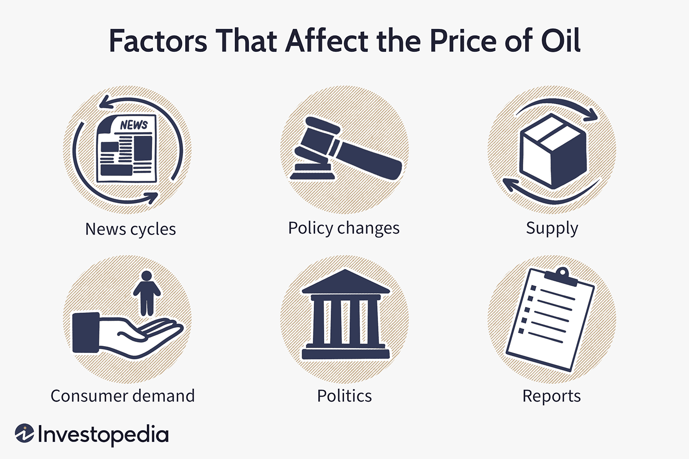

## Table of Contents

## What are the basic factors that affect oil prices?

Oil prices are affected by several basic factors. One big factor is how much oil people want to use, called demand. When more people want oil, like when the economy is doing well, prices go up. Another factor is how much oil is available, called supply. If there is less oil because countries are not producing as much, or there are problems like wars or natural disasters, prices can go up too.

Another important factor is the decisions made by big oil-producing countries. They can choose to produce more or less oil, which changes the supply. For example, OPEC, a group of oil-producing countries, often makes decisions together that can affect oil prices around the world. Also, the value of the US dollar matters because oil is usually bought and sold in dollars. If the dollar gets weaker, oil can become more expensive.

Lastly, things like new technology and changes in laws can also affect oil prices. If new ways to get oil are found, like fracking, it can increase supply and lower prices. On the other hand, if new laws make it harder to produce oil, it can decrease supply and raise prices. All these factors together decide how much we pay for oil.

## How does supply and demand impact oil prices?

Supply and demand are like the two sides of a seesaw that control oil prices. When more people want oil, which is called demand, and there isn't enough oil to go around, the price goes up. This happens because everyone is trying to buy the same amount of oil, so they have to pay more to get it. For example, if more cars are on the road and using gas, the demand for oil goes up, and if the oil companies can't make more oil quickly, the price will rise.

On the other hand, if there is a lot of oil available, which is called supply, and not many people want it, the price goes down. This is because oil companies want to sell their oil, so they might lower the price to attract buyers. For instance, if new oil fields are discovered and more oil is produced, but people are not using as much oil because they are driving less, the price of oil will drop because there is more oil than people need.

These two forces, supply and demand, are always working together to set the price of oil. If something changes on one side, like a big country deciding to produce less oil, it can tip the seesaw and change the price. Understanding how these forces work helps us see why oil prices can go up and down so much.

## What role do geopolitical events play in oil price fluctuations?

Geopolitical events can shake up oil prices a lot. When there are conflicts or tensions in big oil-producing countries, it can mess with how much oil they can get out of the ground and send to other places. For example, if there's a war or political trouble in a place like the Middle East, where a lot of oil comes from, it might make it harder to get oil out, so the supply goes down and prices go up. Also, if countries put sanctions on each other, like not letting oil be shipped from one place to another, it can cut down on how much oil is available, which pushes prices higher.

Another way geopolitical events affect oil prices is through decisions made by groups like OPEC. OPEC is a group of countries that make a lot of the world's oil, and they can decide to produce more or less oil. If they decide to cut back on how much oil they're making because of political reasons, like trying to get more money for their oil, it can make the supply smaller and push prices up. On the flip side, if they decide to make more oil to help out a friend country or to calm down a tense situation, it can make the supply bigger and bring prices down. So, what's happening in the world's politics can really change how much we pay for oil.

## How do OPEC decisions influence oil prices?

OPEC, which stands for Organization of the Petroleum Exporting Countries, has a big say in oil prices because it controls a lot of the world's oil supply. When OPEC decides to produce less oil, it means there's less oil to go around. This can make the price of oil go up because everyone is trying to buy the same amount of oil, but there's not as much available. For example, if OPEC countries agree to cut back on how much oil they pump out of the ground, the world's oil supply goes down, and oil prices can rise.

On the other hand, when OPEC decides to produce more oil, it can make the price of oil go down. If they pump out more oil, there's more oil for everyone, and the price can drop because there's more than enough to go around. OPEC might decide to do this if they want to help the world economy or if they want to compete with oil from other places. So, OPEC's choices about how much oil to produce can really move the oil prices up or down.

## What is the effect of currency fluctuations on oil prices?

Oil prices are usually talked about in US dollars, so when the value of the dollar changes, it can affect how much oil costs. If the US dollar gets weaker compared to other currencies, it means that people from other countries need more of their own money to buy the same amount of oil. This can make oil seem more expensive to them, even if the price in dollars hasn't changed. On the other hand, if the US dollar gets stronger, oil can seem cheaper to people using other currencies because they need less of their money to buy it.

This relationship between the US dollar and oil prices can also affect how much oil countries want to produce and sell. If the dollar is weak, oil-producing countries might decide to produce less oil because they get less money for it. This can make the supply of oil smaller and push the price up. But if the dollar is strong, they might produce more oil because they can make more money from it, which can increase the supply and bring the price down. So, changes in the value of the US dollar can have a big impact on what we pay for oil.

## How do economic indicators like GDP growth affect oil prices?

Economic indicators like GDP growth can have a big impact on oil prices. When a country's GDP is growing, it usually means that the economy is doing well. More people are working, businesses are making more stuff, and people are buying more things. All of this can lead to more demand for oil because cars, trucks, and factories need oil to run. So, when GDP growth is strong, the demand for oil goes up, and if the supply of oil stays the same, the price of oil can go up too.

On the flip side, if GDP growth slows down or goes into a recession, it can mean that the economy is not doing so well. People might be driving less, factories might be making less stuff, and overall, there's less need for oil. This drop in demand can lead to lower oil prices because there's more oil than people need. So, watching GDP growth can give us clues about where oil prices might be headed.

## What is the impact of oil inventory levels on price movements?

Oil inventory levels tell us how much oil is stored and ready to be used. When oil inventories are low, it means there's not a lot of oil sitting around, so if people want more oil, the price can go up because there's less to go around. For example, if oil companies are not filling up their storage tanks as much, it can make the supply seem smaller, and that can push prices higher.

On the other hand, when oil inventories are high, it means there's a lot of oil stored up and ready to use. If there's more oil than people need, the price can go down because oil companies might lower the price to sell off their extra oil. So, keeping an eye on how much oil is in storage can help us understand why oil prices might be going up or down.

## How do technological advancements in oil extraction affect prices?

Technological advancements in oil extraction can make it easier and cheaper to get oil out of the ground. For example, new methods like fracking let us reach oil that was hard to get before. When it's easier to get oil, more oil can be produced, which means there's more supply. If the supply of oil goes up and the demand stays the same, the price of oil can go down because there's more oil than people need.

But sometimes, new technology can also make oil prices go up. If the new technology is very expensive and only a few companies can use it, they might not produce as much oil as before. Less oil being produced can mean less supply, and if people still want the same amount of oil, the price can go up. So, technology can change oil prices in different ways depending on how it affects the supply of oil.

## What are the influences of environmental policies on oil prices?

Environmental policies can make oil prices go up or down. When governments make rules to help the environment, like saying cars need to use less gas or factories need to pollute less, it can mean people use less oil. If people use less oil, the demand for oil goes down, and if the supply stays the same, oil prices can drop. But, if these rules make it harder for oil companies to get oil out of the ground, like not letting them drill in certain places, the supply of oil can go down. Less oil being available can make prices go up because there's not enough to go around.

Also, if governments decide to tax oil more to make people use less of it, this can make oil more expensive. When oil gets more expensive because of taxes, people might choose to use less oil or switch to other kinds of energy that are cheaper or better for the environment. This can lower the demand for oil and bring prices down. But, if the taxes are very high, oil companies might still make money even if they produce less oil, which can keep prices high. So, environmental policies can change oil prices in different ways depending on how they affect how much oil people use and how much oil companies can produce.

## How do financial markets and speculation contribute to oil price volatility?

Financial markets and speculation can make oil prices go up and down a lot. Traders in financial markets buy and sell oil not just to use it, but to make money from changes in its price. They might think the price will go up, so they buy oil now to sell it later for more money. Or they might think the price will go down, so they sell oil now to buy it back later for less. This guessing about future prices, called speculation, can make oil prices move a lot, even if the real supply and demand of oil haven't changed much.

Sometimes, these guesses can become big bets that push oil prices around even more. If a lot of traders start buying oil because they think the price will go up, it can actually make the price go up, even if there's no real reason for it. On the other hand, if many traders start selling oil because they think the price will go down, it can make the price drop quickly. So, the actions of people in financial markets can add a lot of ups and downs to oil prices, making them more unpredictable.

## What are the long-term trends affecting oil price stability?

Over the long term, several big trends can make oil prices more stable or less stable. One big trend is the move towards using more renewable energy like wind and solar power. As more people and countries use these types of energy, they might need less oil. This can make the demand for oil go down, and if the supply stays the same, oil prices can become less stable because there's more oil than people need. Another trend is new technology that makes it easier to find and get oil out of the ground. If it's easier to get oil, more oil can be produced, which can also make oil prices less stable because there's more supply.

Another long-term trend is how countries and companies are working together more to control oil production. Groups like OPEC can decide to make more or less oil, and this can help keep oil prices more stable. But, if countries don't agree on how much oil to produce, it can make prices go up and down a lot. Also, big changes in the world economy, like when countries grow or shrink a lot, can change how much oil people need. If the world economy grows a lot, people might use more oil, and if it shrinks, they might use less. All these trends together can make oil prices more or less stable over time.

## How do global shifts in energy consumption patterns impact oil prices?

Global shifts in how people use energy can change oil prices a lot. If more countries start using less oil because they're switching to other kinds of energy like wind or solar power, it means there's less demand for oil. When fewer people want oil, but the amount of oil being produced stays the same, the price can go down. This is because oil companies might have to lower the price to sell all their oil. For example, if electric cars become really popular, people will buy less gas, and that can make oil prices drop.

But, if countries start using more oil because they're growing their economies or building more factories, the demand for oil can go up. When more people want oil and the supply doesn't change, the price can go up. This happens because everyone is trying to buy the same amount of oil, so they have to pay more to get it. So, changes in how the world uses energy can make oil prices go up or down, depending on whether people are using more or less oil.

## What are the key influences on oil prices?

Oil prices are subject to a multitude of influencing factors that collectively contribute to market fluctuations. Among the most significant influencers are the decisions made by the Organization of the Petroleum Exporting Countries (OPEC), shifts in supply and demand dynamics, geopolitical events, natural disasters, and core economic fundamentals.

OPEC, consisting of major oil-producing nations, plays a central role in the determination of global oil prices. By coordinating production levels among its member countries, OPEC can influence the supply of oil in the market, thus affecting prices. For instance, a decision by OPEC to reduce production can lead to a decrease in supply, potentially driving prices up if demand remains constant or increases.

Supply and demand are the bedrock of oil pricing mechanisms. An equilibrium between supply and demand ensures stable pricing, but disruptions can lead to significant price changes. For example, an oversupply scenario, possibly due to increased production or decreased demand, can result in reduced prices. Conversely, if demand surges, particularly from major economies like China or India, and supply cannot quickly match this increase, prices are likely to rise.

Geopolitical events also exert substantial influence on oil prices. Political instability in key oil-producing regions, particularly the Middle East, can cause supply disruptions and create uncertainty in the markets. This instability often leads to higher prices as markets react to perceived or real threats to oil supply chains. Moreover, trade restrictions and sanctions imposed on oil-producing countries can limit the available supply in the market, leading to similar price increases.

Natural events, including hurricanes, earthquakes, and other disasters, directly affect oil production and pricing. For instance, hurricanes in the Gulf of Mexico can disrupt drilling activities and refinery operations, leading to reduced supply and necessitating price adjustments. These natural interruptions highlight the vulnerability of oil production infrastructure to environmental factors.

Economic fundamentals, such as production costs and storage capabilities, directly impact oil pricing as well. The cost of extraction, refining, and transportation are key components of production costs. An increase in these costs, due to technological challenges or rising labor expenses, can elevate oil prices. Similarly, storage capabilities play a crucial role; limited storage may force producers to sell at lower prices during oversupply periods, whereas ample storage options provide greater flexibility in managing supply.

Incorporating these factors into predictive modeling and strategic planning is essential for stakeholders in the oil market. Using such models, one can assess the potential outcomes of different scenarios, such as an OPEC production cut or a sudden geopolitical conflict. For example, a simple model to estimate the change in oil price ($\Delta P$) due to change in supply ($\Delta S$) and demand ($\Delta D$) might look like:

$$
\Delta P = k (\Delta D - \Delta S)
$$

where $k$ is a proportionality constant that reflects market sensitivity.

Understanding these interrelated factors is crucial for anticipating oil price trends and making informed decisions in a volatile market landscape.

## What are the fundamental dynamics of supply and demand?

Supply and demand are key determinants in the oil markets, serving as the basic framework for understanding price dynamics. The relationship between supply and demand is straightforward: when supply exceeds demand, prices decrease, and when demand surpasses supply, prices increase. This fundamental economic principle plays a significant role in dictating oil market trends.

Oversupply situations typically occur when oil production outstrips global consumption. For instance, advancements in technology, such as hydraulic fracturing and horizontal drilling, have enabled the extraction of previously inaccessible reserves, leading to increased output. When such supply surges are not met with corresponding demand increases, the result is a downward pressure on prices. A notable example of this was observed in 2014 when the U.S. shale boom contributed to an oversupply that caused global prices to plummet.

Conversely, when demand increases without a matching rise in supply, prices tend to rise. This scenario can be driven by various factors, such as economic growth, technological advancements, and increased industrial activity, all of which elevate the need for oil. In particular, fluctuations in international demand are critical. For instance, China's rapid industrial growth has historically had significant implications for global oil demand. China's transition towards a more consumer-driven economy can lead to periodic spikes in oil consumption, thereby influencing global prices.

To quantitatively understand these dynamics, we can express the relationship through a basic economic model:

$$
P = f(S, D)
$$

where $P$ is the price of oil, $S$ is the supply, and $D$ is the demand. A more granular analysis might include differential equations or econometric models to capture the complexities and lag effects that occur between changes in supply, demand, and resulting price adjustments.

In terms of computational modeling, these dynamics can also be simulated using Python. For instance, one could use the following pseudo-code to model price changes based on supply and demand fluctuations:

```python
def oil_price_change(supply, demand):
    if supply > demand:
        return "Price Decrease"
    elif demand > supply:
        return "Price Increase"
    else:
        return "Stable Price"

# Example scenario
supply = 100  # Example supply units
demand = 90   # Example demand units
print(oil_price_change(supply, demand))
```

In conclusion, understanding the foundational dynamics of supply and demand is crucial for anticipating movements in oil prices. While oversupply scenarios generally lead to reduced prices, significant demand surges, especially from major economies like China, can cause notable price increases. These fundamental forces continue to shape the global oil market, interacting with other factors to produce complex and ever-changing pricing landscapes.

## How do interest rates and oil prices relate to each other?

Interest rates have a notable impact on oil prices, primarily due to their influence on economic activities and currency values. When central banks adjust interest rates, they indirectly affect the cost of borrowing for both consumers and businesses. An increase in interest rates usually leads to a reduction in consumer spending and business investments, as borrowing becomes more expensive. Consequently, this can result in decreased demand for oil, leading to potential downward pressure on oil prices.

Furthermore, [interest rate](/wiki/interest-rate-trading-strategies) changes can affect the strength of a currency, particularly the U.S. dollar, which plays a significant role in global oil markets as oil is predominantly priced in dollars. When interest rates in the United States rise, the dollar typically appreciates, making it stronger. A stronger dollar means that oil becomes cheaper for holders of dollars, including U.S. consumers and businesses. This appreciation can lead to reduced global demand for oil as it becomes more expensive for foreign buyers who must convert their weaker currencies to purchase oil, ultimately influencing global oil prices.

From a mathematical perspective, the relationship between interest rates and currency strength often involves exchange rate models. For example, interest rate parity theory can provide insights into how interest differentials influence currency exchange rates:

$$
\text{F} = \text{S} \times \left( \frac{1 + i_{\text{domestic}}}{1 + i_{\text{foreign}}} \right)
$$

where:
- $\text{F}$ is the forward exchange rate
- $\text{S}$ is the spot exchange rate
- $i_{\text{domestic}}$ is the domestic interest rate
- $i_{\text{foreign}}$ is the foreign interest rate

Adjustments in these rates consequently impact the cost of oil on the global market, either amplifying or dampening price shifts depending on the relative strength of international currencies. Thus, monitoring interest rate trends is crucial for understanding potential shifts in oil prices. As central banks modify rates in response to economic indicators, oil markets often react in anticipation of these broader economic changes.

## References & Further Reading

[1]: Kilian, L. (2009). ["Not All Oil Price Shocks Are Alike: Disentangling Demand and Supply Shocks in the Crude Oil Market."](https://www.jstor.org/stable/25592494) American Economic Review, 99(3), 1053-1069.

[2]: Fattouh, B., & Mahadeva, L. (2013). ["OPEC: What Difference Has It Made?"](https://www.oxfordenergy.org/wpcms/wp-content/uploads/2013/01/MEP-3.pdf?v=7516fd43adaa) Oxford Institute for Energy Studies.

[3]: Zhang, D., Liu, J., & Ding, Y. (2017). ["Global economic activity, oil price shocks and oil-exporting countries' financial stress: A wavelet-based copula approach."](https://immunityageing.biomedcentral.com/articles/10.1186/s12979-024-00484-7) Energy Economics, 61, 112-125.

[4]: Narasimhan, T. N., & Baek, H. (1997). ["The role of OPEC in the world oil market."](https://www.researchgate.net/publication/267227221_The_role_of_OPEC_in_the_world_oil_market) Energy Policy, 25(5), 409-418.

[5]: Castonguay, A., & Xie, Y. (2014). ["Algorithmic trading and volatility: An empirical investigation."](https://bpb-us-e1.wpmucdn.com/sites.psu.edu/dist/6/129281/files/2024/02/Castonguay-et-al.-2015a-5ad28ec0f22f5444.pdf) Journal of Empirical Finance, 29, 74-81.

[6]: ["The End of OPEC?"](https://www.csis.org/analysis/end-opec-or-new-beginning) International Monetary Fund (IMF), Finance & Development, March 2021.

[7]: Başarır, Ç. (2016). ["The impact of US interest rate policy on oil prices."](https://www.sciencedirect.com/science/article/abs/pii/S0140988320301122) Renewable Energy, 87, 946-955.