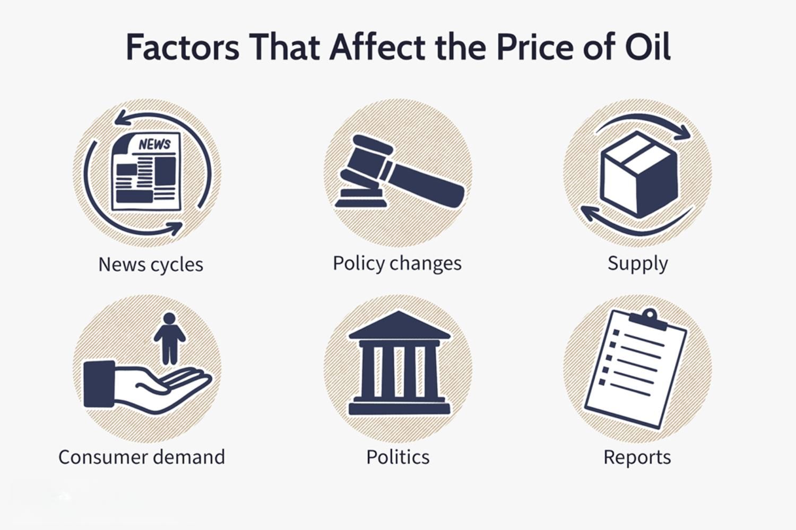

## Table of Contents

## What are the basic factors that influence oil prices?

Oil prices are influenced by many things. One big thing is how much oil people want to buy. If more people want oil, the price goes up. Another thing is how much oil countries can produce. If they can make more oil, the price might go down. Also, things like wars or bad weather can stop oil from being made or moved, which can make prices go up.

Another factor is the value of money. If the money used to buy oil, like the US dollar, becomes weaker, oil prices can go up. Also, rules made by governments can change oil prices. For example, if a country says people can't use as much oil, the price might go up because there is less to go around. Big groups like OPEC can also decide to make more or less oil, which changes the price.

Lastly, the future also affects oil prices. If people think there will be more oil later, they might not want to buy as much now, and prices can go down. But if they think there will be less oil in the future, they might buy more now, and prices can go up. So, what people think about the future is very important for oil prices.

## How does supply and demand affect oil prices?

Supply and demand are big reasons why oil prices change. When more people want to buy oil, the demand goes up. If the amount of oil available, or the supply, stays the same, then the price of oil will go up because everyone is trying to buy the same amount of oil. On the other hand, if fewer people want oil, the demand goes down. If the supply stays the same, the price will go down because there is more oil than people want to buy.

The supply of oil can also change and affect prices. If countries that make oil, like Saudi Arabia or Russia, decide to produce more oil, the supply goes up. If the demand stays the same, more oil means the price can go down because there is more oil to go around. But if something happens, like a war or a big storm, and it makes it hard to get oil out of the ground or move it around, the supply can go down. If the demand stays the same, less oil means the price goes up because there is not enough oil for everyone who wants it.

## What role do oil production levels play in determining oil prices?

Oil production levels are very important for deciding oil prices. When countries that make oil, like Saudi Arabia or the United States, decide to produce more oil, there is more oil available. This is called an increase in supply. If the number of people wanting to buy oil stays the same, having more oil can make the price go down. It's like having more pieces of cake at a party; if there are enough pieces for everyone, the price of the cake might not be as high.

On the other hand, if these countries decide to produce less oil, there is less oil available. This is called a decrease in supply. If the number of people wanting to buy oil stays the same, having less oil can make the price go up. It's like having fewer pieces of cake at a party; if there aren't enough pieces for everyone, people might be willing to pay more for a piece. So, oil production levels can make oil prices go up or down depending on how much oil is being made.

## How do geopolitical events impact oil prices?

Geopolitical events can really shake up oil prices. When there are conflicts or tensions between countries that make oil, like wars or political disagreements, it can mess with how much oil gets produced or moved around. For example, if there's a war in an oil-producing country, it might be hard to keep the oil flowing. This can make the supply of oil go down, and when there's less oil available, the price can go up because everyone is trying to get their hands on what's left.

Also, decisions made by groups like OPEC can affect oil prices. OPEC is a group of countries that make a lot of the world's oil, and they can decide to make more or less oil. If they choose to produce less oil because of political reasons, like wanting to keep prices high, the supply goes down and prices can go up. On the other hand, if they decide to produce more oil to try to calm down tensions or help the global economy, the supply goes up and prices might go down. So, what happens in the world of politics can have a big impact on how much we pay for oil.

## What is the influence of OPEC on oil prices?

OPEC, which stands for the Organization of the Petroleum Exporting Countries, has a big say in oil prices. It's a group of countries that make a lot of the world's oil. When OPEC decides to make more oil, there's more oil to go around. This can make the price of oil go down because there's plenty of oil for everyone who wants it. But if OPEC decides to make less oil, there's not as much oil available. This can make the price go up because everyone is trying to buy the same smaller amount of oil.

OPEC's decisions can also affect what people think about the future of oil prices. If OPEC says they're going to keep making less oil, people might think oil will be hard to get in the future. This can make them want to buy more oil now, which can push prices up even more. On the other hand, if OPEC says they'll make more oil, people might think oil will be easier to get later. This can make them wait to buy oil, which can help bring prices down. So, what OPEC does and says can really move oil prices around.

## How do economic indicators like GDP growth affect oil prices?

Economic indicators like GDP growth can have a big impact on oil prices. GDP, or Gross Domestic Product, is a way to measure how well a country's economy is doing. When a country's GDP is growing, it usually means that businesses are doing well and people are spending more money. This can lead to more people wanting to buy oil, because they need it for things like driving cars or running factories. When more people want oil, the demand goes up. If the amount of oil stays the same, the price of oil can go up because there's more competition for the oil that's available.

On the other hand, if a country's GDP is not growing or is shrinking, it can mean that businesses are not doing as well and people are spending less money. This can lead to fewer people wanting to buy oil, because they don't need as much for their cars or factories. When fewer people want oil, the demand goes down. If the amount of oil stays the same, the price of oil can go down because there's less competition for the oil that's available. So, how well a country's economy is doing can really affect how much we pay for oil.

## What is the effect of currency fluctuations on oil prices?

Oil is usually bought and sold in US dollars. So, when the value of the US dollar changes compared to other currencies, it can affect oil prices. If the US dollar gets weaker, it means that people in other countries can buy oil for less of their own money. This can make more people want to buy oil, which can push up the demand and the price of oil. On the other hand, if the US dollar gets stronger, it means that people in other countries have to pay more of their own money to buy oil. This can make fewer people want to buy oil, which can push down the demand and the price of oil.

Currency fluctuations can also affect how much it costs for countries to produce oil. If a country's currency gets weaker compared to the US dollar, it might cost them more to buy the things they need to make oil, like equipment or technology. This can make it more expensive for them to produce oil, which can lead to less oil being made and higher oil prices. But if a country's currency gets stronger compared to the US dollar, it might cost them less to buy the things they need to make oil. This can make it cheaper for them to produce oil, which can lead to more oil being made and lower oil prices. So, changes in currency values can really shake up oil prices in different ways.

## How do oil inventories and storage levels influence oil prices?

Oil inventories and storage levels can have a big impact on oil prices. When there's a lot of oil stored up in tanks and warehouses, it means there's more oil available than people are using right now. This is called high inventory levels. When there's a lot of oil sitting around, it can make the price of oil go down because there's plenty of oil for everyone who wants it. It's like having a lot of extra food in your pantry; if you have more than you need, you might not be in a hurry to buy more, and the price might not be as high.

On the other hand, when there's not a lot of oil stored up, it means there's less oil available than people are using right now. This is called low inventory levels. When there's not much oil sitting around, it can make the price of oil go up because everyone is trying to buy the same smaller amount of oil. It's like running low on food in your pantry; if you don't have enough, you might be in a hurry to buy more, and the price might go up because everyone else is trying to buy food too. So, how much oil is stored up can really move oil prices around.

## What is the impact of technological advancements in oil extraction on oil prices?

Technological advancements in oil extraction can make it easier and cheaper to get oil out of the ground. When new technology helps oil companies find and drill for oil in places that were hard to reach before, like deep under the ocean or in shale rock, it can increase the amount of oil that's available. This is called an increase in supply. When there's more oil to go around, the price of oil can go down because there's plenty for everyone who wants it. It's like finding a new way to grow more food; if there's more food, the price might not be as high.

But sometimes, new technology can also make oil prices go up. If the new technology is really expensive and only a few companies can use it, it might not lead to a big increase in oil supply right away. Also, if the new technology makes people think that there will be a lot more oil in the future, they might want to buy more oil now. This can push up the demand for oil, which can make the price go up even if there's not a lot more oil available right now. So, new technology can shake up oil prices in different ways depending on how it's used and what people think about the future.

## How do environmental policies and regulations affect oil prices?

Environmental policies and regulations can make oil prices go up. When governments make new rules to protect the environment, like saying cars have to use less gas or factories have to make less pollution, it can make it harder and more expensive for people to use oil. If it's harder to use oil, fewer people might want to buy it, which can make the demand for oil go down. But if the rules also make it harder for oil companies to make oil, like saying they can't drill in certain places, it can make the supply of oil go down too. When there's less oil available, the price can go up because everyone is trying to buy the same smaller amount of oil.

On the other hand, if governments give money or other help to people who use less oil or find other ways to make energy, it can make oil prices go down. If more people start using other kinds of energy, like solar or wind power, they might not need as much oil. This can make the demand for oil go down, which can make the price go down too. But if the rules make it easier for oil companies to make more oil, like giving them money to use new technology, it can make the supply of oil go up. When there's more oil available, the price can go down because there's plenty for everyone who wants it. So, what governments do to help the environment can really move oil prices around.

## What is the role of speculative trading in the oil market?

Speculative trading is when people buy and sell oil not because they need it, but because they think the price will go up or down. These traders are trying to make money by guessing what will happen to oil prices in the future. If a lot of traders think oil prices will go up, they will buy a lot of oil now. This can make the demand for oil go up, which can push the price of oil up even if nothing else has changed. On the other hand, if a lot of traders think oil prices will go down, they will sell their oil now. This can make the supply of oil go up, which can push the price of oil down even if nothing else has changed.

Speculative trading can also make oil prices move around a lot. If traders keep changing their minds about what will happen to oil prices, it can make the price go up and down a lot in a short time. This can make it hard for people who need oil, like airlines or factories, to know how much they will have to pay for it. So, what traders think and do can have a big impact on oil prices, even if they don't use the oil themselves.

## How do long-term trends and future expectations influence oil prices?

Long-term trends and what people think will happen in the future can really change oil prices. If people think there will be more oil in the future, maybe because new ways to get oil are being used or new oil fields are found, they might not want to buy as much oil now. This can make the demand for oil go down, which can make the price go down too. But if people think there will be less oil in the future, maybe because of new rules to protect the environment or because oil is getting harder to find, they might want to buy more oil now. This can make the demand for oil go up, which can make the price go up too.

Also, long-term changes in how we use energy can affect oil prices. If more and more people start using other kinds of energy, like solar or wind power, they might not need as much oil. This can make the demand for oil go down over time, which can make the price go down. But if people keep using a lot of oil and don't switch to other kinds of energy, the demand for oil might stay high. This can make the price stay high or even go up if it gets harder to make more oil. So, what people think about the future and how they use energy can really move oil prices around.

## What are the determinants of oil prices?

Oil prices are primarily dictated by the fundamental economic principles of supply and demand. The relationship between these two factors is pivotal in setting the market equilibrium price. When supply exceeds demand, prices tend to fall, and conversely, when demand exceeds supply, prices rise. This balance can be represented by the basic economic equation:

$$
P = f(Q_s, Q_d)
$$

where $P$ is the price of oil, $Q_s$ is the quantity supplied, and $Q_d$ is the quantity demanded.

Market participants, including hedgers and speculators, play significant roles in influencing oil prices. Hedgers, such as airlines or oil companies, utilize oil futures contracts to mitigate the risk of price fluctuations. By locking in prices for future deliveries, they can stabilize their financial forecasts amidst volatile markets. Speculators, on the other hand, may drive price changes by seeking to profit from anticipated market movements rather than engaging in actual oil trading.

Market sentiment and geopolitical factors further contribute to oil price [volatility](/wiki/volatility-trading-strategies). Investor sentiment, shaped by economic indicators, political developments, and overall market confidence, can lead to sharp price movements as traders react to news and projections. For instance, the announcement of diplomatic tensions or conflicts in oil-rich regions often results in immediate price surges due to anticipated disruptions in supply.

The Organization of the Petroleum Exporting Countries (OPEC) holds substantial influence in swaying global oil prices. As a collective of oil-producing nations, OPEC can adjust its member countries' production levels to influence supply globally. Decisions made during OPEC meetings can lead to supply cuts or increases, causing shifts in global oil prices. OPEC’s strategic maneuvers are often aimed at stabilizing the oil market and ensuring fair returns on investments for member countries.

These determinants highlight the complexity of oil pricing, where a mix of economic principles, strategic actions by market participants, and unpredictable geopolitical events converge to shape the prices observed in global oil markets.

## References & Further Reading

[1]: Hamilton, J. D. (2009). ["Understanding Crude Oil Prices."](https://www.jstor.org/stable/41323239) The Energy Journal, 30(2), 179-206.

[2]: Kilian, L., & Murphy, D. J. (2014). ["The Role of Inventories and Speculative Trading in the Global Market for Crude Oil."](https://deepblue.lib.umich.edu/bitstream/handle/2027.42/106955/jae2322.pdf?sequence=1) Journal of Applied Econometrics, 29(3), 454-478.

[3]: Geman, H. (2005). ["Commodities and Commodity Derivatives: Modelling and Pricing for Agriculturals, Metals and Energy."](https://download.e-bookshelf.de/download/0000/5675/90/L-G-0000567590-0015270354.pdf) Wiley Finance.

[4]: Kaufman, P. J. (2013). ["Trading Systems and Methods."](https://onlinelibrary.wiley.com/doi/book/10.1002/9781119202561) Wiley.

[5]: Irwin, S. H., & Sanders, D. R. (2012). ["Financialization and structural change in commodity futures markets."](https://caia.org/sites/default/files/membersonly/Financialization_and_Structural_Change_in_Commodity_Future_Markets.pdf) Journal of Agricultural and Applied Economics, 44(3), 371-396.