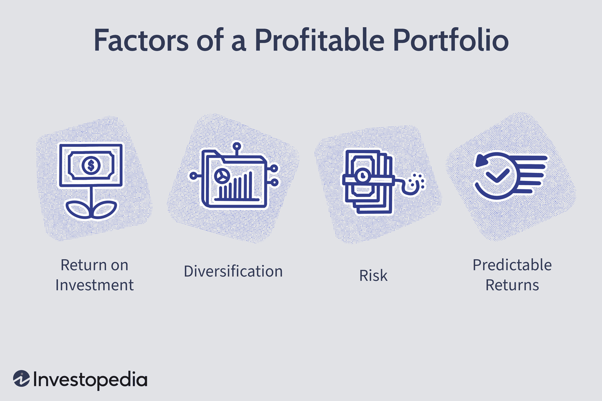

## Table of Contents

## What is a portfolio and why is its profitability important?

A portfolio is a collection of investments like stocks, bonds, and other financial assets that a person or a company owns. It's like a basket where you put different types of fruits to have a mix of flavors and nutrients. The idea is to spread out the risk so that if one investment does poorly, the others might do well and balance things out.

The profitability of a portfolio is important because it shows how well the investments are doing. If a portfolio is profitable, it means the investments are growing in value or giving good returns, like earning money from interest or dividends. This is crucial for people who rely on their investments for income, like retirees, or for those saving up for big goals like buying a house or funding education. A profitable portfolio helps achieve these financial goals and provides a sense of security and progress.

## How does diversification affect portfolio profitability?

Diversification is like not putting all your eggs in one basket. When you spread your money across different types of investments, like stocks, bonds, and real estate, you're less likely to lose everything if one investment does badly. It's a way to manage risk. If one part of your portfolio goes down, another part might go up, helping to keep your overall portfolio more stable.

This stability can actually help with profitability over time. By having a mix of investments, you might not get the highest returns from any single investment, but you're more likely to have steady, reliable growth. Over the long run, this can lead to better overall profitability because you're avoiding big losses that can be hard to recover from. So, diversification is a smart strategy to aim for consistent profits and protect your money.

## What role does risk tolerance play in determining portfolio profitability?

Risk tolerance is how much risk someone is okay with when they invest their money. It's different for everyone. Some people can handle big ups and downs in their portfolio and are okay with the chance of losing money if it means they might make more money too. Others want their money to be safe and don't want to lose any, even if it means they won't make as much.

The amount of risk someone is willing to take can really change how profitable their portfolio might be. If someone has a high risk tolerance, they might put their money into things like stocks that can go up a lot but can also go down a lot. This can lead to bigger profits if things go well, but also bigger losses if they don't. On the other hand, someone with a low risk tolerance might choose safer investments like bonds, which don't go up as much but are more stable. This usually means smaller profits but less chance of losing money. So, understanding your own risk tolerance helps you pick the right investments for your goals and comfort level.

## How can asset allocation impact the profitability of a portfolio?

Asset allocation is all about deciding how to split your money between different types of investments, like stocks, bonds, and real estate. It's like choosing how much of each ingredient to put in a recipe. The way you divide your money can make a big difference in how much profit you can make from your portfolio. If you put more money into stocks, which can grow a lot but are also riskier, you might see bigger profits if the stock market does well. But if the market goes down, you could lose more too. On the other hand, if you put more money into bonds, which are usually safer but don't grow as much, your portfolio might not grow as fast, but it will be more stable.

Getting the right mix of investments based on your goals and how much risk you're okay with is key. If you're young and saving for something far in the future, you might want to put more money into stocks to try to grow your money faster. But if you're closer to needing the money, like for retirement, you might want to shift more into bonds to keep your money safe. Changing your asset allocation over time can help you balance the potential for profit with the need to protect your money, making your portfolio more profitable in the long run.

## What are the effects of market conditions on portfolio performance?

Market conditions are like the weather for your investments. They can change how well your portfolio does. When the economy is doing well, like when people are buying a lot and businesses are making money, stock prices usually go up. This can make your portfolio grow if you have a lot of stocks. But if the economy is not doing well, like during a recession, stock prices can go down, and your portfolio might lose value.

Sometimes, other things like interest rates or big world events can also affect the market. For example, if interest rates go up, it can make borrowing money more expensive for businesses, which might slow down the economy and hurt stock prices. Big events like political changes or natural disasters can also shake up the market and change how your investments do. So, it's important to keep an eye on these market conditions and maybe change your investments to help protect your money.

Overall, market conditions are always changing, and they can have a big impact on your portfolio's performance. By understanding these conditions and maybe adjusting your investments, you can try to make the most of good times and protect your money during bad times.

## How do fees and expenses influence the overall profitability of a portfolio?

Fees and expenses are like little bites taken out of your investment profits. Every time you buy or sell something in your portfolio, or if you have someone managing your money, you might have to pay fees. These fees can add up over time and eat into the money you're trying to make. For example, if you pay a 1% fee every year on a $10,000 investment, that's $100 less profit for you each year. Over many years, those fees can really add up and make your portfolio less profitable.

It's important to keep an eye on these fees and try to keep them as low as possible. Some investments, like index funds, have lower fees than others, like actively managed funds. By choosing investments with lower fees, you can keep more of your money working for you. This can make a big difference in how much profit you end up with, especially over the long run. So, understanding and managing fees is a key part of making your portfolio as profitable as it can be.

## What is the impact of inflation on portfolio profitability?

Inflation is when prices go up over time, making each dollar worth less. This can affect your portfolio because the money you make from your investments might not buy as much in the future. If your investments don't grow faster than inflation, you could end up losing buying power. For example, if inflation is 3% a year and your investments only grow by 2%, you're actually losing 1% of your money's value every year.

To keep your portfolio profitable in the face of inflation, you need to invest in things that can grow faster than inflation. Stocks, real estate, and some types of bonds can do this. If your investments can beat inflation, you'll keep your money's value and maybe even make it grow. It's like running a race where inflation is your competition; you want to make sure your portfolio runs faster to stay ahead.

## How does tax efficiency affect portfolio returns?

Tax efficiency is about making smart choices with your investments so you don't lose too much money to taxes. When you make money from your investments, like selling stocks for a profit or getting dividends, you usually have to pay taxes on that money. But different investments are taxed differently. For example, some investments might be taxed at a lower rate than others. By [picking](/wiki/asset-class-picking) the right investments, you can keep more of your money instead of giving it to the government.

Being tax-efficient can really help your portfolio grow over time. If you can lower the taxes you pay, you'll have more money left to reinvest and make even more money. It's like keeping more of your pie to bake a bigger pie later. So, thinking about taxes when you choose your investments can make a big difference in how much profit you end up with in the long run.

## What role does investment horizon play in portfolio profitability?

The investment horizon is how long you plan to keep your money invested. It's like deciding if you're saving for a short trip next month or a big vacation in ten years. Your investment horizon can really change how you set up your portfolio and how much profit you might make. If you're saving for something soon, you might want to pick safer investments that won't lose value quickly. But if you're saving for the long term, you can take more risks because you have time to recover from any dips in the market.

For example, if you're young and saving for retirement, you might put more money into stocks. Stocks can go up and down a lot, but over many years, they usually grow more than safer investments like bonds. This can help your portfolio grow bigger over time. But if you're close to needing the money, like if you're about to retire, you might want to move more money into bonds to keep your money safe. So, thinking about your investment horizon helps you pick the right mix of investments to make your portfolio as profitable as possible for your goals.

## How can behavioral finance principles influence portfolio profitability?

Behavioral finance looks at how people's feelings and actions can affect their investment choices. Sometimes, people can make choices based on fear or excitement instead of thinking logically. For example, if the stock market goes down a lot, people might get scared and sell their investments, even if it's not a good time to do so. This can lead to selling low and missing out on future gains when the market goes back up. On the other hand, if people see a stock going up a lot, they might get too excited and buy it at a high price, only to see it fall later. These emotional reactions can hurt the profitability of a portfolio.

Understanding these behaviors can help people make better choices. By knowing that they might be tempted to make quick decisions based on emotions, investors can set up rules or plans to stick to, no matter what the market does. For instance, they might decide to only check their investments once a month, so they don't get swayed by daily ups and downs. Or they might set up automatic investments so they keep buying even when the market is low, which can lead to buying at lower prices and better long-term profits. By managing these behavioral tendencies, investors can improve the profitability of their portfolios.

## What advanced strategies can be used to enhance portfolio profitability?

One advanced strategy to boost portfolio profitability is using a technique called "rebalancing." This means checking your portfolio now and then and adjusting it to keep the mix of investments you want. For example, if stocks have done really well and now make up a bigger part of your portfolio than you planned, you might sell some stocks and buy more bonds to get back to your original plan. Rebalancing helps you stick to your strategy and can make your portfolio more profitable over time by buying low and selling high.

Another strategy is "tax-loss harvesting." This is when you sell investments that have gone down in value to use those losses to lower your taxes. You can then buy similar investments to keep your portfolio the same but with a tax benefit. This can help you keep more of your money, which can lead to higher profits in the long run. It's a smart way to make the most out of bad investments.

A third strategy is using "options and derivatives." These are special kinds of investments that can help you make money in different ways. For example, you can use options to protect your portfolio from big drops in the market or to make money if you think a stock will go up or down. These strategies can be a bit tricky, but they can help you manage risk and increase your portfolio's profitability if you use them right.

## How do macroeconomic indicators and global events impact portfolio profitability?

Macroeconomic indicators like interest rates, inflation, and unemployment rates can really change how well your portfolio does. When interest rates go up, borrowing money gets more expensive for businesses, which can slow down the economy and make stock prices go down. But if interest rates are low, borrowing is cheaper, and the economy might grow faster, which can make stock prices go up. Inflation is another big one; if it's high, your money doesn't buy as much, and your investments need to grow faster to keep up. Unemployment rates also matter because if a lot of people are out of work, they won't be spending as much, which can hurt businesses and lower stock prices.

Global events like political changes, natural disasters, or big health crises can shake up the markets too. For example, if there's a big election happening in a country, the uncertainty might make investors nervous, and stock prices might go down. Or if there's a natural disaster like a hurricane, it can hurt businesses in the affected area and lower their stock prices. Big health crises, like a global pandemic, can stop the economy in its tracks, causing stock markets to drop a lot. By keeping an eye on these indicators and events, you can try to adjust your investments to protect your money and maybe even make more profit.

## What are the key elements of portfolio building?

Portfolio building is a fundamental aspect of investment management, requiring careful selection and allocation of different asset classes to meet specific financial objectives. A well-constructed portfolio balances risk and reward, catering to individual investment goals and constraints.

At the core of effective portfolio management lies the principle of risk-reward balancing. This involves assessing potential returns against the associated risks of different investments. Investors must evaluate the risk-adjusted return, often using measures like the Sharpe Ratio, which is defined as:

$$
\text{Sharpe Ratio} = \frac{R_p - R_f}{\sigma_p}
$$

where $R_p$ is the expected portfolio return, $R_f$ is the risk-free rate of return, and $\sigma_p$ is the standard deviation of the portfolio's excess return.

Diversification is a key strategy in spreading risk across various asset classes, such as stocks, bonds, real estate, and commodities. By diversifying investments, an investor can mitigate potential losses from market fluctuations since the performance of different assets is typically uncorrelated. The principle is to avoid putting all resources into a single type of asset, thus reducing the impact of [volatility](/wiki/volatility-trading-strategies) on the overall portfolio.

Aligning a portfolio with personal risk tolerance and investment time horizon is crucial for achieving long-term success. Risk tolerance is an individual's willingness and ability to endure market volatility and potential losses. Investors with a high risk tolerance might favor a larger allocation in equities, while those with low risk tolerance might prefer more bonds or fixed-income securities.

The investment time horizon refers to the expected period over which the investor plans to hold their investments before taking out money. Generally, the longer the investment horizon, the more volatility an investor can afford to endure, allowing for potentially higher returns from riskier asset classes.

In practice, optimizing a portfolio requires regular reviews and adjustments to reflect changes in market conditions, personal financial situations, and investment goals. Portfolio rebalancing, which involves realigning the weightings of different assets, helps maintain the desired risk level and optimizes returns over time.

## How can one maximize profitability?

Profitability within investment portfolios is primarily assessed through the lens of the portfolio's performance relative to the risks undertaken. To effectively gauge this balance, investors often employ strategies such as measuring the return on investment (ROI) and assessing risk-adjusted returns. 

**Return on Investment (ROI)** is a standard metric used to evaluate the efficiency of an investment. It is calculated by the formula:

$$

ROI = \left( \frac{\text{Current Value of Investment} - \text{Cost of Investment}}{\text{Cost of Investment}} \right) \times 100
$$

This metric provides a straightforward percentage that indicates the profit or loss relative to the initial investment cost. While useful, ROI does not account for the risk associated with achieving these returns.

**Risk-Adjusted Returns**, on the other hand, incorporate the risk factor, offering a clearer picture of an investment's performance. Popular metrics include the Sharpe Ratio, which measures how much excess return you receive for the extra volatility endured by holding a riskier asset. The formula for the Sharpe Ratio is:

$$

\text{Sharpe Ratio} = \frac{\text{Average Portfolio Return} - \text{Risk-Free Rate}}{\text{Standard Deviation of Portfolio Return}}
$$

This ratio helps investors understand whether the returns adequately compensate for the risk undertaken. A higher Sharpe Ratio indicates better risk-adjusted performance.

Frequent monitoring and strategic adjustments to the asset mix are crucial for maintaining and maximizing portfolio profitability. Markets are inherently dynamic, and changes such as [interest rate](/wiki/interest-rate-trading-strategies) shifts, geopolitical events, or company-specific news can influence the performance of assets within a portfolio. By consistently reviewing these factors, investors can realign their portfolios to optimize returns. 

For instance, if market conditions suggest a downturn in equities and potential growth in fixed-income securities, reallocating assets accordingly can preserve capital and enhance yields. Using algorithmic tools can significantly aid in this ongoing assessment by providing real-time data analytics and trend forecasting.

In summary, by effectively using ROI and risk-adjusted returns as benchmarks, and maintaining a vigilant approach to portfolio adjustments, investors can enhance the profitability of their investments while managing associated risks. This strategic approach is pivotal to achieving long-term financial objectives.

## What is Risk Management in Algorithmic Trading?

Algorithmic trading provides a robust platform for managing risks by integrating sophisticated technological capabilities into trading strategies. A fundamental feature in this domain is the utilization of stop-loss orders, which automatically trigger the sale of a security when its price falls below a predefined level. This mechanism limits potential losses by ensuring prompt reaction to adverse market conditions without relying on constant human supervision.

Moreover, automated position sizing forms a critical component of risk management in [algorithmic trading](/wiki/algorithmic-trading). This technique involves determining the appropriate amount of capital to allocate to each trade, thereby controlling the exposure based on risk tolerance and market volatility. A systematic approach can be implemented using predefined algorithms to adjust positions dynamically in response to changes in market variables. For instance, the Kelly Criterion is often used to decide the fraction of capital to bet on a series of independent investment opportunities. It can be represented mathematically as:

$$
f^* = \frac{bp - q}{b}
$$

where $f^*$ is the fraction of the portfolio to bet, $b$ is the odds received on the wager, $p$ is the probability of winning, and $q$ is the probability of losing (which is equal to $1 - p$).

Diversification further enhances risk management by spreading investments across a range of asset classes and trading strategies. This reduces the portfolio's dependence on the performance of a single asset or strategy, thus mitigating risk and enhancing resilience against market volatility. Algorithmic trading systems can optimize diversification by analyzing vast datasets to identify uncorrelated assets and strategies, thereby constructing portfolios that aim to achieve superior risk-adjusted returns.

In addition, algorithmic trading allows for the real-time monitoring and adjustment of portfolios. Algorithms can be programmed to respond almost instantaneously to market changes, reducing the risk posed by human error and emotional decision-making. By continuously assessing the market environment and recalibrating strategies, algorithmic trading ensures that risk management practices remain efficient and adaptive.

Risk management in algorithmic trading involves a sophisticated interplay of technology and financial expertise. By employing stop-loss orders, automated position sizing, and diversification, traders can effectively control risks and enhance their potential for profitability in dynamic market environments.

## References & Further Reading

[1]: Bergstra, J., Bardenet, R., Bengio, Y., & Kégl, B. (2011). ["Algorithms for Hyper-Parameter Optimization."](https://dl.acm.org/doi/10.5555/2986459.2986743) Advances in Neural Information Processing Systems 24.

[2]: ["Advances in Financial Machine Learning"](https://www.amazon.com/Advances-Financial-Machine-Learning-Marcos/dp/1119482089) by Marcos Lopez de Prado

[3]: ["Evidence-Based Technical Analysis: Applying the Scientific Method and Statistical Inference to Trading Signals"](https://www.amazon.com/Evidence-Based-Technical-Analysis-Scientific-Statistical/dp/0470008741) by David Aronson

[4]: ["Machine Learning for Algorithmic Trading"](https://github.com/stefan-jansen/machine-learning-for-trading) by Stefan Jansen

[5]: ["Quantitative Trading: How to Build Your Own Algorithmic Trading Business"](https://www.amazon.com/Quantitative-Trading-Build-Algorithmic-Business/dp/1119800064) by Ernest P. Chan