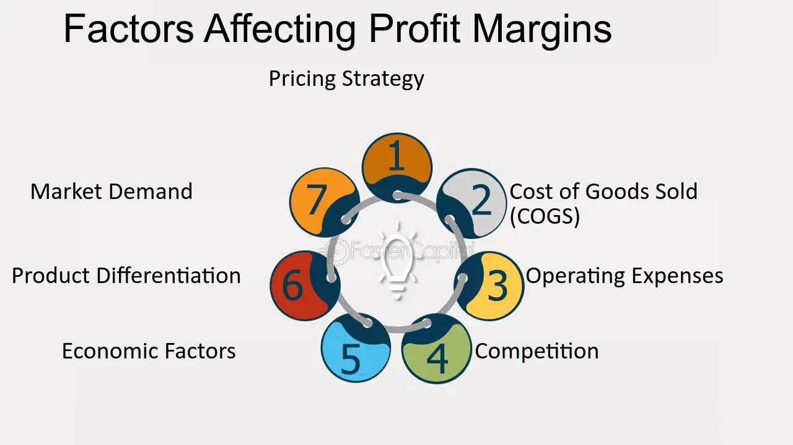

## Table of Contents

## What is a profit margin and why is it important?

A profit margin is the percentage of money a business makes after it pays for all its costs. It shows how much profit is left from each dollar of sales. For example, if a business has a 20% profit margin, it means they keep 20 cents as profit for every dollar they earn.

Profit margin is important because it helps business owners understand if their business is doing well. If the profit margin is high, it means the business is making good money after paying for everything. This can help the business grow or save for the future. If the profit margin is low, the business might need to find ways to cut costs or increase prices to make more profit. Knowing the profit margin helps businesses make smart decisions.

## How do costs of goods sold affect profit margins?

Costs of goods sold (COGS) are the direct costs a business pays to make or buy the products it sells. This includes things like materials, labor, and manufacturing costs. When COGS goes up, it means it costs more to make each product. If the price of the product stays the same, the profit margin will go down because there's less money left over after paying for the costs.

For example, if a business sells a toy for $10 and the COGS is $6, the profit margin is 40% because they keep $4 out of every $10. But if the COGS goes up to $8, and they still sell the toy for $10, the profit margin drops to 20% because they only keep $2 out of every $10. So, keeping COGS low is important for maintaining a healthy profit margin.

## What role do operating expenses play in determining profit margins?

Operating expenses are the costs a business has to pay to keep running every day. These costs include things like rent, utilities, salaries for employees who are not directly making the product, and marketing. When these operating expenses go up, they take away from the money that could be profit. So, if a business has high operating expenses, it might have a lower profit margin because there's less money left over after paying all the bills.

For example, imagine a business makes $100,000 in sales and the cost of goods sold is $60,000. That leaves $40,000 before operating expenses. If the operating expenses are $20,000, the profit is $20,000, which gives a profit margin of 20%. But if the operating expenses go up to $30,000, the profit drops to $10,000, and the profit margin falls to 10%. So, keeping operating expenses under control is important for maintaining a good profit margin.

## How does pricing strategy impact profit margins?

Pricing strategy is how a business decides what to charge for its products or services. It can really change the profit margin. If a business sets its prices high, it might make more money on each sale, which can lead to a bigger profit margin. But, if the prices are too high, fewer people might buy the product, and the total profit could go down. On the other hand, if a business sets its prices low, it might sell more products, but each sale will bring in less money, so the profit margin could be smaller.

Choosing the right pricing strategy depends on understanding the market and the costs. If a business knows it can sell a lot of products even at a low price, it might still make a good profit overall. But if the costs to make the product are high, a low price might not leave enough money for profit. So, businesses need to find a balance where the price is attractive to customers but also covers costs and leaves a good profit margin.

## What are the effects of volume and sales on profit margins?

Volume and sales have a big impact on profit margins. When a business sells more products, it can spread out its fixed costs, like rent and salaries, over more sales. This means each product sold can contribute more to the profit because the fixed costs per item go down. If a business can sell a lot of products, even if the price per item is low, it might still make a good profit overall.

But, if sales go down, the profit margin can get smaller. With fewer sales, the fixed costs are spread over fewer products, so each sale has to cover a bigger part of those costs. This can make the profit margin shrink because there's less money left after paying for everything. So, businesses need to keep an eye on how much they are selling and work to increase their sales [volume](/wiki/volume-trading-strategy) to keep their profit margins healthy.

## How do market competition and industry standards influence profit margins?

Market competition can really change a business's profit margins. If there are a lot of other businesses selling the same thing, they might all have to lower their prices to get customers. When prices go down, the profit margin can get smaller because there's less money left over after paying for everything. But, if a business can find a way to be different or better than its competitors, it might be able to keep its prices higher and keep a bigger profit margin. So, understanding what other businesses are doing and finding a way to stand out can help a business keep good profit margins.

Industry standards also play a big role in profit margins. In some industries, like tech or fashion, it's normal to have higher profit margins because people are willing to pay more for new and trendy things. In other industries, like grocery stores, the profit margins are usually smaller because people expect lower prices for everyday items. Businesses need to know what's normal in their industry and try to do better than that. If a business can keep its costs lower than the industry average or find a way to charge more than usual, it can have better profit margins than its competitors.

## What is the impact of economic cycles on profit margins?

Economic cycles, like booms and recessions, can really change a business's profit margins. During good times, when the economy is growing, people have more money to spend. This can mean more sales for businesses, which can help keep or even increase profit margins. When more people are buying, businesses can spread out their costs over more sales, making each sale more profitable. Also, during good economic times, businesses might be able to raise prices a bit because people are willing to pay more.

But, during bad economic times, like a recession, people might not have as much money to spend. This can lead to fewer sales for businesses, which can hurt profit margins. When fewer people are buying, the costs of running the business are spread over fewer sales, so each sale has to cover more of the costs. This can make the profit margin smaller. Also, businesses might have to lower their prices to attract customers, which can also reduce profit margins. So, economic cycles can make a big difference in how much profit a business can make.

## How can supply chain efficiency affect profit margins?

Supply chain efficiency can really help a business's profit margins. When a business can get its products from the maker to the customer quickly and cheaply, it can save a lot of money. This means the cost of goods sold goes down because it costs less to make or buy each product. When costs go down, the profit margin can go up because there's more money left over after paying for everything.

But if the supply chain isn't working well, it can hurt profit margins. If it takes a long time to get products or if there are a lot of problems, it can cost more money. This can make the cost of goods sold go up, which means there's less profit left over after paying for everything. So, making sure the supply chain runs smoothly is important for keeping good profit margins.

## What role does product mix and diversification play in profit margins?

Product mix and diversification can really change a business's profit margins. When a business sells different kinds of products, it can balance out the profits. Some products might have higher profit margins than others. If a business focuses only on products with low profit margins, it might not make much money overall. But if it also sells products with higher profit margins, it can make more profit. This mix can help the business do better, especially if some products are more popular or profitable at different times.

Diversification also helps a business handle risks better. If a business only sells one type of product and something goes wrong, like a problem with the supply or a drop in demand, it can really hurt the profit margins. But if the business has a variety of products, it can still make money from other products even if one isn't doing well. This can keep the overall profit margins more stable and help the business stay strong no matter what happens in the market.

## How do regulatory changes and taxes affect profit margins?

Regulatory changes can really change how much profit a business makes. When the government makes new rules, businesses might have to spend more money to follow them. For example, if there's a new rule about safety or the environment, a business might need to buy new equipment or change how it does things. This can make the costs go up, which means there's less money left over as profit. If the costs go up a lot, the profit margin can get smaller because the business has to pay more to do everything right.

Taxes also play a big role in profit margins. When taxes go up, businesses have to pay more money to the government. This means there's less money left over after paying all the bills, which can make the profit margin smaller. But if taxes go down, businesses can keep more of their money, which can help keep or even increase the profit margin. So, businesses need to keep an eye on tax changes and plan for how they might affect their profits.

## What advanced financial strategies can be used to optimize profit margins?

One advanced financial strategy to optimize profit margins is cost optimization through lean management. This means looking at all the parts of the business and finding ways to do things more efficiently. For example, a business might use lean methods to cut down on waste, like using less material or making things faster. This can lower the cost of goods sold and operating expenses, which means more money is left over as profit. Another part of this strategy is using technology to automate tasks, which can save time and money. By making the business run smoother and cheaper, the profit margin can go up.

Another strategy is dynamic pricing, where a business changes its prices based on what's happening in the market. For example, if there's a lot of demand for a product, the business might raise the price a bit to make more money on each sale. But if demand goes down, the business might lower the price to keep selling products. This can help keep the profit margin healthy by making sure the business is always getting the best price for its products. Also, using financial tools like hedging can protect a business from big changes in costs, like the price of materials going up. By locking in costs ahead of time, a business can keep its profit margins more stable even when the market changes.

## How can data analytics and technology be utilized to enhance profit margin management?

Data analytics and technology can really help businesses keep an eye on their profit margins and make them better. By using data analytics, businesses can look at a lot of information about their sales, costs, and how customers behave. This can help them find patterns and see where they can save money or make more profit. For example, they might see that some products are not selling well and are costing a lot to make. With this information, they can decide to stop selling those products or find a way to make them cheaper. Also, technology like software can help businesses keep track of everything in real-time, so they can make quick decisions to improve their profit margins.

Another way technology helps is by using tools like [artificial intelligence](/wiki/ai-artificial-intelligence) (AI) and [machine learning](/wiki/machine-learning). These tools can look at a lot of data and find things that people might miss. They can predict what might happen in the future, like how much a product might sell or how costs might change. This can help businesses plan better and make choices that will keep their profit margins high. For example, AI can help with pricing strategies by figuring out the best price for each product to make the most profit. By using these smart tools, businesses can work more efficiently and make more money.

## What is the key to understanding profit margins in business?

Profit margins are a fundamental measure of a company's ability to transform revenue into profits, providing a critical indicator of both profitability and operational efficiency. These metrics illuminate how effectively a business manages its expenses relative to its income. Key profit margins include gross profit margin, operating profit margin, and net profit margin, each offering unique insights into various stages of financial performance.

The gross profit margin is calculated by subtracting the cost of goods sold (COGS) from total revenue and dividing the result by total revenue. It gauges the efficiency of production and pricing strategies.

$$
\text{Gross Profit Margin} = \frac{\text{Revenue} - \text{COGS}}{\text{Revenue}}
$$

The operating profit margin assesses profitability after accounting for administrative and selling expenses. It evaluates operational efficiency excluding non-operational incomes, expenses, interest, and taxes.

$$
\text{Operating Profit Margin} = \frac{\text{Operating Income}}{\text{Revenue}}
$$

The net profit margin is a comprehensive measure showcasing a company's overall ability to convert revenue into profit after taxes and all expenses.

$$
\text{Net Profit Margin} = \frac{\text{Net Income}}{\text{Revenue}}
$$

Understanding these metrics enables businesses to pinpoint strengths, such as cost control or pricing strategies, and identify potential improvement areas, like reducing overhead costs.

In [algorithmic trading](/wiki/algorithmic-trading), maintaining robust profit margins is particularly critical due to substantial transaction volumes and the high-speed nature of trading activities. Algo trading platforms must efficiently manage transaction costs and execution speeds to protect margins. By optimizing algorithms for lower latency and minimal slippage, traders can enhance the profitability of high-frequency trades.

This focus on maintaining healthy profit margins supports sustainable growth and competitive advantage in the fast-paced environment of trading.

## What is the Role of Financial Performance Metrics?

Financial performance metrics are essential tools for evaluating a business's economic health, offering crucial insights into how effectively a company utilizes its resources to generate profits. In the domain of algorithmic trading, such metrics become even more critical, given the fast-paced nature of trading and the necessity for rapid decision-making that can impact profitability.

Commonly used metrics in financial analysis include Return on Investment (ROI), Return on Equity (ROE), and Earnings Before Interest and Taxes (EBIT). Each of these serves a unique purpose:

1. **Return on Investment (ROI)**:
$$
   \text{ROI} = \left( \frac{\text{Net Profit}}{\text{Cost of Investment}} \right) \times 100

$$
   ROI provides a measure of the profitability of an investment, allowing businesses to evaluate the efficiency of different investment choices. In algorithmic trading, managing ROI can help traders assess the success of trading strategies and allocate capital more effectively.

2. **Return on Equity (ROE)**:
$$
   \text{ROE} = \frac{\text{Net Income}}{\text{Shareholder's Equity}}

$$
   ROE indicates how well a company is using shareholders' funds to generate profits. For firms engaged in algo trading, a strong ROE signifies efficient use of equity, which can derive from strategic trading execution and effective risk management.

3. **Earnings Before Interest and Taxes (EBIT)**:
$$
   \text{EBIT} = \text{Revenue} - \text{Operating Expenses}

$$
   EBIT measures a company's profitability from operations, excluding the costs of capital and tax expenses. In the context of algo trading, maintaining a healthy EBIT is a sign of operational efficiency in executing trades without excessive costs undermining profits.

The ability to analyze these indicators empowers businesses to make informed decisions about capital allocation and strategic adjustments. In algo trading, decisions need to be swift and data-driven. These metrics allow traders to evaluate the effectiveness of their algorithms not only in terms of profitability but also in cost efficiency and risk management.

When integrated with algorithmic trading strategies, financial performance metrics can result in enhanced precision and profitability. Automated trading systems can incorporate metrics into their programming, allowing them to adapt strategies dynamically based on performance data. This integration strengthens trading systems by aligning them more closely with financial goals, thus promoting efficient strategy execution.

Overall, financial performance metrics provide a structured approach to assess and improve business strategies in algo trading. By leveraging these metrics, traders and businesses can refine their operations, maximizing returns while minimizing risks and costs. This comprehensive understanding of financial health enables stakeholders to navigate the competitive landscape of algorithmic trading successfully.

## References & Further Reading

[1]: Bergstra, J., Bardenet, R., Bengio, Y., & Kégl, B. (2011). ["Algorithms for Hyper-Parameter Optimization."](https://papers.nips.cc/paper/4443-algorithms-for-hyper-parameter-optimization) Advances in Neural Information Processing Systems 24.

[2]: ["Advances in Financial Machine Learning"](https://www.amazon.com/Advances-Financial-Machine-Learning-Marcos/dp/1119482089) by Marcos Lopez de Prado

[3]: ["Evidence-Based Technical Analysis: Applying the Scientific Method and Statistical Inference to Trading Signals"](https://www.amazon.com/Evidence-Based-Technical-Analysis-Scientific-Statistical/dp/0470008741) by David Aronson

[4]: ["Machine Learning for Algorithmic Trading"](https://github.com/stefan-jansen/machine-learning-for-trading) by Stefan Jansen

[5]: ["Quantitative Trading: How to Build Your Own Algorithmic Trading Business"](https://www.amazon.com/Quantitative-Trading-Build-Algorithmic-Business/dp/1119800064) by Ernest P. Chan