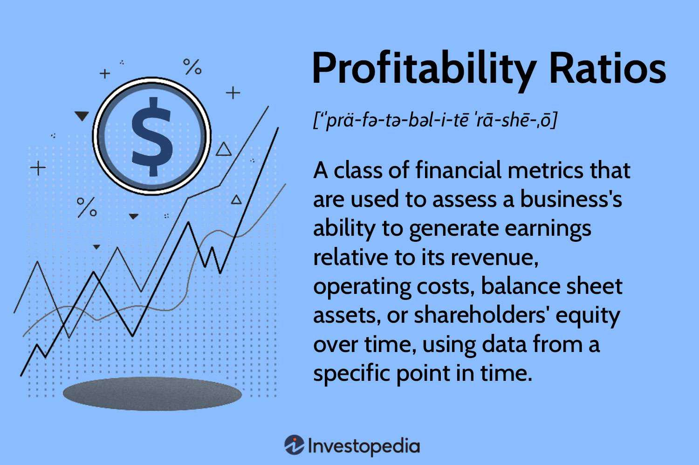

Understanding profit margins and financial performance is essential for assessing business profitability, especially in the dynamic world of algorithmic trading. Algorithmic trading, or algo trading, is a technology-driven trading strategy that uses computer algorithms to execute trades based on predetermined criteria. This strategy relies heavily on precise data analysis and high-frequency trading to achieve optimal profitability. In this context, business success hinges on effectively analyzing and managing financial indicators such as profit margins and financial metrics.

Profit margins, including gross, operating, and net profit margins, are fundamental indicators of a company's efficiency in converting revenue into profit after accounting for expenses. Maintaining healthy profit margins is critical in algo trading due to its high transaction volumes and the fast-paced environment. The gross profit margin measures the difference between revenue and the cost of goods sold, while the operating profit margin accounts for all operating expenses. The net profit margin further deducts taxes and interest, offering a comprehensive view of overall profitability.



Financial metrics such as return on investment (ROI), return on equity (ROE), and earnings before interest and taxes (EBIT) are also pivotal. These metrics provide invaluable insights into a business's economic health and are critical in making swift, data-driven decisions in algo trading. Proper assessment and optimization of these financial indicators can enhance a business's strategic focus and contribute to superior trading outcomes.

This article will explore how businesses can leverage financial performance metrics and profit margins to optimize their algo trading strategies and improve overall profitability. We will examine the influence of these metrics on business success and the role of advanced trading algorithms in achieving competitive advantages. By integrating financial metrics with cutting-edge trading technologies, businesses can enhance their profitability, drive innovation, and sustain growth in an ever-evolving market.

## Table of Contents

## Understanding Profit Margins in Business

Profit margins are a fundamental measure of a company's ability to transform revenue into profits, providing a critical indicator of both profitability and operational efficiency. These metrics illuminate how effectively a business manages its expenses relative to its income. Key profit margins include gross profit margin, operating profit margin, and net profit margin, each offering unique insights into various stages of financial performance.

The gross profit margin is calculated by subtracting the cost of goods sold (COGS) from total revenue and dividing the result by total revenue. It gauges the efficiency of production and pricing strategies.

$$
\text{Gross Profit Margin} = \frac{\text{Revenue} - \text{COGS}}{\text{Revenue}}
$$

The operating profit margin assesses profitability after accounting for administrative and selling expenses. It evaluates operational efficiency excluding non-operational incomes, expenses, interest, and taxes.

$$
\text{Operating Profit Margin} = \frac{\text{Operating Income}}{\text{Revenue}}
$$

The net profit margin is a comprehensive measure showcasing a company's overall ability to convert revenue into profit after taxes and all expenses.

$$
\text{Net Profit Margin} = \frac{\text{Net Income}}{\text{Revenue}}
$$

Understanding these metrics enables businesses to pinpoint strengths, such as cost control or pricing strategies, and identify potential improvement areas, like reducing overhead costs.

In [algorithmic trading](/wiki/algorithmic-trading), maintaining robust profit margins is particularly critical due to substantial transaction volumes and the high-speed nature of trading activities. Algo trading platforms must efficiently manage transaction costs and execution speeds to protect margins. By optimizing algorithms for lower latency and minimal slippage, traders can enhance the profitability of high-frequency trades.

This focus on maintaining healthy profit margins supports sustainable growth and competitive advantage in the fast-paced environment of trading.

## The Role of Financial Performance Metrics

Financial performance metrics are essential tools for evaluating a business's economic health, offering crucial insights into how effectively a company utilizes its resources to generate profits. In the domain of algorithmic trading, such metrics become even more critical, given the fast-paced nature of trading and the necessity for rapid decision-making that can impact profitability.

Commonly used metrics in financial analysis include Return on Investment (ROI), Return on Equity (ROE), and Earnings Before Interest and Taxes (EBIT). Each of these serves a unique purpose:

1. **Return on Investment (ROI)**:
$$
   \text{ROI} = \left( \frac{\text{Net Profit}}{\text{Cost of Investment}} \right) \times 100

$$
   ROI provides a measure of the profitability of an investment, allowing businesses to evaluate the efficiency of different investment choices. In algorithmic trading, managing ROI can help traders assess the success of trading strategies and allocate capital more effectively.

2. **Return on Equity (ROE)**:
$$
   \text{ROE} = \frac{\text{Net Income}}{\text{Shareholder's Equity}}

$$
   ROE indicates how well a company is using shareholders' funds to generate profits. For firms engaged in algo trading, a strong ROE signifies efficient use of equity, which can derive from strategic trading execution and effective risk management.

3. **Earnings Before Interest and Taxes (EBIT)**:
$$
   \text{EBIT} = \text{Revenue} - \text{Operating Expenses}

$$
   EBIT measures a company's profitability from operations, excluding the costs of capital and tax expenses. In the context of algo trading, maintaining a healthy EBIT is a sign of operational efficiency in executing trades without excessive costs undermining profits.

The ability to analyze these indicators empowers businesses to make informed decisions about capital allocation and strategic adjustments. In algo trading, decisions need to be swift and data-driven. These metrics allow traders to evaluate the effectiveness of their algorithms not only in terms of profitability but also in cost efficiency and risk management.

When integrated with algorithmic trading strategies, financial performance metrics can result in enhanced precision and profitability. Automated trading systems can incorporate metrics into their programming, allowing them to adapt strategies dynamically based on performance data. This integration strengthens trading systems by aligning them more closely with financial goals, thus promoting efficient strategy execution.

Overall, financial performance metrics provide a structured approach to assess and improve business strategies in algo trading. By leveraging these metrics, traders and businesses can refine their operations, maximizing returns while minimizing risks and costs. This comprehensive understanding of financial health enables stakeholders to navigate the competitive landscape of algorithmic trading successfully.

## Interconnection between Profit Margins and Algo Trading

Algorithmic trading, or algo trading, fundamentally relies on real-time data analysis to enhance decision-making and optimize profit margins. By executing trades based on pre-defined strategies and algorithms, traders can efficiently assess and act on market fluctuations to maximize their profitability.

Accurate assessment of profit margins is critical in determining strategic entry and [exit](/wiki/exit-strategy) points for trades. Profit margins, defined as the ratio of profits to sales, are essential in evaluating whether a trade aligns with a trader's financial goals. In algo trading, this assessment becomes even more critical due to the speed and [volume](/wiki/volume-trading-strategy) of transactions. Algorithms can be designed to calculate expected profit margins in real-time, allowing traders to execute trades only when profitable thresholds are met or exceeded. For example, an algorithm may be set to trigger a buy order when the potential profit margin reaches a specified percentage, thus ensuring that decisions are both timely and financially sound.

Algo trading systems also offer the flexibility to optimize trading strategies dynamically. By programming systems to adapt to different market conditions, traders can adjust their strategies based on desired profit margin thresholds. This approach allows for a proactive trading stance, where systems continuously learn and recalibrate their actions to maintain or exceed target profit margins. This adaptability is crucial, given the rapid shifts typical of financial markets.

The integration of financial performance data significantly enhances the predictive accuracy of algorithmic models. By utilizing metrics such as Return on Investment (ROI) and historical data trends, algorithms can improve their forecasts regarding market movements. This integration allows for more informed trading decisions, aligning trades with financial performance targets and overall strategic objectives.

Effective management of profit margins in algo trading is vital to mitigate risks and seize market opportunities. By continuously monitoring margins and adjusting strategies as needed, traders can balance potential profits against associated risks, thereby ensuring sustainable profitability. Algorithms can be tailored to incorporate risk management tools, such as stop-loss and take-profit orders, to protect against adverse market movements while still capitalizing on lucrative opportunities.

Overall, the strategic interplay between profit margins and algo trading underscores the importance of data-driven decision-making. By leveraging sophisticated algorithms and real-time financial data, traders can optimize their trading strategies to maintain favorable profit margins, ensuring they stay competitive in the fast-paced trading environment.

## Enhancing Business Profitability through Algo Trading

Algorithmic trading, or algo trading, enhances business profitability by leveraging technology to optimize trading strategies. One of the primary advantages of algo trading is the increased speed and accuracy in executing trades. Algorithms can process vast amounts of market data in milliseconds, allowing traders to respond to market changes almost instantaneously. This rapid execution minimizes the risk of slippage (the difference between the expected price of a trade and the actual price at which the trade is executed) and ensures trades are conducted at the most favorable prices.

Another significant advantage of algo trading is its ability to automate trades, reducing human error and transaction costs. Automation eliminates emotional decision-making, leading to more consistent and objective trading outcomes. It also facilitates high-frequency trading, where large volumes of trades are executed at very high speeds, which is typically unmanageable for human traders.

Advanced algorithms can identify and exploit market inefficiencies, such as [arbitrage](/wiki/arbitrage) opportunities, that human traders might overlook. For example, they can simultaneously buy and sell an asset across different markets to capitalize on price discrepancies—a process that demands both speed and accuracy to be profitable. To exploit such opportunities effectively, algorithms can use historical data to forecast future price movements by employing statistical methods or [machine learning](/wiki/machine-learning) models.

Moreover, enhancing algo trading capabilities gives businesses a competitive advantage. By developing and implementing sophisticated trading algorithms, businesses can operate more efficiently and capture larger market share. These algorithms are often designed to adapt to changing market conditions, ensuring that strategies remain effective over time.

Developing robust algorithms and leveraging data analytics are crucial for maximizing business profitability. The following Python code snippet provides a simple example of how data analytics can be used to identify trading signals based on moving averages:

```python
import pandas as pd

def moving_average_strategy(data, short_window, long_window):
    signals = pd.DataFrame(index=data.index)
    signals['price'] = data['price']
    signals['short_mavg'] = data['price'].rolling(window=short_window, min_periods=1, center=False).mean()
    signals['long_mavg'] = data['price'].rolling(window=long_window, min_periods=1, center=False).mean()
    signals['signal'] = 0.0

    # Generate trading signals
    signals['signal'][short_window:] = np.where(signals['short_mavg'][short_window:] 
                                                > signals['long_mavg'][short_window:], 1.0, 0.0)   
    # Generate trading orders
    signals['positions'] = signals['signal'].diff()

    return signals

# Example usage
data = pd.DataFrame({'price': [10, 11, 12, 13, 12, 11, 12, 13, 14, 15]})
signals = moving_average_strategy(data, short_window=2, long_window=4)
print(signals)
```

This script calculates short and long-term moving averages for a given price data set and generates buy/sell signals—1.0 indicates a buy, and 0.0 indicates a sell. Businesses can build upon such basic strategies using more complex models and algorithms, optimizing them for different asset classes or market conditions.

In summary, algo trading not only boosts profitability through speed and accuracy but also offers the potential for substantial competitive advantages in the trading landscape. By investing in robust algorithm development and data analytics, businesses can ensure they are well-positioned to capitalize on market opportunities.

## Conclusion

In conclusion, understanding and optimizing profit margins and financial performance is crucial for ensuring business success, especially in the context of algorithmic trading. By effectively integrating financial metrics with advanced trading algorithms, businesses have the opportunity to enhance their profitability significantly. This integration facilitates precise decision-making, enabling the identification of lucrative trading opportunities and optimal execution strategies.

Maintaining a strategic focus on profit margins and financial performance metrics is an imperative practice that ensures sustainable growth and provides a competitive edge in the fast-paced trading environment. As trading platforms become increasingly sophisticated, cultivating robust algorithmic strategies and adapting to new market conditions will be essential for success.

Businesses should prioritize innovation and leverage the latest technology to maintain a leading position in the competitive trading landscape. The continuously evolving nature of financial markets demands that businesses remain informed and adaptive to maximize profit margins and overall financial performance. By doing so, they can effectively mitigate risks, capitalize on opportunities, and sustain their profitability in an ever-changing market.

## References & Further Reading

[1]: Bergstra, J., Bardenet, R., Bengio, Y., & Kégl, B. (2011). ["Algorithms for Hyper-Parameter Optimization."](https://papers.nips.cc/paper/4443-algorithms-for-hyper-parameter-optimization) Advances in Neural Information Processing Systems 24.

[2]: ["Advances in Financial Machine Learning"](https://www.amazon.com/Advances-Financial-Machine-Learning-Marcos/dp/1119482089) by Marcos Lopez de Prado

[3]: ["Evidence-Based Technical Analysis: Applying the Scientific Method and Statistical Inference to Trading Signals"](https://www.amazon.com/Evidence-Based-Technical-Analysis-Scientific-Statistical/dp/0470008741) by David Aronson

[4]: ["Machine Learning for Algorithmic Trading"](https://github.com/stefan-jansen/machine-learning-for-trading) by Stefan Jansen

[5]: ["Quantitative Trading: How to Build Your Own Algorithmic Trading Business"](https://www.amazon.com/Quantitative-Trading-Build-Algorithmic-Business/dp/1119800064) by Ernest P. Chan