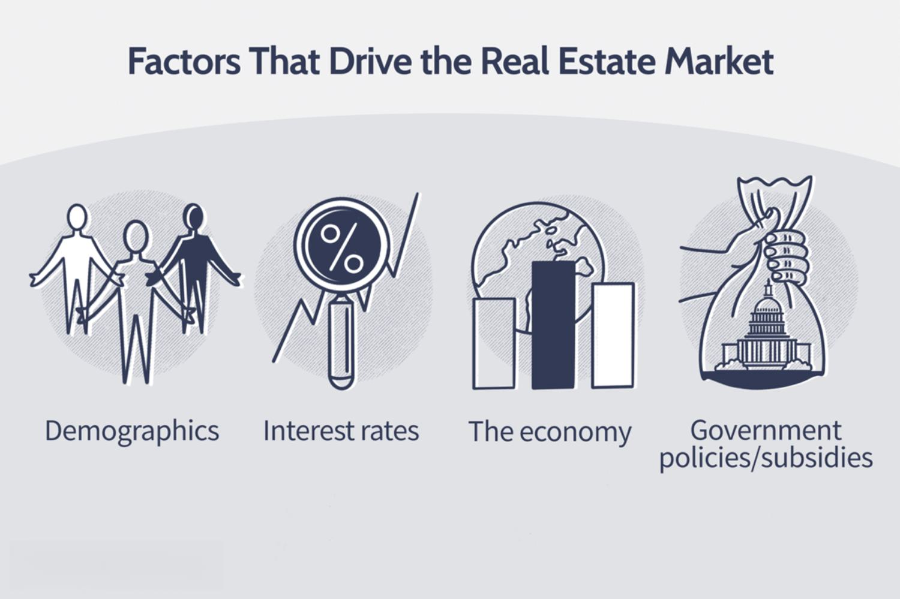

## Table of Contents

## What is the real estate market?

The real estate market is where people buy, sell, and rent properties like homes, apartments, and land. It's like a big store where instead of buying things like clothes or food, people buy places to live or use for business. The price of properties in this market can go up or down based on many things, like how many people want to buy and how many properties are available.

In the real estate market, different areas can have very different prices. For example, a house in a busy city might cost a lot more than a similar house in a small town. People who work in the real estate market, like real estate agents, help buyers and sellers make deals. They know a lot about what's happening in different areas and can help people find the right property at the right price.

## How does the economy affect real estate prices?

The economy plays a big role in deciding how much houses and other properties cost. When the economy is doing well, people have more money and feel confident about spending it. This means more people want to buy homes, which can make prices go up. Also, when people have jobs and good incomes, banks are more likely to give them loans to buy houses, which can push prices even higher.

On the other hand, when the economy is not doing so well, people might be worried about their jobs and money. They might not want to buy a house because they're not sure if they can afford it. This can make fewer people want to buy, which can cause prices to go down. Also, if a lot of people lose their jobs, they might have to sell their homes quickly, which can add more houses to the market and make prices drop even more.

## What role do interest rates play in the real estate market?

Interest rates are really important in the real estate market. They decide how much it costs to borrow money to buy a house. When interest rates are low, it's cheaper to get a loan. This makes more people want to buy houses because they can afford to pay back the loan. So, when interest rates go down, it often makes house prices go up because more people are trying to buy.

On the other hand, when interest rates are high, it costs more to borrow money. This can make people think twice about buying a house because the loan payments will be higher. Fewer people wanting to buy can make house prices go down. So, interest rates can really change how many people are buying and selling houses, and that affects the whole real estate market.

## How does population growth influence real estate demand?

When more people live in an area, it means more people need homes. This is called population growth. When the population grows, there are more people looking to buy or rent houses, apartments, or land. This increased demand can make real estate prices go up because there are more buyers than there are homes available.

Population growth doesn't happen the same way everywhere. Some places grow faster than others. Cities often see a lot of population growth because people move there for jobs or better opportunities. When a city's population grows quickly, it can lead to a big increase in demand for housing, making prices rise even more in those areas. On the other hand, if a place doesn't grow much, the demand for housing might stay the same or even go down, which can keep prices stable or lower them.

## What impact does employment have on the real estate market?

Employment is a big deal when it comes to the real estate market. When lots of people have jobs, they feel good about their money and are more likely to buy houses. This is because they know they can pay the bills every month. More people buying homes can make prices go up because there's more competition to buy the houses that are for sale.

On the flip side, if a lot of people lose their jobs, it can hurt the real estate market. People without jobs might not be able to pay their mortgages, so they might have to sell their homes quickly. This can mean more houses are for sale, which can make prices go down. Also, when people are worried about losing their jobs, they might wait to buy a house, which can slow down the whole market.

## How do government policies and regulations affect real estate?

Government policies and rules can really change how the real estate market works. When the government makes new rules about building homes or how much money banks can lend for buying houses, it can affect how many homes get built and how easy it is for people to buy them. For example, if the government says builders have to follow strict rules to protect the environment, it might slow down how fast new homes get built. This can make the price of homes go up because there are fewer homes for people to buy.

Also, the government can give tax breaks or other help to people buying homes, which can make more people want to buy. This can push house prices up because more people are trying to buy the same number of homes. On the other hand, if the government makes it harder to get a loan by setting tight rules for banks, fewer people might be able to buy homes. This can make house prices go down because fewer people are buying. So, what the government does can really shake up the real estate market in big ways.

## What is the effect of location on property values?

Location is a big deal when it comes to how much a house or property is worth. If a house is in a busy city, close to good schools, shops, and jobs, it usually costs more. People want to live in these places because they are convenient and offer a lot of what people need every day. On the other hand, a house in a quiet, rural area might cost less because it's farther away from these things. But, some people like the peace and quiet of the countryside, so these places can still be valuable, just in a different way.

Another thing about location is how safe the area is and what the neighborhood is like. If a place is known for being safe and having friendly neighbors, people will want to live there more, which can make property prices go up. Also, if a neighborhood is getting better, with new shops and parks being built, the value of homes there can increase because it becomes a nicer place to live. So, location is not just about where a house is, but also about what's around it and how it's changing.

## How do demographic trends influence the real estate market?

Demographic trends are about how groups of people change over time. These changes can really affect the real estate market. For example, if more young people are moving into an area, they might want smaller homes or apartments because they're just starting out. This can make the demand for these types of homes go up, which can raise their prices. On the other hand, if an area has a lot of older people, they might want homes that are easier to live in, like ones with fewer stairs. This can make the demand for these types of homes go up.

Another important demographic trend is families growing or shrinking. If more families are having kids, they might need bigger homes with more space. This can make the demand for bigger homes go up, which can make their prices rise. But if families are getting smaller, they might not need as much space, so they might look for smaller homes or apartments. This can make the demand for smaller homes go up and can affect the prices of different types of properties in different ways.

## What role do technological advancements play in real estate?

Technology has changed a lot about how we buy and sell houses. Now, people can look at houses online without leaving their homes. Websites and apps show pictures and videos of houses, and you can even take a virtual tour. This makes it easier for people to see a lot of houses quickly and from anywhere. Also, technology helps real estate agents work better. They use special computer programs to keep track of all the houses they're selling and to talk to buyers and sellers more easily.

Another big thing technology does is help with smart homes. These are houses that have special gadgets like lights and thermostats you can control with your phone. People like these houses because they make life easier and can save money on things like electricity. Also, technology helps builders make houses faster and better. They use things like 3D printers to build parts of houses, which can make building cheaper and quicker. So, technology is changing how we buy, sell, and live in houses in a lot of cool ways.

## How do global economic conditions impact local real estate markets?

Global economic conditions can really shake up local real estate markets. When the world's economy is doing well, it can make people feel more confident about spending money. This can lead to more people wanting to buy houses, which can make prices go up in local areas. For example, if a country's economy is growing because it's selling a lot of stuff to other countries, people in that country might feel richer and more likely to buy homes. Also, if a lot of people from other countries want to move to a certain place, like for jobs or to retire, this can make the demand for houses in that local area go up and push prices higher.

On the other hand, if the world's economy is struggling, it can make local real estate markets suffer too. When there's a big economic problem, like a global financial crisis, people might lose their jobs or feel less sure about spending money. This can make fewer people want to buy houses, which can cause prices to go down in local areas. For instance, if a country's main way of making money, like selling oil, is not doing well because of low prices around the world, people in that country might not have as much money to buy homes. This can make the local real estate market slow down and prices drop.

## What are the effects of supply and demand dynamics in real estate?

Supply and demand are big forces in the real estate market. When there are a lot of people who want to buy houses but not many houses for sale, it's called high demand and low supply. This makes house prices go up because everyone is trying to buy the same few houses. For example, if a new job brings a lot of people to a town but not many new houses are built, the price of houses in that town can go up a lot. On the other hand, if there are a lot of houses for sale but not many people wanting to buy them, it's called low demand and high supply. This can make house prices go down because sellers might have to lower their prices to get someone to buy their house.

These dynamics can change over time and depend on a lot of things. For example, if the economy is doing well, more people might want to buy houses, which can push prices up. But if the economy is struggling, fewer people might want to buy, which can make prices go down. Also, if builders start making a lot of new houses, this can increase the supply and might make prices go down if the demand stays the same. So, keeping an eye on how many houses are for sale and how many people want to buy them is important for understanding what's happening in the real estate market.

## How can investors predict and capitalize on real estate market trends?

Investors can predict real estate market trends by looking at a lot of different things. They pay attention to the economy, like how many people have jobs and how much money they're making. They also watch interest rates because lower rates can make more people want to buy houses. Another thing they look at is population growth in different areas, because more people usually means more demand for houses. Investors also keep an eye on government rules and new building projects, because these can change how many houses are available. By putting all this information together, investors can guess where house prices might go up or down.

Once investors have a good idea of where the market is heading, they can make smart choices about where to put their money. If they think house prices will go up in a certain area, they might buy houses there to sell later for a profit. Or, if they think prices will go down, they might wait to buy until prices are lower. Investors can also look for places where new jobs are coming or where the population is growing fast, because these areas might see a big increase in demand for houses. By understanding and acting on these trends, investors can make money in the real estate market.

## What are the key market factors in property investment?

Understanding key market factors is crucial for making informed decisions in property investment. These factors include demographics, interest rates, economic health, and government policies, each having a significant impact on the real estate market.

### Demographics

Demographics refer to the statistical characteristics of a population, such as age, gender, income, and migration patterns. Population trends strongly influence property demand. For instance, an aging population may increase demand for smaller homes or senior living facilities. Similarly, urbanization trends can lead to higher demand for housing in cities. Analyzing demographic data allows investors to anticipate changes in property demand and adjust their strategies accordingly. Data sources like government census reports and surveys provide valuable insights into these trends.

### Interest Rates

Interest rates directly affect property values and investment decisions. When interest rates are low, borrowing costs decrease, making mortgages more affordable and increasing demand for properties. Conversely, high interest rates can lead to reduced affordability and decreased housing demand. The relationship between interest rates and property values can be understood through the present value formula. For example, the present value $PV$ of a future cash flow $CF$ discounted at rate $r$ over $n$ periods is given by:

$$
PV = \frac{CF}{(1 + r)^n}
$$

Investors closely monitor [interest rate](/wiki/interest-rate-trading-strategies) changes to assess their investment's potential returns and risks.

### Economic Health

The real estate market is sensitive to the overall economic health, influenced by economic indicators like GDP, employment rates, and inflation. A robust economy typically results in higher employment levels and disposable income, increasing the demand for residential and commercial properties. Conversely, during economic downturns, property demand and prices may fall. Real-time economic data can be obtained from sources such as the Bureau of Economic Analysis and National Statistics Offices, helping investors respond to economic shifts.

### Government Policies

Government policies, including zoning laws, tax incentives, and subsidies, significantly influence real estate market dynamics. For example, favorable tax treatments for homebuyers can boost property sales, while strict zoning laws can limit housing supply, driving up prices. Policies aimed at affordable housing can open new investment opportunities in specific segments. Understanding regulations and potential policy changes are vital for strategic investment planning. Information about policies is typically accessible through government websites and legal publications.

By understanding these market factors, property investors can make informed decisions, anticipating changes and adjusting their strategies to optimize returns.

## References & Further Reading

[1]: Bergstra, J., Bardenet, R., Bengio, Y., & Kégl, B. (2011). ["Algorithms for Hyper-Parameter Optimization."](https://papers.nips.cc/paper/4443-algorithms-for-hyper-parameter-optimization) Advances in Neural Information Processing Systems 24.

[2]: ["Advances in Financial Machine Learning"](https://www.amazon.com/Advances-Financial-Machine-Learning-Marcos/dp/1119482089) by Marcos Lopez de Prado

[3]: ["Evidence-Based Technical Analysis: Applying the Scientific Method and Statistical Inference to Trading Signals"](https://www.amazon.com/Evidence-Based-Technical-Analysis-Scientific-Statistical/dp/0470008741) by David Aronson

[4]: ["Machine Learning for Algorithmic Trading"](https://github.com/stefan-jansen/machine-learning-for-trading) by Stefan Jansen

[5]: ["Quantitative Trading: How to Build Your Own Algorithmic Trading Business"](https://www.amazon.com/Quantitative-Trading-Build-Algorithmic-Business/dp/1119800064) by Ernest P. Chan