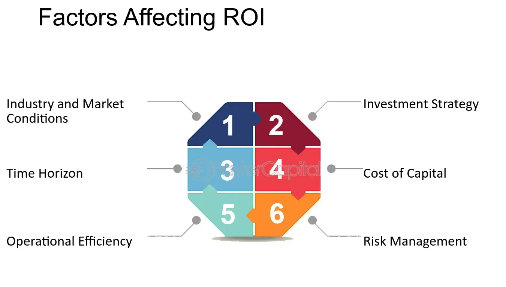

## Table of Contents

## What is Social Return on Investment (SROI)?

Social Return on Investment (SROI) is a way to measure the value of the good things that happen because of a project or program, not just in money but in other important ways too. It helps organizations understand how much positive change they are making in people's lives, communities, and the environment. SROI looks at things like better health, more jobs, or a cleaner environment and tries to put a value on these changes, even though they are not usually counted in dollars and cents.

To figure out SROI, you start by collecting information about all the positive and negative effects of a project. Then, you try to put a value on these effects. This can be tricky because many of the good things, like feeling happier or safer, are hard to measure. But by trying to put a number on these benefits, organizations can see if their efforts are worth it and where they might need to make changes to do even better. This helps them make smarter decisions about where to put their time and money.

## Why is SROI important in social impact measurement?

SROI is important in social impact measurement because it helps organizations see the full picture of the good they are doing. It's not just about how much money is made or saved, but about the real changes in people's lives, like better health, more jobs, or cleaner neighborhoods. By looking at these changes, organizations can understand if their projects are really helping and making a difference.

Using SROI also helps organizations make better choices about where to spend their time and money. If they can see that one project is bringing a lot of good changes but another isn't, they can decide to put more effort into the one that's working better. This way, they can do more good with the resources they have. Plus, showing SROI can help them get more support from others who want to see that their help is making a real difference.

## What are the basic factors that influence SROI?

The basic factors that influence SROI include the outcomes of a project, how long those outcomes last, and how much those outcomes are worth. Outcomes are the good things that happen because of the project, like people getting jobs or feeling healthier. How long these good things last is important because if they last a long time, the SROI will be higher. The worth of the outcomes is tricky because it's hard to put a number on things like feeling happier or safer, but it's important to try.

Another [factor](/wiki/factor-investing) is the cost of the project. This includes all the money and time spent to make the project happen. If a project costs a lot but doesn't make much good change, the SROI will be low. On the other hand, if a project costs less but makes a big difference, the SROI will be high. It's all about balancing the costs with the good things that come out of the project.

Lastly, the way the project is run can affect SROI. This includes things like how well the project is planned, how it's managed, and how well it reaches the people it's meant to help. If a project is run well, it's more likely to have a high SROI because it will be more effective at creating good changes. If it's not run well, it might not make as much of a difference, and the SROI will be lower.

## How does the quality of data collection affect SROI?

The quality of data collection is really important for figuring out SROI. If the data is good, it means the numbers and stories about the good things that happen because of a project are correct and complete. This helps make sure the SROI calculation is right. Good data collection means asking the right questions, talking to the right people, and keeping track of everything carefully. When the data is good, it's easier to see if the project is making a real difference and if it's worth the time and money spent on it.

If the data collection is not good, it can mess up the SROI. Bad data might miss some important good things that happen or include things that aren't really because of the project. This can make the SROI look too high or too low. For example, if the data doesn't show all the people who got jobs because of the project, the SROI might seem lower than it really is. So, it's important to collect data carefully and check it to make sure it's telling the whole story about the project's impact.

## What role does stakeholder engagement play in determining SROI?

Stakeholder engagement is really important for figuring out SROI. Stakeholders are the people who care about the project, like the people it helps, the people who run it, and the people who pay for it. When you talk to these people, you learn more about what good things are happening because of the project. They can tell you about changes in their lives, like feeling healthier or getting a job. By listening to them, you get a better picture of all the good things the project is doing, which helps you measure the SROI more accurately.

Engaging with stakeholders also helps make sure you don't miss any important information. Sometimes, the good things that happen are hard to see if you're not close to the people affected. By involving stakeholders, you can find out about changes that might not show up in numbers or reports. This makes your SROI calculation more complete and fair. Plus, when stakeholders feel like they are part of the process, they are more likely to support the project and help make it even better.

## How can economic factors impact the calculation of SROI?

Economic factors can change how we figure out SROI. For example, if the economy is doing well, it might be easier for people to find jobs because of a project. This means the good things from the project, like more jobs, might be worth more money. But if the economy is not doing well, it might be harder for people to find jobs, so the good things from the project might not seem as valuable. Also, the cost of running a project can go up or down because of the economy. If things cost more, the SROI might look lower because the project costs more to run.

Another way economic factors can affect SROI is by changing how much people value things. If money is tight, people might care more about things like getting a job or saving money. This can make the good things from a project seem more important. But if people have more money, they might care more about things like feeling happier or having a cleaner environment. This can change how we put a value on the good things from the project. So, it's important to think about the economy when figuring out SROI, because it can change both the costs and the value of the good things that happen.

## What are the challenges in quantifying social outcomes for SROI?

One big challenge in figuring out SROI is that some good things that happen because of a project are hard to count. For example, how do you put a number on feeling happier or safer? These things are important, but they don't have a price tag like a job or a new house. So, we have to guess how much these things are worth, and that can be tricky. If we guess wrong, the SROI might not show the real value of the project.

Another challenge is making sure we don't miss any important good things. Sometimes, the good things that happen are not easy to see, especially if they happen over a long time or in ways that are hard to measure. We might need to talk to a lot of people and look at a lot of information to make sure we catch everything. If we miss something, the SROI might look lower than it really is, and we might not see how much good the project is really doing.

## How does the choice of valuation techniques influence SROI?

The way we choose to put a value on the good things that happen because of a project can change the SROI a lot. Different ways of figuring out value can give us different numbers, and this can make the SROI look higher or lower. For example, if we use money to measure how much a job is worth, we might look at how much the person earns. But if we use happiness or well-being to measure it, we might ask people how much better their life feels because of the job. These two ways can give us very different numbers, and that can change the SROI.

Choosing the right way to value things is important because it helps make sure the SROI shows the real good the project is doing. If we pick a way that doesn't fit well with what the project is trying to do, we might miss some important good things or make them seem less important than they are. For example, if a project is all about making people feel safer in their neighborhood, using money to measure this might not show how much safer they really feel. So, we need to think carefully about which way to value things fits best with the project's goals and the good things it's trying to achieve.

## What advanced methodologies can be used to enhance SROI analysis?

One way to make SROI analysis better is by using something called "theory of change." This is a way to map out how a project leads to good things happening. It helps us see all the steps from starting the project to the final good things, like people getting jobs or feeling healthier. By using this, we can make sure we don't miss any important good things and that we understand how the project works. This can make our SROI numbers more accurate and help us see if the project is really making a difference.

Another way is by using "counterfactual analysis." This means we try to guess what would have happened if the project didn't exist. By comparing what actually happened with what might have happened without the project, we can see how much of the good things are really because of the project. This can help us be more sure that the good things we're counting are really from the project and not from something else. It makes our SROI more trustworthy and helps us see the true impact of what we're doing.

Lastly, we can use "multi-criteria analysis" to look at different kinds of good things at the same time. This means we don't just look at one thing, like jobs, but we also look at other important things, like health or the environment. By considering all these different good things together, we can get a fuller picture of the project's impact. This can help us see if the project is doing well in lots of different ways, not just one, and make our SROI calculation more complete and fair.

## How does the time frame of analysis affect the SROI results?

The time frame we choose for looking at SROI can change the results a lot. If we look at the good things that happen right away, like people getting jobs or feeling healthier, the SROI might look pretty good. But if we only look at a short time, we might miss out on good things that take longer to happen, like people keeping their jobs for a long time or neighborhoods getting cleaner over many years. So, a short time frame might make the SROI seem lower than it really is because it doesn't show all the good things that happen over time.

On the other hand, if we choose a longer time frame, we can see more of the good things that happen because of the project. This can make the SROI look higher because we're counting all the good changes that happen over many years. But we also need to think about if the good things will last that long. Sometimes, the good things might not last as long as we think, and that can make the SROI seem too high. So, [picking](/wiki/asset-class-picking) the right time frame is important to make sure the SROI shows the real value of the project.

## What are the best practices for maximizing SROI in social programs?

To make SROI as high as possible in social programs, it's important to start by really understanding what the program is trying to do and who it's trying to help. Talk to the people who will be affected by the program and find out what they need and what they think is important. This helps make sure the program is aimed at the right things and can really make a difference. Also, keep an eye on how much the program costs and try to find ways to do things more cheaply without losing the good things the program is doing. This means spending money wisely and making sure every dollar goes as far as it can.

Another important thing is to keep track of the good things that happen because of the program. Collect good data and use it to see if the program is working well. If something isn't working, be ready to change it to make it better. Also, think about the long-term effects of the program, not just what happens right away. Good things that last a long time can make the SROI much higher. By focusing on these things and always trying to do better, social programs can have a bigger impact and show a higher SROI.

## How can organizations integrate SROI into their strategic decision-making processes?

Organizations can integrate SROI into their strategic decision-making by making it a part of how they plan and check on their projects. When they are deciding what projects to start or how to spend their money, they can use SROI to see which projects will bring the most good changes. By looking at the SROI, they can choose projects that not only help people but also make the best use of their resources. They can also use SROI to set goals for their projects and check if they are meeting those goals. This helps them make sure their projects are doing what they are supposed to do and making a real difference.

To keep using SROI in their decisions, organizations need to make it a regular part of how they work. They can do this by training their staff to understand SROI and how to measure it. They can also set up a system to collect good data about their projects and use this data to figure out the SROI. By doing this regularly, they can keep an eye on how well their projects are doing and make changes if needed. This way, SROI becomes a tool that helps them make smart decisions and do more good with what they have.

## What is the understanding of Social Return on Investment (SROI)?

Social Return on Investment (SROI) is a framework for measuring and accounting for a broad concept of value. It seeks to identify and quantify the social, environmental, and economic value created by an investment, which are often excluded from traditional financial statements. This measurement technique enables investors and organizations to understand the broader impact of their activities beyond financial returns.

**Factors Involved in Calculating SROI**

The calculation of SROI involves several key components:

1. **Social Impact Value**: This represents the quantifiable social benefits an investment generates. It involves identifying the outcomes for stakeholders and assigning monetary values to those outcomes. This can be challenging since assigning monetary values to social impacts often requires assumptions and approximations. Absolute precision is difficult, but it is crucial to ground valuations in realistic and justifiable estimates.

2. **Initial Investment Amount**: This refers to the financial input or original capital put into a project or initiative. It forms the baseline against which social returns are compared. Calculating SROI typically involves comparing the net social impact to this initial investment.

The SROI is expressed as a ratio, calculated by dividing the total value of the benefits by the value of the investment. The formula for calculating SROI is:

$$
\text{SROI Ratio} = \frac{\text{Total Present Value (PV) of Benefits}}{\text{Value of Inputs}}
$$

Where:
- Total Present Value (PV) of Benefits is the sum of the discounted values of social benefits over time.
- Value of Inputs corresponds to the initial investment adjusted if needed for additional funding or costs over time.

**Example to Illustrate SROI**

Consider a nonprofit organization that invests $100,000 in a community program aimed at reducing local unemployment. Through this program, beneficiaries experience improved employability, securing jobs that result in a combined increase in income equivalent to $500,000 over five years. After thorough analysis, it is decided that 80% ($400,000) of this increased income can be attributed to the program.

To calculate the SROI:

- Identify the total value of social impacts: $400,000 (80% of $500,000).
- Initial investment amount: $100,000

Using the SROI formula:

$$
\text{SROI Ratio} = \frac{400,000}{100,000} = 4
$$

This ratio indicates that for every dollar invested, the program generates an equivalent of four dollars in social impact. This example illustrates how SROI provides a valuable lens for evaluating the social benefits of investments relative to their financial costs, promoting a more comprehensive understanding of an investment's value to society.

## How can SROI and Algorithmic Trading be used in a synergistic approach?

Social Return on Investment (SROI) metrics provide a comprehensive framework for evaluating the social impact of investments. When integrated with [algorithmic trading](/wiki/algorithmic-trading) strategies, these metrics can guide financial decisions that align with both economic returns and social responsibility. Algorithmic trading, characterized by the use of predefined rules and algorithms in executing trades, can significantly benefit from incorporating SROI metrics. By embedding social impact measurements into algorithms, investors can more effectively direct capital towards ventures that yield measurable social benefits alongside financial profits.

Aligning financial returns with social impact goals is increasingly recognized as beneficial not only for ethical reasons but also for enhancing long-term financial performance. SROI metrics offer a quantifiable approach to assess such impacts, facilitating the creation of algorithmic models that prioritize investments with higher social returns. This blending of objectives often leads to a more diversified portfolio that appeals to socially conscious investors and enhances brand reputation.

Consider a scenario where an algorithm evaluates potential investments based on traditional financial indicators and a calculated SROI ratio. The SROI ratio, defined as:

$$

\text{SROI Ratio} = \frac{\text{Total Present Value of Social Benefits}}{\text{Initial Investment Cost}} 
$$

can be used to rank investments according to both their financial return potential and their social impact value. This dual evaluation process aids in selecting investments that contribute positively to society, thus attracting interest from investors keen on sustainable practices.

Successful implementations of this approach can be observed in investment firms that have adopted Environmental, Social, and Governance ([ESG](/wiki/esg-investing)) criteria within their trading algorithms. These firms apply SROI as part of their decision-making process, allowing algorithms to filter through and select equities that meet specific social and financial criteria. The resulting portfolios not only deliver competitive financial returns but also increase positive social outcomes, as reflected in improved community engagement and environmental conservation efforts.

For instance, an investment fund that incorporates an algorithm emphasizing both high SROI and financial performance could allocate resources more effectively to renewable energy projects or social enterprises. Analyzing historical case studies, such as the integration of SROI metrics in investment strategies by Triodos Bank, reveals enhanced client satisfaction and sustained financial growth. Such examples underscore the feasibility and advantages of crafting investment strategies guided by SROI-infused algorithms.

Integrating SROI metrics into algorithmic trading frameworks presents a promising synergistic approach that aligns profit motives with societal benefits. As financial markets increasingly value socially responsible investments, leveraging SROI within algorithmic strategies will likely become a prevalent practice, encouraging broader adoption in pursuit of sustainable investing goals.

## References & Further Reading

[1]: Arvidson, M., Lyon, F., McKay, S., & Moro, D. (2013). ["Valuing the social? The nature and controversies of measuring Social Return on Investment (SROI)."](https://portal.research.lu.se/en/publications/valuing-the-social-the-nature-and-controversies-of-measuring-soci) Voluntary Sector Review, 4(3), 24-39.

[2]: Nicholls, J., Lawlor, E., Neitzert, E., & Goodspeed, T. (2012). ["A Guide to Social Return on Investment."](https://neweconomics.org/uploads/files/aff3779953c5b88d53_cpm6v3v71.pdf) Social Value International.

[3]: Marquez, J., Villanueva, Karyn, & Ayuso, S. (2020). ["How Social Impact Measurement Can Become a Lever for Strategic Change."](https://journals.sagepub.com/doi/full/10.1177/1042258717727718) California Management Review.

[4]: Narayanan, A., Bonneau, J., Felten, E., Miller, A., & Goldfeder, S. (2016). ["Bitcoin and Cryptocurrency Technologies: A Comprehensive Introduction."](https://press.princeton.edu/books/hardcover/9780691171692/bitcoin-and-cryptocurrency-technologies) Princeton University Press.

[5]: Peltomaki, J., & Harjanne, A. (2021). ["Algorithmic Trading and its Impacts on Market Quality."](https://link.springer.com/article/10.1007/s10690-021-09353-5) Journal of Financial Markets.