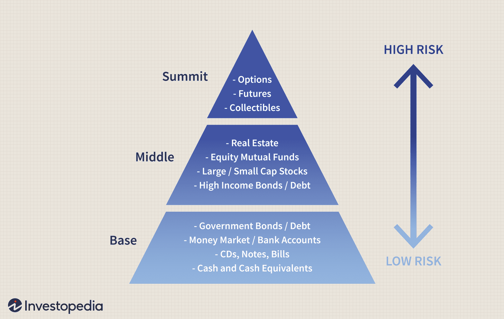

Social Return on Investment (SROI) is an analytic tool used to quantify the social value created by investments, beyond the conventional financial returns typically emphasized in financial statements. SROI translates social impacts into measurable financial metrics, allowing investors, companies, and policymakers to understand the broader implications of their financial decisions. It is increasingly significant in today’s investment landscape as stakeholders demand greater accountability and transparency concerning the environmental, social, and governance (ESG) aspects of their investments.

Linking SROI with social investments and algorithmic trading represents a convergence of traditional investment mechanisms with modern technology and socially conscious goals. Social investments aim to generate measurable social impacts alongside financial returns. By integrating SROI in evaluating these investments, stakeholders can assess outcomes in a meaningful financial context, facilitating decisions that align with broader societal values and demands.



Algorithmic trading, known for its speed, precision, and data-driven approach to financial markets, offers potential benefits when paired with SROI. This integration could optimize investment portfolios to maximize both social impact and financial return, leveraging complex algorithms that account for SROI metrics. Algorithmic systems have the capability to incorporate vast amounts of data to streamline trading operations, ideally suited for modern socially-driven portfolios.

This article aims to provide a comprehensive understanding of SROI, its calculation, and its pivotal role in social investments. It further explores how algorithmic trading can enhance these investments, presenting a synergistic approach that merges financial acumen with social conscientiousness. The subsequent sections will delve into detailed explanations of SROI and algorithmic trading principles, the challenges inherent in assigning quantifiable values to social impacts, and future prospects that hold promise for innovation in this burgeoning field. Ultimately, it underscores the importance for stakeholders to harmonize financial returns with impactful social investments.

## Table of Contents

## Understanding Social Return on Investment (SROI)

Social Return on Investment (SROI) is a framework for measuring and accounting for a broad concept of value. It seeks to identify and quantify the social, environmental, and economic value created by an investment, which are often excluded from traditional financial statements. This measurement technique enables investors and organizations to understand the broader impact of their activities beyond financial returns.

**Factors Involved in Calculating SROI**

The calculation of SROI involves several key components:

1. **Social Impact Value**: This represents the quantifiable social benefits an investment generates. It involves identifying the outcomes for stakeholders and assigning monetary values to those outcomes. This can be challenging since assigning monetary values to social impacts often requires assumptions and approximations. Absolute precision is difficult, but it is crucial to ground valuations in realistic and justifiable estimates.

2. **Initial Investment Amount**: This refers to the financial input or original capital put into a project or initiative. It forms the baseline against which social returns are compared. Calculating SROI typically involves comparing the net social impact to this initial investment.

The SROI is expressed as a ratio, calculated by dividing the total value of the benefits by the value of the investment. The formula for calculating SROI is:

$$
\text{SROI Ratio} = \frac{\text{Total Present Value (PV) of Benefits}}{\text{Value of Inputs}}
$$

Where:
- Total Present Value (PV) of Benefits is the sum of the discounted values of social benefits over time.
- Value of Inputs corresponds to the initial investment adjusted if needed for additional funding or costs over time.

**Example to Illustrate SROI**

Consider a nonprofit organization that invests $100,000 in a community program aimed at reducing local unemployment. Through this program, beneficiaries experience improved employability, securing jobs that result in a combined increase in income equivalent to $500,000 over five years. After thorough analysis, it is decided that 80% ($400,000) of this increased income can be attributed to the program.

To calculate the SROI:

- Identify the total value of social impacts: $400,000 (80% of $500,000).
- Initial investment amount: $100,000

Using the SROI formula:

$$
\text{SROI Ratio} = \frac{400,000}{100,000} = 4
$$

This ratio indicates that for every dollar invested, the program generates an equivalent of four dollars in social impact. This example illustrates how SROI provides a valuable lens for evaluating the social benefits of investments relative to their financial costs, promoting a more comprehensive understanding of an investment's value to society.

## Key Factors Influencing SROI in Social Investments

Social Return on Investment (SROI) serves as a vital tool for evaluating the value generated by social investments beyond traditional financial metrics. To comprehensively measure SROI, it is essential to understand the elements of inputs, outputs, outcomes, and impact.

**Inputs** refer to the resources that are invested in a project, such as time, money, and materials. For example, a community development project might require funding, volunteer hours, and building materials.

**Outputs** are the immediate, tangible products or services resulting from an investment. Continuing with the community development example, outputs could include the number of houses built or the number of people trained.

**Outcomes** are the changes or benefits resulting from the project for individuals or communities. These might include improved living conditions, increased employment rates, or enhanced skills among participants.

**Impact** refers to the broader, long-term changes that occur in the community or environment as a direct or indirect result of the project. It involves assessing the overall value created and ensuring it aligns with the project's initial goals.

### Challenges in Assigning Monetary Values to Social Impacts and Measuring Outcomes

One of the primary challenges in SROI is quantifying social impacts in monetary terms. Assigning a financial value to social benefits, such as community well-being or environmental sustainability, is inherently complex. To tackle this, practitioners often use proxy values or assign hypothetical market values, but these approaches can introduce subjectivity and variability.

Another challenge lies in accurately measuring outcomes. Unlike financial data, which are often precise and quantifiable, social outcomes can be qualitative and subjective, relying on extensive data collection and surveys. This can lead to inconsistencies in SROI calculations and difficulties in standardizing the measurement process.

### Best Practices and Methodologies for Accurate SROI Calculations

To enhance the accuracy of SROI calculations, several methodologies and best practices can be employed:

1. **Stakeholder Involvement**: Engaging stakeholders in the evaluation process helps identify relevant social impacts and values. Stakeholders can provide insights into the project's perceived benefits, ensuring a more comprehensive assessment.

2. **Use of Established Frameworks**: Applying frameworks such as Social Impact Bonds or the Global Impact Investing Network's (GIIN) IRIS metrics can provide standardized benchmarks for evaluating social impacts.

3. **Data Triangulation**: Utilizing multiple data sources and methods can increase the reliability of impact measurements. Combining quantitative and qualitative data can offer a more holistic view of social outcomes.

4. **Sensitivity Analysis**: Conducting sensitivity analyses helps assess how changes in assumptions or proxy values can affect SROI calculations, thereby improving the robustness of the results.

5. **Continuous Monitoring and Reporting**: Regular monitoring and transparent reporting of social outcomes facilitate ongoing learning and adjustment, allowing for the refinement of impact measurement strategies.

These practices, when effectively implemented, contribute to a more precise and meaningful assessment of SROI, ultimately guiding better decision-making in social investments. By addressing the challenges of valuation and measurement, investors can more confidently align their financial pursuits with social impact objectives, fostering sustainable development and community well-being.

## Algorithmic Trading in Social Investments

Algorithmic trading, often referred to as algo trading or automated trading, involves using computer algorithms to execute trades based on pre-defined criteria. These algorithms can analyze vast datasets at high speed, identify trading opportunities, and execute orders at the optimal price. This technology-driven approach has transformed modern investment strategies by improving speed, accuracy, and efficiency while reducing transaction costs. 

The integration of [algorithmic trading](/wiki/algorithmic-trading) with social investment principles represents a promising advancement, aiming to harmonize financial profitability with social impact. Social investment focuses on generating social and environmental benefits alongside financial returns. By implementing algorithms, investors can systematically identify opportunities that align with specific social objectives. This strategic alignment ensures that the capital is allocated effectively towards projects and organizations that deliver measurable social value.

Optimization for social impact involves tailoring algorithms to consider SROI metrics and other socially relevant data points. By incorporating factors such as carbon emissions reduction, job creation, or community development into their decision-making processes, algorithms can prioritize investments that maximize overall social welfare. Algorithms use real-time data to evaluate these factors, allowing for dynamic adjustments in response to changing market conditions or emerging social needs.

For example, an algorithm may be designed to prioritize investments in renewable energy companies based on criteria such as emissions reductions and local community benefits. The algorithm would analyze financial data in concert with sustainability metrics, enabling it to select investments that promise both financial growth and significant SROI. 

Python is often employed for building such algorithms due to its robust data handling capabilities and extensive libraries for quantitative finance and [machine learning](/wiki/machine-learning). A simple example of an investment algorithm might look like this:

```python
import pandas as pd

# Load financial and social impact datasets
financial_data = pd.read_csv("financial_data.csv")
social_impact_data = pd.read_csv("social_impact_data.csv")

# Merge datasets on a common identifier
merged_data = pd.merge(financial_data, social_impact_data, on="company_id")

# Define an investment strategy
def investment_score(row):
    financial_score = row['return_on_investment']
    impact_score = row['sroi']
    return financial_score * 0.7 + impact_score * 0.3

# Apply the investment strategy
merged_data['investment_score'] = merged_data.apply(investment_score, axis=1)

# Select top investments
top_investments = merged_data.sort_values(by='investment_score', ascending=False).head(10)

print(top_investments)
```

This code snippet demonstrates how an algorithm can integrate financial and social impact data to optimize investment decisions. By assigning weights to financial return and SROI, investors can systematically prioritize opportunities that deliver the most substantial combined benefit.

In summary, algorithmic trading, when integrated with social investment criteria, offers a powerful tool for maximizing both financial returns and social impact. By automating and realigning investment strategies to include social objectives, investors can enhance the overall effectiveness and sustainability of their portfolios.

## SROI and Algorithmic Trading: A Synergistic Approach

Social Return on Investment (SROI) metrics provide a comprehensive framework for evaluating the social impact of investments. When integrated with algorithmic trading strategies, these metrics can guide financial decisions that align with both economic returns and social responsibility. Algorithmic trading, characterized by the use of predefined rules and algorithms in executing trades, can significantly benefit from incorporating SROI metrics. By embedding social impact measurements into algorithms, investors can more effectively direct capital towards ventures that yield measurable social benefits alongside financial profits.

Aligning financial returns with social impact goals is increasingly recognized as beneficial not only for ethical reasons but also for enhancing long-term financial performance. SROI metrics offer a quantifiable approach to assess such impacts, facilitating the creation of algorithmic models that prioritize investments with higher social returns. This blending of objectives often leads to a more diversified portfolio that appeals to socially conscious investors and enhances brand reputation.

Consider a scenario where an algorithm evaluates potential investments based on traditional financial indicators and a calculated SROI ratio. The SROI ratio, defined as:

$$

\text{SROI Ratio} = \frac{\text{Total Present Value of Social Benefits}}{\text{Initial Investment Cost}} 
$$

can be used to rank investments according to both their financial return potential and their social impact value. This dual evaluation process aids in selecting investments that contribute positively to society, thus attracting interest from investors keen on sustainable practices.

Successful implementations of this approach can be observed in investment firms that have adopted Environmental, Social, and Governance ([ESG](/wiki/esg-investing)) criteria within their trading algorithms. These firms apply SROI as part of their decision-making process, allowing algorithms to filter through and select equities that meet specific social and financial criteria. The resulting portfolios not only deliver competitive financial returns but also increase positive social outcomes, as reflected in improved community engagement and environmental conservation efforts.

For instance, an investment fund that incorporates an algorithm emphasizing both high SROI and financial performance could allocate resources more effectively to renewable energy projects or social enterprises. Analyzing historical case studies, such as the integration of SROI metrics in investment strategies by Triodos Bank, reveals enhanced client satisfaction and sustained financial growth. Such examples underscore the feasibility and advantages of crafting investment strategies guided by SROI-infused algorithms.

Integrating SROI metrics into algorithmic trading frameworks presents a promising synergistic approach that aligns profit motives with societal benefits. As financial markets increasingly value socially responsible investments, leveraging SROI within algorithmic strategies will likely become a prevalent practice, encouraging broader adoption in pursuit of sustainable investing goals.

## Challenges and Future Prospects

Integrating Social Return on Investment (SROI) with algorithmic trading presents a set of complex challenges that require innovative solutions to effectively marry these two domains. One of the primary difficulties lies in the measurement complexities associated with SROI. SROI attempts to quantify social value, which inherently involves turning qualitative social outcomes into quantitative metrics. This process is fraught with methodological difficulties, particularly when attempting to assign monetary values to social and environmental impacts. The subjective nature of social value assessment complicates creating standardized metrics that can be seamlessly integrated into algorithmic models.

Another significant challenge is technology integration. Algorithmic trading relies on precise data inputs and rapid execution of trades, typically focused on financial returns. Embedding SROI into these algorithms necessitates the development of systems that can handle multi-dimensional data, including non-financial social impact indicators, without compromising the speed and efficiency vital to algorithmic trading. Current algorithmic models are not fully equipped to process these non-traditional metrics, which necessitates a reevaluation of existing technological frameworks and potentially the development of new computational methods and data structures to handle the complexity and uncertainty of social impact data.

Looking forward, the integration of SROI with algorithmic trading opens multiple avenues for development. Future iterations could leverage advancements in [artificial intelligence](/wiki/ai-artificial-intelligence) and machine learning to enhance the preciseness and adaptability of algorithms in evaluating social impacts. Additionally, blockchain technology might provide solutions for improved transparency and accountability in tracking social impact metrics, thus facilitating their incorporation into trading models.

Further research could focus on developing robust methodologies for quantifying social impacts that are universally accepted and easy to integrate into algorithmic frameworks. Enhancing data analytics capabilities to handle social value metrics could also provide a significant breakthrough. There is potential for interdisciplinary collaboration among social scientists, technologists, and financial experts to co-create these solutions.

In conclusion, while there are notable challenges in harmonizing SROI with algorithmic trading, particularly concerning measurement intricacies and technological integration, the prospects for future advancements are promising. Continued efforts in research and innovation will be essential in establishing a cohesive approach that aligns financial profitability with social value creation.

## Conclusion

The integration of Social Return on Investment (SROI) into social investments and algorithmic trading frameworks represents a crucial evolution in modern investment strategies. By leveraging SROI metrics, investors can evaluate the broader social impacts of their investments, ensuring that financial gains do not occur at the expense of societal welfare. This aligns with a growing demand for more ethical investment practices, addressing both the social and environmental challenges of our time.

Throughout this article, we have examined the nuanced methodology of SROI, which assigns value to social impacts, thereby providing a more comprehensive view of investment outcomes. The complexities involved in quantifying social returns, alongside financial assessments, highlight the need for precise and balanced evaluation techniques. Algorithmic trading emerges as a significant tool in this landscape, using advanced algorithms to optimize investment strategies to include social impact considerations. By harnessing data-driven insights, these algorithms can enhance decision-making processes, ensuring that investments yield both financial and social benefits.

The synergy between SROI assessments and algorithmic trading offers numerous advantages. It not only prioritizes financial returns but also amplifies social value, encouraging investors to pursue sustainable and socially-conscious growth paths. This dual focus is becoming increasingly important in a global context where social responsibility and profitability are both valued by investors and consumers alike.

Stakeholders in the investment industry are urged to embrace this integrated approach to fully realize the transformative potential of their portfolios. By considering both financial returns and social impacts, investors can play a pivotal role in fostering a more equitable and sustainable future. Engaging with these methodologies and technologies ensures that investments are not only profitable but also contribute positively to society. As the investment landscape continues to evolve, integrating SROI into investment strategies will remain essential for aligning financial success with social progress.

## References & Further Reading

[1]: Arvidson, M., Lyon, F., McKay, S., & Moro, D. (2013). ["Valuing the social? The nature and controversies of measuring Social Return on Investment (SROI)."](https://portal.research.lu.se/en/publications/valuing-the-social-the-nature-and-controversies-of-measuring-soci) Voluntary Sector Review, 4(3), 24-39.

[2]: Nicholls, J., Lawlor, E., Neitzert, E., & Goodspeed, T. (2012). ["A Guide to Social Return on Investment."](https://neweconomics.org/uploads/files/aff3779953c5b88d53_cpm6v3v71.pdf) Social Value International.

[3]: Marquez, J., Villanueva, Karyn, & Ayuso, S. (2020). ["How Social Impact Measurement Can Become a Lever for Strategic Change."](https://journals.sagepub.com/doi/full/10.1177/1042258717727718) California Management Review.

[4]: Narayanan, A., Bonneau, J., Felten, E., Miller, A., & Goldfeder, S. (2016). ["Bitcoin and Cryptocurrency Technologies: A Comprehensive Introduction."](https://press.princeton.edu/books/hardcover/9780691171692/bitcoin-and-cryptocurrency-technologies) Princeton University Press.

[5]: Peltomaki, J., & Harjanne, A. (2021). ["Algorithmic Trading and its Impacts on Market Quality."](https://link.springer.com/article/10.1007/s10690-021-09353-5) Journal of Financial Markets.