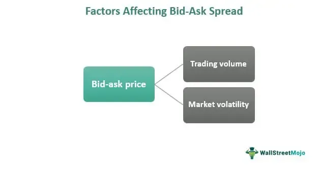

Understanding the financial trading landscape is crucial for both amateur and professional traders. One of the critical elements in this landscape is the bid-ask spread. The bid-ask spread is essentially the difference between the highest price that a buyer is willing to pay for an asset (the bid) and the lowest price a seller is willing to accept (the ask). This spread is a fundamental concept in financial markets, serving as a measure of market liquidity and a cost factor for implementing trading strategies. 

In the stock market, the bid-ask spread can significantly impact trading decisions and overall market efficiency. A narrower spread often indicates higher liquidity, allowing traders to transact quickly with minimal price impact. Conversely, a wider spread might suggest lower liquidity or heightened volatility, potentially increasing the cost of trading. 

Algorithmic trading, which involves the use of computer algorithms to automate trading decisions, heavily relies on understanding and optimizing the bid-ask spread. These algorithms can execute trades at speeds and frequencies beyond human capabilities, aiming to capitalize on even the smallest variations in the spread. This practice not only enhances the efficiency of executing trades but also contributes to narrowing spreads and improving market liquidity.

This article explores the components affecting the bid-ask spread and the impact of algorithmic trading. By examining real-world examples, traders can gain insights into how successful strategies exploit these spreads, adjusting to changes in market and regulatory environments to maintain profitability. 

Finally, we will consider how advancements in technology and evolving regulatory frameworks create opportunities for traders to leverage bid-ask spreads effectively. Understanding these dynamics is essential for those looking to capitalize on spread trading and ensure they remain competitive in an increasingly automated trading environment.

## Table of Contents

## Understanding the Bid-Ask Spread

In financial markets, the bid-ask spread is a fundamental concept representing the difference between the highest price a buyer is willing to pay for an asset (the bid) and the lowest price a seller is willing to accept (the ask). The spread is a critical metric as it influences the cost of trading and serves as an indicator of market liquidity.

To understand the mechanics, consider an example where a stock's bid price is $50 and the ask price is $50.50. The bid-ask spread, therefore, is $0.50. This spread acts as an implicit transaction cost for traders, wherein a trader buying at the ask and selling at the bid incurs a loss equal to the spread, assuming no change in price.

The bid-ask spread also functions as a barometer of [liquidity](/wiki/liquidity-risk-premium). A narrower spread generally indicates high market liquidity, allowing for efficient trade execution with minimal price impact. Conversely, a wider spread can denote lower liquidity, resulting in higher transaction costs and potential difficulty in executing trades at desired prices.

Several factors influence the bid-ask spread, notably trading [volume](/wiki/volume-trading-strategy), market liquidity, and [volatility](/wiki/volatility-trading-strategies):

1. **Volume**: Higher trading volumes often lead to narrower spreads. In active markets where numerous participants are buying and selling, the competition reduces the gap between bid and ask prices.

2. **Market Liquidity**: Liquid markets, characterized by a large number of buyers and sellers, typically exhibit tighter spreads. This scenario facilitates easier trade execution without significantly affecting the asset's price.

3. **Volatility**: Increased market volatility can lead to wider spreads. Uncertainty in an asset’s price movement often prompts market makers to widen spreads as a buffer against potential losses due to price fluctuations.

Understanding these components and their influence on the bid-ask spread is crucial for developing effective trading strategies. In an environment where transaction costs and market execution are pivotal, a comprehensive grasp of the bid-ask spread enables traders to make informed decisions on trade execution, risk management, and the selection of appropriate trading strategies.

## Algorithmic Trading and the Bid-Ask Spread

Algorithmic trading refers to the use of computer algorithms to automate trading decisions, which has transformed the modern trading landscape by allowing for rapid execution of trades and the ability to process large volumes of trade data. This technology plays a crucial role in exploiting the bid-ask spread, a fundamental concept that represents the difference between the highest price a buyer is willing to pay and the lowest price a seller is willing to accept.

Algorithmic trading strategies are designed to utilize the bid-ask spread to enhance trading efficiency by executing trades at optimal times to either capture the spread or minimize the transaction costs associated with it. Algorithms can analyze market data to identify slight discrepancies or variations in the bid-ask spread across different market venues, thereby executing trades that capitalize on these inefficiencies. For example, algorithms can instantly buy assets at the bid price and sell them at the ask price, thus profiting from the spread. The formula to calculate the bid-ask spread is:

$$
\text{Bid-Ask Spread} = \text{Ask Price} - \text{Bid Price}
$$

High-frequency trading ([HFT](/wiki/high-frequency-trading-strategies)), a subset of [algorithmic trading](/wiki/algorithmic-trading), is particularly influential in narrowing the bid-ask spread and enhancing market liquidity. HFT involves executing a large number of orders at extremely high speeds, often in fractions of a second. This rapid trading contributes to tighter spreads because HFT algorithms quickly match buyers with sellers, reducing the difference between bid and ask prices. As a result, HFT provides greater liquidity, making it easier for market participants to enter and [exit](/wiki/exit-strategy) positions at more favorable prices.

Despite the advantages, using algorithms to exploit bid-ask spreads is not without challenges. One significant challenge is the technological infrastructure required to maintain and develop sophisticated trading algorithms. Firms must invest in high-speed data feeds, low-latency networks, and robust computing resources to remain competitive. Furthermore, there is a constant need for algorithm refinement and optimization to adapt to changing market conditions.

Another challenge lies in the regulatory environment, which increasingly scrutinizes algorithmic trading practices due to concerns over market manipulation, flash crashes, and unfair advantages over traditional traders. Traders must ensure their algorithms comply with existing regulations to avoid legal repercussions.

In conclusion, while algorithmic trading and high-frequency trading present opportunities for increased efficiency and profit through the manipulation of the bid-ask spread, they also demand significant investments in technology and compliance with regulatory standards. Traders and firms utilizing these strategies must balance the benefits against the infrastructure costs and evolving legal landscape.

## Strategies for Trading the Bid-Ask Spread

Strategies for trading the bid-ask spread are crucial for traders aiming to capitalize on market inefficiencies. Two primary methods are [market making](/wiki/market-making) and [arbitrage](/wiki/arbitrage), each playing a significant role in liquidity provision and price efficiency.

**Market Making**

Market making involves continuously quoting buy (bid) and sell (ask) prices to capture the bid-ask spread as profit. Market makers earn by facilitating trades and thus, provide liquidity to the market. A narrow bid-ask spread is beneficial as it reduces the market maker’s risk and allows for more transactions in a short period. Market makers often rely on order flow predictions and advanced algorithms to adjust their quotes dynamically, ensuring they remain profitable while minimizing inventory risk.

**Arbitrage**

Arbitrage exploits price discrepancies across different markets or instruments, often focusing on the bid-ask spread. Traders identify opportunities where the same asset is priced differently and execute simultaneous buy and sell orders to lock in risk-free profit. Effective arbitrage requires rapid execution and is typically enhanced through high-frequency trading systems, which minimize latency and maximize speed.

**Scalping and Mean Reversion**

Scalping is a short-term strategy aiming for small profits from minute price movements. Traders engage in high trade volumes and close positions quickly, capitalizing on narrow spreads. Scalping benefits from algorithmic systems that can execute trades within milliseconds to exploit transient price inefficiencies.

Mean reversion, on the other hand, operates on the principle that prices will revert to their historical mean over time. Traders anticipate that deviations from a recognized average or spread are temporary, allowing them to buy undervalued assets and sell overvalued ones. Algorithmic integration in mean reversion strategies helps monitor and react to discrepancies swiftly, aligning trade execution with mean reversion predictions.

**Optimization through Algorithmic Trading**

Algorithmic trading significantly enhances the efficiency and execution of these strategies. By leveraging [machine learning](/wiki/machine-learning), predictive analytics, and high-speed data processing, algorithms optimize trade execution, minimize transaction costs, and exploit bid-ask spreads effectively. Traders develop models to forecast price movements with greater accuracy, allowing for refined adjustment of market-making quotes, effective arbitrage execution, or precise [scalping](/wiki/gamma-scalping) operations. The integration of [artificial intelligence](/wiki/ai-artificial-intelligence) and machine learning in these algorithms further refines the decision-making processes, enabling continual adaptation to changing market conditions and dynamics.

In conclusion, trading the bid-ask spread involves adopting sophisticated strategies that benefit from advanced computational systems and market understanding. These strategies, optimized through algorithmic trading, provide traders with robust tools to navigate and profit from competitive financial markets.

## Real-World Implications and Examples

Algorithmic trading has increasingly leveraged bid-ask spreads to optimize trading strategies and improve market efficiencies. This approach harnesses mathematical models and high-speed decision-making to capitalize on minimal price differences. Such practices have profound implications for both retail and institutional traders in diverse market conditions.

Algorithmic trading, particularly in high-frequency trading (HFT), allows traders to execute orders at fractions of a second, capturing minuscule price gaps between the bid and ask prices. For instance, firms such as Virtu Financial and Citadel Securities have successfully utilized sophisticated algorithms to exploit these spreads. These companies often operate as market makers, providing liquidity by constantly quoting bid and ask prices and profiting from the difference. Their activities significantly contribute to market efficiency by narrowing spreads and enhancing liquidity.

In markets with varying levels of liquidity, the implications for different types of traders must be considered. Retail traders, typically trading in less liquid markets, may face wider spreads due to lower trading volumes and heightened volatility. Algorithmic trading in such environments can help tighten spreads, making trading more cost-effective for individual investors. For institutional traders, who deal in large volumes and often operate in more liquid markets, the ability to navigate and exploit tighter spreads can result in substantial cost savings and improved execution quality.

The impact of bid-ask spread trading is evident in its effect on market dynamics and transaction costs. The continuous presence of algorithmic traders reduces market impact costs and mitigates price fluctuations, contributing to a more stable trading environment. However, this can also lead to increased competition among trading firms, potentially driving down profits from spread trading as technologies and strategies converge.

Case studies of firms like Renaissance Technologies highlight the effectiveness of using algorithmic strategies to narrow spreads and enhance liquidity. Their Medallion Fund, known for leveraging advanced algorithms, exhibits how institutional trading with a focus on spread exploitation can yield high returns while affecting broader market conditions. The influence of such firms tends to promote tighter spreads and more efficient markets, benefiting all market participants through reduced transaction costs.

In summary, algorithmic trading's exploitation of bid-ask spreads has reshaped market operations, offering significant advantages in terms of liquidity and cost efficiency. The resultant tighter spreads and improved liquidity foster a more accessible market for all participants, albeit with amplified competitive pressures.

## Challenges and Considerations

Trading the bid-ask spread presents several challenges and considerations that traders must be aware of to optimize their strategies effectively. One of the primary challenges is market volatility, which can significantly impact the bid-ask spread. In volatile markets, spreads tend to widen as market participants become uncertain about the fair value of assets. This can increase the cost of trading and decrease market liquidity, making it more challenging to execute trades at desirable prices. Traders must therefore develop strategies that can adapt to changing market conditions and manage the increased trading costs associated with wider spreads.

Algorithmic and high-frequency trading (HFT) necessitate substantial infrastructure investment. Effective trading requires high-speed data processing capabilities, co-location services to minimize latency, and sophisticated algorithms capable of executing trades at lightning-fast speeds. For instance, algorithmic traders should consider building or leasing servers close to exchanges to reduce the time it takes for orders to reach the market. Additionally, maintaining and upgrading these systems is an ongoing expense that can be prohibitive for smaller firms. Integrated development environments (IDEs) to develop and backtest trading algorithms, and access to detailed market data feeds, are also crucial components of the infrastructure setup.

Regulatory considerations play a significant role in bid-ask spread trading strategies. Different jurisdictions have varying rules regarding HFT and algorithmic trading, such as restrictions on order types, market manipulation, and spoofing. Traders must ensure their strategies comply with local regulations to avoid penalties. Regulatory actions can also impact market liquidity and volatility, further affecting bid-ask spreads. Keeping abreast of regulatory changes and possibly engaging with legal experts in financial regulations can help traders mitigate the risks associated with non-compliance.

Continuous optimization and risk management are crucial to success in trading the bid-ask spread. Algorithms must be regularly tested and updated to adapt to market changes and exploit profitable opportunities efficiently. Implementing robust risk management protocols, such as stop-loss orders and dynamic hedging techniques, can help protect against significant losses during unforeseen market movements. Backtesting strategies using historical data and running simulations can provide insights into potential risks and allow for the refinement of trading algorithms.

Ultimately, the dynamic nature of financial markets requires traders to remain vigilant and adaptable, continually seeking ways to refine and optimize their strategies to navigate the challenges posed by market volatility, infrastructure demands, regulatory landscapes, and risk management requirements.

## Conclusion

The bid-ask spread is a fundamental component of financial trading, with significant implications for both traditional and algorithmic trading strategies. It serves as a critical indicator of market liquidity and transaction costs, offering insights into how efficiently markets operate. A comprehensive understanding of the bid-ask spread allows traders to gauge the market's health and make more informed trading decisions.

The rapid advancement of technology plays a pivotal role in optimizing bid-ask spread trading. Algorithmic and high-frequency trading strategies, powered by state-of-the-art technology, have transformed how traders interact with the market. These technologies enable the execution of trades at speeds and volumes unattainable for human traders, narrowing spreads and enhancing market liquidity. The impact of this technology is evident in its ability to minimize transaction costs and provide traders with more precise control over their trading activities.

Given the dynamic nature of financial markets and the regulatory environments in which they operate, it is crucial for traders to remain well-informed and adaptable. Regulatory changes can significantly affect trading strategies that leverage the bid-ask spread. Keeping abreast of these changes ensures that traders can adjust their strategies effectively and remain compliant while optimizing their trading outcomes. Furthermore, an understanding of how different market conditions impact the bid-ask spread allows traders to tailor their strategies to capitalize on opportunities as they arise.

In conclusion, the potential for profitable trading strategies through a comprehensive understanding of the bid-ask spread is immense. By appreciating its role as a liquidity and cost indicator, traders can develop strategies that optimize their interaction with the market. The continuous evolution of technology and the regulatory landscape demands that traders stay engaged with new developments, fostering an adaptive approach to trading. This adaptive mindset will be vital in continuing to exploit the opportunities presented by bid-ask spreads in an ever-changing financial environment.

## References & Further Reading

### Key Books, Articles, and Online Resources

1. **Books on Financial Markets and Trading**:
   - *"Algorithmic Trading: Winning Strategies and Their Rationale"* by Ernie Chan explores various algorithmic trading strategies, providing insights into how they can be applied in real-world scenarios. The book offers practical examples and is a valuable resource for both beginners and seasoned traders.
   - *"Market Liquidity: Theory, Evidence, and Policy"* by Thierry Foucault, Marco Pagano, and Ailsa Röell gives a comprehensive overview of market liquidity, including factors that influence the bid-ask spread, essential for understanding market dynamics.

2. **Articles and Research Papers**:
   - A seminal paper by Glosten and Milgrom (1985) titled ["Bid, Ask and Transaction Prices in a Specialist Market with Heterogeneously Informed Traders"](https://www.jstor.org/stable/1836314), published in the Journal of Financial Economics, discusses the implications of information asymmetry on bid-ask spreads.
   - [Hasbrouck, J. (1991)]. "The Summary Informativeness of Stock Trades: An Econometric Analysis" is a key academic paper that provides insights into how trades contribute to price discovery in financial markets, crucial for understanding the role of bid-ask spreads.

3. **Online Resources and Community Engagement**:
   - The website [Investopedia](https://www.investopedia.com/) offers a comprehensive glossary and tutorials on bid-ask spreads and algorithmic trading, making it an excellent starting point for those new to the subject.
   - Platforms like [QuantConnect](https://www.quantconnect.com/) and [QuantStart](https://www.quantstart.com/) offer a wealth of resources, including tutorials, forums, and discussions on backtesting trading strategies that focus on bid-ask spreads.

### Academic Studies and Case Studies

- The research paper ["High-Frequency Trading: A Regulatory Framework"](https://www.cfapubs.org/doi/full/10.2469/dig.v44.n2.6) by Jones, C. M. (2013) explores the impact of high-frequency trading on market stability and liquidity, addressing how algorithmic trading strategies influence bid-ask spreads.
- A case study on [Virtu Financial, Inc.](https://www.virtu.com/), a global leader in market making and high-frequency trading, highlights how effective optimization of bid-ask spreads can enhance profitability and market presence.

### Engaging with Industry Forums

- Participation in forums such as [EliteTrader](https://www.elitetrader.com/) and specialized subreddits like [r/algotrading](https://www.reddit.com/r/algotrading/) can offer real-time insights and peer discussions on trends in bid-ask spreads and algorithmic trading.
- Engaging in webinars and conferences hosted by organizations such as the CFA Institute and the Algorithmic Trading Symposium can provide current industry developments and expert perspectives.

These resources, ranging from foundational texts to interactive platforms, are essential for anyone looking to deepen their understanding of bid-ask spreads and the role of algorithmic trading in modern financial markets.

