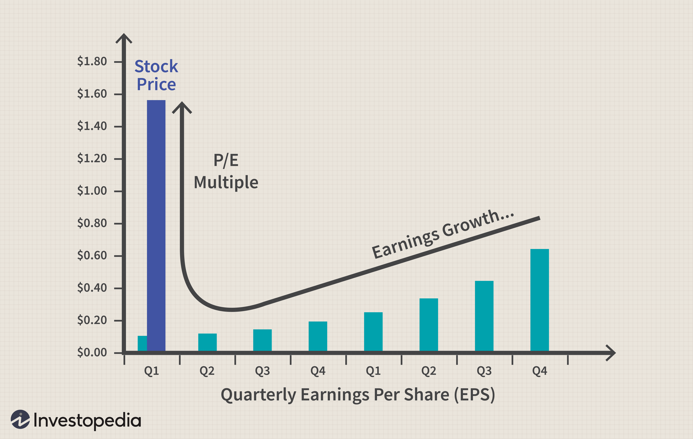

## Table of Contents

## What are stock prices and why do they fluctuate?

Stock prices are the values at which shares of a company are bought and sold on the stock market. When you buy a stock, you are buying a small piece of that company. The price of a stock is determined by what people are willing to pay for it at any given time. If more people want to buy the stock than sell it, the price goes up. If more people want to sell the stock than buy it, the price goes down.

Stock prices fluctuate for many reasons. One big reason is news about the company. If a company does well and makes more money than expected, its stock price might go up because people think it's a good investment. On the other hand, if a company does poorly or has bad news, its stock price might go down. Another reason for fluctuations is the overall economy. If the economy is doing well, people might be more willing to invest in stocks, pushing prices up. If the economy is struggling, people might sell their stocks, causing prices to drop. Emotions also play a role; if people are scared or excited, they might buy or sell more, which can cause quick changes in stock prices.

## How do economic indicators affect stock prices?

Economic indicators are like signs that tell us how the economy is doing. They can affect stock prices because they give investors clues about whether they should buy or sell stocks. For example, if the unemployment rate goes down, it means more people have jobs and are earning money. This can make investors feel good about the economy, so they might buy more stocks, which can push stock prices up. On the other hand, if the unemployment rate goes up, it might make investors worried, and they might sell their stocks, which can cause stock prices to drop.

Another important economic indicator is inflation. Inflation is when the prices of things we buy go up over time. If inflation is high, it can make investors nervous because it might mean that their money won't be worth as much in the future. This can lead them to sell stocks, which can lower stock prices. But if inflation is low and steady, investors might feel more confident and be more likely to buy stocks, which can help push stock prices up. So, economic indicators can really move stock prices by changing how investors feel about the future.

## What role do company earnings play in stock price movements?

Company earnings are a big deal when it comes to stock prices. Earnings are the money a company makes after paying all its bills. When a company reports its earnings, people pay close attention. If a company earns more money than people thought it would, its stock price often goes up. This is because investors think the company is doing well and might keep doing well in the future. They want to buy the stock, which pushes the price higher.

On the other hand, if a company earns less money than expected, its stock price can go down. Investors might start to worry that the company isn't doing as well as they hoped. They might sell their stocks, which makes the price drop. So, earnings reports can cause big swings in stock prices because they give investors a clear picture of how a company is doing right now and what might happen next.

## How does market sentiment influence stock prices?

Market sentiment is all about how people feel about the stock market. If people feel good and are hopeful about the future, they are more likely to buy stocks. This can make stock prices go up because more people want to own them. For example, if there's good news about the economy or a company, people might get excited and start buying stocks, pushing the prices higher.

On the other hand, if people are scared or worried, they might sell their stocks. This can make stock prices go down because more people want to get rid of their stocks. Bad news, like a company doing poorly or the economy struggling, can make people feel nervous and lead them to sell, which lowers stock prices. So, how people feel can really move stock prices up or down.

## What impact do interest rates have on stock market fluctuations?

Interest rates can really affect the stock market. When interest rates go up, it can make borrowing money more expensive for companies. This might make them less likely to grow or invest in new projects. At the same time, people might move their money from stocks to savings accounts or bonds because they can earn more interest there. This can make stock prices go down because fewer people want to buy stocks.

On the other hand, when interest rates go down, borrowing money becomes cheaper. Companies might take this chance to grow or start new projects, which can make investors feel good about the future. Also, when interest rates are low, people might move their money from savings accounts or bonds to stocks because they can't earn as much interest. This can push stock prices up because more people want to buy stocks. So, interest rates can cause big changes in the stock market by changing how companies and people behave.

## How do geopolitical events affect stock prices?

Geopolitical events, like wars or big changes in government, can really shake up the stock market. When something big happens in the world, it can make people worried about the future. For example, if there's a war, people might think it will hurt the economy. They might start selling their stocks because they're scared, and this can make stock prices go down. Also, if a country changes its leader or its laws, it can make investors unsure about what will happen next. This uncertainty can make them sell their stocks, which can also lower stock prices.

But sometimes, geopolitical events can make stock prices go up. If a country solves a big problem or makes a good deal with another country, it can make people feel hopeful. They might think the economy will do better because of this good news. So, they might buy more stocks, which can push the prices up. It all depends on how people think the event will affect the future. Geopolitical events can cause big swings in the stock market because they change how people feel about what's going to happen next.

## What is the effect of supply and demand on stock prices?

Supply and demand are big reasons why stock prices move up and down. Supply is about how many stocks a company has for people to buy. Demand is about how many people want to buy those stocks. If more people want to buy a stock than there are stocks available, the price of the stock goes up. This is because people are willing to pay more to get the stock. On the other hand, if there are more stocks available than people want to buy, the price goes down. People don't have to pay as much because there are plenty of stocks to go around.

This balance between supply and demand can change quickly. For example, if a company does really well and more people want to buy its stock, the demand goes up and the price goes up too. But if something bad happens to the company, like it loses money, fewer people might want to buy its stock. This means the demand goes down, and so does the price. So, the price of a stock is always moving because the number of people who want to buy it and the number of stocks available are always changing.

## How do stock market indices and their performance impact individual stock prices?

Stock market indices, like the S&P 500 or the Dow Jones, are like big lists of stocks that show how the whole market is doing. When these indices go up, it often means that many stocks are doing well, which can make people feel good about the market. If people see that the indices are going up, they might think it's a good time to buy stocks. This can make more people want to buy individual stocks, pushing their prices up. For example, if the S&P 500 is doing great, people might want to buy stocks from companies in that index, which can help those stock prices go up too.

On the other hand, if the indices go down, it can make people worried. They might think it's not a good time to buy stocks and start selling what they have. This can make the prices of individual stocks go down because fewer people want to buy them. For example, if the Dow Jones drops a lot, people might sell their stocks from companies in that index, which can cause those stock prices to fall. So, the performance of stock market indices can really affect how people feel about buying and selling individual stocks, which changes their prices.

## What are the implications of insider trading on stock price volatility?

Insider trading happens when people who work at a company buy or sell its stock using secret information that others don't know. This can make stock prices move a lot because when insiders trade, it can send a signal to other people about what's going on with the company. If insiders are buying a lot of stock, it might mean they think the company will do well, and that can make the stock price go up as other people want to buy too. But if insiders are selling a lot, it might mean they think the company will do badly, and that can make the stock price go down as others start selling too.

This kind of trading can make the stock market more unpredictable because it's hard for regular people to know what the insiders know. When insider trading happens, it can cause big changes in stock prices very quickly. This can make it harder for people to guess what will happen next with the stock, which adds to the ups and downs in the market. That's why insider trading is against the law in many places, to keep the market fair for everyone.

## How do algorithmic trading and high-frequency trading affect stock price fluctuations?

Algorithmic trading and high-frequency trading are ways of buying and selling stocks using computers. These computers use special math formulas to decide when to buy or sell stocks very quickly. This can make stock prices move a lot because these trades happen so fast. For example, if lots of computers decide to sell a stock at the same time, the price can drop quickly. On the other hand, if they all decide to buy, the price can go up fast. So, these fast computer trades can make the stock market more unpredictable.

High-frequency trading, which is a type of algorithmic trading, happens in just a few seconds or even less. These traders make lots of trades every day, trying to make small profits from tiny changes in stock prices. Because they trade so often and so fast, they can cause big swings in stock prices. If many high-frequency traders start buying or selling at the same time, it can lead to quick ups and downs in the market. This can make it harder for regular people to know what will happen next with stock prices.

## What role do regulatory changes play in influencing stock prices?

Regulatory changes are rules made by the government that can affect how companies work. When these rules change, it can make stock prices move. For example, if the government makes a new rule that makes it harder for a company to do business, like a new tax or more rules about how they can sell their products, the company might make less money. This can make investors worried, and they might sell their stocks, which can make the stock price go down. On the other hand, if the government makes a rule that helps a company, like giving them money or making it easier for them to do business, investors might feel good and buy more stocks, which can make the price go up.

These changes can also affect whole industries. If the government makes a new rule that affects all companies in a certain industry, like new environmental rules for oil companies, it can make the stock prices of all those companies move in the same way. If the rule is good for the industry, stock prices might go up. If it's bad, stock prices might go down. So, when the government changes rules, it can cause big changes in stock prices because it changes how people think about the future of companies and industries.

## How can advanced statistical models and machine learning be used to predict stock price movements?

Advanced statistical models and machine learning can help predict stock price movements by finding patterns in big sets of data. These models look at things like past stock prices, company earnings, economic indicators, and even news stories. They use this information to guess what might happen next with stock prices. For example, a machine learning model might notice that when a company's earnings go up, its stock price usually goes up too. By finding these patterns, the model can make predictions about future stock prices.

But predicting stock prices is really hard because the stock market can be unpredictable. Even the best models can be wrong because there are so many things that can affect stock prices, like unexpected news or changes in how people feel about the market. Still, these models can be helpful for investors because they give them more information to think about when deciding whether to buy or sell stocks. By using advanced statistical models and machine learning, investors can make better guesses about what might happen next with stock prices.

## References & Further Reading

[1]: Bergstra, J., Bardenet, R., Bengio, Y., & Kégl, B. (2011). ["Algorithms for Hyper-Parameter Optimization."](https://papers.nips.cc/paper/4443-algorithms-for-hyper-parameter-optimization) Advances in Neural Information Processing Systems 24.

[2]: ["Advances in Financial Machine Learning"](https://www.amazon.com/Advances-Financial-Machine-Learning-Marcos/dp/1119482089) by Marcos Lopez de Prado

[3]: ["Evidence-Based Technical Analysis: Applying the Scientific Method and Statistical Inference to Trading Signals"](https://www.amazon.com/Evidence-Based-Technical-Analysis-Scientific-Statistical/dp/0470008741) by David Aronson

[4]: ["Machine Learning for Algorithmic Trading"](https://github.com/PacktPublishing/Machine-Learning-for-Algorithmic-Trading-Second-Edition) by Stefan Jansen

[5]: ["Quantitative Trading: How to Build Your Own Algorithmic Trading Business"](https://books.google.com/books/about/Quantitative_Trading.html?id=j70yEAAAQBAJ) by Ernest P. Chan