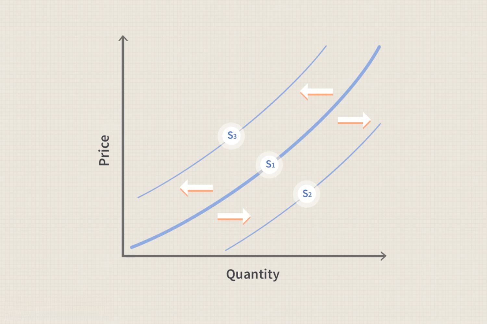

In today's dynamic economic environment, understanding the factors that influence supply and demand is crucial for making informed financial decisions. Supply shifts—changes in the position of the supply curve—reflect these underlying influences and have significant implications for market equilibrium. A thorough comprehension of these shifts enables market participants to better anticipate price changes and adjust their strategies accordingly.

Algorithmic trading has revolutionized the financial markets by enabling rapid analysis and response to supply curve shifts. This approach uses computer algorithms to automatically execute trades based on real-time market data, offering traders a significant advantage over traditional methods. Understanding how algorithmic trading interacts with supply shifts is increasingly important as technology continuously transforms market dynamics.



This article explores the concept of supply shift economics and its impact on the supply curve, particularly in algorithmic trading. We will examine how determinants of supply—such as technological advancements, changes in production costs, and regulatory impacts—affect supply positions and influence financial strategies. Additionally, we consider how traders utilizing advanced technologies respond to these shifts to optimize their trading strategies.

By the end, readers will gain a comprehensive understanding of how supply shifts impact market dynamics and trading algorithms, providing clarity on this crucial component of modern financial analysis and strategy formulation.

## Table of Contents

## Understanding Supply Shift in Economics

Supply shift refers to changes in the position of the supply curve, representing alterations in the quantity of goods supplied at varying price levels. In economic terms, a rightward shift of the supply curve signifies an increase in supply, while a leftward shift indicates a decrease. These shifts are pivotal in determining the price-quantity equilibrium in the market, affecting both pricing strategies and market demand.

Factors that cause supply shifts are multifaceted and include technological advancements, changes in production costs, and fluctuations in the number of competing firms in the market. Technological advancements often result in increased production efficiency, lowering costs and enabling producers to supply more at each price point. For example, automation and improved machinery can enhance production rates, causing the supply curve to shift rightward.

Conversely, changes in production costs, such as increases in the price of raw materials or labor, can decrease supply, shifting the supply curve leftward. This results in a higher equilibrium price, as producers need compensations for their increased costs to maintain profitability. Additionally, regulatory changes, such as new environmental standards or tariffs, can alter production costs and subsequently affect supply.

Market competition also plays a crucial role. An increase in the number of producers typically enhances market supply, driving the curve rightward and potentially lowering prices due to competitive forces. Conversely, a decrease in the number of suppliers can restrict supply, shifting the curve leftward.

These shifts in supply are integral to evaluating market dynamics, as they directly affect the allocation of resources, production capabilities, and consumer pricing strategies. Understanding the causes and effects of supply shifts enables businesses to adapt to market conditions, optimize their operations, and strategically position themselves in a competitive landscape.

## Determinants of Supply and Their Impact

Several key determinants can cause shifts in the supply curve, significantly impacting market conditions. Understanding these factors is essential for predicting and responding to changes in supply dynamics.

One of the primary determinants is production costs. A decrease in production costs typically leads to an increase in supply, as producers can afford to supply a greater quantity of goods at the same price level. This scenario results in a rightward shift of the supply curve. Cost reductions can arise from a variety of sources, including lower input prices, enhanced production efficiency, or economies of scale.

Conversely, technological setbacks or increased regulations can reduce supply. Technological advancements generally lead to improved production processes, enhancing efficiency and output. However, when technological improvements halt or regress, production processes may become less efficient, leading to a decrease in supply and a leftward shift in the supply curve. Similarly, increased regulation can raise production costs or impose constraints on the production process, thereby reducing supply.

Supplier expectations also play a crucial role. If suppliers anticipate higher future prices, they might withhold current supply to benefit from potential future price increases, reducing present supply levels. This strategic decision can lead to a leftward shift in the supply curve, affecting current market prices and availability.

These determinants influence the supply balance differently, impacting market stability and pricing. A comprehensive understanding of these factors allows market participants to predict how supply might shift, enabling them to make strategic decisions in response to changing market conditions. By analyzing the underlying causes of supply shifts, stakeholders can better navigate the economic landscape and optimize outcomes.

## Role of Algorithmic Trading in Supply Analysis

Algorithmic trading utilizes advanced computer algorithms to execute trades efficiently, exploiting variations in supply and demand data. These algorithms have revolutionized the trading landscape by processing vast amounts of market data at speeds unattainable by human traders. This rapid data analysis allows for the swift identification of supply shifts and associated market opportunities.

One primary function of trading algorithms is to analyze order flow, which includes a continuous stream of buy and sell orders in the market. By evaluating this flow along with market [liquidity](/wiki/liquidity-risk-premium) data, algorithms can predict imminent price changes. Market liquidity, the ease with which assets can be bought or sold without affecting the asset's price, is crucial in these calculations. Liquidity analysis helps determine whether it is advantageous to enter or [exit](/wiki/exit-strategy) trades quickly, especially when supply disruptions occur.

Rapid execution is key in [algorithmic trading](/wiki/algorithmic-trading). When algorithms detect a supply disruption, they can execute trades almost instantaneously, taking advantage of short-lived market inefficiencies. The speed of execution aims to optimize profit by either buying undervalued assets or selling overvalued ones before the broader market adjusts.

For example, consider a sudden disruption in commodity supply due to unexpected weather events. An algorithm, upon recognizing this supply shift through real-time data analysis, might execute a series of trades that either short-sell or buy futures contracts, depending on the anticipated price movement. The goal is to either capitalize on the rising prices if supply is expected to decrease or benefit from falling prices if supply increases unexpectedly.

The capability of algorithms to make decisions based on a wide array of variables, such as historical price patterns, [volume](/wiki/volume-trading-strategy) data, and other economic indicators, allows them to manage risk better and ensure trades are executed under optimal conditions. As markets continue to evolve, algorithmic trading remains a critical component enabling traders to respond to supply shifts with unparalleled precision and speed.

In summary, algorithmic trading plays a pivotal role in supply analysis by leveraging advanced algorithms to exploit rapid supply shifts, ensuring optimal trade execution and risk management. This technological advancement has dramatically increased the efficacy and profitability of modern trading strategies.

## Machine Learning and Predictive Models

Advanced [machine learning](/wiki/machine-learning) models are increasingly crucial for enhancing algorithmic trading strategies. By leveraging historical data, these models are capable of predicting future supply conditions and market movements effectively. Machine learning algorithms can analyze vast datasets at unprecedented speeds, identifying patterns and correlations that may not be evident through traditional analytical methods.

To provide a competitive edge, these models incorporate various variables such as historical prices, trading volumes, and external economic indicators. This multifaceted approach allows for the development of more accurate and robust predictive models. For instance, linear regression models might assess the relationship between supply shifts and historical price data to forecast potential future trends. Similarly, more complex models like neural networks can capture non-linear relationships and intricate patterns within the data, offering deeper insights into how market dynamics may evolve.

Companies at the forefront of leveraging these technologies, such as Kensho and Numerai, continuously refine their predictive models to enhance trading outcomes. Kensho, for example, uses advanced data analytics combined with machine learning to provide financial professionals with tools to make informed decisions. Numerai, on the other hand, utilizes crowd-sourced machine learning to hedge funds, allowing data scientists globally to test and improve their models.

The application of machine learning in predicting market movements can be implemented in Python using libraries such as scikit-learn and TensorFlow. Here's a simplified example of how one might set up a predictive model with historical data:

```python
import pandas as pd
from sklearn.model_selection import train_test_split
from sklearn.ensemble import RandomForestRegressor
from sklearn.metrics import mean_squared_error

# Load historical market data
data = pd.read_csv('historical_data.csv')

# Select features and target variable
features = data[['historical_price', 'volume', 'economic_indicator']]
target = data['future_price']

# Split data into training and testing sets
X_train, X_test, y_train, y_test = train_test_split(features, target, test_size=0.2, random_state=42)

# Initialize and train the model
model = RandomForestRegressor(n_estimators=100, random_state=42)
model.fit(X_train, y_train)

# Make predictions
predictions = model.predict(X_test)

# Evaluate model performance
mse = mean_squared_error(y_test, predictions)
print(f'Model Mean Squared Error: {mse}')
```

In this example, a Random Forest algorithm is used to predict future prices based on historical prices, volume data, and economic indicators. This model can help traders anticipate supply shifts in the market, enabling them to adjust their strategies accordingly.

By integrating machine learning models into trading strategies, market participants are better equipped to navigate the complexities of financial markets, leveraging data-driven insights to optimize their trading decisions.

## Case Study: Technological Impact on Supply Shift

A prime example of a supply shift driven by technology is the adoption of hydraulic fracturing, commonly known as fracking, in the oil industry. Fracking technology involves the high-pressure injection of fluid into subterranean rock formations to release oil and gas reserves that were previously inaccessible through conventional drilling techniques. This technological advancement significantly increased the supply of oil, as it allowed access to vast reserves of shale oil, particularly in regions like the United States.

The impact of fracking on the oil supply is considerable. As the supply increased, the oil market experienced a rightward shift in the supply curve, resulting in a lower equilibrium price. This shift was one of the primary factors behind the dramatic reduction in global oil prices starting in 2014. The increased supply led not only to lower prices but also to a redistribution of market power, with the United States emerging as a leading oil producer.

The implications of this technological shift extend beyond price changes. The increased oil supply reshaped the global energy market, impacting geopolitical dynamics and reducing the influence of traditional oil-producing nations within the Organization of the Petroleum Exporting Countries (OPEC). Additionally, the economics of energy production fundamentally changed, influencing investment decisions and prompting a reconsideration of energy policies worldwide.

For traders and financial analysts, understanding these technological impacts is crucial. The ability to anticipate such supply shifts allows traders to capitalize on market changes by accurately predicting price movements. For instance, traders can employ algorithmic trading strategies that react quickly to changes in the supply landscape, optimizing their positions based on the expected future supply dynamics. Recognizing the potential for technology to alter supply conditions forms a vital component of strategic trading and investment planning in the volatile energy market.

## Conclusion

Understanding supply shifts is essential for those involved in financial markets, as these shifts influence the foundational dynamics of supply and demand. Algorithmic trading has revolutionized the ability to monitor and react to such changes, offering unprecedented speed and efficiency in trading operations. Algorithms assess large datasets to detect supply variations, allowing traders to make informed decisions almost instantaneously. Recognizing supply shift determinants enables participants to better predict price trends and adjust their strategies accordingly. As the rapid evolution of technology propels market dynamics, grasping these concepts is vital for success in today's financial environment.

## References & Further Reading

[1]: Hull, J. C. (2018). ["Options, Futures, and Other Derivatives."](https://www.semanticscholar.org/paper/Options%2C-Futures%2C-and-Other-Derivatives-Hull/89bdee500c8623864fc9eb7a471546aa713acc44) Pearson.

[2]: López de Prado, M. (2018). ["Advances in Financial Machine Learning."](https://www.amazon.com/Advances-Financial-Machine-Learning-Marcos/dp/1119482089) Wiley.

[3]: Chan, E. P. (2009). ["Quantitative Trading: How to Build Your Own Algorithmic Trading Business."](https://github.com/ftvision/quant_trading_echan_book) Wiley.

[4]: Jansen, S. (2020). ["Machine Learning for Algorithmic Trading - Second Edition."](https://www.amazon.com/Machine-Learning-Algorithmic-Trading-alternative/dp/1839217715) Packt Publishing.

[5]: The Economist. (2015). ["The new economics of oil: Sheikhs vs shale,"](https://www.economist.com/leaders/2014/12/04/sheikhs-v-shale) The Economist.

[6]: Aronson, D. (2007). ["Evidence-Based Technical Analysis: Applying the Scientific Method and Statistical Inference to Trading Signals."](https://www.wiley.com/en-us/Evidence+Based+Technical+Analysis%3A+Applying+the+Scientific+Method+and+Statistical+Inference+to+Trading+Signals-p-9780470008744) Wiley.