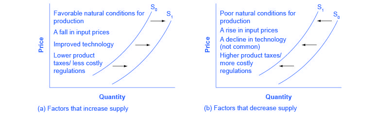

## Table of Contents

## What is a supply curve?

A supply curve is a graph that shows how much of a product people want to sell at different prices. It usually goes up from left to right. This means that if the price is higher, more people will want to sell the product. For example, if you are selling apples, you might be willing to sell more apples if the price per apple goes up.

The supply curve is important because it helps us understand how businesses decide what to sell. When the price of a product goes up, it becomes more profitable for businesses to make and sell that product. So, they will produce more of it. On the other hand, if the price goes down, businesses might not want to sell as much because it's not as profitable. This relationship between price and quantity supplied is what the supply curve shows us.

## What causes a supply curve to shift?

A supply curve can shift because of changes in the costs of making a product. If it becomes cheaper to make something, like if the price of materials goes down or new technology makes production easier, businesses will want to sell more of that product at every price. This makes the supply curve move to the right, showing that more of the product is available. On the other hand, if costs go up, like if workers need to be paid more or if there are new taxes, businesses will want to sell less at every price. This shifts the supply curve to the left, showing that less of the product is available.

Another reason for a supply curve to shift is changes in the number of sellers. If more businesses start selling the same product, the total amount of that product on the market goes up. This shifts the supply curve to the right. If some businesses stop selling the product, maybe because they go out of business or switch to selling something else, the total amount of the product on the market goes down. This shifts the supply curve to the left. So, the number of sellers can also change how much of a product is available at different prices.

## How do changes in production costs affect the supply curve?

Changes in production costs can make the supply curve move. If it costs less to make a product, like if materials get cheaper or new machines make things faster, businesses will want to sell more of that product at every price. This makes the supply curve shift to the right. It means that at any given price, more of the product is available because it's easier and cheaper to make.

On the other hand, if it costs more to make a product, like if workers need more money or there are new taxes, businesses will want to sell less at every price. This makes the supply curve shift to the left. It means that at any given price, less of the product is available because it's harder and more expensive to make. So, the cost of production plays a big role in deciding how much of a product businesses are willing to supply.

## What role do technological advancements play in shifting the supply curve?

Technological advancements can make the supply curve move to the right. When new technology makes it easier or cheaper to make things, businesses can produce more of a product without spending more money. For example, if a new machine helps farmers grow more wheat with less work, they will want to sell more wheat at every price. This means that at any given price, more wheat is available on the market. So, the supply curve shifts to the right because technology helps increase the amount of product that can be made.

On the other hand, if a new technology is very expensive and only a few businesses can afford it, it might not shift the supply curve right away. Only the businesses with the new technology can produce more, while others might still struggle with old methods. Over time, as more businesses get the new technology, the supply curve will start to shift to the right. But in the beginning, the impact might be small because not everyone can use the new technology right away.

## How do government policies and regulations influence the supply curve?

Government policies and regulations can change the supply curve by making it more expensive or cheaper for businesses to make things. If the government puts a new tax on a product, like a tax on cigarettes, it costs more for businesses to sell that product. This makes them want to sell less at every price, so the supply curve shifts to the left. On the other hand, if the government gives businesses money to help them make a product, like subsidies for solar panels, it becomes cheaper to make that product. This makes businesses want to sell more at every price, so the supply curve shifts to the right.

Regulations can also affect the supply curve. If the government makes new rules that businesses have to follow, like rules about pollution, it might cost more to make things because businesses have to buy new equipment or change how they work. This can shift the supply curve to the left because it's more expensive to produce the product. But if the government makes rules that help businesses, like making it easier to get permits for building factories, it can be cheaper and faster to make things. This can shift the supply curve to the right because businesses can produce more at every price.

## What impact do natural events and disasters have on the supply curve?

Natural events and disasters can change the supply curve by making it harder for businesses to make things. If there's a big storm or earthquake, it might damage factories or farms. This means businesses can't make as much of their product as before. For example, if a hurricane destroys orange groves, there will be fewer oranges to sell. This makes the supply curve shift to the left because at every price, there are fewer oranges available.

On the other hand, if a natural event helps production, like good weather for crops, it can make the supply curve shift to the right. If there's a lot of rain and sunshine, farmers might grow more wheat than usual. This means there's more wheat to sell at every price. So, the supply curve moves to the right because more wheat is available on the market. Natural events can have a big impact on how much of a product businesses can supply.

## How do changes in the number of suppliers affect the supply curve?

When more businesses start selling a product, it changes the supply curve. If more people want to sell something, like more farmers growing apples, there will be more apples available at every price. This makes the supply curve shift to the right. It means that at any price, there are more apples for people to buy because there are more sellers.

On the other hand, if some businesses stop selling a product, it also affects the supply curve. If fewer farmers are growing apples because some went out of business, there will be fewer apples to sell. This makes the supply curve shift to the left. It means that at any price, there are fewer apples available because there are fewer sellers. So, the number of suppliers can make a big difference in how much of a product is available on the market.

## What is the effect of expectations about future prices on the supply curve?

When people who sell things think prices will go up in the future, they might want to sell less now and keep more of their product to sell later. This is because they can make more money if they wait until the price is higher. So, if sellers think the price of their product will go up, they will sell less at every price right now. This makes the supply curve move to the left because there is less of the product available on the market.

On the other hand, if sellers think prices will go down in the future, they might want to sell more now before the price drops. They want to make money while the price is still good. So, if sellers think the price of their product will go down, they will sell more at every price right now. This makes the supply curve move to the right because there is more of the product available on the market. Expectations about future prices can really change how much sellers are willing to supply today.

## How do international trade policies and global market conditions shift the supply curve?

International trade policies and global market conditions can change the supply curve by affecting how much of a product is available in a country. If a country starts to import more of a product because trade policies become easier, like lower tariffs, there will be more of that product available at every price. This makes the supply curve shift to the right. For example, if a country lowers tariffs on cars, more cars can be imported, so there are more cars to sell at every price. On the other hand, if trade policies make it harder to import, like higher tariffs or new restrictions, there will be less of the product available. This makes the supply curve shift to the left because fewer cars can be brought into the country.

Global market conditions also play a big role in shifting the supply curve. If there is a lot of a product available around the world, like a big harvest of wheat, the supply curve in a country that imports wheat will shift to the right. This is because there is more wheat to buy from other countries at every price. But if there is less of a product available globally, like if a disease affects coffee plants, the supply curve will shift to the left. This is because there is less coffee to buy from other countries, so less coffee is available at every price. So, what happens in the global market can change how much of a product is available in a country.

## What is the relationship between input prices and shifts in the supply curve?

When the prices of things that businesses need to make their products go up, it costs more to make those products. This means businesses will want to sell less at every price because it's not as profitable. So, if the price of materials like steel or labor goes up, the supply curve will shift to the left. This shows that at any given price, there is less of the product available because it's more expensive to make.

On the other hand, if the prices of things businesses need go down, it becomes cheaper to make products. This makes businesses want to sell more at every price because it's more profitable. So, if the price of materials like cotton or energy goes down, the supply curve will shift to the right. This shows that at any given price, there is more of the product available because it's cheaper to make.

## How can subsidies and taxes alter the supply curve?

Subsidies and taxes can change how much of a product businesses want to sell. When the government gives businesses money to help them make a product, this is called a subsidy. Subsidies make it cheaper for businesses to make things. So, if the government gives money to farmers to grow corn, it costs less for them to grow corn. This makes farmers want to sell more corn at every price because they can make more money. So, the supply curve shifts to the right because more corn is available.

On the other hand, taxes make it more expensive for businesses to sell things. If the government puts a tax on a product, like a tax on cigarettes, it costs more for businesses to sell that product. This makes businesses want to sell less at every price because it's not as profitable. So, the supply curve shifts to the left because there is less of the product available. Subsidies and taxes can have a big impact on how much of a product businesses are willing to supply.

## What advanced economic theories explain complex shifts in the supply curve?

Some advanced economic theories help us understand why the supply curve can change in complicated ways. One theory is about how businesses expect prices to change in the future. If businesses think prices will go up later, they might decide to produce less now and more later when they can sell at a higher price. This can make the supply curve shift to the left now but shift to the right later. Another theory looks at how businesses think about risk and uncertainty. If making a product feels too risky because of things like changing laws or unpredictable markets, businesses might produce less of it. This can shift the supply curve to the left because they are less willing to take the risk.

Another important theory is about how businesses work together or compete. If businesses in an industry decide to work together to control how much they produce, like in a cartel, they can shift the supply curve to the left to keep prices high. But if new businesses enter the market and start competing, they might produce more to try to sell at lower prices, which can shift the supply curve to the right. These theories show that the supply curve can shift because of what businesses think will happen and how they choose to work with each other or compete.

## References & Further Reading

[1]: Hull, J. C. (2018). ["Options, Futures, and Other Derivatives."](https://www.semanticscholar.org/paper/Options%2C-Futures%2C-and-Other-Derivatives-Hull/89bdee500c8623864fc9eb7a471546aa713acc44) Pearson.

[2]: López de Prado, M. (2018). ["Advances in Financial Machine Learning."](https://www.amazon.com/Advances-Financial-Machine-Learning-Marcos/dp/1119482089) Wiley.

[3]: Chan, E. P. (2009). ["Quantitative Trading: How to Build Your Own Algorithmic Trading Business."](https://github.com/ftvision/quant_trading_echan_book) Wiley.

[4]: Jansen, S. (2020). ["Machine Learning for Algorithmic Trading - Second Edition."](https://www.amazon.com/Machine-Learning-Algorithmic-Trading-alternative/dp/1839217715) Packt Publishing.

[5]: The Economist. (2015). ["The new economics of oil: Sheikhs vs shale,"](https://www.economist.com/leaders/2014/12/04/sheikhs-v-shale) The Economist.

[6]: Aronson, D. (2007). ["Evidence-Based Technical Analysis: Applying the Scientific Method and Statistical Inference to Trading Signals."](https://www.wiley.com/en-us/Evidence+Based+Technical+Analysis%3A+Applying+the+Scientific+Method+and+Statistical+Inference+to+Trading+Signals-p-9780470008744) Wiley.