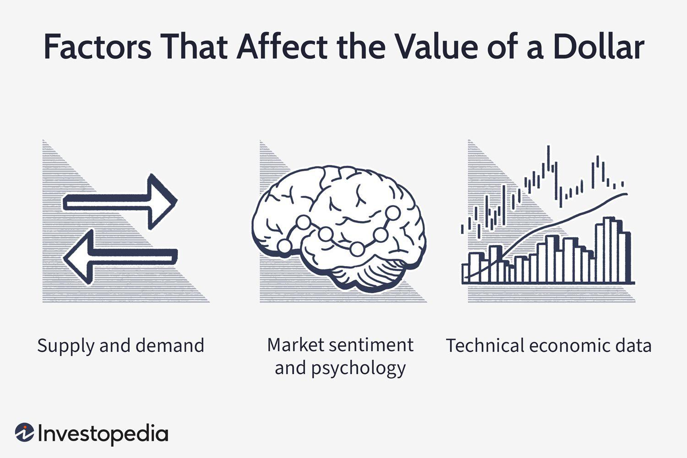

Understanding the factors that influence the U.S. dollar's value is crucial for traders and investors. The U.S. dollar (USD) serves as the world's primary reserve currency, meaning it is held in significant quantities by governments and institutions as part of their foreign exchange reserves. Its value impacts global trade and finance significantly.

Algorithmic trading, or algo trading, leverages these factors to execute trades based on pre-defined criteria. Algo trading systems use mathematical models and complex algorithms to make decisions at speeds beyond human capability, thereby capitalizing on tiny price fluctuations in the forex markets. The efficacy of these systems is heavily reliant on accurate data input relating to economic conditions that affect currency valuations.



Economic factors play a pivotal role in determining the U.S. dollar’s value within forex markets. Key among these factors are supply and demand dynamics, market sentiment toward geopolitical and economic developments, and a range of economic indicators such as GDP growth, inflation rates, and employment figures. Each element contributes uniquely to the currency's strength or weakness.

This article explores the core economic determinants influencing the U.S. dollar and their integration into algorithmic trading strategies. The fusion of economic insight with technological prowess allows market participants to develop more informed, agile, and strategic approaches to currency trading amidst today's rapidly evolving financial landscapes. Understanding this interplay is essential for traders who wish to navigate the complexities of the forex market effectively.

## Table of Contents

## Supply and Demand Dynamics

The U.S. dollar's value is fundamentally governed by supply and demand dynamics within the global market. A key factor in demand fluctuations comes from international trade activities, particularly exports and imports. When the United States exports goods, foreign buyers need to purchase dollars to complete transactions, increasing demand for the currency. Conversely, imports require U.S. entities to trade dollars for foreign currencies, impacting demand negatively. Foreign investment also plays a significant role, as investors seeking U.S. assets must convert their local currencies into dollars, driving up demand.

Central banks, through their monetary policies, can influence the supply of the dollar. By altering interest rates or engaging in open market operations, the Federal Reserve and other central banks can increase or decrease the money supply, indirectly affecting the dollar's value. For example, a rise in interest rates typically attracts foreign capital investment, boosting the dollar's demand and potentially its value.

Algorithmic trading systems are designed to monitor these supply and demand dynamics closely. These systems integrate a variety of data sources, including trade flows and monetary policy shifts, to make predictions about currency value changes. Using [machine learning](/wiki/machine-learning) algorithms, such systems can analyze historical patterns and real-time data to identify trends and potential shifts in the dollar's value. By simulating supply-demand models, [algorithmic trading](/wiki/algorithmic-trading) can react swiftly to market alterations, enabling traders to capitalize on potential profit opportunities. Here's a simple Python code snippet that illustrates how an algo-trading system might incorporate supply and demand data:

```python
import numpy as np

# Simulated data for exports, imports, and foreign investment
exports = np.array([200, 220, 210])
imports = np.array([180, 200, 195])
foreign_investment = np.array([150, 160, 170])

# Calculate net demand for USD
net_demand = exports - imports + foreign_investment

# Simulate market impact on USD value
usd_value_changes = net_demand * 0.01  # Simplified model

print("USD Value Changes:", usd_value_changes)
```

This code uses simple simulated data to illustrate how changes in exports, imports, and foreign investment could influence the value of the U.S. dollar. More sophisticated systems would integrate real-world data and use complex models to generate trading signals. Understanding these core supply and demand mechanics is crucial for traders employing algorithmic strategies to navigate the [forex](/wiki/forex-system) market effectively.

## Market Sentiment and Investor Behavior

Market sentiment significantly impacts the value of the U.S. dollar, often driven by geopolitical events and economic data releases. Traders and investors closely watch these developments to interpret the underlying tone of the market, which, in turn, affects their demand for the dollar.

Investors' perception of the U.S. economic stability is paramount in influencing their demand for the currency. When the U.S. economy is perceived to be stable and robust, investors are more likely to hold onto their dollar assets or seek out additional dollar-denominated investments. Conversely, any perception of instability—be it from unexpected political developments, natural disasters, or economic downturns—may lead investors to divest from the dollar, thus affecting its value.

Algorithmic models play a critical role in this context by incorporating sentiment analysis into their trading strategies. These models utilize advanced machine learning techniques to process large volumes of textual data, particularly from news articles, social media, and financial reports. By analyzing the sentiment expressed in these sources, the models can gauge the market's mood and adjust trading positions accordingly.

For practical implementation, algorithms can be developed using Python's Natural Language Toolkit (NLTK) or more advanced libraries such as SpaCy or Hugging Face's Transformers. Here's a basic example using Python to parse news data for sentiment analysis:

```python
from textblob import TextBlob
import requests

def analyze_sentiment(news_headlines):
    sentiments = []
    for headline in news_headlines:
        blob = TextBlob(headline)
        sentiment = blob.sentiment.polarity
        sentiments.append(sentiment)
    return sentiments

# Example usage with hypothetical news headlines
news = ["U.S. economy shows signs of growth amid global uncertainty",
        "Political tensions in Washington affect market outlook",
        "Federal Reserve hints at possible interest rate hike"]

sentiment_scores = analyze_sentiment(news)
print(sentiment_scores)
```

Trading systems may exploit this sentiment analysis to anticipate market movements before they unfold. Positive sentiment, for instance, might lead to increased dollar demand, whereas negative sentiment could predict a sell-off. Thus, integrating sentiment analysis into algorithmic trading provides the foresight necessary to navigate the complex dynamics of forex markets effectively.

## Economic Indicators and Data

Key economic indicators such as Gross Domestic Product (GDP), inflation, and unemployment rates are essential in determining the valuation of the U.S. dollar in forex markets. These indicators provide insights into the economic health of the nation, influencing investor sentiment and market dynamics.

GDP, as the total monetary or market value of all finished goods and services produced within a country's borders in a specific time period, is a primary indicator of economic performance. A growing GDP is often interpreted as a strong economy, potentially leading to an appreciation of the U.S. dollar. Conversely, a decline in GDP may signal economic troubles, which can result in a weaker dollar.

Inflation reflects the rate at which the general level of prices for goods and services rises, eroding purchasing power. Central banks monitor inflation to make decisions about interest rates, affecting currency value. High inflation typically devalues a currency as purchasing power declines; however, if the Federal Reserve raises interest rates to combat inflation, it might strengthen the dollar by attracting foreign investment seeking higher returns.

Unemployment rates provide insights into labor market health and overall economic stability. Higher unemployment may indicate economic distress, potentially weakening the currency as consumer spending and economic activity reduce. Conversely, low unemployment suggests economic robustness, potentially boosting the currency’s value.

Traders utilize economic calendars to plan their trades around major economic announcements such as Non-Farm Payrolls, Consumer Price Index (CPI) releases, and Federal Open Market Committee (FOMC) meetings. These events can cause significant [volatility](/wiki/volatility-trading-strategies) in the forex market, and anticipating these movements allows traders to capitalize on currency fluctuations.

Algorithmic trading systems leverage machine learning models to forecast the outcomes of economic releases and their potential impacts on the U.S. dollar. For instance, a model might predict the effect of an unexpected GDP growth rate on the dollar by analyzing historical data patterns. Python libraries such as scikit-learn or TensorFlow can be employed for building predictive models:

```python
from sklearn.ensemble import RandomForestRegressor
from sklearn.model_selection import train_test_split

# Assuming data is in a pandas DataFrame called df
X = df[['previous_gdp', 'current_inflation', 'unemployment_rate']]
y = df['usd_value_post_announcement']

X_train, X_test, y_train, y_test = train_test_split(X, y, test_size=0.2, random_state=42)

model = RandomForestRegressor(n_estimators=100, random_state=42)
model.fit(X_train, y_train)

predictions = model.predict(X_test)
```

Understanding these economic indicators allows traders to position themselves strategically, taking advantage of data-driven insights to maximize profitability in the forex markets. By analyzing these factors, traders can anticipate currency movements, leveraging both traditional analysis and modern algorithmic technologies to enhance decision-making processes.

## Role of Federal Reserve and Monetary Policy

The Federal Reserve's monetary policy decisions are pivotal in influencing the value of the U.S. dollar. Central to these decisions are [interest rate](/wiki/interest-rate-trading-strategies) adjustments, which play a substantial role in the global flow of capital. When the Federal Reserve raises interest rates, the returns on assets denominated in U.S. dollars increase, making them more attractive to foreign investors. This increased demand for dollar-denominated assets often leads to an appreciation of the dollar. Conversely, lower interest rates might deter foreign investment, leading to a potential depreciation of the currency.

Algorithmic trading systems incorporate models that predict the potential paths of Federal Reserve policies. These systems assess economic data, such as employment [statistics](/wiki/bayesian-statistics) and inflation rates, which are key factors that influence Fed decisions. By analyzing historical data trends and simulating potential outcomes, algorithms can adjust trading strategies to capitalize on anticipated interest rate changes. For instance, a simplified model might use the Taylor Rule, which relates the federal funds rate (i) to the inflation rate (π) and the output gap (y):

$$
i = r^* + \pi + 0.5(\pi - \pi^*) + 0.5y
$$

where $r^*$ is the real interest rate, and $\pi^*$ is the target inflation rate.

Market anticipation of monetary policy can lead to significant moves in currency markets even before official announcements are made. This occurs because traders analyze Fed communications, such as meeting minutes and press releases, to gauge future policy directions. The phenomenon of "buying the rumor, selling the news" is a common strategy where market participants position themselves based on expected policy changes. This anticipation can create pre-emptive currency movements, which are monitored and utilized by algorithmic trading systems to optimize trade execution and timing.

Incorporating sophisticated techniques like natural language processing, some algorithmic models assess the sentiment and tone of Federal Reserve speeches to predict policy shifts. By swiftly analyzing qualitative data, these systems enhance the predictive accuracy of market movements, enabling faster and more informed decision-making. As such, understanding and modeling the Federal Reserve's monetary policy decisions remain vital for traders and investors seeking to maintain a competitive edge in the forex markets.

## Technological Advances in Algorithmic Trading

Advancements in technology have significantly enhanced the application of economic factors in trading, particularly through the development of high-frequency trading ([HFT](/wiki/high-frequency-trading-strategies)) and machine learning algorithms. High-frequency trading, characterized by the execution of thousands of orders within fractions of a second, relies on sophisticated algorithms and state-of-the-art hardware to process and analyze vast datasets almost instantaneously. This capability enables traders to exploit minute changes in economic indicators that might go unnoticed by human traders, thus offering a strategic advantage in the highly competitive forex market.

Machine learning algorithms, often implemented in Python, further contribute to the efficacy of algorithmic trading systems. By training on historical market data, these algorithms can identify complex patterns and predict future price movements with a high degree of accuracy. A simple Python example may involve utilizing libraries such as Scikit-learn or TensorFlow to build predictive models:

```python
from sklearn.ensemble import RandomForestRegressor
import numpy as np

# Sample data: features could include historical prices, economic indicators, etc.
X = np.array([[1.2, 3.4, 5.6], [1.5, 3.8, 5.9]])  # Example feature set
y = np.array([1.0, 0.9])  # Target variable: future price movements

# Create Random Forest Regressor model
model = RandomForestRegressor(n_estimators=100, random_state=42)
model.fit(X, y)

# Predict future price movements
predictions = model.predict(np.array([[1.3, 3.5, 5.7]]))
print(predictions)
```

These advancements have refined the methods through which traders incorporate economic data into their decision-making processes. By employing algorithms capable of processing information across multiple dimensions, traders can develop a multifaceted understanding of market conditions and react swiftly to new information.

Furthermore, blockchain and distributed ledger technologies are also beginning to influence algorithmic trading. They offer enhanced security, transparency, and efficiency in the execution of trades. An understanding of these technological elements is crucial for enhancing the strategic deployment of algorithmic trading systems. As technology continues to evolve, it will inevitably integrate more deeply into trading processes, driving the need for continuous adaptation and learning among participants in the forex market.

## Conclusion

The interplay of economic factors and technology in algorithmic trading provides sophisticated methodologies for analyzing the U.S. dollar's movements. By understanding these economic drivers—such as supply and demand dynamics, market sentiment, economic indicators, and monetary policy—traders are better positioned to make data-driven decisions. Algorithmic trading systems that integrate real-time data analytics, machine learning, and advanced computational power allow traders to process immense quantities of information, enabling timely and efficient responses to market developments.

As global markets advance, the complexities they introduce heighten the need for algorithmic strategies to navigate currency fluctuations effectively. The progression toward data-centric analysis in trading is more than a trend; it represents a paradigm shift in how currency trading is conducted. The ability of algorithmic systems to continuously learn from new data and adapt strategies accordingly ensures that traders can maintain an edge amidst ever-evolving market conditions.

Continuous learning and adaptation are fundamental in thriving within forex markets, particularly given the growing sophistication of trading technologies. The emphasis on continual enhancement of algorithmic models, driven by new data inputs and evolving economic conditions, underlines the critical role of technology in modern trading practices. This constant evolution and adaptation help traders keep pace with rapid changes and maintain a competitive edge in a complex and interconnected global market landscape.

## References & Further Reading

[1]: Bergstra, J., Bardenet, R., Bengio, Y., & Kégl, B. (2011). ["Algorithms for Hyper-Parameter Optimization."](https://papers.nips.cc/paper/4443-algorithms-for-hyper-parameter-optimization) Advances in Neural Information Processing Systems 24.

[2]: ["Advances in Financial Machine Learning"](https://www.amazon.com/Advances-Financial-Machine-Learning-Marcos/dp/1119482089) by Marcos Lopez de Prado

[3]: ["Evidence-Based Technical Analysis: Applying the Scientific Method and Statistical Inference to Trading Signals"](https://www.amazon.com/Evidence-Based-Technical-Analysis-Scientific-Statistical/dp/0470008741) by David Aronson

[4]: ["Machine Learning for Algorithmic Trading"](https://github.com/stefan-jansen/machine-learning-for-trading) by Stefan Jansen

[5]: ["Quantitative Trading: How to Build Your Own Algorithmic Trading Business"](https://www.amazon.com/Quantitative-Trading-Build-Algorithmic-Business/dp/1119800064) by Ernest P. Chan