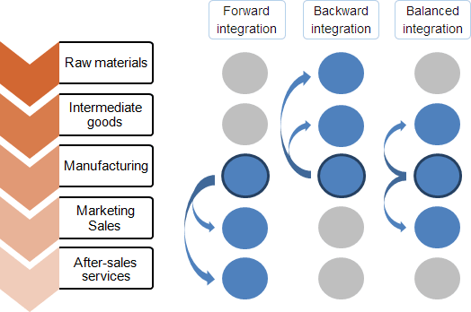

## Table of Contents

## What is vertical integration?

Vertical integration is when a company takes control of more than one stage of the production process for its products. Instead of just making the product, the company might also handle the raw materials, manufacturing, and even the selling of the product. This means the company can do everything from start to finish, which can help them save money and have more control over how things are done.

For example, a car company might decide to buy a tire factory. This way, they don't have to buy tires from another company; they can make their own. This can help them save money because they don't have to pay another company for tires. It can also make sure they always have enough tires, which can help them make more cars faster. But, it can also be risky because if something goes wrong at the tire factory, it can affect the whole car company.

## What are the different types of vertical integration?

There are two main types of vertical integration: forward integration and backward integration. Forward integration happens when a company takes over the next step in the process after making their product. For example, a company that makes cereal might buy stores that sell cereal. This way, they can control how their cereal is sold to customers. Backward integration is when a company takes over the steps that happen before they make their product. For instance, a furniture company might buy a wood mill. This lets them control where they get their wood from, which is important for making furniture.

Sometimes, a company might do both forward and backward integration at the same time. This is called balanced integration. For example, a coffee company might buy coffee farms (backward integration) and also buy coffee shops (forward integration). By doing this, they control the whole process from growing the coffee beans to selling the coffee to customers. Each type of integration can help a company save money and have more control, but it can also be risky if something goes wrong at any step.

## Why do companies choose to vertically integrate?

Companies choose to vertically integrate because it can help them save money and have more control over their business. When a company controls more parts of the process, from making the product to selling it, they can cut down on costs. For example, if a company makes its own parts instead of buying them from someone else, they might save money. Also, if they own the stores that sell their products, they don't have to pay another company to do that. This can make the company more profitable.

Another reason companies go for vertical integration is to have more control over their supply chain and how their products are made and sold. If a company owns the factories that make their products, they can make sure everything is done the way they want. They can also make sure they always have the materials they need, which can help them make more products faster. But, it's not always easy. If something goes wrong at any part of the process they control, it can cause big problems for the whole company.

## What are the potential benefits of vertical integration for a company?

Vertical integration can help a company save money. When a company controls more steps in making and selling their product, they don't have to pay other companies to do these things. For example, if a car company makes its own tires instead of buying them, they can save money on tire costs. This can make the company more profitable because they are spending less money to make their product. Saving money on costs can also help the company sell their products at a lower price, which might attract more customers.

Another benefit of vertical integration is that it gives a company more control over their business. When a company owns the factories that make their products, they can make sure everything is done the way they want. They can also make sure they always have the materials they need, which can help them make more products faster. For example, if a furniture company owns a wood mill, they can make sure they always have enough wood to make furniture. This control can help the company run more smoothly and be more efficient.

But, vertical integration isn't always easy. If something goes wrong at any part of the process the company controls, it can cause big problems. For example, if the tire factory has a problem, it can stop the car company from making cars. So, while vertical integration can help a company save money and have more control, it also comes with risks that the company needs to manage carefully.

## What are the potential risks and challenges associated with vertical integration?

Vertical integration can be risky for a company because if something goes wrong at any part of the process they control, it can cause big problems. For example, if a car company owns a tire factory and the factory has a problem, it can stop the company from making cars. This can lead to delays and lost sales, which can hurt the company's profits. Also, if the company spends a lot of money to buy other businesses, like factories or stores, and those businesses don't do well, the company can lose a lot of money.

Another challenge with vertical integration is that it can make a company less flexible. When a company controls many steps of the production process, it can be harder for them to change if something in the market changes. For example, if a new technology comes out that makes the company's products less popular, it might be harder for them to switch to making something new because they have so much invested in the old way of doing things. This can make it harder for the company to keep up with competitors who might be able to change more quickly.

Lastly, managing a vertically integrated company can be more complicated. The company has to deal with more parts of the business, which means more things to keep track of and more decisions to make. This can be hard for the company's leaders and might require them to hire more people or spend more time managing different parts of the business. If they don't manage well, it can lead to mistakes and inefficiencies, which can make the company less successful.

## How does market structure influence a company's decision to vertically integrate?

Market structure can play a big role in whether a company decides to vertically integrate. If a company is in a market where there are only a few big companies, called an oligopoly, they might choose to vertically integrate to stay competitive. By controlling more parts of the production process, they can save money and have more control over their products. This can help them keep up with or even beat their competitors. Also, in a market where it's hard to get the materials or parts they need, vertical integration can help a company make sure they always have what they need to keep making their products.

On the other hand, in a market with lots of small companies, called a competitive market, vertical integration might not be as helpful. In this kind of market, companies often focus on being able to change quickly to meet customer needs. Vertical integration can make a company less flexible because it ties them to certain ways of doing things. So, in a competitive market, a company might decide that the risks of vertical integration, like the cost of buying other businesses and the chance of something going wrong, are too high compared to the benefits.

In some cases, the government might also affect a company's decision to vertically integrate. If the government has rules against companies getting too big or controlling too much of the market, called antitrust laws, a company might decide that vertical integration is too risky. They might worry about getting in trouble with the government or having to deal with a lot of legal issues. So, the market structure and government rules together can make a big difference in whether a company chooses to vertically integrate.

## What role does technology play in facilitating vertical integration?

Technology can make vertical integration easier for companies. With new technology, companies can better manage the different parts of their business. For example, they can use computer systems to keep track of their supplies and production. This helps them make sure they always have the materials they need and can make their products more efficiently. Technology also lets companies share information quickly between different parts of their business, like from the factory to the stores. This can help them work together better and make decisions faster.

Another way technology helps with vertical integration is by making it easier to control quality. With new machines and systems, companies can check their products at every step of the process. This can help them make sure their products are always good quality, which is important for keeping customers happy. Technology also lets companies do things like automate parts of their production, which can save them money and time. So, technology can make vertical integration more effective and less risky for companies.

## How do regulatory environments affect vertical integration strategies?

Regulatory environments can have a big impact on a company's decision to vertically integrate. Governments often have rules, called antitrust laws, that stop companies from getting too big or controlling too much of the market. If a company wants to vertically integrate, they might worry about breaking these rules. They could face fines or legal problems if the government thinks they are trying to control too much of the market. So, companies need to think carefully about these rules before they decide to vertically integrate.

In some countries, the rules might be stricter than in others. For example, in the United States, the government watches closely to make sure companies don't use vertical integration to hurt competition. If a company wants to buy another business, they might have to get permission from the government first. This can make vertical integration more complicated and risky. On the other hand, in countries with fewer rules, companies might find it easier to vertically integrate. But, they still need to be careful because even if the rules are not strict, the government might still step in if they think a company is getting too powerful.

## Can you provide examples of successful vertical integration in various industries?

In the tech industry, Apple is a good example of successful vertical integration. Apple makes its own hardware, like iPhones and MacBooks, and also creates its own software, like iOS and macOS. By doing this, Apple can make sure that their hardware and software work well together. This helps them give customers a better experience and keeps them ahead of other companies. Apple also has its own stores, both online and in-person, where they sell their products directly to customers. This lets them control how their products are sold and helps them make more money.

In the car industry, Tesla has used vertical integration to become successful. Tesla doesn't just make cars; they also make many of the parts that go into their cars, like batteries and motors. This helps them control the quality of their cars and save money by not having to buy parts from other companies. Tesla also sells its cars directly to customers through their own stores and website, instead of using car dealerships. This gives them more control over the sales process and helps them build a closer relationship with their customers.

## How does vertical integration impact supply chain management?

Vertical integration can make supply chain management easier for a company. When a company controls more parts of the process, from making the product to selling it, they can keep a closer eye on everything. This means they can make sure they always have the materials they need and can make their products faster. For example, if a company owns the factory that makes their products, they can quickly change how much they make if they need to. This can help them meet customer needs better and save money by not having to wait for parts from other companies.

But, vertical integration can also make supply chain management more complicated. If something goes wrong at any part of the process the company controls, it can cause big problems. For example, if a factory that the company owns has a problem, it can stop the whole supply chain. This can lead to delays and lost sales, which can hurt the company's profits. So, while vertical integration can help a company have more control over their supply chain, it also means they have to manage more things and be ready to fix problems quickly.

## What are the financial implications of vertical integration for a company?

Vertical integration can help a company save money. When a company controls more steps in making and selling their product, they don't have to pay other companies to do these things. For example, if a car company makes its own tires instead of buying them, they can save money on tire costs. This can make the company more profitable because they are spending less money to make their product. Saving money on costs can also help the company sell their products at a lower price, which might attract more customers. But, vertical integration can also be expensive. A company might need to spend a lot of money to buy other businesses, like factories or stores. If those businesses don't do well, the company can lose a lot of money.

Another financial implication of vertical integration is that it can affect a company's cash flow. When a company buys other businesses, they need to use a lot of money upfront. This can make it harder for them to have enough money for other things they need, like paying their workers or investing in new projects. But, if vertical integration works well, it can help the company make more money in the long run. By controlling more parts of the process, the company can make their products more efficiently and sell them for more profit. So, while vertical integration can be a big financial risk, it can also lead to big financial rewards if it's done right.

## How can a company assess whether vertical integration is the right strategy for them?

A company can assess whether vertical integration is the right strategy by looking at their costs and how much control they want over their business. If a company can save a lot of money by making their own parts or selling their own products, vertical integration might be a good idea. They should compare the costs of buying other businesses to the money they could save by controlling more of the process. If the savings are more than the costs, it could be worth it. But, they also need to think about the risks. If something goes wrong at any part of the process they control, it can hurt their whole business. So, they need to weigh the potential savings against the potential risks.

Another thing a company should think about is how vertical integration might affect their flexibility. If the market changes quickly, like if new technology comes out, a company that is vertically integrated might find it harder to change. They need to decide if the benefits of having more control are worth the risk of being less flexible. They should also look at the competition. If other companies in their market are vertically integrated and doing well, it might be a good idea for them to do the same. But, if the market is very competitive and changes a lot, they might decide that staying flexible is more important than trying to save money through vertical integration.

Lastly, a company should consider the regulatory environment. If the government has strict rules about companies getting too big or controlling too much of the market, vertical integration might be risky. The company could face fines or legal problems if they break these rules. So, they need to understand the laws in their country and think about how these might affect their plans. By looking at all these things - costs, control, flexibility, competition, and regulations - a company can make a smart decision about whether vertical integration is the right strategy for them.

## References & Further Reading

[1]: Harrigan, K. R. (1986). ["Matching vertical integration strategies to competitive conditions"](https://www.jstor.org/stable/2486138). Strategic Management Journal, 7(6), 535-555.

[2]: Porter, M. E. (1980). "Competitive Strategy: Techniques for Analyzing Industries and Competitors". Free Press, New York.

[3]: Lopez de Prado, M. (2018). ["Advances in Financial Machine Learning"](https://www.amazon.com/Advances-Financial-Machine-Learning-Marcos/dp/1119482089). Wiley.

[4]: Coffee, J. C. (1991). ["The Future of Corporate Federalism: State Competition and the New Trend Towards De Facto Federal Minimum Standards"](https://www.jstor.org/stable/27212396). Michigan Law Review, 90(2), 1929-1952.

[5]: Aronson, D. R. (2006). ["Evidence-Based Technical Analysis: Applying the Scientific Method and Statistical Inference to Trading Signals"](https://www.amazon.com/Evidence-Based-Technical-Analysis-Scientific-Statistical/dp/0470008741). Wiley.

[6]: Jansen, S. (2020). ["Machine Learning for Algorithmic Trading"](https://github.com/stefan-jansen/machine-learning-for-trading). Packt Publishing.

[7]: Chandler, A. D. Jr. (1990). "Scale and Scope: The Dynamics of Industrial Capitalism". Belknap Press.

[8]: Chandler, A. D. Jr. (1977). "The Visible Hand: The Managerial Revolution in American Business". Harvard University Press.

[9]: Teece, D. J. (1980). ["Economies of scope and the scope of the enterprise"](https://www.sciencedirect.com/science/article/pii/0167268180900025). Journal of Economic Behavior & Organization, 1(3), 223-247.

These references provide a mix of strategic management perspectives and algorithmic trading insights, offering a comprehensive understanding of vertical integration and its implications across various industries.