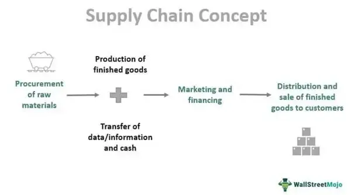

In today's fast-paced business world, strategic decisions are crucial for a company's success. Among the various strategies available to businesses, vertical integration stands out as a comprehensive approach that enhances a firm's control over its supply chain. By overseeing multiple stages of production and distribution, companies can achieve greater efficiency, reduce dependency on third parties, and improve overall quality control, ultimately gaining a competitive edge in their respective markets.

Vertical integration is not limited to traditional industries. Algorithmic trading firms, which operate in highly dynamic and technology-driven environments, also utilize vertical integration to streamline their operations. By consolidating processes such as data acquisition, algorithm development, order execution, and post-trade analysis, these firms can optimize each stage of their trading activities. This results in minimized latency, reduced transaction fees, and improved strategic alignment, providing significant advantages in a competitive trading landscape.

This article will explore how vertical integration influences corporate decision-making and business strategies, and its specific application in algorithmic trading. Through the lens of these practices, we will examine the potential benefits and challenges associated with vertical integration, demonstrating how it remains a powerful strategy for enhancing corporate efficiency and market strength.

## Table of Contents

## Understanding Vertical Integration

Vertical integration is a strategic approach where a company extends its operations across multiple levels of its production and distribution process. This expansion can manifest as either backward or forward integration. Backward integration occurs when a company gains control over its suppliers, thereby securing the resources and raw materials necessary for production. Conversely, forward integration involves the company taking charge of distribution, marketing, and retail operations to directly reach consumers.

The comprehensive nature of vertical integration provides firms with several advantages. One significant benefit is the reduction of costs. By managing multiple stages of the production and supply chain internally, companies can avoid markups that are usually added by third-party suppliers and distributors. This control over the supply chain enables firms to streamline processes, negotiate better terms for raw materials, and reduce reliance on external entities that may have conflicting agendas.

Another benefit is the improvement in quality control. With vertical integration, companies have direct oversight of every stage of their product's journey from inception to final sale. This control allows for consistent quality standards, reducing variability and enhancing customer satisfaction. The ability to implement uniform quality measures along the entire production line can also lead to innovation and improvements that might not be possible when dealing with independent suppliers or retailers.

Vertical integration also enhances supply chain efficiency. By integrating various stages of the supply chain, companies can better synchronize activities like production, inventory management, and logistics. This synchronization minimizes delays and disruptions, ensuring smoother and more predictable operations. It allows for real-time responses to shifts in demand, enabling companies to adjust their production and distribution strategies quickly and effectively.

Overall, vertical integration is a robust strategy that can lead to substantial improvements in cost management, quality assurance, and operational efficiency, making it a valuable consideration for firms seeking to enhance their competitiveness in the market.

## The Role of Vertical Integration in Corporate Decision-Making

Vertical integration plays a crucial role in corporate decision-making by offering numerous strategic advantages, such as reduced dependency on third-party entities and enhanced market power. The decision to vertically integrate requires a comprehensive evaluation of both its potential benefits and associated risks, influencing a company's strategic alignment and long-term goals.

By integrating various components of the supply chain, companies can manage their operations more effectively. For instance, owning production facilities or distribution channels allows businesses to streamline processes, leading to cost reductions and improved quality control. This control over the supply chain can help companies respond swiftly to market demand changes, ensuring timely delivery of products and services.

Vertical integration can also enhance a company's market power by reducing reliance on suppliers and distributors. This autonomy enables firms to negotiate better terms, diversify their revenue streams, and protect intellectual property. Consequently, businesses can focus on innovation and delivering value to customers without external constraints.

However, integrating vertically involves careful consideration of potential risks. The initial investment required for acquiring or establishing supply chain components can be substantial. Moreover, managing a more extensive range of operations increases operational complexity and necessitates robust organizational capabilities. Companies must also navigate regulatory landscapes as integration can attract scrutiny from competition authorities concerned about monopolistic practices.

To assess whether vertical integration aligns with their strategic objectives, firms often conduct a thorough cost-benefit analysis. This analysis includes evaluating the financial implications, competitive landscape, and potential impact on operational efficiency. By analyzing these factors, companies make informed decisions about whether vertical integration will enhance their strategic positioning in the industry.

Overall, vertical integration offers a path to greater control and efficiency in corporate operations, but it requires a strategic evaluation of the interplay between costs, operational capabilities, and market dynamics.

## Business Strategy: The Case for Vertical Integration

Vertical integration is a strategic approach that has allowed companies like Apple and Starbucks to gain a significant competitive edge by controlling multiple stages of their production, distribution, and sales processes. By owning the various components of their supply chains, these corporations can manage costs, maintain quality, and respond swiftly to market changes, thus reinforcing their market positions.

Apple's success in vertical integration is evident through its tight control over hardware and software development. By manufacturing its own hardware and developing its software ecosystem, Apple ensures seamless compatibility and quality across its product range. This integration extends to its retail operations, where Apple Stores serve as exclusive channels for its products, providing a consistent brand experience. Such a cohesive strategy not only boosts operational efficiency but also enhances brand loyalty and customer engagement.

Similarly, Starbucks exemplifies vertical integration through its extensive control over coffee cultivation and supply chain. The company sources high-quality coffee beans directly from growers and processes them in its own facilities. By doing so, Starbucks maintains stringent quality standards and reduces reliance on third-party suppliers. This strategy also enables the company to introduce innovative products swiftly and sustain a premium market position.

Vertical integration, by streamlining operations, minimizes transaction costs and reduces the risk of supply chain disruptions. It also allows companies to secure inputs, improve profit margins, and adapt swiftly to consumer preferences. As these case studies illustrate, effective integration can fortify a company's market leadership and ensure long-term sustainability in a competitive environment.

## Algorithmic Trading and Vertical Integration

In [algorithmic trading](/wiki/algorithmic-trading), vertical integration involves the consolidation of various trading processes within a single firm to enhance efficiency and control over its operations. This strategy enables trading firms to manage all crucial components, including data acquisition, algorithm development, order execution, and post-trade analysis, under one unified management structure.

Data acquisition forms the foundation of algorithmic trading, serving as the first step in the trading process. By vertically integrating data acquisition, firms can ensure access to high-quality, real-time data streams that are essential for accurate market predictions. This not only reduces dependency on third-party data providers but also minimizes data latency, a critical [factor](/wiki/factor-investing) in high-frequency trading environments. With direct control over data sourcing, firms can tailor data feed specifications to better meet their strategic requirements.

Algorithm development, being central to the success of trading strategies, benefits significantly from vertical integration. This stage involves designing algorithms that can process data and identify trading opportunities with precision. By bringing algorithm development in-house, firms maintain greater confidentiality of their proprietary trading strategies and align development efforts directly with market objectives. This vertical integration allows for closer collaboration between quantitative analysts and software developers, fostering innovation and leading to more robust and responsive algorithms.

Order execution, another vital component, is optimized through vertical integration by consolidating the execution infrastructure. Firms can implement their own execution systems, thereby reducing reliance on external brokerage services. This direct control over execution speeds enhances transaction efficiency and lowers transaction fees. Reduced execution latency provides a competitive edge, especially in markets where microseconds can determine the success or failure of a trade.

Post-trade analysis is the final step in the trading process, and integrating this component allows firms to thoroughly evaluate performance metrics and risk exposures. By controlling post-trade activities, companies can develop comprehensive feedback loops that inform future trading strategies, leading to continual improvement and refinement of algorithmic models.

While the integration of these processes provides significant benefits, it also requires a substantial initial investment in technology and infrastructure. Companies must balance these upfront costs against the long-term advantages gained through improved efficiency, lower costs, and enhanced strategic control. Moreover, the complex nature of financial regulations necessitates careful compliance management to avoid legal pitfalls.

In summary, vertical integration within algorithmic trading streamlines operations, minimizes latency, and reduces transaction fees, providing trading firms with substantial competitive advantages in a rapidly evolving market.

## Benefits and Challenges of Vertical Integration

Vertical integration offers numerous advantages that can significantly enhance a company's operational and financial performance. One of the primary benefits is cost savings, achieved through the elimination of intermediaries, bulk purchasing, and streamlined operations. By controlling multiple levels of the supply chain, companies can also reduce transaction costs and avoid markups imposed by external suppliers or distributors.

Improved efficiency is another critical advantage of vertical integration. By consolidating operations under one management structure, firms can optimize processes, leading to faster production cycles, reduced lead times, and improved product quality. This control facilitates better coordination among different stages of production and distribution, resulting in less wastage and more consistent output.

Enhanced risk management is an additional benefit. Companies engaged in vertical integration are less vulnerable to supply chain disruptions since they have direct control over key inputs and processes. This autonomy allows firms to respond more swiftly to market changes, adjust production schedules as needed, and maintain more reliable supply channels.

Despite these advantages, vertical integration poses significant challenges. The initial investment required for acquiring or developing new stages of production can be substantial, often demanding significant capital outlays. These investments may take time to recoup, adding financial pressure on the company.

Moreover, managing a vertically integrated enterprise introduces increased complexity. As businesses expand their control over the supply chain, they must navigate the intricacies of additional operational layers, which require robust management systems and effective coordination mechanisms to maintain efficiency.

Regulatory hurdles also present considerable challenges. Companies may face stricter scrutiny from governmental bodies concerned with antitrust issues, as vertical integration can sometimes lead to monopolistic behaviors or unfair market advantages. Firms must ensure compliance with all relevant regulations to avoid legal repercussions.

As companies consider vertical integration, they must carefully assess these benefits and challenges. Weighing the potential for cost savings and efficiency improvements against the financial, operational, and regulatory complexities is crucial. Strategic planning and thorough market analysis are essential for making informed decisions that align with the company's long-term goals and competitive strategy.

## Conclusion

Vertical integration remains a powerful strategy for enhancing corporate efficiency and market strength. By controlling multiple stages of the supply chain, both traditional companies and algorithmic trading firms can achieve substantial competitive advantages. This strategic approach allows firms to align their operational processes more closely with their business objectives, leading to cost reductions, improved quality control, and greater market responsiveness.

In traditional industries, vertical integration can solidify a company's market presence by reducing reliance on external suppliers and distributors. It empowers companies to maintain stringent quality standards and fosters innovation through better resource management. For example, companies like Apple integrate their hardware and software development processes to create a seamless consumer experience, while Starbucks controls coffee bean sourcing and distribution to ensure product quality and supply consistency.

Algorithmic trading firms benefit similarly by vertical integration through the consolidation of data acquisition, algorithm development, trade execution, and post-trade analysis under one umbrella. This integration minimizes latency, reduces transaction costs, and strengthens market position by enhancing the speed and accuracy of trade executions.

As technological advances and global economic shifts continue to reshape the business landscape, vertical integration will maintain its significance in strategic decision-making. Companies pursuing vertical integration must navigate potential challenges such as high upfront costs and increased operational complexity. However, the long-term benefits in terms of competitiveness and market strength often outweigh these initial drawbacks.

Vertical integration will likely evolve to accommodate emerging technologies and changing market dynamics, staying a cornerstone strategy for companies seeking to optimize their supply chains and fortify their market standings. Whether in manufacturing, retail, or finance, the ability to control and integrate various production and distribution phases will be a key determinant of success in an increasingly complex global market.

## References & Further Reading

[1]: Harrigan, K. R. (1986). ["Matching vertical integration strategies to competitive conditions"](https://www.jstor.org/stable/2486138). Strategic Management Journal, 7(6), 535-555.

[2]: Porter, M. E. (1980). "Competitive Strategy: Techniques for Analyzing Industries and Competitors". Free Press, New York.

[3]: Lopez de Prado, M. (2018). ["Advances in Financial Machine Learning"](https://www.amazon.com/Advances-Financial-Machine-Learning-Marcos/dp/1119482089). Wiley.

[4]: Coffee, J. C. (1991). ["The Future of Corporate Federalism: State Competition and the New Trend Towards De Facto Federal Minimum Standards"](https://www.jstor.org/stable/27212396). Michigan Law Review, 90(2), 1929-1952.

[5]: Aronson, D. R. (2006). ["Evidence-Based Technical Analysis: Applying the Scientific Method and Statistical Inference to Trading Signals"](https://www.amazon.com/Evidence-Based-Technical-Analysis-Scientific-Statistical/dp/0470008741). Wiley.

[6]: Jansen, S. (2020). ["Machine Learning for Algorithmic Trading"](https://github.com/stefan-jansen/machine-learning-for-trading). Packt Publishing.

[7]: Chandler, A. D. Jr. (1990). "Scale and Scope: The Dynamics of Industrial Capitalism". Belknap Press.

[8]: Chandler, A. D. Jr. (1977). "The Visible Hand: The Managerial Revolution in American Business". Harvard University Press.

[9]: Teece, D. J. (1980). ["Economies of scope and the scope of the enterprise"](https://www.sciencedirect.com/science/article/pii/0167268180900025). Journal of Economic Behavior & Organization, 1(3), 223-247.

These references provide a mix of strategic management perspectives and algorithmic trading insights, offering a comprehensive understanding of vertical integration and its implications across various industries.