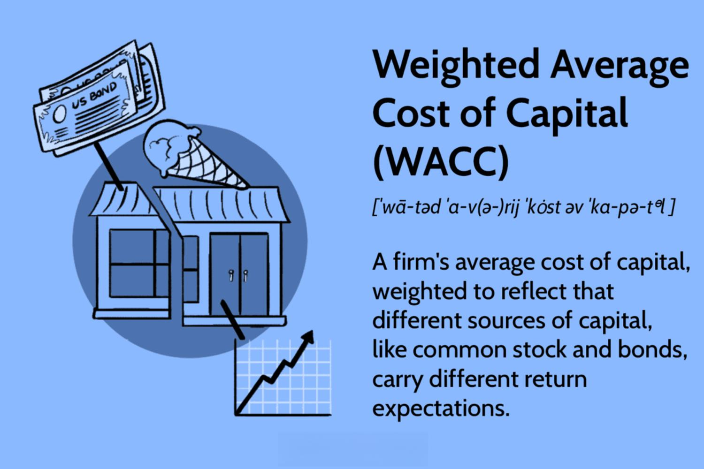

The Weighted Average Cost of Capital (WACC) is a fundamental concept in finance that represents the average rate a company is expected to pay to finance its assets. It is weighted according to the proportion of debt and equity in the company's capital structure. The WACC formula is given by: 

$$
WACC = \left(\frac{E}{V} \times Re\right) + \left(\frac{D}{V} \times Rd \times (1 - Tc)\right)
$$

where:
- $E$ is the market value of equity,
- $D$ is the market value of debt,
- $V$ is the total value of capital (equity + debt),
- $Re$ is the cost of equity,
- $Rd$ is the cost of debt,
- $Tc$ is the corporate tax rate.

WACC is significant because it serves as a hurdle rate for investment decisions and company valuations. A project's returns must exceed the WACC to create shareholder value. Moreover, it reflects the blended cost of capital across all sources, providing insights into a company’s cost of financing and risk profile.

Interest rates play a vital role in the economy by influencing borrowing costs and investment decisions. They are often controlled by central banks through monetary policies to maintain economic stability. Changes in interest rates affect the cost of debt, and thus, can alter a company’s WACC. Capital structure refers to the mix of debt and equity that a company uses to finance its operations. Choosing an optimal capital structure is crucial as it influences financial flexibility and stability.

These financial concepts are increasingly relevant in [algorithmic trading](/wiki/algorithmic-trading), where quantitative techniques are used to make data-driven trading decisions. Automated trading systems can leverage WACC, interest rates, and capital structure data to identify investment opportunities, manage risks, and improve returns.

The objective of this article is to equip readers with a thorough understanding of WACC, interest rates, and capital structure, and illustrate how these concepts apply to algorithmic trading. Readers can expect to learn the significance of these financial metrics in crafting effective investment strategies. By grasping these critical elements, investors and traders can enhance their decision-making processes and optimize their financial performance. Understanding these metrics is essential for developing informed and strategic investment approaches across various financial markets.

## Table of Contents

## Understanding WACC

Weighted Average Cost of Capital (WACC) is a crucial financial metric used to assess the average rate of return a company is expected to pay to its security holders to finance its assets. It is computed as the weighted average of the cost of equity and the cost of debt, providing a unifying measure of a firm's cost of capital. These weights are proportional to the company's capital structure, representing the relative proportion of equity and debt used.

### Calculation of WACC

WACC can be mathematically expressed as:

$$

\text{WACC} = \left( \frac{E}{V} \right) \cdot r_e + \left( \frac{D}{V} \right) \cdot r_d \cdot (1 - T)
$$

Where:
- $E$ is the market value of equity
- $D$ is the market value of debt
- $V$ is the total market value of the company's financing (Equity + Debt)
- $r_e$ is the cost of equity
- $r_d$ is the cost of debt
- $T$ is the corporate tax rate

### Importance of WACC

WACC serves as a fundamental tool for evaluating investment opportunities and company valuations. For investment projects, WACC is often used as a discount rate for cash flows. A project is typically considered viable if its return exceeds the WACC, as it indicates the project generates sufficient returns to cover the capital costs.

In valuations, particularly for discounted cash flow (DCF) analyses, WACC is employed as the discount rate, playing a critical role in determining the present value of future cash flows and thereby influencing company valuations. 

### Impact of Market Conditions

Market conditions, such as changes in interest rates or fluctuations in a company's stock price, profoundly affect WACC. An increase in interest rates generally escalates the cost of debt, thereby raising WACC, reducing the viability of marginal projects. Conversely, a rise in stock prices can lower the cost of equity, potentially decreasing WACC and making investment projects more attractive.

### Application in Decision-Making

Businesses leverage WACC in several strategic decision-making processes, including capital budgeting, mergers and acquisitions, and financial performance assessment. For example, a company might assess potential acquisitions or mergers using WACC as a benchmark to ensure that the deal would likely generate a return exceeding the cost of capital. 

### Limitations and Assumptions

WACC calculations are subject to several assumptions that can limit its effectiveness. It assumes a constant corporate tax rate, which may not always be realistic given potential changes in tax legislation. Moreover, calculating the cost of equity can vary depending on methods such as the Capital Asset Pricing Model (CAPM), and these estimates can introduce variability. WACC also presumes a stable capital structure, which may not apply for companies in dynamic or volatile industries.

Understanding these limitations is crucial for accurately applying WACC in financial analysis, ensuring that the metric remains a valuable tool while acknowledging its boundaries. These intricacies highlight the importance of expert judgement in the interpretation of WACC and its implications for investment strategy.

## The Role of Interest Rates

Interest rates play a critical role in shaping the broader economy by influencing borrowing costs, consumer spending, and investment decisions. At their core, interest rates represent the cost of borrowing money. When interest rates decrease, borrowing becomes cheaper, leading to an increase in consumer spending and business investments. Conversely, higher interest rates raise borrowing costs, which can dampen spending and investment activity.

Central banks, such as the Federal Reserve in the United States, are key players in setting and influencing interest rates through monetary policies. These policies are designed to target inflation, stabilize the currency, and achieve full employment. Central banks use tools such as open market operations, discount rates, and reserve requirements to steer the economy towards these goals. The policy [interest rate](/wiki/interest-rate-trading-strategies) set by a central bank serves as a benchmark for other interest rates in the economy, affecting everything from mortgage rates to the yields on government bonds.

Interest rates also have a significant impact on corporate capital structures, which consist of equity and debt. When interest rates are low, companies may be more inclined to issue debt as it becomes a cheaper way to finance expansion compared to equity. This can lead to a higher proportion of debt in the capital structure. Conversely, higher interest rates may incentivize companies to rely more on equity financing to avoid the increased costs associated with borrowing.

Algorithmic traders, who use automated systems to execute trades, can benefit from analyzing interest rate data. Changes in interest rates can signal shifts in market conditions, influencing the valuation of stocks and bonds. By incorporating interest rate data into their algorithms, traders can develop strategies to capitalize on these changes. For example, they might employ statistical models to predict rate movements and adjust their investment portfolios accordingly.

Python, a popular programming language in finance, can be used to model the relationship between interest rates and asset prices. Using libraries such as NumPy and pandas, traders can process large datasets to identify patterns and make informed trading decisions. Furthermore, with [machine learning](/wiki/machine-learning) techniques, traders can enhance their predictive analytics, improving the accuracy of their models in response to changing interest rate environments.

In summary, interest rates are a pivotal element in the economy and financial markets. Understanding their dynamics enables individuals and businesses to make informed decisions that enhance growth and stability. For algorithmic traders, leveraging interest rate data is crucial for developing sophisticated trading strategies that can adapt to the ever-changing economic landscape.

## Exploring Capital Structure

Capital structure refers to the way a corporation finances its operations and growth through different sources of funds, primarily equity and debt. Equity represents ownership in the company, which can come in the form of common and preferred stocks. Debt involves borrowing funds that the company is obligated to repay, often with interest, and may include instruments such as bonds and loans.

An optimal capital structure is critical for a company's stability and growth. It balances the cost and benefits of debt and equity, minimizing the weighted average cost of capital (WACC) and maximizing the firm's value. A well-designed capital structure can result in a lower cost of capital, enhancing the company’s ability to undertake profitable projects and handle economic downturns.

The trade-offs between debt and equity financing involve several considerations. Debt financing is often cheaper due to tax-deductible interest payments, but excessive debt increases financial risk and may lead to higher borrowing costs in the future. Equity financing avoids repayment obligations and reduces bankruptcy risk, but it can dilute ownership and have a higher direct cost if the company’s shares are undervalued.

Capital structure decisions significantly impact a company’s WACC, which is a crucial indicator used for evaluating investment opportunities. The formula for WACC is as follows:

$$
\text{WACC} = \left( \frac{E}{V} \times \text{Re} \right) + \left( \frac{D}{V} \times \text{Rd} \times (1-T) \right)
$$

Where:
- $E$ is the market value of equity,
- $D$ is the market value of debt,
- $V$ is the total market value of the company’s financing (equity plus debt),
- $\text{Re}$ is the cost of equity,
- $\text{Rd}$ is the cost of debt,
- $T$ is the corporate tax rate.

Changes in the capital structure can alter these components and, subsequently, the WACC. An increase in debt can decrease WACC due to tax advantages but may also increase the required return from equity holders due to higher financial leverage risk.

Algorithmic traders often assess a company’s capital structure as part of their strategy. By evaluating metrics such as debt-to-equity ratios, interest coverage ratios, and the cost components of WACC, algorithms can identify opportunities and risks associated with changes in a company's financial leverage. Advanced techniques, such as machine learning models, can predict shifts in capital structure and their potential impact on market performance, thus enhancing decision-making in trading strategies. Algorithmic traders utilize real-time data to constantly monitor these metrics and adjust their positions to optimize returns and manage risk effectively. This approach not only aids in yielding better investment results but also in anticipating market movements influenced by corporate financial strategies.

## Algorithmic Trading and Financial Metrics

Algorithmic trading refers to the use of computer programs and systems to execute trades in financial markets. By leveraging predefined criteria and quantitative models, it allows for high-speed and high-frequency trading with minimal human intervention. This method has become increasingly prominent due to its ability to process vast amounts of data rapidly and execute trades more efficiently than human traders.

Algorithmic trading integrates various financial metrics such as the Weighted Average Cost of Capital (WACC), interest rates, and a company's capital structure to enhance decision-making processes. By combining these elements, trading algorithms can analyze the relative value and growth potential of different investment opportunities while assessing the cost of financing and the market risks. This multidimensional analysis aids in formulating strategies that align an investment’s risk and return profile with optimal funding costs.

For example, an algorithm might utilize WACC to evaluate whether a company's expected return exceeds its cost of capital, which is vital for investment attractiveness. Changes in interest rates are also critical inputs, as they impact both the discount rates used in asset pricing models and the cost of debt financing. By factoring in these variables, trading algorithms can identify mispriced securities or optimize portfolio allocations based on updated cost-benefit analyses.

Real-time data feeds and predictive analytics further bolster algorithmic trading. By providing instant access to up-to-date market information, these technologies allow algorithms to detect and act on trading signals swiftly and efficiently. Predictive analytics, using machine learning techniques, can identify patterns and trends from historical data to forecast future market movements. This capability enhances the accuracy of trading decisions and increases the potential for profit, especially in volatile markets.

Effective risk management and optimization are essential components of algorithmic trading strategies. Algorithms often employ sophisticated risk assessment models to mitigate potential losses while maximizing returns. Techniques such as Monte Carlo simulations, stress testing, and Value at Risk (VaR) calculations help evaluate different risk scenarios. Additionally, optimization algorithms, such as genetic algorithms or linear programming, are implemented to refine trading strategies, ensuring they meet the desired risk-return thresholds.

Case studies like Renaissance Technologies' Medallion Fund exemplify the potential of algorithmic trading. Their proprietary algorithms consistently [factor](/wiki/factor-investing) in vast financial metrics to generate robust returns. Similarly, high-frequency trading firms exploit minute price discrepancies across markets, leveraging interest rate fluctuations and WACC as integral components in their models.

As the financial landscape evolves, the integration of machine learning and advances in computing technology will likely further augment the capabilities of algorithmic trading. These developments underscore the necessity for traders to continually adapt and incorporate comprehensive financial metrics to maintain a competitive edge in dynamic markets.

## Conclusion

In this article, we explored the critical financial metrics of Weighted Average Cost of Capital (WACC), interest rates, and capital structure, emphasizing their significance in both traditional financial analysis and algorithmic trading. Understanding WACC is fundamental for evaluating investment opportunities and assessing company valuations. We discussed how WACC is influenced by market conditions and explored its pivotal role in strategic decision-making within businesses. Interest rates, as another key component, have far-reaching effects on borrowing costs, investment decisions, and monetary policies. Their fluctuation is a vital indicator analyzed by both corporate strategists and algorithmic traders. The capital structure, comprised of equity and debt, was another focus area, guiding companies towards optimal financial stability and growth potentials, impacting WACC directly.

Algorithmic trading, with its reliance on quantitative analysis, benefits substantially from these financial metrics. By integrating WACC, interest rate fluctuations, and capital structure nuances into trading algorithms, traders can enhance precision in decision-making and potentially achieve superior returns. The availability of real-time data and advanced predictive analytics optimizes these strategies, allowing for dynamic risk management and opportunity leverage.

Readers are encouraged to deepen their understanding of these concepts, as they play an essential role in crafting robust trading and investment strategies. By appreciating the intricate interdependencies of WACC, interest rates, and capital structures, future traders can better navigate their investment terrains. Enthusiasts seeking to expand their knowledge can consider exploring advanced resources on quantitative finance and algorithmic trading strategies to foster a more comprehensive understanding and application of these influential financial metrics.

## References & Further Reading

[1]: ["Valuation: Measuring and Managing the Value of Companies"](https://www.amazon.com/Valuation-Measuring-Managing-Companies-Finance/dp/1119610885) by McKinsey & Company Inc., Tim Koller, Marc Goedhart, David Wessels

[2]: ["Financial Modeling"](https://www.investopedia.com/terms/f/financialmodeling.asp) by Simon Benninga

[3]: ["Investment Valuation: Tools and Techniques for Determining the Value of Any Asset"](https://archive.org/details/investmentvaluat0000damo_n6k9) by Aswath Damodaran

[4]: ["Modern Portfolio Theory and Investment Analysis"](https://books.google.com/books/about/Modern_Portfolio_Theory_and_Investment_A.html?id=181CEAAAQBAJ) by Edwin J. Elton, Martin J. Gruber, Stephen J. Brown, William N. Goetzmann

[5]: ["Equity Asset Valuation"](https://www.amazon.com/Equity-Asset-Valuation-Institute-Investment/dp/1119628105) by Jerald E. Pinto, Elaine Henry, Thomas R. Robinson, John D. Stowe