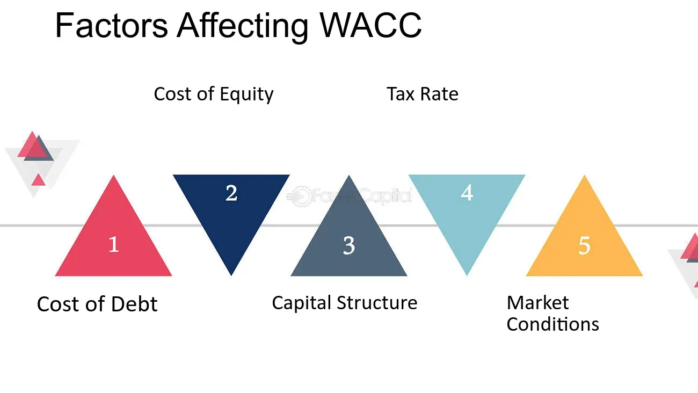

## Table of Contents

## What is Weighted Average Cost of Capital (WACC)?

Weighted Average Cost of Capital (WACC) is a financial metric that companies use to figure out the average rate of return they need to pay to their investors. It's like a weighted average because it takes into account the different costs of different types of financing, such as debt and equity, and weighs them according to how much of each the company uses. For example, if a company uses more debt than equity, the cost of debt will have a bigger impact on the WACC.

WACC is important because it helps companies make decisions about investments and projects. If a project's expected return is higher than the WACC, it might be a good investment because it's expected to earn more than what the company pays to its investors. On the other hand, if the expected return is lower than the WACC, the company might decide not to go ahead with the project because it wouldn't be worth the cost of financing.

## Why is WACC important for businesses?

WACC is really important for businesses because it helps them figure out if they should go ahead with new projects or investments. It's like a benchmark that shows the minimum return a company needs to make to satisfy its investors. If a project's expected return is higher than the WACC, it means the project could be profitable because it's expected to earn more than what the company pays to its investors. This makes WACC a key tool for deciding where to put the company's money.

Also, WACC helps businesses understand how much it costs them to get money from different sources, like loans or selling shares. By knowing their WACC, companies can see if they're using the right mix of debt and equity. If the WACC is too high, it might mean the company is relying too much on expensive financing. This understanding can help businesses make smarter choices about how to finance their operations and growth, keeping costs down and profits up.

## What are the main components of WACC?

The main components of WACC are the cost of equity and the cost of debt. The cost of equity is what shareholders expect to earn on their investment in the company. It's usually higher than the cost of debt because shareholders take more risk. They might not get their money back if the company does badly. The cost of debt is what the company pays to borrow money, like the interest on loans or bonds. It's usually lower than the cost of equity because lenders get paid back before shareholders if the company has problems.

Another important part of WACC is the company's capital structure, which is how much of the company's money comes from debt and how much comes from equity. If a company uses a lot of debt, the cost of debt will have a bigger impact on the WACC. If it uses a lot of equity, the cost of equity will matter more. The weights of these components are based on their market values, not what the company paid for them. This helps give a true picture of the cost of capital.

The last piece of the puzzle is the tax rate. Interest on debt can often be deducted from taxes, which makes the cost of debt cheaper after taxes. This is why the cost of debt in the WACC formula is usually adjusted for taxes. By putting all these pieces together—the cost of equity, the cost of debt, the capital structure, and the tax rate—companies can figure out their WACC and use it to make smart decisions about investments and financing.

## How does the cost of debt affect WACC?

The cost of debt is a big part of figuring out a company's WACC. It's what the company pays to borrow money, like the interest on loans or bonds. When you're calculating WACC, you need to think about how much of the company's money comes from debt. If a company uses a lot of debt, the cost of debt will have a bigger effect on the WACC. This is because the WACC is a weighted average, so the more debt a company has, the more the cost of debt matters.

Also, the cost of debt is usually lower than the cost of equity because lenders get paid back before shareholders if the company has trouble. But there's a twist: interest on debt can often be deducted from taxes, which makes the cost of debt cheaper after taxes. So when you're figuring out WACC, you adjust the cost of debt for taxes. This means that if a company can borrow money at a low rate and get a tax break, it can lower its WACC and make its projects more profitable.

## What role does the cost of equity play in WACC?

The cost of equity is a big part of figuring out a company's WACC. It's what shareholders expect to earn on their investment in the company. Usually, the cost of equity is higher than the cost of debt because shareholders take more risk. They might not get their money back if the company does badly. When you calculate WACC, you need to know how much of the company's money comes from equity. If a company uses a lot of equity, the cost of equity will have a bigger impact on the WACC because it's a weighted average.

The cost of equity is important because it helps the company decide if a project is worth doing. If the expected return from a project is higher than the WACC, which includes the cost of equity, it might be a good investment. This is because the project is expected to earn more than what the company needs to pay its shareholders. By understanding the cost of equity, companies can make smart choices about where to put their money and how to grow their business.

## How do tax rates influence WACC?

Tax rates have a big effect on a company's WACC, especially when it comes to the cost of debt. When a company borrows money, it pays interest on that debt. But the cool thing is, the interest they pay can often be deducted from their taxes. This makes the cost of debt cheaper after taxes. So, when you're figuring out WACC, you adjust the cost of debt to account for these tax savings. If the tax rate is high, this tax shield makes the cost of debt even lower, which can bring down the overall WACC.

This means that companies in countries with higher tax rates might find it more attractive to use debt financing because it's cheaper after taxes. A lower WACC can make more projects look profitable because the company needs a lower return to cover its costs. So, understanding how tax rates affect the cost of debt is really important for companies when they're deciding how to finance their operations and growth.

## What is the impact of market conditions on WACC?

Market conditions can really change a company's WACC. When the economy is doing well, interest rates might go up because there's more demand for money. This can make the cost of debt higher, which pushes up the WACC. On the other hand, if the economy is not doing so great, interest rates might go down to encourage borrowing, making the cost of debt lower and the WACC smaller. Also, when the stock market is doing well, investors might want a higher return on their equity, which can increase the cost of equity and the WACC.

Another way market conditions affect WACC is through the risk investors see in the market. If the market is risky, like during a financial crisis, investors might want a higher return to take that risk. This can make both the cost of debt and the cost of equity go up, which increases the WACC. But if the market is stable and investors feel safe, they might be okay with lower returns, which can lower the WACC. So, market conditions play a big role in deciding how much it costs a company to get money from investors.

## How does a company's capital structure affect its WACC?

A company's capital structure is all about how it uses debt and equity to get money. This mix of debt and equity really affects the WACC because WACC is a weighted average of the costs of these two types of financing. If a company uses a lot of debt, the cost of debt will have a bigger say in the WACC. Debt is usually cheaper than equity because lenders get paid back before shareholders if things go wrong. But using more debt also means more risk, so companies need to find a balance that keeps the WACC low without making the company too risky.

The weights in WACC come from the market values of debt and equity, not what the company paid for them. This gives a true picture of how much it costs the company to get money. If a company changes its capital structure, like by taking on more debt or issuing more shares, it changes the weights and can make the WACC go up or down. For example, if a company borrows more money at a low interest rate, it might lower its WACC because the cost of debt is cheaper than equity. But if it takes on too much debt, the risk goes up, and investors might want a higher return, which can push the WACC up again.

## Can you explain how business risk influences WACC?

Business risk is how likely it is that a company might not make as much money as expected. This risk can change how much investors want to be paid to put their money into the company. If a company has a lot of business risk, like it's in a shaky industry or it depends a lot on one product, investors might want a higher return to take that risk. This means the cost of equity goes up because shareholders want more money to cover the chance that things might go wrong. And if the cost of equity goes up, the WACC goes up too because WACC is made up of the costs of debt and equity.

But business risk doesn't just affect the cost of equity. It can also change the cost of debt. If a company is seen as risky, lenders might charge more interest to cover the chance that the company might not be able to pay back the loan. This makes the cost of debt higher, and because debt is part of the WACC, the WACC goes up too. So, the more business risk a company has, the higher its WACC can be, making it harder for the company to find projects that will give a return higher than the WACC.

## What advanced methods are used to estimate the cost of equity in WACC calculations?

One advanced method to estimate the cost of equity is the Capital Asset Pricing Model (CAPM). CAPM says that the cost of equity is made up of the risk-free rate, which is what you'd get from a super safe investment like a government bond, plus a risk premium. The risk premium is how much more investors want to be paid for taking on the risk of investing in the company. To figure out the risk premium, you multiply the market risk premium, which is the extra return investors expect from the stock market over the risk-free rate, by the company's beta. Beta is a number that shows how much the company's stock price moves compared to the market. If a company's stock moves a lot when the market moves, it has a high beta and a higher cost of equity.

Another method is the Dividend Discount Model (DDM). This model looks at the dividends a company pays to its shareholders. The idea is that the cost of equity is the rate that makes the present value of all future dividends equal to the current stock price. If a company pays steady dividends, you can use the Gordon Growth Model, which is a simpler version of DDM. It says the cost of equity is the next dividend divided by the current stock price, plus the growth rate of the dividends. Both CAPM and DDM help companies figure out what investors expect to earn, which is important for calculating the WACC and making smart investment choices.

## How do international operations and currency fluctuations impact WACC?

When a company does business in different countries, it can change its WACC. This is because the cost of capital can be different in each country. For example, if a company borrows money in a country with high interest rates, its cost of debt will go up, which can push up the WACC. Also, if the company sells shares in a country where investors want a high return, the cost of equity will be higher. So, the mix of debt and equity from different countries can make the WACC go up or down, depending on where the money comes from and how much it costs.

Currency fluctuations can also affect a company's WACC. If the value of the currency in one country goes up or down a lot, it can change how much it costs the company to borrow money or pay dividends. For example, if a company borrows money in a foreign currency and that currency gets stronger, the company might have to pay back more money than it expected. This can make the cost of debt higher. On the other hand, if the currency gets weaker, it might make the cost of debt lower. These changes in currency values can make it harder for a company to figure out its WACC and plan for the future.

## What are the latest trends and research findings on factors affecting WACC?

Recent trends and research in finance show that environmental, social, and governance (ESG) factors are becoming more important in affecting a company's WACC. Companies that focus on being good to the environment, treating people well, and having strong leadership are seen as less risky by investors. This can lower their cost of equity because investors might be okay with a smaller return if they think the company is doing the right things. Also, companies with good ESG scores might be able to borrow money at lower interest rates, which can bring down their cost of debt. So, paying attention to ESG can help a company lower its WACC and make it easier to find good projects to invest in.

Another big trend is the use of big data and machine learning to figure out WACC more accurately. These new tools can look at a lot of information quickly and find patterns that people might miss. For example, they can look at how the economy is doing, what's happening in different industries, and even what people are saying on social media to predict how much it will cost a company to get money. This can help companies make better guesses about their cost of equity and cost of debt, which are important parts of WACC. By using these new methods, companies can make smarter choices about where to put their money and how to grow their business.

## What is WACC and how can it be understood?

Weighted Average Cost of Capital (WACC) is a crucial financial metric used to assess the average rate of return a company is expected to pay to its security holders to finance its assets. It is computed as the weighted average of the cost of equity and the cost of debt, providing a unifying measure of a firm's cost of capital. These weights are proportional to the company's capital structure, representing the relative proportion of equity and debt used.

### Calculation of WACC

WACC can be mathematically expressed as:

$$

\text{WACC} = \left( \frac{E}{V} \right) \cdot r_e + \left( \frac{D}{V} \right) \cdot r_d \cdot (1 - T)
$$

Where:
- $E$ is the market value of equity
- $D$ is the market value of debt
- $V$ is the total market value of the company's financing (Equity + Debt)
- $r_e$ is the cost of equity
- $r_d$ is the cost of debt
- $T$ is the corporate tax rate

### Importance of WACC

WACC serves as a fundamental tool for evaluating investment opportunities and company valuations. For investment projects, WACC is often used as a discount rate for cash flows. A project is typically considered viable if its return exceeds the WACC, as it indicates the project generates sufficient returns to cover the capital costs.

In valuations, particularly for discounted cash flow (DCF) analyses, WACC is employed as the discount rate, playing a critical role in determining the present value of future cash flows and thereby influencing company valuations. 

### Impact of Market Conditions

Market conditions, such as changes in interest rates or fluctuations in a company's stock price, profoundly affect WACC. An increase in interest rates generally escalates the cost of debt, thereby raising WACC, reducing the viability of marginal projects. Conversely, a rise in stock prices can lower the cost of equity, potentially decreasing WACC and making investment projects more attractive.

### Application in Decision-Making

Businesses leverage WACC in several strategic decision-making processes, including capital budgeting, mergers and acquisitions, and financial performance assessment. For example, a company might assess potential acquisitions or mergers using WACC as a benchmark to ensure that the deal would likely generate a return exceeding the cost of capital. 

### Limitations and Assumptions

WACC calculations are subject to several assumptions that can limit its effectiveness. It assumes a constant corporate tax rate, which may not always be realistic given potential changes in tax legislation. Moreover, calculating the cost of equity can vary depending on methods such as the Capital Asset Pricing Model (CAPM), and these estimates can introduce variability. WACC also presumes a stable capital structure, which may not apply for companies in dynamic or volatile industries.

Understanding these limitations is crucial for accurately applying WACC in financial analysis, ensuring that the metric remains a valuable tool while acknowledging its boundaries. These intricacies highlight the importance of expert judgement in the interpretation of WACC and its implications for investment strategy.

## What are the key aspects of exploring capital structure?

Capital structure refers to the way a corporation finances its operations and growth through different sources of funds, primarily equity and debt. Equity represents ownership in the company, which can come in the form of common and preferred stocks. Debt involves borrowing funds that the company is obligated to repay, often with interest, and may include instruments such as bonds and loans.

An optimal capital structure is critical for a company's stability and growth. It balances the cost and benefits of debt and equity, minimizing the weighted average cost of capital (WACC) and maximizing the firm's value. A well-designed capital structure can result in a lower cost of capital, enhancing the company’s ability to undertake profitable projects and handle economic downturns.

The trade-offs between debt and equity financing involve several considerations. Debt financing is often cheaper due to tax-deductible interest payments, but excessive debt increases financial risk and may lead to higher borrowing costs in the future. Equity financing avoids repayment obligations and reduces bankruptcy risk, but it can dilute ownership and have a higher direct cost if the company’s shares are undervalued.

Capital structure decisions significantly impact a company’s WACC, which is a crucial indicator used for evaluating investment opportunities. The formula for WACC is as follows:

$$
\text{WACC} = \left( \frac{E}{V} \times \text{Re} \right) + \left( \frac{D}{V} \times \text{Rd} \times (1-T) \right)
$$

Where:
- $E$ is the market value of equity,
- $D$ is the market value of debt,
- $V$ is the total market value of the company’s financing (equity plus debt),
- $\text{Re}$ is the cost of equity,
- $\text{Rd}$ is the cost of debt,
- $T$ is the corporate tax rate.

Changes in the capital structure can alter these components and, subsequently, the WACC. An increase in debt can decrease WACC due to tax advantages but may also increase the required return from equity holders due to higher financial leverage risk.

Algorithmic traders often assess a company’s capital structure as part of their strategy. By evaluating metrics such as debt-to-equity ratios, interest coverage ratios, and the cost components of WACC, algorithms can identify opportunities and risks associated with changes in a company's financial leverage. Advanced techniques, such as machine learning models, can predict shifts in capital structure and their potential impact on market performance, thus enhancing decision-making in trading strategies. Algorithmic traders utilize real-time data to constantly monitor these metrics and adjust their positions to optimize returns and manage risk effectively. This approach not only aids in yielding better investment results but also in anticipating market movements influenced by corporate financial strategies.

## References & Further Reading

[1]: ["Valuation: Measuring and Managing the Value of Companies"](https://www.amazon.com/Valuation-Measuring-Managing-Companies-Finance/dp/1119610885) by McKinsey & Company Inc., Tim Koller, Marc Goedhart, David Wessels

[2]: ["Financial Modeling"](https://www.investopedia.com/terms/f/financialmodeling.asp) by Simon Benninga

[3]: ["Investment Valuation: Tools and Techniques for Determining the Value of Any Asset"](https://archive.org/details/investmentvaluat0000damo_n6k9) by Aswath Damodaran

[4]: ["Modern Portfolio Theory and Investment Analysis"](https://books.google.com/books/about/Modern_Portfolio_Theory_and_Investment_A.html?id=181CEAAAQBAJ) by Edwin J. Elton, Martin J. Gruber, Stephen J. Brown, William N. Goetzmann

[5]: ["Equity Asset Valuation"](https://www.amazon.com/Equity-Asset-Valuation-Institute-Investment/dp/1119628105) by Jerald E. Pinto, Elaine Henry, Thomas R. Robinson, John D. Stowe