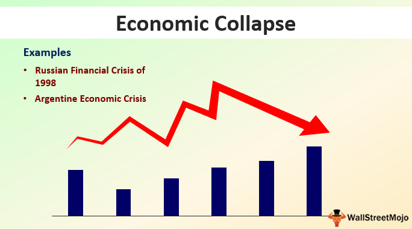

The U.S. dollar has long been viewed as the cornerstone of global finance, holding a pivotal role as the primary reserve currency. This dominant position is supported by the economic might of the United States, extensive financial markets, and the broad acceptance of the dollar in international trade and finance. Despite its robust standing, the U.S. dollar is not immune to the risks that could trigger a potential collapse.

Several elements could influence the stability and value of the U.S. dollar, ranging from domestic economic policies to international geopolitical dynamics. Economic factors such as inflation, interest rates, and public debt levels can significantly impact the dollar's strength. Additionally, global economic shifts and challenges could also alter its position, prompting concerns regarding its continued dominance in world finance.



Algorithmic trading has emerged as a significant factor in managing currency risks, offering sophisticated tools that can process vast amounts of data in real time. These algorithms help investors navigate potential currency volatility, making them crucial in today's fast-paced financial environment.

Understanding these complex dynamics of economic pressures and technological advancements is essential for investors and policymakers. By examining the strengths, weaknesses, and vulnerabilities associated with the U.S. dollar, stakeholders can better prepare for future uncertainties and manage potential risks effectively. This article aims to provide a comprehensive analysis of these factors, offering insights into the current and future state of the U.S. dollar in global finance.

## Table of Contents

## Why Currencies Collapse

A currency collapse is characterized by a sharp depreciation in the currency's value, precipitating widespread economic turmoil. This phenomenon disrupts financial stability, diminishes purchasing power, and increases inflation rates, leading to a cycle of economic challenges. Key factors contributing to the collapse of a currency include political instability, poor economic management, and the erosion of public trust in the currency's value.

Political instability often undermines the confidence in a nation's currency, as unpredictable governance can lead to erratic economic policies and insecurity. For instance, regime changes or political unrest can provoke capital flight and reduce foreign investment, exacerbating currency depreciation. Poor economic management, on the other hand, generally manifests in unsustainable fiscal policies, excessive debt accumulation, and the mismanagement of monetary resources. This mismanagement can lead to hyperinflation, as observed in Zimbabwe and Argentina, where poor fiscal discipline and overreliance on printing money to cover budget deficits led to currency devaluation.

A currency crisis often unfolds in two stages: an initial gradual decline, followed by a sudden and steep collapse. In the early phase, the currency might experience slow depreciation due to underlying economic weaknesses and reduced foreign reserves. As confidence wanes, either because of economic mismanagement or political decisions, the currency's value can plummet rapidly, triggered by a panic that spreads among investors and citizens.

Examining historical cases like Argentina and Zimbabwe provides valuable lessons on the typical causes and progression of currency collapses. Argentina's chronic fiscal mismanagement and inconsistent economic policies resulted in rampant inflation and recurring currency crises throughout the late 20th and early 21st centuries. Zimbabwe's collapse was marked by hyperinflation that peaked in the late 2000s, driven by the government's excessive issuance of money without a corresponding increase in economic output.

Currency instability fundamentally arises from the erosion of its roles as a store of value and medium of exchange. When individuals and businesses lose faith in a currency's ability to retain value over time, they seek more stable alternatives, often accelerating the currency's downfall. The inability to function effectively as a medium of exchange emerges when hyperinflation makes transactions impractical or when foreign currencies become preferable for everyday trade. Recognizing these dynamics is essential for preventing and mitigating the risks of currency collapse.

## The U.S. Dollar's Strengths and Weaknesses

The U.S. dollar serves as the world’s primary reserve currency, a status that underscores its significant strengths. This preeminent position is supported by several factors. Firstly, the United States possesses one of the world's most stable and robust economies, offering a level of predictability that is attractive to global investors. Large, well-developed financial markets further enhance this appeal, facilitating significant [liquidity](/wiki/liquidity-risk-premium) and enabling seamless international transactions. Moreover, the dollar's dominance in global trade reinforces its widespread acceptance and usage, creating a virtuous cycle of demand and trust.

However, the dollar is not without vulnerabilities. As a fiat currency, its value is not backed by a physical commodity like gold or silver. Instead, it relies on the U.S. government's economic and fiscal health, and the confidence of its users. This intrinsic characteristic exposes the dollar to potential instabilities. For instance, U.S. fiscal and monetary policies can significantly impact the currency's value. High national debt levels, for example, may lead to inflationary pressures or loss of foreign investor confidence, potentially weakening the dollar.

Additionally, global economic shifts pose challenges. The rise of economies such as China and the eurozone presents alternative currencies that could compete with the dollar for reserve status. These shifts could alter trade patterns and erode the dollar's dominance. Natural economic cycles also introduce potential price [volatility](/wiki/volatility-trading-strategies) and exchange rate fluctuations, affecting the dollar's stability. 

Understanding these strengths and potential shortcomings is vital for assessing the U.S. dollar's future trajectory. Policymakers and investors must be aware of these dynamics to make informed decisions about currency-related strategies. By balancing the dollar's inherent strengths with a keen awareness of its vulnerabilities, stakeholders can better navigate the complexities of global finance.

## Potential Threats to the Dollar's Status

The status of the U.S. dollar as the dominant global reserve currency is increasingly under scrutiny due to several emerging threats. One of the primary concerns is the persistent fiscal deficit of the United States. A fiscal deficit occurs when a government's expenditures surpass its revenues, and extended periods of deficit spending can erode investor confidence in a currency. As fiscal deficits grow, the risk of inflationary pressures increases, which can devalue the currency over time.

Additionally, the rising strength of foreign currencies, particularly in emerging markets, poses a challenge to the dollar's hegemony. Currencies like the Chinese yuan are becoming increasingly significant in global trade and finance. China's strategic internationalization of the yuan through initiatives like the Belt and Road Initiative and the establishment of offshore yuan trading hubs reflect this effort. As foreign currencies gain prominence, they could provide competitive alternatives to the dollar.

Geopolitical tensions further exacerbate these threats. Trade disputes, especially those involving major economies such as China, can destabilize currency values. During trade wars, countries may resort to protectionist measures, impacting global supply chains and increasing market volatility. The 2018-2019 U.S.-China trade war highlighted this risk, resulting in fluctuations in the dollar's strength against other currencies.

Another controversial aspect is the dollar's use as a tool of political influence, often described as "weaponization." Sanctions and restrictive policies, primarily when targeting countries opposed to U.S. foreign policy, have prompted affected nations to seek alternatives to the dollar to circumvent these economic pressures. Countries like Russia and Iran have previously sought to develop alternative systems to minimize reliance on the dollar, prompting concerns over the potential fragmentation of dollar dominance.

Efforts to de-dollarize by major economies also pose a threat. De-dollarization refers to reducing reliance on the U.S. dollar in international transactions. Initiatives to establish new financial systems, such as the European Union's attempts to strengthen the euro's role in international markets and the collaboration of BRICS nations to create a new international currency, illustrate this trend. Such movements could gradually erode the dollar's status as the primary reserve currency.

Monitoring these threats is critical for policymakers and investors, as early warning signs can provide valuable insights into potential vulnerabilities. By understanding and addressing these risks, strategies can be developed to protect the dollar's status or prepare for a more multipolar currency landscape in international finance.

## Algorithmic Trading and Currency Management

Algorithmic trading has become a fundamental component of currency markets, offering sophisticated tools for risk management, particularly amid periods of currency volatility and threats of collapse. This form of trading leverages computer algorithms to execute trades at speeds and frequencies beyond human capability, addressing the dynamic nature of currency markets.

One primary advantage of [algorithmic trading](/wiki/algorithmic-trading) is its ability to process vast amounts of data swiftly, facilitating real-time trading adjustments. Algorithms can analyze market conditions, historical data, and current trends to make informed trading decisions almost instantaneously. This rapid data processing proves invaluable in volatile market conditions, where the ability to react swiftly to price movements is critical. 

For instance, investors can employ algorithms that utilize [machine learning](/wiki/machine-learning) techniques to predict short-term price movements. Machine learning models, such as neural networks or decision trees, can be trained on historical price data to recognize patterns that precede significant price shifts. A simple Python implementation might involve using libraries such as Scikit-learn or TensorFlow to develop a predictive model that informs trading decisions:

```python
from sklearn.model_selection import train_test_split
from sklearn.ensemble import RandomForestRegressor
import numpy as np

# Sample data preparation
X, y = np.random.rand(1000, 10), np.random.rand(1000)

# Split data into training and testing
X_train, X_test, y_train, y_test = train_test_split(X, y, test_size=0.2, random_state=42)

# Model training
model = RandomForestRegressor(n_estimators=100)
model.fit(X_train, y_train)

# Making predictions
predictions = model.predict(X_test)
```

Such models can provide traders with probabilities of future price changes, aiding in effective decision-making. Another advantage of algorithmic trading lies in its capacity to help investors hedge against potential currency devaluations. By strategically employing hedging techniques such as pairs trading or statistical [arbitrage](/wiki/arbitrage), algorithms can mitigate risks associated with unfavorable currency movements.

Furthermore, algorithmic trading systems often incorporate stop-loss and take-profit mechanisms that automatically trigger trades when certain price levels are reached, locking in profits or limiting losses. This form of automated risk management ensures that investors can adhere to their predefined risk tolerance levels without the need for constant market monitoring.

Overall, understanding the role of algorithmic trading is crucial for modern currency management strategies. The integration of advanced technology in trading platforms not only enhances the efficiency of executing trades but also provides robust mechanisms to manage risks in an ever-fluctuating financial landscape. As currency markets continue to evolve, leveraging these technological advancements will remain essential for both institutional and individual investors striving to maintain a competitive edge.

## Conclusion: Can the U.S. Dollar Collapse?

While the collapse of the U.S. dollar is a scenario fraught with significant improbabilities, it remains within possibilities subject to a confluence of factors. Given the dollar's entrenched role in global finance, a precipitous decline would require a combination of adverse conditions. Vigilant monitoring of key economic indicators and policy decisions is essential, as these elements offer early warning signals that could precede a fiscal disruption. Metrics such as the U.S. fiscal deficit, interest rates, inflation, and geopolitical developments should be closely examined.

Diversification and risk management strategies serve as prudent measures to cushion the impacts of any potential depreciation in the dollar's value. Investors are encouraged to diversify their asset portfolios, integrating commodities, foreign currencies, and alternative assets to hedge against potential dollar devaluation. Implementing robust risk management frameworks can protect assets from abrupt market shifts.

In light of evolving global dynamics, adaptive currency strategies are indispensable. The shift of economic and political gravitas towards emerging markets and the increasing ambitions for currency diversification present challenges and opportunities. Countries like China and Russia are exploring de-dollarization strategies, augmenting their holdings in other currencies and commodities such as the euro and gold, respectively.

Ultimately, the future status of the U.S. dollar hinges on a tapestry of complex domestic and international variables. Navigating these intricacies necessitates an understanding of the interplay between fiscal policies, global trade relationships, and technological innovations in financial markets. As economic conditions evolve, maintaining a flexible approach to currency management will be vital in mitigating risks associated with the dollar's potential vulnerability.

## References & Further Reading

[1]: ["Currency Wars: The Making of the Next Global Crisis"](https://www.amazon.com/Currency-Wars-Making-Global-Crisis/dp/1591845564) by James Rickards

[2]: Reinhart, C. M., & Rogoff, K. S. (2009). ["This Time Is Different: Eight Centuries of Financial Folly"](https://www.nber.org/system/files/working_papers/w13882/w13882.pdf). Princeton University Press.

[3]: ["The Death of Money: The Coming Collapse of the International Monetary System"](https://www.amazon.com/Death-Money-Collapse-International-Monetary/dp/1591846706) by James Rickards

[4]: ["Algorithmic and High-Frequency Trading"](https://www.cambridge.org/us/universitypress/subjects/mathematics/mathematical-finance/algorithmic-and-high-frequency-trading) by Álvaro Cartea, Sebastian Jaimungal, and José Penalva

[5]: Aizenman, J., & Glick, R. (2009). ["Sterilization, Monetary Policy, and Global Financial Integration"](https://onlinelibrary.wiley.com/doi/10.1111/j.1467-9396.2009.00848.x). National Bureau of Economic Research Working Paper Series.