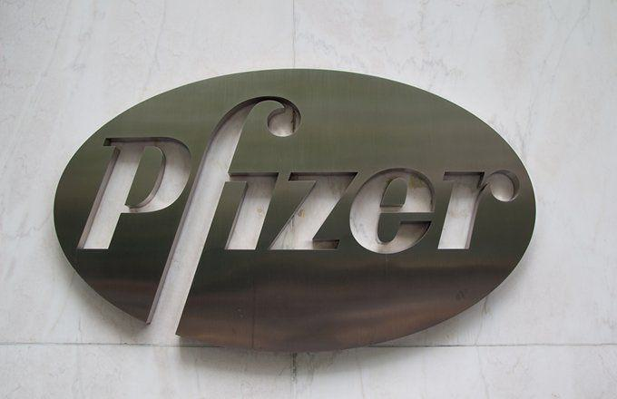

Pfizer's corporate restructuring strategy represents a pivotal move aimed at addressing the dynamic challenges and opportunities inherent in the pharmaceutical industry. As a prominent player in the global pharmaceutical market, Pfizer faces pressure to sustain growth, innovate rapidly, and respond to shifting demographic and market dynamics. Corporate restructuring, therefore, emerges as a vital mechanism for Pfizer to realign its operations, enhance efficiency, and foster innovation.

In the pharmaceutical industry, corporate restructuring is crucial due to several factors, including the need to adapt to regulatory changes, technological advancements, and evolving consumer demands. Restructuring allows companies to streamline operations, focus on core competencies, and allocate resources more effectively towards research and development. For Pfizer, this means creating specialized divisions that can operate with greater agility and strategically targeting areas with the highest potential for growth.



Algorithmic trading, traditionally associated with the financial sector, is increasingly recognized for its role in shaping corporate strategies, including those in the pharmaceutical industry. By leveraging advanced algorithms and data analytics, companies can optimize supply chain operations, forecast market trends, and improve decision-making processes. For Pfizer, integrating algorithmic trading techniques could enhance its ability to adapt to market fluctuations, optimize pricing strategies, and increase overall operational efficiency. This approach not only reinforces Pfizer's commitment to innovation but also positions the company to leverage cutting-edge technologies to sustain competitive advantage in a rapidly evolving market. 

Thus, the significance of Pfizer's corporate restructuring strategy is underscored by its potential to drive innovation and efficiency in response to industry shifts, ultimately positioning the company to better serve global health needs and achieve long-term success.

## Table of Contents

## The Motivations Behind Pfizer's Restructuring

Pfizer has undergone significant restructuring efforts in response to various challenges that affect its growth trajectory and shareholder satisfaction. One of the primary issues facing Pfizer is waning growth, which necessitates strategic shifts to maintain its competitive position in the pharmaceutical industry. The decision to restructure by dividing into three distinct businesses—Innovative Medicines, Established Medicines, and Consumer Healthcare—reflects a deliberate response to these challenges.

### Challenges of Waning Growth and Shareholder Pressure

Pfizer's growth has encountered hurdles due to several factors, including the expiration of patents for blockbuster drugs, heightened competition, and stringent regulatory environments. The loss of patent exclusivity often leads to a decrease in sales and revenue as generic alternatives become available, contributing to declining growth rates. Additionally, the competitive nature of the pharmaceutical sector, with numerous firms vying for market share, pushes Pfizer to continuously innovate and optimize its product offerings.

Shareholder pressure further exacerbates these challenges, as investors seek maximized returns. Shareholders demand that Pfizer streamline operations to boost profitability and maintain dividends, which can be challenging amidst stagnant or declining growth.

### Strategic Restructuring into Three Businesses

In light of these challenges, Pfizer's decision to restructure into three separate entities aims to enhance focus and specialization within each unit. The Innovative Medicines division is designed to concentrate on the development of novel therapies and cutting-edge research, fostering an environment that encourages rapid innovation. Established Medicines focus on managing the lifecycle of existing drugs, optimizing their value in a competitive landscape. Consumer Healthcare, a division that Pfizer partly divested by forming a joint venture with GlaxoSmithKline, targets over-the-counter products, thereby allowing more tailored strategies in response to consumer trends.

This segmentation allows each unit to operate with greater agility and focus on strategic priorities specific to their market environment. The restructuring is intended to drive efficiency, tailor investment to growth areas, and allocate resources more effectively to enhance Pfizer’s overall competitive edge.

### Demographic Shifts and their Strategic Implications

Demographic trends, particularly aging populations, significantly impact Pfizer’s strategic direction. Globally, populations are experiencing increased life expectancy, resulting in a higher prevalence of age-related diseases. This demographic shift presents both opportunities and challenges for Pfizer. On one hand, there is increased demand for therapies targeting age-related conditions, such as Alzheimer's disease, osteoporosis, and cardiovascular disorders. On the other hand, it requires a reallocation of resources towards research and development focused on tailored medical solutions for these conditions.

Pfizer’s strategic restructuring aims to capitalize on these demographic trends by enhancing its focus on innovation within the Innovative Medicines division, thereby aligning its R&D efforts with the increasing demand for geriatric and chronic disease treatments. This alignment can potentially lead to breakthroughs that meet the evolving needs of the aging population, helping Pfizer secure a significant share in this growing market.

## Pfizer’s Strategy for Innovation

Pfizer's restructuring strategy is aimed at enhancing its agility while reinforcing its commitment to innovation. The pharmaceutical giant has taken significant steps to reorganize its operational structure to better align with evolving market demands and technological advancements.

One of the cornerstone initiatives of this strategy is the establishment of the Innovative Medicines division. This division is tasked with leveraging Pfizer's research and development expertise to deliver groundbreaking therapies that address unmet medical needs. The focus is on therapeutic areas where Pfizer possesses substantial scientific and commercial leadership, such as oncology, immunology, cardiovascular, and metabolic health. By creating a dedicated division for innovative medicines, Pfizer aims to streamline its R&D processes, reduce time-to-market for new drugs, and ultimately enhance its competitive position in the pharmaceutical industry.

This strategic move is particularly significant as it enables Pfizer to concentrate its resources and efforts on areas with the highest potential for innovation, thus fostering a culture of creativity and scientific advancement. The reorganization provides Pfizer with the flexibility to adapt quickly to changes, respond to emerging trends, and address the challenges posed by dynamic market conditions.

Demographic shifts, notably the aging global population, are a critical [factor](/wiki/factor-investing) influencing the demand for innovative medicines. As life expectancy increases and birth rates decline in many developed countries, the burden of age-related diseases such as cancer, Alzheimer's, and cardiovascular diseases is projected to escalate. These demographic trends underscore the urgent need for innovative treatments and preventive measures that can address the complex healthcare challenges faced by an aging population.

The demand for innovative medicines is also driven by a growing awareness and diagnosis of chronic conditions, heightened patient expectations for quality of life, and the availability of advanced diagnostic and therapeutic technologies. By strategically positioning itself through structural realignment, Pfizer is positioning itself to capitalize on these opportunities, ensuring it meets the health needs of an increasingly elderly population.

In summary, Pfizer's focus on innovation through its restructuring strategy aims to enhance operational agility and responsiveness, ensuring the company can effectively address both current and future healthcare demands. The creation of the Innovative Medicines division is a pivotal step in this direction, aiming to harness Pfizer's R&D capabilities to deliver transformative healthcare solutions that cater to demographic trends and the shifting dynamics of the pharmaceutical industry.

## Algorithmic Trading and Corporate Strategy Optimization

Algorithmic trading, a sophisticated method of executing trades using automated and pre-programmed instructions, has emerged as a crucial tool in corporate strategy optimization. By harnessing the power of advanced computational algorithms, businesses like Pfizer can significantly enhance their decision-making processes and operational efficiencies. At its core, [algorithmic trading](/wiki/algorithmic-trading) leverages mathematical models and high-speed computer programs to analyze large datasets, identify market opportunities, and execute trades at optimal prices and times.

The integration of algorithmic models into corporate strategy offers a plethora of benefits. These models can process vast amounts of financial data, quickly identifying patterns and trends that might be imperceptible to human analysts. This capability enables firms to navigate complex market dynamics with greater precision, minimizing risks and capitalizing on profitable opportunities. For instance, algorithms can be designed to execute high-frequency trading strategies, capturing value even from minute price discrepancies across different markets.

Algorithmic trading also enhances strategic decision-making by providing real-time insights and analytics. Companies can use these tools to forecast market movements, optimize supply chains, and allocate resources more effectively. For example, algorithms can simulate various market scenarios, enabling Pfizer to assess the potential outcomes of different strategic moves. This predictive capacity is invaluable for making informed decisions that align with long-term corporate goals.

Moreover, optimizing trading operations through algorithms has the potential to boost revenue streams. By executing trades with enhanced speed and accuracy, companies can reduce transaction costs and improve their profit margins. Algorithms can also manage large portfolios more efficiently, rebalancing assets in response to market shifts and ensuring that businesses maintain their desired risk-reward profiles.

To illustrate the implementation of algorithmic trading, consider the following Python code snippet for a simple moving average crossover strategy, a common algorithmic trading model:

```python
import pandas as pd
import numpy as np

# Load market data
data = pd.read_csv('market_data.csv')

# Calculate moving averages
short_window = 40
long_window = 100

data['short_mavg'] = data['Close'].rolling(window=short_window, min_periods=1).mean()
data['long_mavg'] = data['Close'].rolling(window=long_window, min_periods=1).mean()

# Generate trading signals
data['signal'] = 0
data['signal'][short_window:] = np.where(data['short_mavg'][short_window:] > data['long_mavg'][short_window:], 1, 0)

# Calculate trading positions
data['position'] = data['signal'].diff()

# Output the trading signals
print(data[['Date', 'Close', 'short_mavg', 'long_mavg', 'signal', 'position']].tail())
```

This code example calculates the short and long-term moving averages of a stock's closing prices, generating buy or sell signals based on the crossover of these averages. While simplistic, such strategies form the foundation for more complex algorithms that integrate multiple indicators and complex logic to refine trading decisions.

In conclusion, algorithmic trading represents a powerful means of optimizing corporate strategy, offering the potential for increased revenue through improved operational efficiency and strategic insight. As companies continue to embrace technological advancements, the role of algorithmic trading will likely expand, further shaping how corporations like Pfizer navigate an ever-evolving market landscape.

## Challenges and Opportunities

Pfizer's corporate restructuring strategy presents both challenges and opportunities as the company adapts to a rapidly changing pharmaceutical landscape. Implementing this strategy will require overcoming significant regulatory hurdles. The pharmaceutical industry is heavily regulated, and any structural changes must comply with numerous local and international laws. Regulatory bodies such as the U.S. Food and Drug Administration (FDA) and the European Medicines Agency (EMA) impose rigorous standards on drug development and distribution. Pfizer's restructuring, which involves splitting into three distinct businesses, will necessitate re-negotiations with these regulatory authorities to ensure continued compliance, potentially leading to delays or additional scrutiny.

Despite these regulatory challenges, Pfizer's strategy opens up significant opportunities, particularly in emerging markets and through technological advancements. Emerging markets, characterized by increasing healthcare access and growing economies, offer a fertile ground for expansion. Countries in Asia, Africa, and Latin America have seen rising demand for pharmaceuticals due to improving healthcare infrastructure and changing demographic patterns. These regions provide Pfizer with opportunities to introduce innovative medicines tailored to local needs, potentially increasing market share and revenue.

Technological advancements present another avenue for growth. Over the past decade, the pharmaceutical industry has undergone a digital transformation with technologies such as [artificial intelligence](/wiki/ai-artificial-intelligence) (AI) and [machine learning](/wiki/machine-learning) driving innovation. Pfizer's emphasis on restructuring could facilitate the integration of these technologies into their operations, optimizing drug development processes and enhancing research capabilities. This technological edge may lead to quicker drug discovery and development cycles, potentially reducing costs and time-to-market.

However, the reliance on algorithmic decision-making and algorithmic trading also introduces potential risks. While these models can drive efficiency and enhance strategic decision-making, they can also pose challenges. Algorithmic models rely heavily on data quality and accuracy. Any errors in data input can lead to incorrect predictions or decisions, potentially resulting in financial losses or strategic missteps. Moreover, these models are often complex and lack transparency, which can complicate regulatory compliance and risk management processes.

In summary, Pfizer's restructuring strategy presents a complex landscape of challenges and opportunities. By addressing regulatory hurdles, leveraging opportunities in emerging markets, and carefully managing the risks associated with algorithmic decision-making, Pfizer can position itself to thrive in a highly competitive and evolving pharmaceutical industry.

## The Future of Pharmaceutical Strategy and Innovation

Strategic restructuring has become a critical tool for pharmaceutical companies in preparing for future industry shifts. Pfizer, a global leader in pharmaceuticals, is leveraging such strategies to enhance its competitiveness and responsiveness to evolving market demands. One of the key components of Pfizer's future strategy is the integration of algorithmic trading into its operations, aiming to refine pricing strategies, optimize supply chains, and improve overall financial performance.

Algorithmic trading involves using computer algorithms to execute trading decisions. In the context of pharmaceuticals, this process can be adapted to optimize drug pricing, manage raw material purchases, and improve inventory management. By analyzing vast datasets, these algorithms can foresee market trends, adjust strategies in real-time, and identify opportunities for cost savings or revenue growth. The integration of such technology positions Pfizer to react swiftly to market changes and capitalize on fleeting opportunities, thus maintaining a competitive edge.

Looking forward, Pfizer's embrace of algorithmic trading implies a significant transformation in its business operations. As the pharmaceutical industry faces increasing pressure from regulatory changes, pricing challenges, and shifting demographic needs, algorithmic trading offers a pathway to streamline operations and enhance profitability. By reducing the lag between data analysis and decision-making, Pfizer is likely to achieve a more agile business model that can quickly adapt to fluctuations in the market landscape.

Additionally, Pfizer's strategic restructuring that incorporates algorithmic trading is expected to provide long-term benefits, such as reduced operational costs, enhanced decision accuracy, and improved market positioning. The company's ability to forecast and manage complex supply chain dynamics will be pivotal in ensuring consistent product availability and meeting global demand efficiently.

In the long term, Pfizer’s commitment to innovative strategies, such as algorithmic integration, will be crucial as it navigates an evolving market landscape characterized by technological advancements and unprecedented changes in global health trends. The continuous adaptation of strategic restructuring and technological adoption will help Pfizer ensure sustainable growth, fulfill its commitment to providing innovative treatments, and remain at the forefront of the pharmaceutical industry.

## Conclusion

Pfizer's recent corporate restructuring marks a significant pivot aimed at enhancing its operational efficacy and capturing new growth avenues in the pharmaceutical sector. By dividing its operations into specialized segments, Pfizer seeks to streamline its processes, focus on core competencies, and foster innovation. This strategic restructuring is designed to improve the company's agility, allowing it to better respond to the dynamic demands of the healthcare industry and to leverage emerging opportunities presented by demographic, economic, and technological shifts.

Integrating algorithmic trading into corporate strategy represents both a promising avenue and a potential risk. On the one hand, the use of algorithmic models can significantly enhance strategic decision-making, improve efficiency, and potentially increase revenue through optimized trading operations. This technological integration can offer Pfizer a competitive edge, enabling it to navigate market fluctuations and capitalize on emerging trends with precision and speed. However, the reliance on algorithmic processes also introduces risks, such as over-reliance on automated systems and potential vulnerabilities to market anomalies or algorithmic errors. Ensuring robust oversight and human judgment in conjunction with algorithmic strategies is imperative to mitigate these risks.

Looking ahead, the future of innovation in the pharmaceutical sector is likely to be shaped by a combination of strategic restructuring, technological advancements, and demographic trends. Pfizer's proactive approach positions it well to adapt to and influence these changes, setting a precedent for other pharmaceutical companies navigating an evolving market landscape. The integration of algorithmic trading into corporate strategies underscores the potential for technological innovations to redefine business operations, while also highlighting the need for careful management of associated risks.

In conclusion, Pfizer's restructuring and its embrace of algorithmic trading signify a forward-thinking strategy designed to sustain its legacy of innovation and market leadership. As the pharmaceutical industry continues to evolve, the balance between technological integration and strategic foresight will be critical in shaping the future landscape of healthcare innovation.

## References & Further Reading

[1]: DeRuiter, A., & Holston, P. (2012). ["The Impact of New FDA Guidelines on Drug Innovation and Patient Access."](https://www.researchgate.net/publication/290544030_New_drug_review_2012) Journal of Health Economics, 31(1), 230–245.

[2]: Ghemawat, P., & Pisano, G. (2000). ["Pfizer’s Warner-Lambert Acquisition Case Analysis."](https://journals.sagepub.com/doi/10.1177/0149206308316058?icid=int.sj-abstract.citing-articles.145) Harvard Business Review Case Studies.

[3]: Myers, J. D., Napier, R., & Pickup, T. (2013). ["Strategic Alliances and Restructuring in the Pharmaceutical Industry."](https://www.taylorfrancis.com/books/mono/10.4324/9780429493096/social-psychology-john-delamater-daniel-myers-jessica-collett) International Journal of Pharmaceutical and Healthcare Marketing.

[4]: Ransbotham, S., & Kiron, D. (2017). ["Analytics as a Source of Business Innovation."](https://sloanreview.mit.edu/projects/analytics-as-a-source-of-business-innovation/) MIT Sloan Management Review.

[5]: ["Algorithms on the Trading Floor: An Introduction to Market Microstructure"](https://www.quantstart.com/articles/high-frequency-trading-i-introduction-to-market-microstructure/) by Larry Harris - CFA Institute Publications.