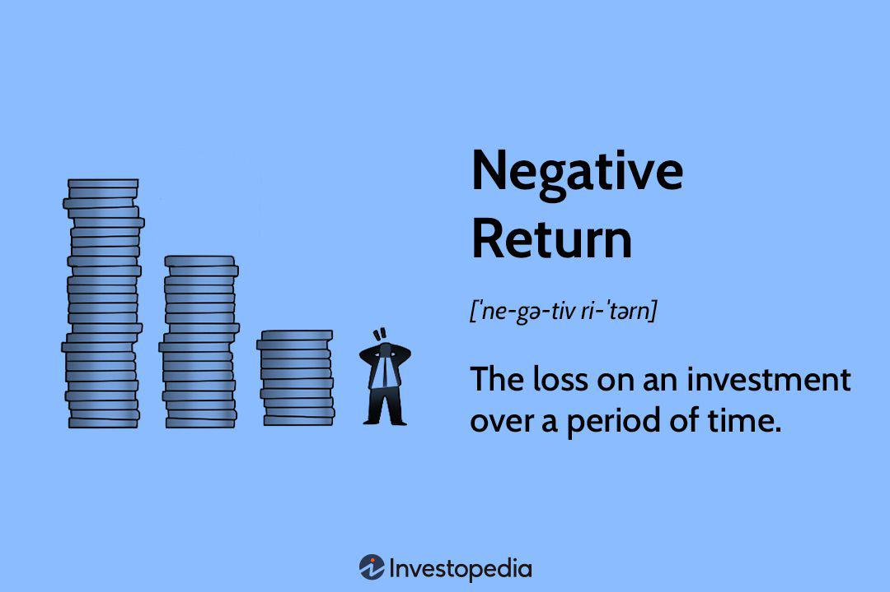

Understanding the landscape of financial risk is crucial for both traditional and algorithmic investors. Financial risk refers to the possibility of losses in an investment and can manifest in various forms, including market volatility, economic downturns, and geopolitical tensions. Among the most significant indicators of potential investment loss are negative rates of return. A negative rate of return occurs when an investment results in a financial loss, yielding less than the amount initially invested. This situation becomes particularly pronounced in volatile markets where sudden changes can erase gains or exacerbate losses.

Algorithmic trading (algo trading) introduces unique challenges and opportunities in managing financial risk. Defined by the use of sophisticated algorithms and computer programs, algo trading aims to automate trading decisions and execute them at high frequencies and speeds unmatched by human traders. This capability allows for rapid responses to market movements, offering possibilities to both seize profitable opportunities and mitigate risks. However, the reliance on models and algorithms also demands rigorous risk management to prevent adverse outcomes that could arise from flawed strategies or unexpected market conditions.



This article will explore how negative returns impact investments and the role of algo trading in this context. We will examine the causes and implications of negative rates of return, investigate the mechanics and benefits of algorithmic trading in managing financial risk, and provide strategies to mitigate these risks and optimize trading performance. Understanding and leveraging these insights can aid investors in aligning their strategies with their investment goals, enabling them to navigate the financial markets more effectively.

## Table of Contents

## The Concept of Financial Risk

Financial risk is the potential for financial loss in an investment or business venture. It is a multifaceted concept comprising various risk types that can impact the financial health of an entity. By understanding these risk types, investors and businesses can devise strategies to minimize potential losses.

**Market Risk**: This type of risk arises from fluctuations in market prices. It encompasses factors such as changes in stock prices, interest rates, and foreign exchange rates. Market risk is often quantified using metrics like Value at Risk (VaR) and beta, which measure the potential for fluctuations in an asset's value relative to the overall market.

**Credit Risk**: Credit risk refers to the possibility that a borrower may default on their debt obligations, leading to financial loss for the lender. This risk is prevalent in lending activities, including corporate and government bonds as well as individual loans. Assessing the creditworthiness of borrowers, typically through credit ratings or credit scoring models, helps mitigate credit risk.

**Liquidity Risk**: This risk arises when an entity cannot quickly sell or convert an asset into cash without a significant loss in value. Liquidity risk is crucial for investors holding complex or less liquid assets. Strategies to manage liquidity risk include maintaining a portfolio of readily marketable securities and establishing lines of credit.

**Operational Risk**: Operational risk stems from failures in internal processes, human errors, and external events that disrupt business operations. It covers a wide range of issues, including fraud, system failures, and regulatory compliance breaches. Continuous monitoring of internal controls and risk management systems is essential for mitigating operational risk.

By comprehensively understanding these types of financial risks, investors can identify potential vulnerabilities within their portfolios and implement strategies to mitigate their impact. Techniques such as diversification, hedging, and rigorous risk assessment models can aid in reducing exposure to financial losses, thereby enhancing the resilience of investment strategies and business operations.

## Negative Rate of Return: An Investment Challenge

A negative rate of return signifies a loss in the value of an investment, occurring when the final amount received from the investment is less than the initial investment. This outcome stands as a critical challenge for investors, necessitating an understanding of its causes and historical significance to mitigate potential losses.

Historically, asset performance analyses reveal that negative returns can follow particular patterns. These patterns are often tied to broader economic cycles and market behaviors. During periods of economic downturn or recession, equity markets frequently exhibit increased [volatility](/wiki/volatility-trading-strategies), often resulting in negative returns for investors. For example, the financial crisis of 2008 saw major indices like the S&P 500 and the Dow Jones Industrial Average experiencing significant negative returns due to systemic risk factors and economic collapse.

Several factors can lead to negative rates of return, with market volatility being a primary driver. Volatility reflects rapid and unpredictable changes in market prices and can arise from sudden shifts in investor sentiment, earnings reports, or unexpected events. These fluctuations can lead to temporary, yet substantial, losses for investors whose portfolios may not be diversified effectively.

Poor economic conditions also contribute to negative returns. Economic indicators such as GDP growth rates, unemployment rates, and inflation can impact investor confidence and market stability. For example, high inflation can erode purchasing power, leading to decreased consumer spending and impacting corporate earnings, which in turn can result in negative returns on investments in affected sectors.

Geopolitical tensions further complicate the investment landscape, as they introduce additional uncertainty and risk. Incidents such as trade wars, armed conflicts, and political instability can disrupt markets on a global scale. For instance, the uncertainty surrounding Brexit negotiations had significant implications for both the British pound and European stock markets, leading to periods of negative returns as markets reacted to unfolding political events.

Investors seeking to mitigate the impact of negative returns must adopt strategic approaches that consider these contributing factors. Through diversification, hedging, and robust risk assessment models, investors can better position themselves to minimize potential losses and navigate the complex dynamics influencing market performance.

## Investment Losses: Causes and Implications

Investment losses are an inherent aspect of participating in financial markets and can originate from a multitude of sources. Understanding these sources is crucial for investors aiming to develop effective recovery strategies and mitigate future risks.

Market downturns are a primary cause of investment losses. These downturns can be triggered by various factors, including economic recessions, abrupt shifts in market sentiment, or significant geopolitical events. During such periods, asset prices typically decline in response to reduced investor confidence and economic uncertainty, leading to potential losses.

Investment losses may also result from poor investment decisions, which can stem from inadequate analysis, emotional trading, or following market trends without due diligence. For instance, overestimating the growth prospects of a company or industry can lead to purchasing overvalued assets that may subsequently depreciate.

Systemic risks represent another source of investment losses. These risks are linked to macroeconomic factors affecting an entire market or sector rather than just individual companies. Examples include changes in monetary policy, global financial crises, or widespread technological disruptions that can lead to a cascade of investment losses across portfolios.

The implications of investment losses extend beyond immediate reductions in portfolio value. Such losses can significantly impact investor confidence, leading to increased risk aversion and changes in investment strategies. This can alter market dynamics, as investor withdrawal or shifts in allocation contribute to further volatility.

Developing an effective recovery strategy necessitates a thorough understanding of the root causes of investment losses. Investors need to evaluate their portfolio's exposure to various risk factors and adjust their strategies accordingly. Implementing diversified asset allocations, setting stop-loss limits, and regularly reviewing market conditions are practical measures to mitigate the effects of potential losses.

In summary, the complexity and interconnectedness of factors leading to investment losses underscore the importance of comprehensive risk management and strategic planning for investors seeking to safeguard their financial interests.

## Overview of Algorithmic Trading

Algorithmic trading, frequently referred to as algo trading, is the process of using computer algorithms to make trading decisions automatically in the financial markets. These algorithms can perform complex computations and analyses of data at speeds and frequencies that are beyond human capabilities. The primary objective of [algorithmic trading](/wiki/algorithmic-trading) is to generate profits at a pace no human trader can achieve by automating the trade execution process.

At its core, algorithmic trading relies on sophisticated mathematical models and algorithms to analyze large datasets and identify trading opportunities. These algorithms use predefined rules to execute trades when certain conditions are met, such as price fluctuations, timing, or the presence of a particular event. The use of such models reduces the risk of human error and emotion-driven decisions, leading to potentially more consistent trading outcomes.

One of the key benefits of algorithmic trading is its ability to process and analyze vast amounts of market data in real-time. This capability is essential in modern markets, where prices can change rapidly based on numerous variables. For instance, a well-designed algorithm might analyze data from disparate sources like stock prices, market news, and geopolitical events to spot a profitable trading opportunity.

The popularity of algorithmic trading has surged due to its advantages in speed and precision. High-Frequency Trading ([HFT](/wiki/high-frequency-trading-strategies)) is a subset of algorithmic trading that focuses on executing a large number of orders at extremely high speeds. In HFT, the timeframes for executing trades are often fractions of seconds, allowing firms to take advantage of small price discrepancies that may exist only momentarily.

Python is a favored programming language among algorithmic traders due to its simplicity and the extensive libraries available for data analysis and [machine learning](/wiki/machine-learning), such as Pandas and NumPy. An example of a simple algorithmic trading strategy in Python could look as follows:

```python
import pandas as pd

# Load historical stock data
data = pd.read_csv('stock_data.csv')

# Simple moving average strategy
data['SMA_10'] = data['Close'].rolling(window=10).mean()
data['SMA_50'] = data['Close'].rolling(window=50).mean()

# Generate trading signals
data['Signal'] = 0
data.loc[data['SMA_10'] > data['SMA_50'], 'Signal'] = 1  # Buy signal
data.loc[data['SMA_10'] < data['SMA_50'], 'Signal'] = -1  # Sell signal

# Execute trades based on signals
# Assuming stock trading implementation follows here
```

In this example, a simple strategy calculates short-term and long-term moving averages, generating buy or sell signals based on the crossovers of these averages.

While algo trading offers numerous advantages, it also requires careful design and [backtesting](/wiki/backtesting) of algorithms, as poorly constructed strategies can lead to significant losses. Continuous monitoring and adjustments are necessary to ensure algorithms remain effective in changing market conditions. This reliance on advanced technology underscores the importance of investing in robust infrastructure and development resources for successful algorithmic trading operations.

## The Role of Algo Trading in Managing Financial Risk

Algorithmic trading, commonly referred to as algo trading, has emerged as a significant force in financial markets by providing advanced methods to manage financial risk. This is achieved through the implementation of sophisticated strategies that identify and exploit market inefficiencies. 

Algo trading utilizes algorithms that analyze vast sets of data to find trading opportunities that may not be apparent to human traders. By doing so, these algorithms can execute trades with speed and precision, thereby mitigating the risk associated with market timing. Additionally, algo trading can incorporate various risk management rules directly into the trading strategy. This allows the algorithms to automatically adjust a trader's exposure to potential losses, enhancing portfolio protection and stability. 

For instance, algorithms might use hedging tactics to balance losing positions with others that might yield profit. They can dynamically calibrate positions using quantitative measures such as Value at Risk (VaR) to stay within an acceptable risk threshold. Formally, an algorithm might calculate VaR as follows:

$$
VaR = - \sigma \times Z \times \sqrt{T}
$$

Where:
- $\sigma$ is the portfolio's standard deviation
- $Z$ is the Z-score corresponding to the desired confidence level
- $T$ is the time horizon

Backtesting forms an integral part of the risk management process in algo trading. It involves applying trading strategies to historical data to assess how they would have performed in past market conditions. This process helps in validating the strategy's effectiveness and provides an opportunity for refinement before its application in live markets. Through backtesting, traders can simulate scenarios and stress-test their algorithms under various conditions, ensuring robustness and reliability.

Real-time data analysis further strengthens the risk management capabilities of algo trading. Algorithms can process streaming market data to identify minute-by-minute changes and adjust trading strategies accordingly. This ensures that the trading approach remains aligned with current market dynamics, minimizing potential losses from sudden market movements.

For practical implementation, algo traders often utilize programming languages like Python, which offer libraries such as Pandas for data manipulation and NumPy for numerical calculations. Here is a simple Python code snippet demonstrating how one might compute the moving average, a common tool in algo trading strategies, for assessing market trends:

```python
import pandas as pd

# Sample price data
price_data = pd.Series([100, 102, 101, 103, 107, 110])

# Calculate the moving average
moving_average = price_data.rolling(window=3).mean()

print(moving_average)
```

In summary, algo trading equips traders with tools that not only execute trades efficiently but also manage risk through strategic execution, backtesting, and real-time analysis. By integrating these components, traders can better navigate financial markets and potentially reduce exposure to adverse conditions.

## Strategies to Handle Negative Returns in Algo Trading

Diversification within algorithmic strategies involves spreading risk across multiple assets and instruments, thereby minimizing the impact of a negative performance in any single holding. In practice, diversification is about allocating capital across a range of asset classes such as equities, bonds, commodities, and currencies. The fundamental aim is to achieve a more stable overall return profile. By employing multiple strategies, traders can better hedge against market downturns. For example, a strategy that performs well in a bearish market might balance another that excels during bullish periods.

Implementing stop-loss orders is a proactive approach to risk management and helps limit potential losses by predetermining the level at which a trade should be closed to prevent further loss. A stop-loss order works by automatically selling a security when its price falls to a certain level. This method can be crucial in maintaining the financial health of portfolios by cutting losses early, before they can escalate. For instance, a trader might set a stop-loss order at 5% below the purchase price. If the asset value falls to that level, a sell order is generated, thus capping the loss at 5%.

Continuous monitoring and adjustment of algorithms are necessary to ensure they remain aligned with prevailing market conditions and investor goals. This involves the ongoing analysis of market data and performance metrics to fine-tune algorithms. In particular, it is essential to monitor for any overfitting in backtesting results, where an algorithm may excel under historical data but perform poorly in live markets. Python can be a useful tool for such monitoring through libraries like `pandas` and `numpy` for data manipulation and `matplotlib` for visualization.

```python
import pandas as pd
import numpy as np
import matplotlib.pyplot as plt

# Sample code to monitor trading performance
def calculate_performance(data):
    # Calculate returns
    data['return'] = data['price'].pct_change()
    # Cumulative return calculation
    data['cumulative_return'] = (1 + data['return']).cumprod() - 1
    return data

# Sample stock data
data = pd.DataFrame({
    'price': [100, 102, 101, 105, 107, 104]
})

# Calculate and plot performance
performance_data = calculate_performance(data)
plt.plot(performance_data['cumulative_return'])
plt.title('Cumulative Return')
plt.xlabel('Time')
plt.ylabel('Return')
plt.show()
```

This code snippet demonstrates how to calculate cumulative returns of a dataset and plot the results. By visualizing performance, traders can detect deviations from expected outcomes and adjust their algorithms accordingly. 

Through effective diversification, strategic use of stop-loss orders, and continuous algorithm refinement, traders can better mitigate the impact of negative returns in algorithmic trading. These tools and techniques work synergistically to enhance the resilience and adaptability of trading strategies.

## Conclusion

Balancing financial risk with potential returns is a crucial aspect of both traditional and algorithmic trading. This balance requires investors to develop a comprehensive understanding of market dynamics and a proactive approach to managing potential financial exposures. Addressing negative rates of return, which are indicative of investment losses, forms the cornerstone of this risk management process. By identifying and mitigating the causes of negative returns, investors can safeguard their portfolios from substantial losses and foster a more robust investment strategy.

Algorithmic trading, with its capacity for processing vast amounts of data rapidly and executing trades at speeds beyond human capability, offers potent tools for managing financial risks. Its systematic approach to risk management can integrate sophisticated strategies that detect and capitalize on market inefficiencies. However, the effectiveness of algorithmic trading relies heavily on meticulous planning and execution. This includes developing robust algorithms, performing extensive backtesting, and continuously monitoring trading performance to ensure alignment with current market conditions.

Investors must maintain vigilance and adaptability to navigate the ever-evolving financial landscape successfully. This involves staying updated with market trends, regulatory changes, and technological advancements within trading systems. By doing so, investors can optimize their trading performance and better position themselves to handle potential risks. The dynamic nature of the financial markets demands a perpetual learning process and the adoption of innovative trading methodologies to remain competitive.

In conclusion, the synergy between managing financial risk and optimizing returns can significantly enhance the success of investment endeavors. Algorithmic trading stands out as a transformative approach for risk management. Nevertheless, it requires a diligent and informed strategy to leverage its full potential effectively. Investors who embrace a proactive, informed stance are more likely to achieve stable and profitable outcomes in their financial activities.

## References & Further Reading

[1]: Bergstra, J., Bardenet, R., Bengio, Y., & Kégl, B. (2011). ["Algorithms for Hyper-Parameter Optimization."](https://dl.acm.org/doi/10.5555/2986459.2986743) Advances in Neural Information Processing Systems 24.

[2]: ["Advances in Financial Machine Learning"](https://www.amazon.com/Advances-Financial-Machine-Learning-Marcos/dp/1119482089) by Marcos Lopez de Prado

[3]: ["Evidence-Based Technical Analysis: Applying the Scientific Method and Statistical Inference to Trading Signals"](https://www.amazon.com/Evidence-Based-Technical-Analysis-Scientific-Statistical/dp/0470008741) by David Aronson

[4]: ["Machine Learning for Algorithmic Trading"](https://github.com/stefan-jansen/machine-learning-for-trading) by Stefan Jansen

[5]: ["Quantitative Trading: How to Build Your Own Algorithmic Trading Business"](https://www.amazon.com/Quantitative-Trading-Build-Algorithmic-Business-ebook/dp/B097QGPVND) by Ernest P. Chan