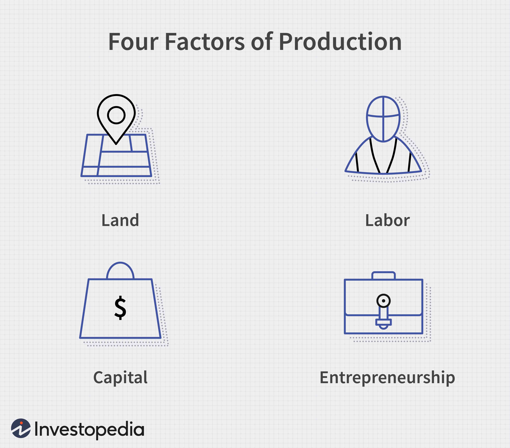

## Table of Contents

## What are the factors of production?

The factors of production are the resources used to make goods and services. There are four main factors: land, labor, capital, and entrepreneurship. Land includes natural resources like water, forests, and minerals. Labor is the work people do to produce things. Capital refers to the tools, machines, and buildings used in production. Entrepreneurship is the skill and creativity needed to start and run a business.

Each factor of production plays a crucial role in the economy. Land provides the raw materials needed for production. Without labor, there would be no one to work the machines or manage the business. Capital helps make production more efficient and effective. Entrepreneurship brings all these elements together to create new products and services. Together, these factors help businesses grow and economies thrive.

## How many main factors of production are there, and what are they?

There are four main factors of production. These are land, labor, capital, and entrepreneurship. Each one is important for making things and providing services.

Land means natural things like water, trees, and minerals. Labor is the work people do. Capital includes tools, machines, and buildings. Entrepreneurship is when people start and run businesses, using the other factors to create new products and services.

## What is the role of land in economic growth?

Land plays a big role in economic growth. It gives us the natural resources we need to make things. For example, we use water to grow food, trees to make paper, and minerals to build machines. Without land, we wouldn't have these resources, and it would be hard to produce goods and services.

Land also helps the economy grow by being a place to build things. Factories, farms, and offices need space to operate. When we use land well, we can make more things and create jobs. This helps the economy get bigger and stronger. So, land is very important for economic growth because it provides both resources and space.

## How does labor contribute to economic growth?

Labor is really important for economic growth. It's the work that people do to make things and provide services. When more people work, they can make more stuff and offer more services. This means the economy can grow because there are more goods and services available. Also, when people work, they earn money. They can spend this money on things they need or want, which helps other businesses grow too.

Labor also helps the economy by making things better and more efficient. When people learn new skills or use new technology, they can do their jobs faster and better. This can lead to new inventions and better ways of doing things. As a result, businesses can make more money, and the whole economy can grow. So, labor is key to economic growth because it drives production and helps improve how things are made.

## What is the significance of capital in the production process?

Capital is really important in the production process. It includes things like machines, tools, and buildings that help make goods and services. Without capital, it would be hard to make things quickly and efficiently. For example, a factory needs machines to make cars. If they didn't have these machines, it would take a lot longer to build each car, and they wouldn't be able to make as many.

Capital also helps businesses grow. When a company has good capital, it can make more things and reach more customers. This can lead to more money for the business, which they can use to buy even better capital. Over time, this can help the whole economy grow because businesses can make more and better products. So, capital is key to making things and helping the economy get bigger.

## How does entrepreneurship drive economic growth?

Entrepreneurship is really important for making the economy grow. It's when people come up with new ideas and start their own businesses. When someone starts a business, they create jobs for other people. More jobs mean more people can work and earn money. When people have money, they can buy things, which helps other businesses grow too. So, entrepreneurship helps the economy by creating jobs and making more money move around.

Entrepreneurs also bring new ideas and inventions to the market. They might make a new product or find a better way to do something. When they do this, it can make things cheaper or better for everyone. This can make the economy grow because people want to buy these new and better things. So, entrepreneurship drives economic growth by bringing new ideas and making things better for everyone.

## What is the difference between physical and human capital?

Physical capital includes things like machines, tools, and buildings that help make goods and services. These are things you can touch and see. For example, a factory uses machines to make cars. Without these machines, it would be hard to make cars quickly and in large numbers. Physical capital helps businesses work better and make more things.

Human capital is different. It's about the skills, knowledge, and experience that people have. This includes things like education and training. For example, a doctor needs to go to school and learn a lot to help people. When people have more skills and knowledge, they can do their jobs better. Human capital helps the economy grow because people can make better things and provide better services.

## How do technological advancements affect the factors of production?

Technological advancements change how we use the factors of production. They make things like land, labor, and capital work better. For example, new farming technology helps us use land more efficiently. We can grow more food on the same piece of land. Machines and tools, which are part of capital, also get better with technology. A new machine might make things faster or cheaper. This means businesses can make more stuff with the same amount of capital.

Technology also changes how we use labor. New technology can make jobs easier or even create new jobs. For example, computers and the internet have created lots of new jobs that didn't exist before. But sometimes, technology can also make some jobs go away. If a machine can do a job better than a person, the business might use the machine instead. This can be hard for people who lose their jobs, but it can also make the economy grow because things get made faster and cheaper.

Entrepreneurship is also affected by technology. New technology gives entrepreneurs new ideas for businesses. They can use technology to make new products or find new ways to do things. This can help the economy grow because new businesses create jobs and make new things for people to buy. So, technology changes how we use all the factors of production and helps the economy grow in new ways.

## What role do natural resources play in economic development?

Natural resources are very important for economic development. They include things like water, trees, oil, and minerals. These resources help us make things we need, like food, houses, and cars. When a country has a lot of natural resources, it can use them to make more stuff and sell it to other countries. This can bring in a lot of money and help the economy grow. For example, a country with a lot of oil can sell it to other countries and use the money to build roads and schools.

But having natural resources is not enough by itself. How a country uses these resources matters a lot. If a country uses its resources well, it can help everyone get richer. Good planning and smart use of resources can lead to more jobs and better lives for people. But if a country does not use its resources well, it might not help the economy as much. So, natural resources are important, but using them the right way is key to making the economy grow.

## How can improvements in infrastructure impact the efficiency of factors of production?

Improvements in infrastructure can make the factors of production work better. Infrastructure includes things like roads, bridges, and power lines. When these things are good, it's easier to move stuff around. For example, good roads help trucks get materials from one place to another quickly. This means businesses can get what they need faster and make more things. Also, good infrastructure helps people get to work easily. When people can get to work on time, they can do their jobs better and make more stuff. So, better infrastructure helps land, labor, and capital work more efficiently.

Infrastructure also helps with new ideas and businesses. When a place has good internet and power, it's easier for entrepreneurs to start new businesses. They can use the internet to sell things all over the world. Good power lines mean machines can work all the time without stopping. This helps businesses make things faster and cheaper. So, better infrastructure not only helps current businesses work better but also helps new businesses start and grow. This can make the whole economy stronger and more efficient.

## What are the challenges in balancing the use of factors of production for sustainable growth?

Balancing the use of factors of production for sustainable growth is hard because we need to think about the future, not just now. Land, labor, capital, and entrepreneurship all need to be used in a way that helps the economy grow but also keeps the environment safe. For example, if we use too much land to build factories, we might not have enough space for farms or forests. This can hurt the environment and make it hard to grow food. Also, if we use too much of our natural resources, like oil or water, we might run out of them in the future. So, we need to find a way to use these resources carefully so they last a long time.

Another challenge is making sure everyone benefits from economic growth. Sometimes, when businesses grow, they might not pay workers enough or might not take care of the environment. This can lead to problems like pollution or people not having good jobs. We need to make sure that as the economy grows, people have good jobs and the environment stays healthy. This means we need to use labor and capital in a way that is fair and good for everyone. It's a big challenge, but if we can balance all these things, we can have sustainable growth that helps everyone and keeps our world safe for the future.

## How do economic policies influence the allocation and productivity of factors of production?

Economic policies can change how we use land, labor, capital, and entrepreneurship. For example, if the government gives money to build new roads or schools, it makes it easier for people to get to work and for businesses to grow. This can help the economy get bigger because businesses can make more things and people can do their jobs better. Also, if the government makes rules about how much people should get paid, it can change how much it costs to use labor. This can make businesses think about using machines instead of people, which can change how they use capital.

Policies can also affect how new businesses start and grow. If the government makes it easy to start a business, more people might try to be entrepreneurs. This can lead to new ideas and more jobs. But if the government makes it hard to start a business, fewer people might try, and the economy might not grow as fast. So, economic policies can help or hurt how we use the factors of production. It's important for the government to make good policies that help the economy grow in a fair and sustainable way.

## References & Further Reading

[1]: Bergstra, J., Bardenet, R., Bengio, Y., & Kégl, B. (2011). ["Algorithms for Hyper-Parameter Optimization."](https://papers.nips.cc/paper/4443-algorithms-for-hyper-parameter-optimization) Advances in Neural Information Processing Systems 24.

[2]: ["Advances in Financial Machine Learning"](https://www.amazon.com/Advances-Financial-Machine-Learning-Marcos/dp/1119482089) by Marcos Lopez de Prado

[3]: ["Evidence-Based Technical Analysis: Applying the Scientific Method and Statistical Inference to Trading Signals"](https://www.amazon.com/Evidence-Based-Technical-Analysis-Scientific-Statistical/dp/0470008741) by David Aronson

[4]: ["Machine Learning for Algorithmic Trading"](https://github.com/PacktPublishing/Machine-Learning-for-Algorithmic-Trading-Second-Edition) by Stefan Jansen

[5]: ["Quantitative Trading: How to Build Your Own Algorithmic Trading Business"](https://books.google.com/books/about/Quantitative_Trading.html?id=j70yEAAAQBAJ) by Ernest P. Chan