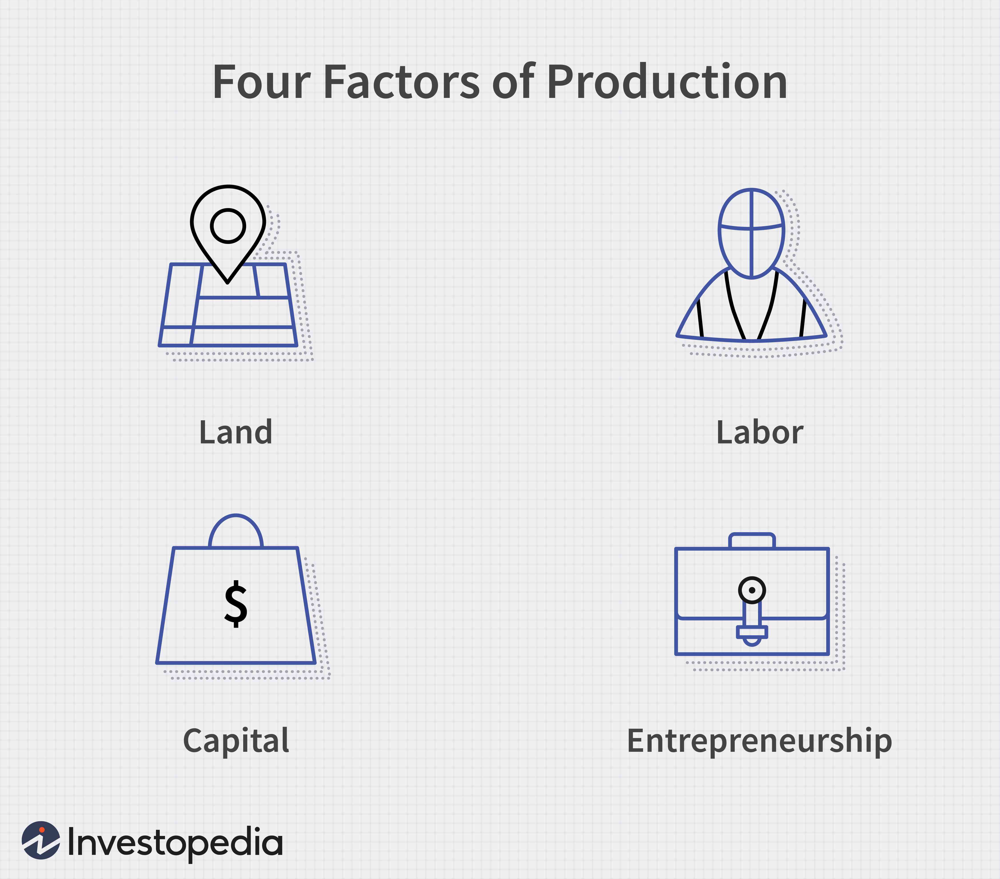

## Table of Contents

## What are factors of production inputs?

Factors of production inputs are the resources used to create goods and services. These inputs are essential for any economic activity and include land, labor, capital, and entrepreneurship. Land refers to all natural resources used in production, like forests, minerals, and water. Labor is the human effort used in the production process, including both physical and mental work. Capital includes all man-made resources used to produce goods and services, such as machinery, buildings, and tools. Entrepreneurship is the skill and vision needed to combine these other factors and start a business.

Each of these factors plays a crucial role in the economy. Land provides the raw materials needed for production. Without labor, there would be no one to transform these raw materials into finished products. Capital helps to increase efficiency and productivity, making it possible to produce more with less effort. Entrepreneurship drives innovation and growth by finding new ways to use these resources. Together, these factors of production inputs form the backbone of any economy, enabling the creation of everything from simple goods to complex services.

## How many main types of factors of production are there?

There are four main types of factors of production. These are land, labor, capital, and entrepreneurship. Each type is important for making things or providing services.

Land means all the natural things we use, like soil, water, and minerals. Labor is the work people do, using their hands or their minds. Capital includes things made by people, like machines and buildings, that help make other things. Entrepreneurship is when someone has an idea and starts a business using the other three factors. All these parts work together to help the economy grow and make things we need and want.

## Can you name and briefly describe the four main factors of production?

The four main factors of production are land, labor, capital, and entrepreneurship. Land includes all natural resources that we use to make things, like soil, water, and minerals. These are things that come from nature and are important because they provide the raw materials needed for production. Labor is the work that people do. It can be physical work, like building something, or mental work, like planning or designing. Without people working, we wouldn't be able to turn raw materials into finished products.

Capital is made up of things that people have created to help make other things. This includes machines, tools, and buildings. Capital helps to make work easier and more efficient, so we can produce more with less effort. Entrepreneurship is when someone has an idea and decides to start a business. Entrepreneurs use land, labor, and capital to create new products or services. They are important because they bring innovation and help the economy grow by finding new ways to use resources.

## Why are factors of production important in economics?

Factors of production are important in economics because they are the building blocks for making things and providing services. They include land, labor, capital, and entrepreneurship. Without these, it would be impossible to create anything, from simple goods like bread to complex services like healthcare. Each [factor](/wiki/factor-investing) plays a key role: land gives us the raw materials, labor turns these materials into products, capital makes the process more efficient, and entrepreneurship brings new ideas and businesses to life.

Understanding these factors helps us see how an economy works and grows. When businesses use these resources well, they can produce more and better goods and services. This can lead to more jobs, higher wages, and a better standard of living for people. Economists study these factors to find ways to use them more effectively, which can help make the economy stronger and more productive. In short, factors of production are the heart of any economy, driving everything from daily production to long-term growth.

## How do factors of production contribute to economic growth?

Factors of production help the economy grow by working together to make things and provide services. When businesses use land, labor, capital, and entrepreneurship well, they can make more goods and offer more services. This means more people can have jobs, and when people have jobs, they earn money. With money, they can buy more things, which makes the economy bigger and stronger. Land gives us the raw materials we need, like wood or minerals. Labor is the work people do to turn these materials into things we can use, like making a table from wood. Capital, like machines and tools, helps people work faster and make more things. And entrepreneurship brings new ideas and businesses, which can create new jobs and new ways to use resources.

When all these factors work well together, the economy can grow. For example, if a new factory is built (capital), it can use natural resources (land) and hire people (labor) to make products. An entrepreneur might start this factory with a new idea for a product that people want. As the factory grows, it might need more workers, which means more jobs and more money for people to spend. This cycle of using factors of production can lead to more growth, as businesses expand and create even more jobs and wealth. Economists look at how these factors are used to find ways to make the economy grow even more, helping everyone have a better life.

## What is the role of entrepreneurship in factors of production?

Entrepreneurship is a key part of the factors of production because it brings new ideas and starts new businesses. Without entrepreneurs, we wouldn't have new products or services. Entrepreneurs use land, labor, and capital to make their ideas real. They see opportunities where others might not and take risks to start a business. This can lead to new jobs and help the economy grow.

When entrepreneurs start a business, they mix the other factors of production in new ways. They might use land to get raw materials, hire people to work, and buy machines to help make things. By doing this, they not only create something new but also help the economy. Their ideas can lead to more jobs, more money for people to spend, and new ways of doing things. This makes entrepreneurship a very important part of making the economy stronger and better.

## How do technological advancements affect the factors of production?

Technological advancements change how we use the factors of production. They make things like land, labor, and capital work better. For example, new machines can help farmers use less land to grow more food. This means we can use our natural resources more wisely. Also, technology can make work easier for people. With computers and robots, workers can do their jobs faster and with less effort. This can lead to more things being made and more services being offered.

Entrepreneurship also gets a big boost from technology. New inventions give entrepreneurs new ideas for businesses. They can use technology to start companies that do things in new ways. For example, someone might start a business that uses the internet to sell things all over the world. This can create new jobs and help the economy grow. Overall, technology helps us use the factors of production in smarter and more efficient ways, making our economy stronger.

## What are some examples of land as a factor of production?

Land as a factor of production includes all the natural things we use to make stuff. This can be things like soil, where we grow our food. Farmers use land to plant crops like wheat, corn, and vegetables. They need good soil to make sure the plants grow well. Another example is water. We use water from rivers and lakes to drink, to water crops, and in factories to make things. Without water, we couldn't grow food or make many products.

Minerals are also part of land. We dig minerals like coal, oil, and metals out of the ground. Coal and oil give us energy to run machines and heat our homes. Metals like iron and copper are used to make cars, buildings, and electronics. Forests are another example of land. We use wood from trees to build houses, make furniture, and even create paper. All these natural resources come from land and are important for making the things we need every day.

## How does the concept of labor as a factor of production differ across industries?

The concept of labor as a factor of production can look very different depending on the industry. In farming, labor might mean people working in the fields, planting seeds, and harvesting crops. They use their physical strength to do these tasks. In a factory, labor could be workers using machines to make things like cars or toys. They might need to know how to operate the machines and keep them running smoothly. In both cases, labor is about the work people do, but the kind of work and the skills needed can be very different.

In the service industry, like restaurants or hospitals, labor is about providing help to others. A chef in a restaurant uses their skills to cook meals, while a nurse in a hospital takes care of patients. These jobs need different kinds of training and knowledge. In the tech industry, labor might involve people writing computer code or designing software. They use their minds more than their muscles. Even though all these jobs are considered labor, the way people work and the skills they need change a lot from one industry to another.

## What is the impact of capital investment on productivity?

Capital investment, like buying new machines or building new factories, can make workers more productive. When a business buys a new machine, it can help workers do their jobs faster and easier. For example, a farmer might buy a new tractor that can plow fields quicker than doing it by hand. This means the farmer can plant more crops and get more food from the same amount of land. In a factory, new machines can make more things in less time, so the workers can produce more with less effort. This is why capital investment is important—it helps people work better and make more.

When businesses invest in capital, it can also lead to new jobs and better pay for workers. If a company builds a new factory, it will need more people to work there. This means more jobs for people, and when there are more jobs, workers can often ask for higher wages. Also, better machines and tools can make the work easier and safer, which can make workers happier and more willing to stay with the company. So, capital investment not only helps businesses make more things but also helps the people who work there have better lives.

## How do changes in the availability of natural resources influence economic strategies?

When the amount of natural resources like oil, water, or minerals changes, it can affect how a country plans its economy. If a country finds a lot of a new resource, like a big oil field, it might decide to focus more on using that resource to grow its economy. They might build more factories to turn the oil into things like gasoline or plastic. This can create new jobs and bring in more money. But if a resource becomes harder to find, like if water starts running low, the country might need to find new ways to use less of it. They might change their farming methods to save water or look for other sources of energy.

These changes can also affect how a country trades with others. If a country has a lot of a resource that others need, it can sell it to them and make money. But if it doesn't have enough of a resource, it might have to buy it from other countries, which can cost a lot. So, leaders have to think carefully about how to use their resources wisely. They might invest in new technology to find more resources or use them more efficiently. This helps keep the economy strong even when the availability of natural resources changes.

## What advanced economic theories discuss the interrelation between different factors of production?

Advanced economic theories like the theory of production and the theory of economic growth look at how land, labor, capital, and entrepreneurship work together. These theories say that each factor of production is important, but they all need each other to make the economy grow. For example, land gives us raw materials, but without labor to turn those materials into things we can use, they're not very helpful. Capital, like machines and tools, helps make the work of labor easier and faster. And entrepreneurship brings new ideas that can use land, labor, and capital in new ways. When these factors work well together, they can make the economy stronger and help people have better lives.

Another theory, called the theory of technological change, looks at how new inventions and technology can change how we use the factors of production. Technology can make land more useful by helping us find new resources or use them better. It can also make labor more productive by giving workers better tools and machines. Capital itself can change with new technology, like when a new machine is invented that can do the work of many old ones. And entrepreneurs often use new technology to start new businesses. So, technology can change how all the factors of production work together and help the economy grow even more.

## References & Further Reading

[1]: Kirilenko, A., Kyle, A. S., Samadi, M., & Tuzun, T. (2017). ["The Flash Crash: High-frequency trading in an electronic market."](https://www.jstor.org/stable/26652722) The Journal of Finance, 72(1), 371-417.

[2]: McGowan, M. J. (2010). ["The rise of computerized high-frequency trading: Use and controversy."](https://scholarship.law.duke.edu/dltr/vol9/iss1/15/) Duke Law & Technology Review, 2010(1), 1-24.

[3]: Biais, B., Foucault, T., & Moinas, S. (2015). ["Equilibrium fast trading."](https://www.sciencedirect.com/science/article/abs/pii/S0304405X15000288) Journal of Financial Economics, 116(2), 292-293.

[4]: Lopez de Prado, M. (2018). ["Advances in Financial Machine Learning."](https://www.amazon.com/Advances-Financial-Machine-Learning-Marcos/dp/1119482089) Wiley.

[5]: Chan, E. P. (2008). ["Quantitative Trading: How to Build Your Own Algorithmic Trading Business."](https://github.com/ftvision/quant_trading_echan_book) Wiley.

[6]: Jansen, S. (2020). ["Machine Learning for Algorithmic Trading."](https://github.com/stefan-jansen/machine-learning-for-trading) Packt Publishing.

[7]: Aronson, D. R. (2006). ["Evidence-Based Technical Analysis: Applying the Scientific Method and Statistical Inference to Trading Signals."](https://onlinelibrary.wiley.com/doi/book/10.1002/9781118268315) Wiley.