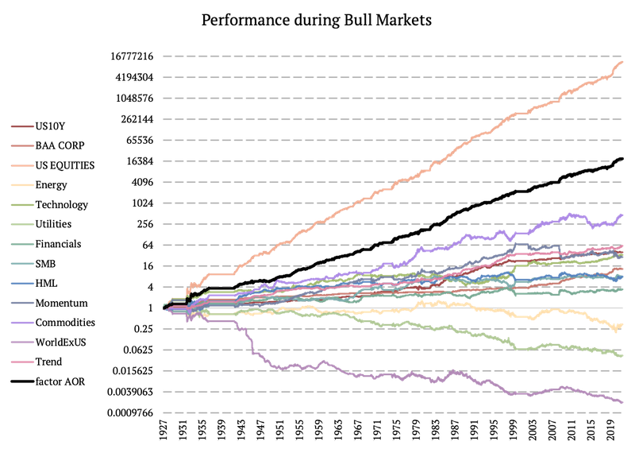

## Table of Contents

## What are market cycles and how do they affect investments?

Market cycles are the ups and downs that happen in the economy over time. They are like the seasons, but instead of affecting the weather, they affect businesses and money. There are four main parts to a market cycle: expansion, peak, contraction, and trough. During expansion, the economy grows, and people feel good about spending and investing. The peak is when the economy is at its best, but it can't keep growing forever. After the peak comes contraction, where the economy starts to shrink, and people might lose jobs or cut back on spending. Finally, the trough is the bottom of the cycle, where things start to get better again, and the cycle begins anew.

Market cycles affect investments because they change how much risk people are willing to take and how much money they have to invest. When the economy is in an expansion phase, people might feel more confident and invest more in stocks, hoping to make a lot of money. But when the economy hits a contraction, people might get scared and pull their money out of the stock market, or they might look for safer places to put their money, like bonds. Understanding market cycles can help investors make smarter choices, like buying stocks when prices are low during a trough or selling when prices are high at a peak. However, it's hard to predict exactly when these changes will happen, so investors need to be ready for surprises and plan for the long term.

## What is a factor in the context of investing?

In the world of investing, a factor is something that can help explain why some investments do better than others. Think of it like a recipe for a cake. Just like how different ingredients like flour, sugar, and eggs affect how the cake turns out, factors are the ingredients that affect how well an investment performs. Common factors include things like the size of a company, how much it grows, how much risk it has, and how much it pays out in dividends.

Investors use these factors to try and pick investments that will do well. For example, if an investor believes that small companies will do better than big ones, they might choose to invest more in small companies. By understanding and using factors, investors can build a mix of investments that they think will help them reach their goals. But remember, just like baking a cake, it's not always easy to get the mix just right, and sometimes things don't turn out as expected.

## How can factors be used to enhance portfolio performance?

Factors can help make a portfolio perform better by letting investors pick investments that match what they think will do well in the future. For example, if an investor thinks that companies that are growing fast will do better than others, they can choose to put more money into those kinds of companies. This is like picking the best players for a sports team. By focusing on factors like growth, size, or how much risk a company has, investors can try to build a portfolio that does better than just picking investments randomly.

But using factors isn't a sure thing. Sometimes, what worked in the past might not work in the future. So, investors need to keep an eye on how their choices are doing and be ready to change things if needed. It's also important not to put all the eggs in one basket. By mixing different factors, like having some investments that focus on growth and others that focus on safety, investors can try to make their portfolio more stable and possibly do better over time.

## What are the common types of market cycles?

Market cycles are patterns that show how the economy changes over time. They can be broken down into four main parts: expansion, peak, contraction, and trough. During the expansion phase, the economy grows, and people feel good about spending and investing. This is a time when businesses do well, and more jobs are created. The peak is when the economy is at its highest point. It can't keep growing forever, so this is when things start to slow down.

After the peak comes the contraction phase, where the economy starts to shrink. People might lose jobs, and businesses might struggle. This can make people feel worried about spending and investing. The trough is the bottom of the cycle, where things are at their worst. But it's also the point where the economy starts to get better again. From the trough, the cycle begins anew with another expansion phase.

There are other types of market cycles too, like the business cycle and the real estate cycle. The business cycle is similar to the general market cycle but focuses more on how businesses are doing. The real estate cycle looks at how the housing market goes up and down. All these cycles are important for investors to understand because they can affect how much money people make from their investments.

## How does a factor's performance vary across different market cycles?

A factor's performance can change a lot depending on where we are in the market cycle. During the expansion phase, when the economy is growing and people feel good about spending, factors like growth and momentum tend to do well. Companies that are growing fast or whose stock prices are going up quickly can make a lot of money for investors. On the other hand, factors like value, which focus on companies that might be cheaper but not growing as fast, might not do as well during this time because investors are looking for quick wins.

When the market hits the peak and starts to contract, things can change. During a contraction, when the economy is shrinking and people are worried, factors like quality and low volatility can become more important. Investors might look for companies that are stable and less risky, even if they don't grow as fast. Value factors can also start to do better because the prices of some companies might drop a lot, making them good deals. Finally, during the trough, when the economy is at its lowest point, factors that did well during the contraction might continue to be important, but as the economy starts to recover, growth factors might start to pick up again.

## Can you explain the impact of economic cycles on factor performance?

Economic cycles can really change how well different factors do in investing. When the economy is growing and everyone feels good, like during the expansion part of the cycle, factors like growth and momentum tend to do well. These are about companies that are getting bigger fast or whose stock prices are going up quickly. People want to invest in these kinds of companies because they think they can make a lot of money quickly. But during this time, value factors, which are about companies that might be cheaper but not growing as fast, might not do as well because people are looking for quick wins.

When the economy starts to shrink and people get worried, like during the contraction part of the cycle, different factors can become more important. Quality and low volatility factors can do better because people start looking for companies that are stable and less risky. Even if these companies don't grow as fast, they can be safer places to put money. Value factors can also start to do better because some companies' prices might drop a lot, making them good deals. As the economy hits the bottom, or the trough, and starts to get better, the factors that did well during the contraction might keep doing well, but as things start to recover, growth factors might start to pick up again.

## What historical data supports the analysis of factor performance during market cycles?

Looking at history helps us see how different factors do during market cycles. For example, during the big economic growth times in the 1990s, growth and momentum factors did really well. Tech companies were booming, and their stock prices went up a lot. But when the dot-com bubble burst around 2000, these same factors didn't do so well. People started looking for safer places to put their money, and value and quality factors started to shine. During the 2008 financial crisis, when the economy was shrinking fast, low volatility and quality factors were the ones that helped investors lose less money.

After the 2008 crisis, as the economy started to recover, growth factors started doing better again. People felt more confident and were willing to take more risks. But then, during the short but sharp economic dip in 2020 caused by the global health crisis, quality and low volatility factors again became important. Investors were scared and wanted to protect their money. These examples from history show that different factors can do better or worse depending on where we are in the market cycle. By understanding these patterns, investors can try to pick the right factors at the right time to help their investments do better.

## How do different factors like value, momentum, and quality perform during bull and bear markets?

During bull markets, when the economy is growing and everyone feels good about spending and investing, factors like momentum and growth tend to do really well. Momentum is about picking stocks that have been going up in price recently, and growth is about companies that are getting bigger fast. People are more willing to take risks during these times, so they want to invest in companies that might make them a lot of money quickly. Value factors, which focus on companies that might be cheaper but not growing as fast, usually don't do as well during bull markets because people are looking for quick wins.

In bear markets, when the economy is shrinking and people are worried, different factors can become more important. Quality and low volatility factors often do better because investors start looking for companies that are stable and less risky. These companies might not grow as fast, but they can be safer places to put money. Value factors can also start to do better during bear markets because some companies' prices might drop a lot, making them good deals. By understanding how these factors perform in different market conditions, investors can try to pick the right ones to help their investments do better.

## What advanced statistical methods can be used to analyze factor performance across market cycles?

To understand how different factors like growth, value, and quality do in different parts of the market cycle, investors can use some fancy math called advanced statistical methods. One popular method is regression analysis. This helps investors see how much each factor affects investment returns over time. They can use something called time-series regression to look at how these factors do during different market phases, like when the market is going up or down. Another method is factor analysis, which helps group different investments based on what affects their performance the most. This can show if a factor like value is more important during a bear market or if growth does better during a bull market.

Another useful method is the use of Markov regime-switching models. These models can help investors see how factors behave when the market switches from a bull to a bear market or back again. They look at how likely it is for the market to change from one state to another and how factors perform in each state. By using these models, investors can get a better idea of when to focus on certain factors. Lastly, there's machine learning, which can look at a lot of data and find patterns that might be hard to see otherwise. Machine learning can help predict how factors might do in the future based on past market cycles. By using these advanced methods, investors can make smarter choices about which factors to focus on at different times.

## How can investors adjust their factor exposure based on anticipated market cycles?

Investors can adjust their factor exposure by paying attention to where they think the market is going. If they think the market is going to grow and become a bull market, they might want to put more money into growth and momentum factors. These are about companies that are getting bigger fast or whose stock prices are going up quickly. During good times, people are more willing to take risks, so focusing on these factors can help make more money. On the other hand, if investors think the market might shrink and become a bear market, they might want to focus more on quality and low volatility factors. These are about companies that are stable and less risky, which can be safer places to put money when things are not going well.

To make these adjustments, investors can use different tools and methods. They might look at economic reports, listen to what experts are saying, and use fancy math to predict where the market might go next. By understanding these predictions, investors can change how much they invest in different factors. For example, if they think a bear market is coming, they might sell some of their growth stocks and buy more value or quality stocks. By doing this, they can try to make their investments do better no matter what the market is doing.

## What are the limitations and risks associated with relying on factor performance during market cycles?

Using factors to make investment choices based on market cycles can be tricky. One big problem is that it's really hard to predict exactly when the market will change from growing to shrinking or back again. Even the best experts can get it wrong, which means that if you try to change your investments based on what you think will happen, you might end up making the wrong moves. Another risk is that just because a factor did well in the past during a certain part of the market cycle, it doesn't mean it will do the same thing in the future. The economy and the market can change in ways that no one expects, so relying too much on past patterns can lead to surprises and losses.

Also, focusing too much on one or two factors can make your investments less safe. If you put all your money into growth stocks because you think the market will keep growing, but then it suddenly starts to shrink, you could lose a lot. It's important to have a mix of different factors in your portfolio to help protect against these risks. Trying to time the market and switch between factors can also lead to a lot of buying and selling, which can cost you money in fees and taxes. So while understanding factors and market cycles can help, it's important to use this knowledge carefully and not rely on it too much.

## How do global economic events influence the performance of factors across different market cycles?

Global economic events can really shake things up when it comes to how well different factors do during market cycles. When something big happens, like a financial crisis or a global health scare, it can change how people feel about spending and investing. For example, during the 2008 financial crisis, a lot of people got scared and started looking for safe places to put their money. This made factors like quality and low volatility do better because they focus on companies that are stable and less risky. On the other hand, growth and momentum factors, which are about companies that are growing fast or whose stock prices are going up quickly, might not do as well during these times because people are less willing to take risks.

These events can also make the market cycle move faster or slower than usual. If a global event causes the economy to shrink quickly, like what happened in 2020 with the health crisis, the market might go from a bull market to a bear market in no time. During these quick changes, value factors, which focus on companies that might be cheaper but not growing as fast, can start to do better because some companies' prices might drop a lot, making them good deals. But once things start to get better and the economy starts growing again, growth factors might start to pick up. So, global economic events can really mess with the usual patterns of how factors perform during market cycles, making it harder for investors to predict what will happen next.

## What are the factors during bull markets?

During bull markets, most investment factors generally perform well as economic conditions are typically favorable, leading to rising asset prices and increased investor confidence. Historically, periods of economic expansion and enthusiasm in financial markets result in higher overall returns across various asset classes. However, not all factors benefit equally during such periods.

Some specific factors, like World ex-US equities, Utilities, and Energy, tend to show weaker performance compared to U.S. equities during bull markets. World ex-US equities, which represent global stocks excluding the United States, might underperform due to the relatively stronger economic growth and more robust financial market infrastructure in the U.S. This may lead to U.S. equities benefiting more directly from domestic market optimism and monetary policies aimed at stimulating economic growth.

Utilities and Energy sectors, often considered defensive due to their traditionally stable earnings and dividends, tend to lag during bull markets. These sectors are typically less volatile and do not benefit as much from the risk-on sentiment that characterizes bull markets. Investors might prefer high-growth sectors, such as technology, which offer greater potential returns during expansions, leaving utilities and energy sectors with comparatively lower performance.

Diversification remains a cornerstone of investing during bull markets. The AOR [ETF](/wiki/etf-trading-strategies), which represents a diversified portfolio of global equities and bonds, exemplifies the advantages of diversification. Through its exposure to a wide array of asset classes and geographical regions, the AOR ETF often outperforms individual factors. The performance of a diversified portfolio is generally more stable since it can capitalize on different market drivers and spread risk across various sectors and regions.

The benefits of diversification in bull markets can be demonstrated through the Capital Asset Pricing Model (CAPM) framework. According to CAPM, the expected return of a diversified portfolio ($E(R_p)$) can be calculated using the formula:

$$
E(R_p) = R_f + \beta_p(E(R_m) - R_f)
$$

where $R_f$ is the risk-free rate, $\beta_p$ is the portfolio's beta, and $E(R_m)$ is the expected market return. In diversified portfolios like AOR, the portfolio beta $\beta_p$ is typically closer to 1 due to a balance of high- and low-beta assets, aligning the portfolio's performance more closely with the market return. Thus, during bull markets, diversified portfolios often capture the broad market upswing effectively without being exposed to the specific risks of underperforming factors.

## What are the factors to consider during bear markets?

In bear markets, certain factors tend to perform better than others, providing algorithmic traders with opportunities to optimize their strategies. Among these, World ex-US equities and the Trend Factor have demonstrated superior performance, often achieving higher Sharpe ratios. The Sharpe ratio, calculated as:

$$
\text{Sharpe Ratio} = \frac{E[R] - R_f}{\sigma}
$$

where $E[R]$ is the expected return, $R_f$ is the risk-free rate, and $\sigma$ is the standard deviation of returns, is a widely used measure to evaluate the risk-adjusted return of an investment. Higher Sharpe ratios indicate that World ex-US equities and the Trend Factor can potentially serve as defensive strategies, offering investors better compensation for the risk undertaken during periods of market decline.

World ex-US equities offer diversification benefits by providing exposure to international markets, which might not be as deeply affected by bear market conditions in the U.S. This geographic diversity can reduce portfolio [volatility](/wiki/volatility-trading-strategies) and enhance risk-adjusted returns.

The Trend Factor, often implemented through trend-following strategies, captures [momentum](/wiki/momentum) and benefits from the continuation of declining market trends. These strategies can adapt to downward market movements more swiftly, potentially leading to higher returns and an increase in Sharpe ratios during bear phases.

Conversely, the AOR ETF, a diversified asset allocation strategy combining various asset classes, has shown lesser effectiveness in bear markets compared to the aforementioned factors. While it provides broad diversification across different asset classes, its inclusion of riskier assets can diminish its capability to buffer against substantial market downturns.

Thus, strategy diversity is paramount during bear markets. By leveraging factors like World ex-US equities and the Trend Factor, algorithmic traders can enhance their portfolios' resilience against declining markets, potentially improving overall performance.

## References & Further Reading

[1]: ["Advances in Financial Machine Learning"](https://www.amazon.com/Advances-Financial-Machine-Learning-Marcos/dp/1119482089) by Marcos Lopez de Prado

[2]: ["Quantitative Momentum: A Practitioner's Guide to Building a Momentum-Based Stock Selection System"](https://books.google.com/books/about/Quantitative_Momentum.html?id=K2npCgAAQBAJ) by Wesley R. Gray and Jack R. Vogel

[3]: ["Trading and Exchanges: Market Microstructure for Practitioners"](https://www.amazon.com/Trading-Exchanges-Market-Microstructure-Practitioners/dp/0195144708) by Larry Harris

[4]: ["Machine Learning for Algorithmic Trading"](https://github.com/PacktPublishing/Machine-Learning-for-Algorithmic-Trading-Second-Edition) by Stefan Jansen

[5]: ["Quantitative Trading: How to Build Your Own Algorithmic Trading Business"](https://books.google.com/books/about/Quantitative_Trading.html?id=j70yEAAAQBAJ) by Ernest P. Chan

[6]: ["Evidence-Based Technical Analysis: Applying the Scientific Method and Statistical Inference to Trading Signals"](https://www.amazon.com/Evidence-Based-Technical-Analysis-Scientific-Statistical/dp/0470008741) by David Aronson

[7]: Bergstra, J., Bardenet, R., Bengio, Y., & Kégl, B. (2011). ["Algorithms for Hyper-Parameter Optimization."](https://dl.acm.org/doi/10.5555/2986459.2986743) Advances in Neural Information Processing Systems 24.