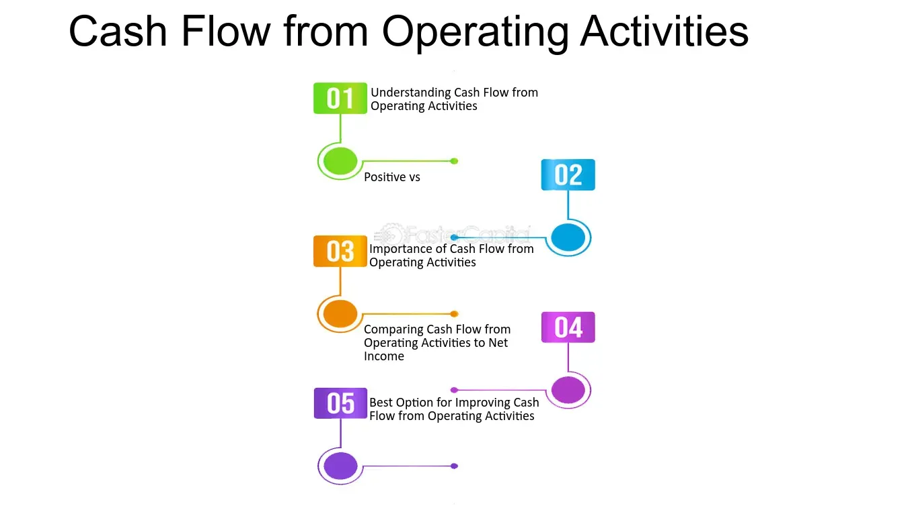

## Table of Contents

## What is cash flow from operating activities?

Cash flow from operating activities is the money a company makes or spends from its regular business operations. This includes things like selling products or services, paying employees, and buying supplies. It shows how well a company is doing at making money from its main business, not from investing or borrowing.

Looking at the cash flow from operating activities helps people understand if a company can pay its bills, reinvest in the business, or pay dividends to shareholders. If this number is positive, it means the company is generating more cash than it is using, which is a good sign. If it's negative, the company might be spending more than it's earning, which could be a warning sign.

## Why is it important to monitor cash flow from operating activities?

Monitoring cash flow from operating activities is important because it tells you if a company is making money from its main business. It shows if the company can pay its bills and keep running every day. If the cash flow is positive, it means the company is earning more than it's spending, which is a good sign. But if it's negative, the company might be in trouble because it's spending more than it's making.

This information is useful for people who own the company or are thinking about investing in it. They want to know if the company is healthy and can keep going. It also helps managers make decisions about spending money, like whether to buy new equipment or hire more people. By keeping an eye on cash flow from operating activities, everyone can understand how well the company is doing at its core business.

## What are common factors that can reduce cash flow from operating activities?

There are several common things that can make a company's cash flow from operating activities go down. One big reason is if the company is not selling as many products or services as before. When sales drop, less money comes in, and that can hurt the cash flow. Another reason could be if the company has to pay more to its suppliers or for things like rent and utilities. If these costs go up, the company has less money left over after paying its bills.

Another [factor](/wiki/factor-investing) that can reduce cash flow is if the company is not collecting money from customers quickly enough. If customers are slow to pay, the company might not have enough cash to keep running smoothly. Also, if the company has to pay its employees more or hire more workers, that can use up more cash. All these things together can make it harder for a company to have positive cash flow from its main business activities.

Sometimes, a company might have to spend a lot of money on fixing things or keeping them running, like machines or buildings. These kinds of expenses can also reduce the cash flow from operating activities. It's important for a company to keep an eye on all these factors to make sure it can keep making money from its main business.

## How does an increase in accounts receivable affect cash flow from operating activities?

When a company sells things but lets customers pay later, it creates something called accounts receivable. This means the company has made a sale, but it hasn't gotten the cash yet. If accounts receivable go up, it means more customers are buying on credit and not paying right away. This can hurt the cash flow from operating activities because the company is waiting longer to get paid. Even though the company has made sales, it doesn't have the cash in hand to use for other things like paying bills or buying supplies.

So, an increase in accounts receivable is shown as a negative number on the cash flow statement. This is because the cash hasn't actually come in yet, even though the sale was made. If a company has a lot of money tied up in accounts receivable, it might struggle to pay its own bills on time. That's why it's important for a company to keep an eye on how quickly customers are paying back what they owe. If too much money is stuck in accounts receivable, it can make the cash flow from operating activities look worse than it really is.

## What impact do higher inventory levels have on cash flow from operating activities?

When a company has more inventory, it means they have more products sitting in their warehouse or store. This can be a problem for cash flow from operating activities because the company has spent money to buy or make those products, but it hasn't sold them yet. So, the money is tied up in the inventory and not coming back into the company's bank account. This can make it harder for the company to pay its bills or buy new things because the cash is stuck in the products on the shelf.

Higher inventory levels show up as a negative number on the cash flow statement. This is because the company used cash to increase its inventory, and that cash isn't coming back until the products are sold. If the company keeps a lot of money tied up in inventory for a long time, it can hurt the cash flow from operating activities. It's important for a company to manage its inventory well so it can keep enough cash flowing to keep the business running smoothly.

## How can changes in accounts payable influence cash flow from operating activities?

When a company buys things from suppliers but doesn't pay right away, it creates something called accounts payable. If accounts payable go up, it means the company is buying more things on credit and not paying for them yet. This can help the cash flow from operating activities because the company gets to keep its cash longer. It's like getting a short-term loan from the supplier, which can be good for the company's cash flow.

On the other hand, if accounts payable go down, it means the company is paying off what it owes to suppliers faster. This uses up more cash and can hurt the cash flow from operating activities. When a company pays its bills, the money goes out of its bank account, and that can make it harder to cover other expenses or keep the business running smoothly. So, changes in accounts payable can have a big impact on how much cash a company has available from its main business activities.

## What role do depreciation and amortization play in cash flow from operating activities?

Depreciation and amortization are ways to spread out the cost of things like buildings, machines, or patents over time. They don't involve actual cash going out, so they don't directly reduce the cash a company has. But they are added back to the company's net income when calculating cash flow from operating activities. This is because net income is reduced by depreciation and amortization on the income statement, but since no cash was spent, we need to add them back to see the real cash flow.

When you see depreciation and amortization on a cash flow statement, it's a way to show that the company's cash flow is better than its net income might suggest. For example, if a company reports a net income of $100,000 but has $20,000 in depreciation, the cash flow from operating activities would start at $120,000. This helps give a clearer picture of how much cash the company is actually generating from its main business activities, without being misled by non-cash expenses.

## How do non-cash expenses affect the cash flow from operating activities?

Non-cash expenses are costs that a company reports on its income statement but doesn't actually pay out in cash. Common examples are depreciation and amortization. These expenses reduce a company's net income on paper, but since no cash leaves the company, they don't directly affect the cash flow. When calculating cash flow from operating activities, these non-cash expenses are added back to the net income. This adjustment helps show the real amount of cash the company is generating from its main business activities.

For example, if a company has a net income of $50,000 but reports $10,000 in depreciation, the cash flow from operating activities would be calculated starting at $60,000. This is because the $10,000 in depreciation was subtracted from net income to get the $50,000, but since no actual cash was spent, it's added back. By doing this, the cash flow statement gives a clearer picture of how much cash the company is really bringing in from its operations, without being confused by expenses that don't involve cash.

## What are the effects of deferred revenue on cash flow from operating activities?

Deferred revenue is money a company gets from customers before it actually gives them the product or service. When a company receives this money, it shows up as cash coming in on the cash flow statement, which can make the cash flow from operating activities look better. This is because even though the company hasn't earned the money yet, it has the cash in hand.

However, on the income statement, this money isn't counted as revenue until the company actually provides the product or service. So, when looking at the cash flow from operating activities, deferred revenue can make it seem like the company is doing better than it really is because it shows cash coming in, but the company still has to do the work to earn that money. It's important to remember that this cash might need to be used later to fulfill the promise to the customer, so it's not really free money for the company to spend right away.

## How can operating losses lead to reduced cash flow from operating activities?

When a company has operating losses, it means they are spending more money on their main business activities than they are making from selling their products or services. This can directly reduce the cash flow from operating activities because the company is using up its cash to cover these losses. If the company keeps losing money, it might not have enough cash to pay for things like salaries, supplies, or rent, which can make the situation even worse.

Operating losses show up on the cash flow statement as a negative number, which means the company is not generating enough cash from its main business to keep going. If these losses continue, the company might need to borrow money or use up its savings just to stay open. This can make it harder for the company to recover and start making money again, leading to a cycle of reduced cash flow from operating activities.

## What advanced strategies can businesses use to mitigate factors reducing cash flow from operating activities?

Businesses can use several advanced strategies to improve their cash flow from operating activities. One way is by tightening up their credit policies. This means they might ask customers to pay faster or only give credit to customers who are likely to pay on time. Another strategy is to manage inventory better. Instead of keeping too many products in stock, businesses can use systems to predict how much they need and when. This helps them avoid spending too much money on things that sit on shelves without being sold.

Another approach is to negotiate better terms with suppliers. If a business can get longer to pay its bills, it keeps more cash in the bank for longer. This can help a lot with cash flow. Also, businesses can look for ways to cut costs. They might find cheaper ways to make their products or services, or they might use technology to do things more efficiently. All these strategies can help a business have more cash coming in than going out, which is good for cash flow from operating activities.

Finally, businesses can use financial tools like factoring or invoice financing. Factoring means selling their accounts receivable to a third party for immediate cash, which can help if customers are slow to pay. Invoice financing is similar but involves borrowing against the invoices. These tools can give a business the cash it needs right away, helping to smooth out cash flow problems. By using these strategies smartly, businesses can work on making their cash flow from operating activities stronger and more stable.

## How can financial modeling help predict and manage factors affecting cash flow from operating activities?

Financial modeling can help a business predict and manage factors that affect its cash flow from operating activities by creating a detailed picture of how money moves in and out of the business. By using a financial model, a company can look at different scenarios and see how changes in things like sales, costs, or how quickly customers pay can impact their cash flow. For example, if a business thinks sales might go down, they can use the model to see how that would affect their cash flow and plan ahead. This helps them make better decisions about things like when to buy more inventory or when to hire more staff.

Another way financial modeling helps is by letting a business test out different strategies to improve cash flow before actually trying them. They can see what happens if they change their credit terms, negotiate better deals with suppliers, or cut costs in certain areas. By running these scenarios through the model, the business can find the best ways to keep their cash flow strong. This kind of planning can help a company avoid running out of cash and make sure they have enough money to keep running smoothly.

## What is the understanding of operating activities and cash flow?

Operating activities are integral components of a company's financial statements, depicting the core business processes responsible for generating revenue. They encompass activities directly related to producing and delivering goods or services, such as sales, manufacturing, and administrative functions. Understanding these activities is crucial for investors and analysts aiming to evaluate a company's operational efficiency and financial health.

Cash flow from operating activities (CFO) is a key metric that measures the cash generated or used in the primary operations of a business. The calculation of CFO often involves starting with net income and making adjustments for non-cash items, changes in working capital, and other operating activities that impact cash.

$$
\text{Cash Flow from Operating Activities} = \text{Net Income} + \text{Non-Cash Items} + \Delta \text{Working Capital}
$$

**Net Income**: The starting point for calculating CFO is the net income, which is the profit a company has after deducting all expenses from revenues. However, as net income includes several non-cash items, it is necessary to adjust it further to reflect actual cash movements.

**Non-Cash Items**: These are expenses recorded in the income statement that do not involve actual cash transactions. Depreciation and amortization are common examples. These expenses are added back to the net income since they reduce reported profits but do not affect cash flow.

**Changes in Working Capital**: Working capital, defined as current assets minus current liabilities, impacts the liquidity and short-term financial health of a company. Changes in working capital components such as accounts receivable, inventories, and accounts payable can significantly influence operating cash flow. An increase in accounts receivable or inventory levels typically consumes cash, while an increase in accounts payable provides additional cash.

Consider a hypothetical example to illustrate these adjustments:

```python
def calculate_cfo(net_income, non_cash_items, change_in_working_capital):
    return net_income + non_cash_items + change_in_working_capital

# Example values
net_income = 50000
non_cash_items = 10000  # e.g., depreciation
change_in_working_capital = -5000  # increase in accounts receivable

cfo = calculate_cfo(net_income, non_cash_items, change_in_working_capital)
print("Cash Flow from Operating Activities:", cfo)
```

In this example, a company with a net income of $50,000 has non-cash charges of $10,000 and an increase in working capital that reduces cash by $5,000. Therefore, the cash flow from operating activities would be $55,000.

Understanding these elements helps in assessing a company's ability to generate sufficient cash to maintain operations, invest in growth, and return capital to shareholders. This, in turn, informs financial strategy and decision-making, as positive operational cash flow can indicate robust business performance and financial stability. Conversely, negative cash flow from operations might suggest underlying business challenges or inefficient capital management, leading to strategic adjustments.

## What Financial Factors Affect Cash Flow?

Cash flow from operating activities is a vital indicator of a company's financial health, reflecting the cash generated by its core business operations. Several financial factors can significantly impact this flow. Understanding and managing these factors is crucial for companies aiming to maintain [liquidity](/wiki/liquidity-risk-premium) and a robust financial position.

### Net Income and Cash Flow

A decrease in net income, the total earnings after all expenses, interest, and taxes, can immediately impact operating cash flow. Net income, however, is not a direct measure of cash flow. While net income is based on accrual accounting, cash flow reflects the actual cash changes. Companies with high non-cash expenses, such as depreciation and amortization, might still enjoy healthy cash flows despite low net income.

### Working Capital Changes

Working capital, defined as current assets minus current liabilities, is pivotal in cash flow analysis. Changes in working capital components—like accounts receivable, inventory, and accounts payable—can significantly affect cash flow. For instance, an increase in accounts receivable reduces cash flow as it indicates that more sales are made on credit rather than in cash.

$$

\text{Change in Working Capital} = (\Delta \text{Accounts Receivable}) + (\Delta \text{Inventory}) - (\Delta \text{Accounts Payable})
$$

Effective management of these components can optimize cash flow. Companies often strive to shorten their accounts receivable turnover and lengthen their accounts payable turnover to boost cash flow. An increase in inventory turnover can also improve operating cash flow by reducing the amount of capital tied up in unsold goods.

### Inventory Turnover and Its Effects

The inventory turnover ratio, which measures how efficiently a company sells and replaces its stock, is critical in managing cash flow. A higher inventory turnover indicates efficient management, leading to higher cash availability. However, excessively high turnover might indicate inadequate inventory levels, potentially leading to stockouts and lost sales.

$$

\text{Inventory Turnover} = \frac{\text{Cost of Goods Sold}}{\text{Average Inventory}}
$$

### Financial Risks and Opportunities

Operating cash flow is susceptible to various financial risks, such as credit risk, economic downturns, and fluctuating interest rates. Companies can leverage opportunities by managing credit terms effectively, optimizing inventory levels, and prudently financing operations. Hedging against [interest rate](/wiki/interest-rate-trading-strategies) fluctuations and diversifying revenue streams are strategies to mitigate risks and stabilize cash flow.

### Case Studies and Examples

Several corporations have demonstrated effective cash flow management. For example, a retail giant could improve its cash position by renegotiating supplier contracts, extending payment terms, and employing just-in-time inventory practices to minimize stock levels while still meeting customer demand. Similarly, a technology firm focused on reducing receivable periods and enhancing customer credit checks to maintain strong cash inflows.

### Importance of Cash Flow Analysis

Thorough cash flow analysis enables companies to identify areas for improvement, plan for future cash shortages, and ensure sufficient liquidity for operations. It aids in making strategic decisions regarding investments, financing, and operational efficiencies. Companies that excel in managing cash flow are often better equipped to navigate economic uncertainties and pursue growth opportunities.

In conclusion, understanding financial factors affecting cash flow from operating activities is essential for maintaining financial health. Companies should continually analyze these factors to enhance their cash flow, ensuring they possess the necessary liquidity to support ongoing business operations and strategic initiatives.

## References & Further Reading

[1]: ["Financial Statement Analysis and Security Valuation"](https://www.mheducation.com/highered/product/Financial-Statement-Analysis-and-Security-Valuation-Penman.html) by Stephen Penman

[2]: ["Algorithmic Trading and DMA: An introduction to direct access trading strategies"](https://archive.org/details/algorithmictradi0000john) by Barry Johnson

[3]: ["Quantitative Momentum: A Practitioner's Guide to Building a Momentum-Based Stock Selection System"](https://www.amazon.com/Quantitative-Momentum-Practitioners-Momentum-Based-Selection/dp/111923719X) by Wesley R. Gray and Jack R. Vogel

[4]: ["Python for Finance: Mastering Data-Driven Finance"](https://www.amazon.com/Python-Finance-Mastering-Data-Driven/dp/1492024333) by Yves Hilpisch

[5]: ["Financial Modeling"](https://en.wikipedia.org/wiki/Financial_modeling) by Simon Benninga

[6]: ["The Art of Value Investing: How the World's Best Investors Beat the Market"](http://digitallibrary.loyolacollegekerala.edu.in:8080/jspui/bitstream/123456789/2151/1/The%20Art%20of%20Value%20Investing_%20How%20the%20World_s%20Best%20Investors%20Beat%20the%20Market.pdf) by John Heins and Whitney Tilson