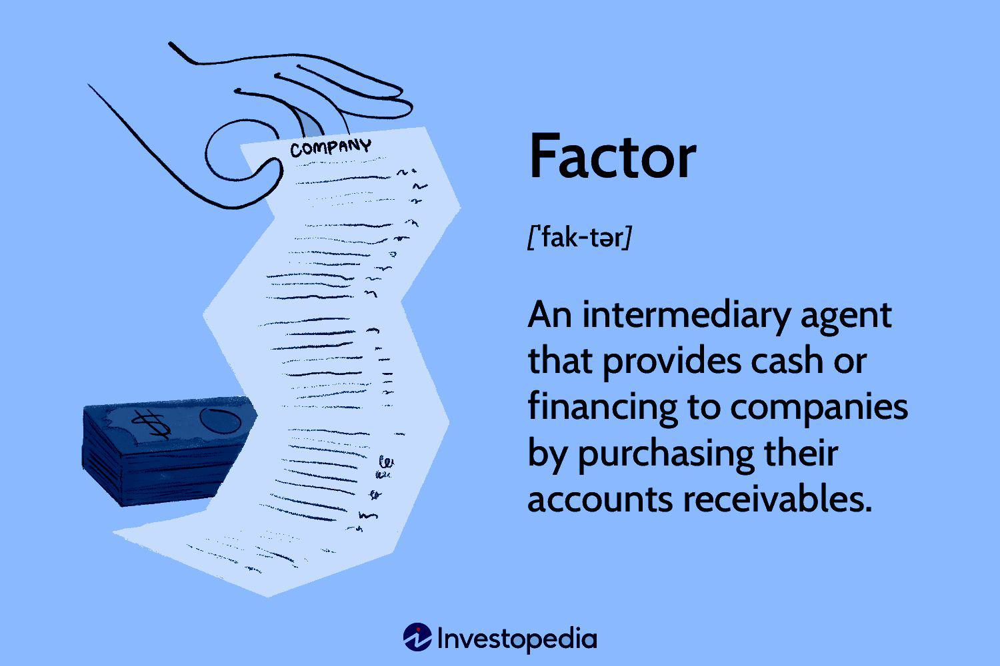

Algorithmic trading, often referred to as algo-trading, signifies the use of computer algorithms to execute trading orders. These algorithms manage the trading process based on predefined instructions and parameters, such as timing, price, or volume, and are crucial in modern financial markets due to their ability to execute orders at a higher speed and frequency than human traders.

The history of algorithmic trading dates back to the 1970s when exchanges began to transition from paper-based to electronic trading systems. The introduction of the New York Stock Exchange’s Designated Order Turnaround (DOT) System in 1976 marked a significant shift towards automation. However, it wasn't until the 1990s, with advancements in technology and the internet, that algorithmic trading began to grow rapidly. The early 2000s ushered in a new era with the proliferation of high-frequency trading (HFT), a subset of algorithmic trading characterized by the high speed and volume of trades.

Core components of algorithmic trading involve three primary elements: data, models, and execution systems. Data analysis is crucial, as algorithms depend on historical and real-time data to make predictions. Statistical models are developed to forecast price movements, and execution systems are employed to carry out trades efficiently. Quantitative analysis, machine learning, and artificial intelligence are often integral to refining these algorithms.

The growing popularity of algorithmic trading among traders is driven by several factors. Speed and efficiency are paramount—algorithms can process vast datasets and execute trades within milliseconds, offering a significant edge in fast-moving markets. Additionally, algorithmic trading reduces the influence of human emotions and errors, ensuring a more disciplined trading approach. The ability to backtest strategies using historical data allows traders to refine their models before deploying them, enhancing their accuracy and reliability.

This article will explore algorithmic trading comprehensively, starting with its benefits, such as increased speed, efficiency, and diversification capabilities. We will also examine key factors influencing algorithmic trading, including market dynamics, technology infrastructure, and regulatory compliance. Furthermore, we will discuss the essential requirements for successful algorithmic trading, including technical skills and robust strategies. Finally, we will provide examples of successful trading strategies to illustrate the practical application of algorithmic trading in various scenarios.

## Table of Contents

## Benefits of Algorithmic Trading

Algorithmic trading offers numerous advantages that have greatly contributed to its widespread adoption in financial markets. Primarily, it provides increased speed and efficiency compared to traditional manual trading methods. Algorithms can execute trades within milliseconds, enabling traders to capitalize on fleeting market opportunities that would be impossible for humans to exploit in real-time. The execution speed is crucial in fast-moving markets where prices can change within an instant, providing a competitive edge to algorithmic traders.

Furthermore, [algorithmic trading](/wiki/algorithmic-trading) significantly reduces the risk of human error and emotional biases. Traders may succumb to cognitive biases or emotional decision-making, leading to irrational trades and potential losses. Automation allows for a systematic approach, adhering strictly to predefined strategies and conditions, which helps maintain discipline and consistency. This removes subjectivity from the trading process, ensuring that decisions are based purely on data and established criteria.

Another benefit of algorithmic trading is diversification. Automated systems can handle multiple trading strategies simultaneously across various markets and instruments, enabling traders to spread risk effectively. Diversification diminishes the impact of adverse movements in any single asset class, thereby optimizing the risk-return profile of a portfolio. By executing numerous strategies at once, algorithmic traders can achieve a level of diversification that would be daunting to manage manually.

Algorithmic trading also enhances accuracy and offers robust [backtesting](/wiki/backtesting) capabilities. Before deploying a trading strategy in the live market, it can be rigorously tested against historical data to assess its performance. Backtesting allows traders to refine and optimize their algorithms, increasing the likelihood of success in actual trading conditions. This process involves quantifying expected returns, [volatility](/wiki/volatility-trading-strategies), and risk, and selecting the models that prove reliable based on past data.

Lastly, cost-effectiveness and scalability are notable advantages. Algorithmic systems can manage large volumes of transactions with minimal marginal costs, making them scalable solutions for traders of all sizes—from individual stakeholders to large financial institutions. The automation of the trading process reduces the need for human intervention, cutting down on labor costs. Additionally, algorithms often get better pricing due to the ability to execute trades more quickly, potentially reducing transaction costs over time.

Overall, algorithmic trading offers significant benefits, enabling faster, more efficient, and diversified trading grounded in rigorous data analysis. This positions it as an increasingly preferred choice for traders looking to optimize their operations in complex, dynamic markets.

## Key Factors in Algorithmic Trading

Algorithmic trading relies on several key market factors to function effectively, with [liquidity](/wiki/liquidity-risk-premium) and volatility standing out as pivotal elements. Liquidity refers to the ease with which assets can be bought or sold in the market without affecting their price. High liquidity allows for more efficient execution of large trades, reducing the likelihood of slippage and improving the overall effectiveness of algorithmic strategies. Volatility, the degree of variation in asset prices, is equally vital as it often presents opportunities for profits through price movements. Algorithms can capitalize on these fluctuations by executing trades at optimal times, making both liquidity and volatility crucial considerations for traders.

The robustness of technology infrastructure is paramount to successful algorithmic trading. Reliable data feeds, low-latency environments, and powerful computing resources form the backbone of efficient algorithmic operations. Access to accurate and timely market data enables algorithms to make informed decisions and execute trades quickly. As delays can lead to missed opportunities or losses, maintaining an up-to-date and responsive technological setup is essential. Moreover, the advent of [artificial intelligence](/wiki/ai-artificial-intelligence) (AI) and [machine learning](/wiki/machine-learning) (ML) has further revolutionized algorithmic trading. These technologies enable the development of sophisticated models that can analyze vast amounts of data, identify patterns, and predict market movements with higher accuracy.

Regulatory considerations and compliance issues represent another critical [factor](/wiki/factor-investing) in algorithmic trading. Different jurisdictions impose various regulations to ensure market integrity and protect investors. Algorithmic traders must navigate these regulations to avoid legal repercussions and maintain compliance. This involves adhering to rules concerning order types, trade reporting, and risk management practices. It’s essential for traders to stay informed about regulatory changes and ensure their systems are adaptable to new requirements.

Risk management is inherently important in algorithmic trading, given its reliance on automated systems and market dynamics. Effective strategies include diversification, wherein multiple independent strategies are deployed to reduce the risk of any single strategy underperforming. Employing stop-loss orders and position limits can also mitigate potential losses. Moreover, continuous monitoring and real-time adjustments help address unforeseen market changes, ensuring that algorithms operate within acceptable risk parameters. 

By combining these key factors—liquidity, volatility, cutting-edge technology, compliance with regulations, and rigorous risk management—algorithmic trading can be both effective and sustainable in the fast-paced financial markets.

## Requirements for Successful Algorithmic Trading

Algorithmic trading requires a meticulous combination of technical skills, strategic planning, and adequate resources. Key to its success are the necessary technical skills, including proficiency in programming and quantitative analysis, which serve as the backbone for developing and executing trading algorithms.

Programming skills are crucial for developing sophisticated trading strategies. Familiarity with languages such as Python, C++, or Java allows traders to design and modify algorithms efficiently. Python is particularly favored for its powerful libraries like Pandas and NumPy, which facilitate data analysis and model building. Additionally, knowledge of SQL is beneficial for managing large datasets.

Quantitative analysis skills are equally important. They enable traders to model and analyze financial markets using statistical techniques. Understanding concepts like regression analysis, time series modeling, and stochastic calculus is vital. For instance, traders might use linear regression to identify relationships between variables or apply stochastic calculus to model and predict stock price movements.

Robust trading strategies and thorough backtesting are fundamental requirements. Creating effective strategies demands a deep understanding of market behavior and financial theory. Strategies must be extensively backtested against historical data to ensure their reliability under various market conditions. Backtesting involves simulating a trading strategy on past data to evaluate its performance. This process helps in identifying potential weaknesses and optimizing the strategy. Traders often employ frameworks such as QuantConnect or Backtrader for backtesting purposes.

A comprehensive technology stack, involving both hardware and software solutions, is imperative. Low-latency and high-speed internet connections are crucial for timely data analysis and order execution. Additionally, high-performance computing systems can significantly enhance the processing speed and efficiency of algorithms. On the software side, trading platforms like MetaTrader or [Interactive Brokers](/wiki/interactive-brokers-api) provide useful interfaces for algorithmic trading. These platforms offer features such as automated order execution and real-time data feeds.

Continuous monitoring and updates of trading algorithms are necessary to adapt to ever-changing market conditions. Algorithms must be regularly reviewed and adjusted to maintain their efficacy. This requires automated systems to monitor performance in real-time and identify potential issues. Machine learning techniques can be employed to enable adaptive algorithms that learn and improve over time.

Capital requirements and allocation strategies are also crucial for successful algorithmic trading. Adequate capital is needed not only to exploit market opportunities but also to absorb potential losses. Diversifying the allocation of capital by distributing it across multiple strategies and asset classes can mitigate risk. Position sizing, which determines the amount of capital allocated to each trade, is another critical aspect. Techniques such as the Kelly Criterion can help in optimizing capital allocation to maximize growth while controlling risk.

In summary, successful algorithmic trading hinges on a synergy of technical expertise, strategic depth, and practical resources. Proficiency in programming and quantitative analysis, the creation and validation of robust strategies, a compelling technological infrastructure, diligent oversight, and prudent capital management collectively shape the foundation for profitable algorithmic trading endeavors.

## Examples of Algorithmic Trading Strategies

Algorithmic trading strategies encompass a variety of methodologies, each designed to leverage the capabilities of computers to execute trades in financial markets. These strategies are built around different market conditions and objectives, ranging from capitalizing on market inefficiencies to providing liquidity. Below are several prominent types of algorithmic trading strategies:

### Trend Following and Arbitrage

#### Trend Following:
Trend following strategies aim to capitalize on market [momentum](/wiki/momentum). These strategies identify and exploit patterns in price movements, assuming that the market will continue moving in the same direction. A common technique involves using moving averages, where trades are executed when short-term averages cross above or below long-term averages. This strategy can be represented as:

$$
\text{Signal} = 
  \begin{cases} 
  \text{Buy,} & \text{if } MA_{\text{short}} > MA_{\text{long}} \\
  \text{Sell,} & \text{if } MA_{\text{short}} < MA_{\text{long}}
  \end{cases}
$$

#### Arbitrage:
Arbitrage strategies take advantage of price discrepancies between related markets or instruments. Arbitrage can be executed in several forms, such as index [arbitrage](/wiki/arbitrage), [statistical arbitrage](/wiki/statistical-arbitrage), or triangular arbitrage in currencies. For example, in [pair trading](/wiki/pair-trading), a subset of statistical arbitrage, traders simultaneously buy and sell two correlated assets to profit from the convergence of their price difference.

### High-Frequency Trading (HFT)

High-frequency trading is characterized by executing a large number of orders at extremely high speeds. It relies on sophisticated algorithms and advanced technology to process orders in fractions of seconds. [HFT](/wiki/high-frequency-trading-strategies) strategies may focus on order flow prediction, latency arbitrage, or providing market liquidity through [market making](/wiki/market-making). A notable characteristic of HFT is the need for a robust infrastructure capable of processing high volumes of data in real-time, often collocated within exchange data centers to minimize latency.

### Statistical Arbitrage

Statistical arbitrage involves complex mathematical models to identify and exploit relative price movements. It often combines statistical and machine learning techniques to predict future price movements based on historical data. For instance, mean reversion strategies, a type of statistical arbitrage, are based on the idea that asset prices tend to revert to their historical mean. A simple implementation could use z-scores to signal trades:

$$
z = \frac{X - \mu}{\sigma}
$$

where $X$ is the current price, $\mu$ is the mean, and $\sigma$ is the standard deviation. Trades are executed when the z-score crosses a predetermined threshold.

### Momentum-Based Strategies

Momentum-based strategies exploit the continuation of existing trends. Traders using these strategies go long in markets showing upward momentum and short in those showing downward momentum, betting on the persistence of these trends. Such strategies often use indicators like the Relative Strength Index (RSI) to determine overbought or oversold conditions in the market.

### Market Maker Strategies

Market maker strategies aim to provide liquidity by simultaneously placing buy and sell orders for a security. Traders profit from the bid-ask spread, striving to minimize risk through quick order matching. A market maker might adjust quotes based on volatility, inventory levels, and overall market conditions.

### Case Studies

Successful implementation of algorithmic trading strategies is evident in various case studies. For instance, Renaissance Technologies, the [hedge fund](/wiki/hedge-fund-trading-strategies) known for its Medallion Fund, has effectively used statistical and machine learning models to achieve consistent profitability. Similarly, firms employing high-frequency trading have benefited from exploiting microscopic time discrepancies across markets.

In conclusion, algorithmic trading strategies are diverse, each with its unique approach to capitalizing on market opportunities. These strategies require a deep understanding of market dynamics, strong technical skills, and the ability to adapt to changing market conditions.

## Conclusion

Algorithmic trading has revolutionized the financial markets, providing several notable benefits over traditional trading methods. Key advantages include increased speed and efficiency, as algorithms can execute trades far faster than human traders. Additionally, the reduction of human error and emotional bias enhances decision-making precision. The ability to diversify through simultaneous execution of multiple strategies further amplifies these benefits, offering traders improved accuracy and backtesting capabilities. Algorithmic trading also proves to be cost-effective and scalable, accommodating both small-scale and large-scale operations with ease.

Success in algorithmic trading, however, hinges on understanding and integrating key factors such as market liquidity, volatility, and the essential role of cutting-edge technology, including artificial intelligence and machine learning. A robust technology infrastructure and reliable data feeds are indispensable, as is compliance with regulatory standards to mitigate potential legal and operational risks. Risk management strategies are critical for safeguarding investments against unforeseen market fluctuations.

Requirements for thriving in algorithmic trading encompass a blend of technical skills and strategic insight. Mastery of programming and quantitative analysis is crucial, alongside the development of robust trading strategies backed by thorough backtesting. An efficient technology stack, comprising reliable hardware and software solutions, is essential to support continuous monitoring and updates of trading algorithms. Sound capital management and allocation strategies play a pivotal role in optimizing returns and mitigating risks.

Looking forward, algorithmic trading is poised to expand its influence in financial markets, driven by advancements in technology such as artificial intelligence, machine learning, and data analytics. These technologies promise to enhance the sophistication and effectiveness of trading strategies, potentially leading to greater market efficiencies and opportunities. Strategic planning and continuous learning will remain essential for traders to adapt to evolving market dynamics and leverage technological innovations effectively.

Continued exploration and research in algorithmic trading open avenues for innovation and refinement of strategies. Readers are encouraged to deepen their understanding and share experiences or queries, contributing to a broader dialogue on algorithmic trading. Engagement in this discourse not only fosters collective knowledge but also helps individuals and organizations harness the full potential of algorithmic trading.

## References & Further Reading

[1]: Bergstra, J., Bardenet, R., Bengio, Y., & Kégl, B. (2011). ["Algorithms for Hyper-Parameter Optimization."](https://papers.nips.cc/paper/4443-algorithms-for-hyper-parameter-optimization) Advances in Neural Information Processing Systems 24.

[2]: ["Advances in Financial Machine Learning"](https://www.amazon.com/Advances-Financial-Machine-Learning-Marcos/dp/1119482089) by Marcos Lopez de Prado

[3]: ["Evidence-Based Technical Analysis: Applying the Scientific Method and Statistical Inference to Trading Signals"](https://www.amazon.com/Evidence-Based-Technical-Analysis-Scientific-Statistical/dp/0470008741) by David Aronson

[4]: ["Machine Learning for Algorithmic Trading"](https://github.com/stefan-jansen/machine-learning-for-trading) by Stefan Jansen

[5]: ["Quantitative Trading: How to Build Your Own Algorithmic Trading Business"](https://www.amazon.com/Quantitative-Trading-Build-Algorithmic-Business/dp/1119800064) by Ernest P. Chan