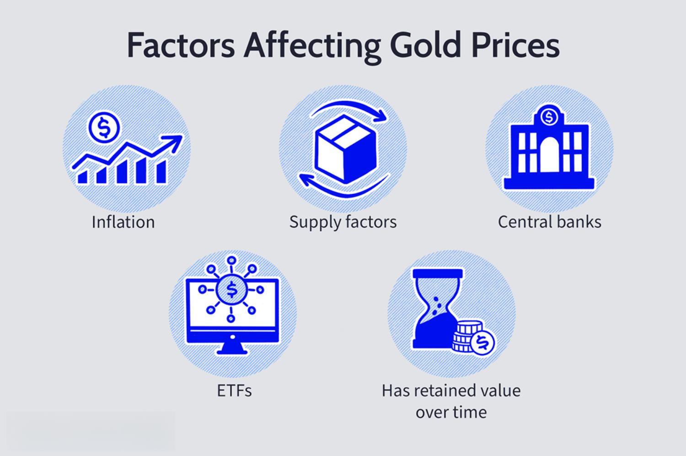

Gold has long stood as a symbol of wealth and security, renowned for its intrinsic value and historical significance. This precious metal has captivated investors across generations, offering a reliable means to diversify portfolios and mitigate risks associated with economic volatility. As financial markets evolve, the dynamics surrounding gold investments become increasingly intricate, influenced by a range of factors that alter its market pricing.

Several key trends shape the gold market today, driven by economic indicators, geopolitical factors, and the advent of technology in trading. Understanding these trends is critical for investors aiming to navigate the complexities of the gold market effectively. Economic factors such as inflation and interest rates play a crucial role, with many viewing gold as a hedge against inflationary pressures. Additionally, fluctuations in the US dollar, the currency in which gold is typically traded, can have significant effects on its global appeal and valuation.



Apart from economic considerations, algorithmic trading is reshaping traditional approaches to gold investment. This technology enables more efficient trade execution and offers new strategies for anticipating gold price movements, providing investors with opportunities to capitalize on market shifts swiftly.

Moreover, geopolitical and market conditions frequently inject volatility into global markets, contributing to gold's reputation as a safe haven during times of uncertainty. Political instability and economic downturns often lead to shifts in investor sentiment, thereby impacting gold demand and pricing.

Understanding the interplay of these diverse factors—combining economic insights, geopolitical analysis, and technological advancements—is pivotal for optimizing gold investment strategies. As this landscape continues to evolve, staying informed will empower investors to make strategic decisions that enhance portfolio resilience against economic instability.

## Table of Contents

## Understanding Gold Market Trends

Gold prices are influenced by a confluence of factors including economic indicators, geopolitical events, and market sentiment. These elements collectively contribute to price volatility and investor behavior within the gold market.

**Economic Indicators:** Investors closely monitor economic indicators such as inflation rates, interest rates, and GDP growth. Inflation often leads to an increase in gold prices as gold is traditionally considered a hedge against inflationary pressures. When inflation rises, the purchasing power of fiat currencies declines, causing investors to flock to gold as a store of value. Conversely, higher interest rates can have a negative impact on gold prices. When interest rates rise, the opportunity cost of holding non-yielding assets like gold increases, making alternative investments more attractive.

**Geopolitical Events:** Gold often acts as a safe haven during times of geopolitical turmoil. Events such as wars, terrorist attacks, or political instability can cause investors to seek refuge in gold, increasing its demand and consequently its price. For example, following geopolitical tensions, investors' nervousness about global stability can drive them to allocate more of their portfolios to gold, leading to price surges.

**Market Sentiment:** The psychological component of market sentiment plays a crucial role in influencing gold prices. Market perception about the future direction of the economy significantly affects gold’s appeal. If investors expect economic downturns, they may preemptively invest in gold, anticipating its price to increase. Conversely, if the economic outlook is positive, demand for gold may decrease as investors seek higher returns from riskier assets.

Gold’s inherent [volatility](/wiki/volatility-trading-strategies) is reflected in the way these factors interact. Market responses to the same events can vary greatly, contingent upon the existing economic backdrop and prevailing investor sentiment. For instance, a geopolitical event might cause significant fluctuations in gold prices if the economy is perceived as fragile, while having a more muted effect if the economic indicators show resilience.

Therefore, understanding gold market trends requires a multifaceted analysis of how economic indicators, geopolitical events, and market sentiment interact. This understanding helps investors make informed decisions in response to potential changes in the gold market, and navigate the inherent volatility that these elements collectively present.

## Economic Factors Affecting Gold Prices

Gold prices are significantly influenced by economic factors, with inflation and interest rates being primary drivers. Traditionally, gold serves as a hedge against inflation, maintaining its value when purchasing power declines. During periods of high inflation, the demand for gold often rises as investors seek to protect their wealth, subsequently driving up prices. As a tangible asset, gold offers security compared to currencies whose values decline with inflation.

Interest rates inversely affect gold prices. When interest rates are low, the opportunity cost of holding non-yield-bearing assets like gold decreases, making gold more attractive to investors. Conversely, high interest rates elevate the returns from interest-bearing investments, reducing gold’s appeal. This inverse relationship means that when central banks lower interest rates to stimulate the economy, gold prices tend to increase due to rising demand.

The strength of the US dollar plays a crucial role in gold’s global appeal. Since gold is priced in dollars, fluctuations in the dollar’s strength affect gold prices worldwide. A weakening dollar enhances gold’s attractiveness as it becomes cheaper for foreign investors, increasing demand. Conversely, a strong dollar can suppress gold prices by making it more expensive for overseas buyers.

Mathematically, the impact of these factors can be approximated using the following relationships:

1. **Inflation and Gold Prices:**
$$
   G = f(I)

$$
   where $G$ denotes gold price and $I$ signifies inflation rate. A positive correlation exists, meaning as $I$ increases, $G$ typically increases.

2. **Interest Rates and Gold Prices:**
$$
   G = f(R)

$$
   Here, $R$ represents interest rates. This relationship is inverse, as higher $R$ tends to lead to a decrease in $G$.

3. **US Dollar Strength and Gold Prices:**
$$
   G = f(D)

$$
   For this function, $D$ stands for the strength of the US dollar. A negative correlation exists, indicating that as $D$ increases, $G$ tends to decrease.

Investors and analysts often use these fundamental economic indicators to forecast gold price movements and develop investment strategies. Recognizing these relationships can aid in understanding the dynamic nature of gold valuation in response to economic changes. Such insights are crucial for anticipating market behavior and making informed investment decisions.

## Impact of Algorithmic Trading on Gold Markets

Algorithmic trading is increasingly playing a significant role in the gold markets by providing investors with enhanced capabilities for efficient and swift trade execution. This advanced form of trading leverages complex algorithms, computational finance models, and electronic platforms to manage trading processes at high speeds. The adoption of [algorithmic trading](/wiki/algorithmic-trading) in gold markets reflects broader trends in financial markets, where the need for agility and precision has driven significant technological advancements.

One of the primary benefits of algorithmic trading is the ability to predict gold price movements more effectively. Algorithms can analyze vast datasets, including historical prices, economic reports, and real-time market data, to identify patterns and trends that may not be immediately apparent to human traders. By employing techniques such as [machine learning](/wiki/machine-learning) and statistical [arbitrage](/wiki/arbitrage), these algorithms adapt to market changes and refine their predictive capabilities over time.

Algorithmic trading strategies in the gold market often include [momentum](/wiki/momentum) strategies, mean reversion strategies, and market-making strategies. Momentum strategies focus on exploiting trends in price movements, betting that a security that has performed well will continue to do so in the short term. Conversely, mean reversion strategies assume that prices will revert to their long-term mean, and profits can be made when prices deviate from these averages. Market-making strategies involve placing both buy and sell orders to capture spreads between the bid and ask prices, thereby providing [liquidity](/wiki/liquidity-risk-premium) to the market.

For instance, a simple momentum-based strategy could be implemented using Python to simulate trading decisions based on moving average crossovers. Here is a basic example:

```python
import pandas as pd

# Assume 'data' is a DataFrame containing gold price data with a 'Close' column for closing prices
data['Short_MA'] = data['Close'].rolling(window=40).mean()
data['Long_MA'] = data['Close'].rolling(window=100).mean()

data['Signal'] = 0
data.loc[data['Short_MA'] > data['Long_MA'], 'Signal'] = 1
data.loc[data['Short_MA'] <= data['Long_MA'], 'Signal'] = -1

# 'Signal' indicates trade decisions: 1 for buy, -1 for sell
```

This script illustrates a simplistic approach to using moving averages to generate trade signals: when the short moving average crosses above the long moving average, a buy signal is generated, and vice versa for a sell signal.

The speed and efficiency provided by algorithmic trading yield other substantial advantages. They reduce transaction costs by minimizing market impact and slippage, as trades can be executed at optimal prices more consistently. Additionally, algorithms help mitigate human errors and emotional biases, which can significantly impact trading performance.

In summary, algorithmic trading is transforming gold markets by enabling investors to harness the power of data science and computational prowess. By predicting price movements and efficiently executing trades, algorithmic trading strategies capture potential opportunities that manual trading may overlook, thus enhancing overall market efficiency.

## Geopolitical and Market Conditions

Geopolitical tensions can have a profound impact on gold markets as they often lead to uncertainty in global financial systems. This uncertainty prompts investors to seek refuge in gold, universally regarded as a safe-haven asset. Historical events have shown that during periods of political instability or conflict, the demand for gold typically surges, driving up prices. For instance, the heightened tensions during the Cold War and more recent disputes in the Middle East have repeatedly triggered increased gold purchases.

Market sentiment is another critical [factor](/wiki/factor-investing) influencing gold prices during geopolitical disruptions. Investors' perception of risk amplifies when faced with potential adverse events such as wars, trade disputes, or political upheaval, leading to a shift towards conservative investment strategies. This shift is reflected in higher gold demand, as observed during the 2008 financial crisis and various Brexit-related developments, where gold provided a hedge against the anticipated volatility in other financial instruments.

Economic downturns often coincide with geopolitical unease, further reinforcing gold's role as a protective asset. During such periods, global economic growth slows, and issues like inflation, currency devaluation, and stock market volatility come to the fore. Gold, being largely insulated from these challenges, becomes an attractive option for preserving wealth. The interplay between geopolitical factors and economic conditions underscores gold's unique position in maintaining financial stability amidst uncertainty.

## Supply and Demand Dynamics

Gold's market value is significantly influenced by the delicate balance between supply and demand. This dynamic hinges primarily on two factors: the supply from mining and recycling activities and the demand driven by jewelry manufacturing and investments.

The supply of gold primarily comes from mining operations, which account for roughly two-thirds of the annual gold supply. Global gold mining is geographically dispersed, with significant production in countries like China, Australia, and Russia. This production is subject to several constraints, including environmental regulations, political conditions, and technological advancements. Additionally, gold recycling contributes a substantial portion of the supply. This includes the reprocessing of scrap from industrial applications and old jewelry, providing a more elastic response to short-term price shifts compared to mining.

On the demand side, jewelry manufacturing remains one of the most significant consumers of gold, particularly in countries with strong cultural ties to gold consumption, such as India and China. Investment demand, however, tends to be more volatile, as it is heavily influenced by market sentiment and economic conditions. Investors often flock to gold in times of economic uncertainty, driving up prices.

Disruptions in the supply chain, such as strikes at mining sites or geopolitical tensions affecting key producing regions, can lead to supply shortages, exerting upward pressure on prices. Similarly, a surge in jewelry demand during festivals or economic booms can lead to increased gold consumption, further impacting prices.

To mathematically understand these dynamics, the basic economic principle of equilibrium can be applied. The equilibrium price of gold $P_e$ is determined when the quantity supplied $Q_s$ equals the quantity demanded $Q_d$. Any imbalance, where $Q_s \neq Q_d$, leads to price adjustments until a new equilibrium is reached.

In Python, such a dynamic can be modeled to predict how changes in either supply or demand affect gold prices:

```python
def gold_price(supply, demand, initial_price=1500):
    # simulate price change based on supply and demand
    for _ in range(100):
        if supply > demand:
            initial_price *= 0.99  # decrease price
        elif supply < demand:
            initial_price *= 1.01  # increase price
        supply *= 0.995  # simulate supply change
        demand *= 1.005  # simulate demand change
    return initial_price

supply_initial = 1000
demand_initial = 1000
predicted_price = gold_price(supply_initial, demand_initial)
```

This code provides a basic simulation where price dynamics adjust based on varying supply and demand over time. By understanding and anticipating these fluctuations, market participants can better strategize their investments or operation planning within the gold market.

## Future Outlook and Investment Strategies

As we look to the future of gold investment, understanding the interplay of various market dynamics is crucial for crafting effective strategies. Gold's historical role as a hedge against economic instability remains relevant, yet the methods and tools used for navigating its market are evolving. Key trends such as technological advancements in trading and the shifting landscapes of global economies offer both challenges and opportunities for investors.

Algorithmic trading has emerged as a significant factor in influencing gold market strategies. These automated systems leverage complex algorithms to process vast amounts of financial data and execute trades with remarkable speed and precision. By incorporating machine learning models and predictive analytics, these tools can identify patterns and trends that might be overlooked by traditional analysis. This allows investors to make more informed decisions and capitalize on market opportunities while mitigating risks associated with human error and emotional biases.

To effectively use algorithmic trading in the gold market, investors can adopt strategies such as momentum trading, which focuses on identifying and capitalizing on trends in gold prices. Another approach is [statistical arbitrage](/wiki/statistical-arbitrage), which involves exploiting pricing inefficiencies between related commodities or financial instruments. By developing custom algorithms tailored to these strategies, investors can enhance their ability to anticipate market movements and adjust positions accordingly.

Additionally, investors must remain cognizant of the broader economic landscape and its impact on gold. Interest rates, inflation rates, and currency fluctuations continue to influence gold prices. As central banks navigate monetary policy amidst varying economic conditions, investors should closely monitor these indicators to predict potential shifts in the gold market. For example, in times of rising inflation, gold tends to attract more investment as it is perceived as a stable store of value. Therefore, maintaining a diversified portfolio that includes gold can help hedge against economic volatility.

Looking forward, leveraging technological innovation alongside a solid understanding of economic fundamentals will be pivotal for gold investors. By staying informed about emerging trends and continuously refining strategies through data-driven techniques, investors can better navigate the complexities of the gold market. Engaging with these strategies provides a dynamic way to optimize investment portfolios and seek consistent returns despite fluctuating conditions.

## Conclusion

Gold remains a vital component of a diversified investment portfolio, offering stability and security amidst economic fluctuations. Its intrinsic value and historical resilience make it an attractive asset, particularly during periods of market uncertainty. The unique advantages of gold as an investment lie in its ability to serve as a hedge against inflation and currency devaluation, as well as its consistent demand across various sectors.

To optimize investment strategies in gold, it is crucial for investors to stay informed about current market trends, economic indicators, and technological advancements. These elements can significantly influence gold prices and demand patterns. For example, understanding how inflation rates and interest levels intersect with gold's market performance can lead to more precise investment decisions. Similarly, keeping abreast of geopolitical developments and their potential impact on the gold market can help investors anticipate shifts in sentiment and demand.

Moreover, technological advancements, particularly in the field of algorithmic trading, are transforming how gold is traded. These innovations offer investors enhanced tools to analyze market data, identify trends, and execute trades with greater efficiency. By leveraging such technology, investors can better navigate the complexities of the gold market and minimize risks associated with price volatility.

In conclusion, gold's role as a stabilizing force in investment portfolios underscores the importance of continuous vigilance and adaptation. By remaining informed and responsive to the dynamic factors influencing the gold market, investors can enhance their strategies and capitalize on the enduring value of this precious metal.

## References & Further Reading

[1]: Bergstra, J., Bardenet, R., Bengio, Y., & Kégl, B. (2011). ["Algorithms for Hyper-Parameter Optimization."](https://papers.nips.cc/paper/4443-algorithms-for-hyper-parameter-optimization) Advances in Neural Information Processing Systems 24.

[2]: ["Advances in Financial Machine Learning"](https://www.amazon.com/Advances-Financial-Machine-Learning-Marcos/dp/1119482089) by Marcos Lopez de Prado

[3]: ["Evidence-Based Technical Analysis: Applying the Scientific Method and Statistical Inference to Trading Signals"](https://books.google.com/books/about/Evidence_Based_Technical_Analysis.html?id=MeoJAQAAMAAJ) by David Aronson

[4]: ["Machine Learning for Algorithmic Trading"](https://github.com/stefan-jansen/machine-learning-for-trading) by Stefan Jansen

[5]: ["Quantitative Trading: How to Build Your Own Algorithmic Trading Business"](https://www.amazon.com/Quantitative-Trading-Build-Algorithmic-Business/dp/1119800064) by Ernest P. Chan