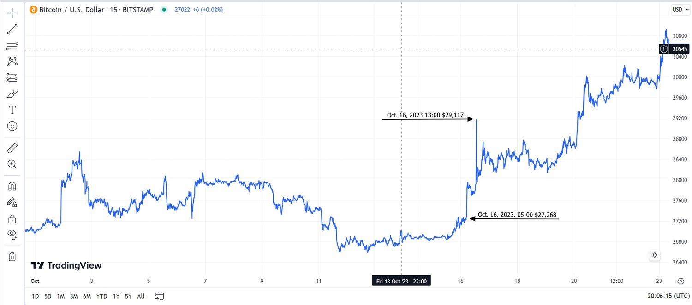

Bitcoin, the first cryptocurrency, has established itself as a prominent digital asset within the financial sector since its introduction in 2009 by the pseudonymous Satoshi Nakamoto. It operates on a decentralized blockchain network, providing users with a peer-to-peer transaction system that eliminates the need for intermediaries like banks. Bitcoin's prominence in the cryptocurrency market can largely be attributed to its pioneering status and its significant market capitalization, which has often overshadowed other digital assets.

Bitcoin is characterized by its high volatility, presenting both opportunities and challenges for investors and traders. The price of Bitcoin can experience dramatic swings in short periods, driven by factors such as market sentiment, regulatory news, macroeconomic trends, and technological developments. This volatility creates a challenging environment for traders seeking to maximize returns and manage risk effectively.



To navigate the inherent volatility of Bitcoin, algorithmic trading has emerged as a valuable tool. Algorithmic trading utilizes computer programs and algorithms to trade assets at high speed and frequency, allowing traders to exploit small price changes in the market. These algorithms can be designed to adopt various strategies, such as trend following, arbitrage, and market making, which are particularly useful in volatile markets like that of Bitcoin. By removing the emotional and psychological barriers associated with manual trading, algorithmic trading can enhance efficiency and execution.

Accurate price predictions are crucial for developing effective trading strategies. Predictive models, which might include statistical methods and advanced machine learning techniques, aim to forecast Bitcoin's future price movements. Successful predictions can inform decision-making processes, improve trade timing, and enhance profitability while mitigating risks.

This article will explore the intricacies of Bitcoin's volatility and the mechanisms, including algorithmic trading, employed to manage and capitalize on the dynamic price changes in the cryptocurrency market. Understanding these factors is essential for traders and investors seeking to develop robust strategies and succeed in this evolving financial landscape.

## Table of Contents

## Understanding Bitcoin Volatility

Bitcoin's distinctive features, primarily its decentralized nature and limited supply, contribute to its substantial volatility compared to traditional assets. Unlike fiat currencies, Bitcoin operates independently of central bank policies, rendering it immune to conventional monetary controls used to stabilize currency value. The limited supply, capped at 21 million Bitcoins, exacerbates price fluctuations as demand variabilities directly affect the market price without central interventions to modulate supply or demand. 

A prominent [factor](/wiki/factor-investing) influencing Bitcoin's [volatility](/wiki/volatility-trading-strategies) is investor sentiment and market speculation. In the [cryptocurrency](/wiki/cryptocurrency) market, prices are heavily driven by public perception and speculative trading. Trends can quickly gain [momentum](/wiki/momentum), often amplified by discussions on social media platforms and forums, leading to rapid price changes. This herd behavior tends to magnify both upwards and downwards price movements, contributing to the volatility.

News and media play a critical role in shaping short-term price movements. Announcements ranging from regulatory changes, technological advancements, security breaches, to major market players' endorsements or criticisms can lead to significant price swings. For instance, regulatory crackdowns in major markets or endorsements from influential figures can lead to rapid shifts in investor confidence, promptly reflected in Bitcoin's price.

Long-term trends exhibit profound historical price swings. Bitcoin has experienced several boom and bust cycles since its inception. Early adopters witnessed significant value increases, yet sharp corrections have occurred, often precipitated by regulatory uncertainty or security issues within cryptocurrency exchanges. An analysis of historical data shows that Bitcoin's volatility is intrinsic to its market evolution, influenced by its relatively short history and the ongoing maturation of the global cryptocurrency ecosystem.

Understanding these factors is vital for stakeholders in the cryptocurrency market. While volatility presents challenges, it also creates opportunities for traders and investors who can accurately anticipate market movements.

## Price Prediction Challenges for Bitcoin

Bitcoin, as a digital asset, presents unique challenges when it comes to price prediction due to its highly volatile nature and lack of traditional financial fundamentals that underpin its value. This section explores some common methods used to predict Bitcoin prices, highlighting the inherent limitations and challenges.

### Common Methods for Price Prediction and Limitations

1. **Technical Analysis**: This approach involves using historical price data and trading volumes to identify patterns and trends that might suggest future price movements. Common tools include moving averages, RSI (Relative Strength Index), and MACD (Moving Average Convergence Divergence). However, technical analysis often struggles with Bitcoin's extreme volatility and may provide misleading signals during rapid market changes.

2. **Time Series Forecasting**: Models such as ARIMA (AutoRegressive Integrated Moving Average) and GARCH (Generalized Autoregressive Conditional Heteroskedasticity) are used to forecast prices based on past values. While these models can be useful for stationary data, Bitcoin prices often exhibit non-stationary behaviors with frequent structural breaks, limiting the effectiveness of such models.

3. **Sentiment Analysis**: By analyzing social media platforms, forums, and news articles, sentiment analysis attempts to gauge market sentiment and predict price movements. Although valuable for short-term predictions, this method can be unreliable due to its heavy dependence on the volume and accuracy of data being analysed.

4. **Machine Learning Models**: Algorithms like neural networks and decision trees are increasingly applied for Bitcoin prediction. Despite their potential to identify complex patterns beyond human capabilities, these models require vast amounts of data to train adequately and risk overfitting, especially amidst Bitcoin's volatile pricing.

### Lack of Fundamentals

Bitcoin lacks the traditional financial fundamentals such as earnings reports, dividend yields, or interest rates, which complicates price predictions. Instead, its value is largely perceived, driven by usage, scarcity, and market sentiment. This absence of a fundamental basis contrasts sharply with traditional assets and makes Bitcoin pricing more unpredictable. 

### Challenges from High Volatility

The volatility of Bitcoin is significantly higher compared to traditional financial assets. According to some studies, this asset can experience daily price swings of over 10% with relative frequency. Such volatility creates an environment where price predictions can quickly become obsolete. The dynamic and rapidly changing nature of Bitcoin’s market can amplify prediction errors and expose predictive models to substantial risk.

### Gaps in Prediction Accuracy 

Despite advancements in predictive methodologies, there are notable gaps in the accuracy of Bitcoin price forecasts. The unpredictable nature of geopolitical events, regulatory announcements, and technological developments can lead to sudden market shifts that no model can fully anticipate.

Overall, the challenges of Bitcoin price prediction stem from its inherent unpredictability, lack of fundamental valuation metrics, and susceptibility to news and speculations. Addressing these issues requires continuous advancements in predictive technologies and methodologies, as well as a thorough understanding of market dynamics.

## Algorithmic Trading in Volatile Markets

Algorithmic trading refers to the use of computer programs and systems to execute financial transactions according to a predefined set of rules and instructions. This method leverages mathematical models and algorithms to determine the optimal timing, price, and quantity for trades, significantly reducing human intervention. In volatile markets like that of Bitcoin, [algorithmic trading](/wiki/algorithmic-trading) becomes particularly beneficial due to its ability to process vast amounts of real-time data swiftly, allowing traders to react to rapid market changes more efficiently than manual trading would permit.

One significant advantage of algorithmic trading in managing Bitcoin's volatility is its capacity for high-frequency trading ([HFT](/wiki/high-frequency-trading-strategies)). HFT strategies exploit minute price discrepancies that occur within fractions of a second. By analyzing these opportunities across various exchanges, algorithms can execute a large number of trades rapidly, profiting from marginal price differences.

Additionally, algorithmic trading can mitigate emotional decision-making, a common challenge in highly volatile markets. By adhering strictly to quantitative rules, algorithms prevent the psychological biases that might lead traders to make impulsive decisions based on panic or greed. This systematic approach is advantageous in a market characterized by dramatic price swings and speculative behavior.

Several strategies and tools are employed in algorithmic trading for cryptocurrencies. Trend-following strategies, for instance, analyze historical data to predict future price movements by identifying patterns in the market. These strategies adjust positions in response to the market's directional shifts, striving to capture extended market trends.

Arbitrage strategies take advantage of price differences across various markets or exchanges, providing another avenue for algorithmic profit. For example, if Bitcoin is priced lower on one exchange compared to another, an algorithm can buy at the lower price and sell at the higher one almost simultaneously. Market-making strategies are also popular, where algorithms place both buy and sell limit orders to profit from the spread between the bid and ask prices.

The success of algorithmic trading models can be seen in various applications. Renaissance Technologies, a renowned quantitative [hedge fund](/wiki/hedge-fund-trading-strategies), has utilized algorithmic trading techniques to achieve consistently high returns across volatile markets, including cryptocurrencies. Their models process vast amounts of historical and real-time data to uncover hidden patterns that inform their trading strategies.

Moreover, [machine learning](/wiki/machine-learning) algorithms have increasingly been integrated into predictive trading models, further enhancing their accuracy. By learning from past data and adjusting to new market conditions, these algorithms adapt to evolving patterns in Bitcoin's behavior. For instance, neural networks have been employed to predict price movements by learning complex, non-linear relationships within the data.

In summary, algorithmic trading offers several benefits in managing Bitcoin's volatility, from executing high-frequency trades to reducing psychological biases in decision-making. Employing various strategies such as trend-following, [arbitrage](/wiki/arbitrage), and market-making, algorithmic trading has proven capable of navigating the challenges presented by Bitcoin's erratic price behavior.

## Innovations in Predictive Models

Machine learning (ML) and [deep learning](/wiki/deep-learning) (DL) have significantly transformed the landscape of Bitcoin price prediction, offering the potential to enhance the accuracy and reliability of predictive models. These advanced methodologies leverage vast amounts of data and complex algorithms to identify patterns and trends that are not easily discernible through traditional analytical methods.

**Machine Learning and Deep Learning in Bitcoin Price Prediction**

Machine learning involves training algorithms on historical data to predict future outcomes without being explicitly programmed. In Bitcoin price prediction, various ML models, such as regression models, decision trees, and support vector machines (SVM), are employed. Deep learning, a subset of ML, uses neural networks with multiple layers (hence 'deep') to model intricate patterns in data. Convolutional Neural Networks (CNNs) and Recurrent Neural Networks (RNNs), particularly Long Short-Term Memory (LSTM) networks, are popular choices for modeling sequence data, such as price movements over time.

**Comparison of Predictive Models and Their Effectiveness**

Predictive models vary in their approach and efficacy. Traditional statistical models, like ARIMA (AutoRegressive Integrated Moving Average), have been used extensively for time-series forecasting. However, they often fall short in capturing the non-linear and volatile nature of Bitcoin prices. ML models offer improved flexibility and accuracy. For example, Random Forests (RF) and Gradient Boosting Machines (GBM) can manage non-linearity better than ARIMA. Deep learning models like LSTMs are particularly effective in capturing temporal dependencies and long-term relationships in time-series data, offering a more accurate prediction framework for Bitcoin prices. However, these models require substantial computational power and large datasets to train effectively.

**Role of On-Chain Data and Advanced Analytics**

On-chain data, which includes transaction details recorded on the Bitcoin blockchain, provides a rich source of information for predictive modeling. Advanced analytics, utilizing this data, enhances model predictions by incorporating real-time metrics, such as transaction [volume](/wiki/volume-trading-strategy), mining activity, and network hash rates. These metrics help in gauging the market sentiment and network activity, crucial for comprehending potential price movements. Advanced analytics tools, such as TensorFlow and PyTorch, offer robust frameworks for developing complex ML models, while libraries like Pandas and scikit-learn facilitate data manipulation and analysis.

**Case Studies of Successful Predictive Models**

Several case studies demonstrate the potential of predictive models in cryptocurrency trading. For instance, a study utilizing LSTM networks achieved high accuracy in forecasting short-term Bitcoin price movements, leveraging not only historical price data but also incorporating social media sentiment analysis via Twitter feed data as an additional feature set. Another model employed a hybrid approach combining ARIMA and DL models, achieving enhanced performance compared to standalone models. These cases underscore the importance of integrating various data sources and methodologies to refine prediction accuracy.

In summary, the integration of machine learning and deep learning, along with the strategic use of on-chain data and advanced analytics, presents powerful tools for improving the accuracy of Bitcoin price predictions. While challenges in data quality and model interpretability remain, ongoing innovations continue to enhance the robustness and utility of these predictive models in cryptocurrency trading.

## Trading Strategies for Bitcoin

Bitcoin trading strategies can be broadly categorized into short-term and long-term approaches, each with their distinct characteristics and methodologies. Understanding these strategies is crucial for navigating the high volatility associated with Bitcoin.

### Short-term Trading Strategies

Short-term strategies typically focus on profiting from price fluctuations over shorter time frames, such as hours or days. These strategies often utilize technical indicators and market sentiment analysis to inform trading decisions. 

**Technical Indicators**
Technical indicators are mathematical calculations based on historical price, volume, or open interest information. Commonly used indicators in short-term trading include the Relative Strength Index (RSI), Moving Averages (MA), and Bollinger Bands. These indicators help traders identify potential entry and [exit](/wiki/exit-strategy) points based on market conditions.

For example, the RSI is a momentum oscillator that measures the speed and change of price movements. It ranges from 0 to 100 and is used to identify overbought or oversold conditions in the market. A reading above 70 may indicate that an asset is overbought, while a reading below 30 may suggest that it is oversold.

**Market Sentiment Analysis**
Market sentiment analysis involves gauging the overall mood or attitude of investors towards Bitcoin. This can be achieved by analyzing data from social media platforms, forums, and news outlets. Tools like sentiment analysis algorithms can process large volumes of textual data to determine the prevailing sentiment, which can provide insights into potential price movements.

### Long-term Trading Strategies

Long-term trading strategies are designed for holding positions over extended periods, from months to years. These strategies often rely less on technical indicators and more on [fundamental analysis](/wiki/fundamental-analysis).

Investors adopting a long-term strategy may focus on Bitcoin’s potential as a store of value and its role in the broader financial ecosystem. They often ignore short-term price volatility, with the belief that the long-term trend will be upward.

### Backtesting Trading Strategies

Backtesting involves testing a trading strategy on historical data to evaluate its feasibility. This process is crucial for understanding how a strategy might perform in the market. It allows traders to assess the risk and potential profitability of a strategy before deploying it in a live environment. 

Python is a popular choice for [backtesting](/wiki/backtesting) due to its extensive libraries, such as `pandas` and `numpy`, which facilitate data manipulation and numerical analysis. The `[backtrader](/wiki/backtrader)` library is specifically designed for backtesting trading strategies and can handle multiple datasets for simulating trading scenarios.

```python
import backtrader as bt

class MyStrategy(bt.Strategy):
    def next(self):
        if self.data.close[-1] < self.data.close[0]:
            self.buy(size=1)
        elif self.data.close[-1] > self.data.close[0]:
            self.sell(size=1)

cerebro = bt.Cerebro()
cerebro.addstrategy(MyStrategy)
data = bt.feeds.YahooFinanceData(dataname='BTC-USD', fromdate='2020-01-01', todate='2021-01-01')
cerebro.adddata(data)
cerebro.run()
```

### Potential Pitfalls and Risks

Trading Bitcoin involves significant risks, primarily due to its inherent volatility. Short-term strategies require precision and can lead to substantial losses if trades move against positions. High-frequency trading, for example, necessitates sophisticated algorithms and infrastructure, and may not be suitable for all traders.

There is also the risk of emotional decision-making. Market sentiment can shift rapidly, and traders influenced by panic or greed may make irrational decisions that result in financial losses. Furthermore, the unregulated nature of some cryptocurrency exchanges adds another layer of risk, as it may expose traders to fraud or security breaches.

In conclusion, while Bitcoin trading offers opportunities for profit, it also presents unique challenges and risks that must be carefully managed. Traders should employ robust strategies and continuously refine their approaches through tools like backtesting to enhance their chances of success.

## The Future of Bitcoin Trading

Emerging trends and technologies in Bitcoin trading continue to shape the landscape of the cryptocurrency market. One notable trend is the increasing integration of [artificial intelligence](/wiki/ai-artificial-intelligence) (AI) and machine learning (ML) in trading strategies. These technologies enable the analysis of large datasets to discover patterns and predict market movements with greater accuracy. Techniques such as natural language processing (NLP) are used to analyze news, social media, and market sentiment, providing traders with valuable insights.

Blockchain technology advancements also enhance Bitcoin trading. The rise of decentralized exchanges (DEXs) offers greater transparency and security by enabling direct peer-to-peer transactions without intermediaries. Smart contracts, utilizing blockchain technology, allow for automated and more efficient trade execution, reducing the potential for human error.

The potential impact of regulatory changes on Bitcoin trading is significant. As governments and financial institutions develop frameworks to regulate cryptocurrencies, traders may face new compliance requirements. Regulatory clarity could lead to increased institutional participation, enhancing [liquidity](/wiki/liquidity-risk-premium) and stability in the market. However, stringent regulations may also pose challenges, potentially limiting trading activities and impacting market dynamics.

The long-term outlook for Bitcoin as an asset class is subject to considerable speculation. Bitcoin's finite supply, with a capped maximum of 21 million coins, positions it as a potential hedge against inflation, similar to gold. Its growing acceptance as a legitimate investment asset among institutional investors supports its longevity. However, price volatility and scalability challenges remain concerns. Ongoing developments in the Lightning Network aim to enhance Bitcoin's transaction speed and scalability, contributing to its potential as a long-term store of value and medium of exchange.

In conclusion, investors and traders in the Bitcoin market should remain vigilant of emerging technologies and regulatory developments. Embracing AI and blockchain innovations can lead to more informed trading decisions and improved strategies. Regulatory changes require careful navigation to capitalize on opportunities while mitigating risks. As Bitcoin continues to evolve, its role as an asset class may strengthen, offering both challenges and opportunities to market participants.

## References & Further Reading

[1]: Bergstra, J., Bardenet, R., Bengio, Y., & Kégl, B. (2011). ["Algorithms for Hyper-Parameter Optimization."](https://papers.nips.cc/paper/4443-algorithms-for-hyper-parameter-optimization) Advances in Neural Information Processing Systems 24.

[2]: ["Advances in Financial Machine Learning"](https://www.amazon.com/Advances-Financial-Machine-Learning-Marcos/dp/1119482089) by Marcos Lopez de Prado

[3]: ["Evidence-Based Technical Analysis: Applying the Scientific Method and Statistical Inference to Trading Signals"](https://www.amazon.com/Evidence-Based-Technical-Analysis-Scientific-Statistical/dp/0470008741) by David Aronson

[4]: ["Machine Learning for Algorithmic Trading"](https://github.com/stefan-jansen/machine-learning-for-trading) by Stefan Jansen

[5]: ["Quantitative Trading: How to Build Your Own Algorithmic Trading Business"](https://www.amazon.com/Quantitative-Trading-Build-Algorithmic-Business/dp/1119800064) by Ernest P. Chan