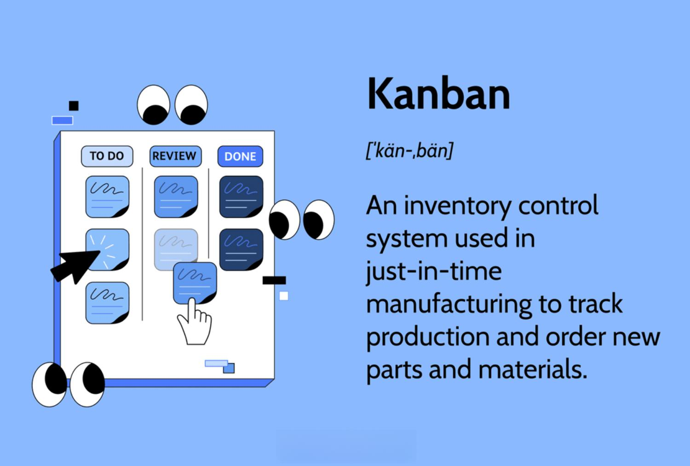

Manufacturing factory orders are essential economic indicators, offering a window into the health and direction of the economy. These reports are not only invaluable to economists but also to traders and investors seeking to understand market dynamics and make informed decisions. Over recent years, factory orders have taken on increased significance in algorithmic trading, where they provide data-driven insights that help in predicting market trends and behaviors.

Factory orders intersect with various economic indicators, influencing algorithmic trading strategies by supplying the crucial data that supports sophisticated trading models. This article will address the role of these factory orders, highlighting their significance as predictors of economic shifts and explaining how traders can utilize this information for strategic decision-making. The intricate details of economic indicators like factory orders can offer traders a substantial advantage in today’s increasingly competitive trading environments.



By leveraging this information, traders and investors can refine their strategies, improving their ability to forecast market movements and subsequently achieving better trading outcomes. Understanding the nuances and implications of factory orders is therefore crucial, as it equips market participants with insights that can enhance both traditional and algorithmic trading approaches. As the markets continue to evolve, the ability to integrate comprehensive data analysis with these economic reports will become ever more vital for success.

## Table of Contents

## Understanding Manufacturing Factory Orders

Factory orders are crucial reports that quantify the dollar value of orders placed for durable and non-durable goods manufactured within an economy. These reports provide a comprehensive overview of the manufacturing sector's performance and help gauge the broader economic activity. In the United States, the U.S. Census Bureau is responsible for releasing these figures monthly, offering insights into both current production activities and future outlooks.

Unlike the Advance Durable Goods Report, which focuses primarily on long-lasting items such as machinery, vehicles, and electronics, factory orders encompass a more extensive dataset. This includes non-durable goods like food, beverages, clothing, and other items with shorter lifespans. By covering both durable and non-durable goods, factory orders provide a detailed snapshot of industry performance and demand.

The reports are composed of several key components: new orders, unfilled orders, shipments, and inventories. Each of these elements plays a significant role in understanding the direction of economic activity:

1. **New Orders:** These indicate fresh demand for manufactured goods, serving as a leading indicator of production activity and potential future economic growth.

2. **Unfilled Orders:** This metric reflects the backlog in production and can signal strong demand if the number is increasing. Conversely, a decrease may suggest declining demand or improved production efficiency.

3. **Shipments:** This component shows the actual sale and delivery of goods. Rising shipment numbers often correlate with stronger economic performance and higher manufacturing output.

4. **Inventories:** The level of inventories held by manufacturers can suggest changes in supply chain efficiency and anticipated future demand. High inventories might indicate overproduction or weak demand, while low inventories could suggest strong sales or insufficient production.

By carefully analyzing these components, investors and traders can infer the manufacturing sector's health and its potential impact on economic expansion or contraction. For instance, a consistent increase in new orders and shipments might signal robust economic growth, while rising inventories coupled with declining new orders could foreshadow a slowdown. Thus, factory orders are indispensable tools for predicting economic trends and making informed trading decisions.

## Economic Indicators: A Broader Perspective

Economic indicators such as manufacturing factory orders play a crucial role in understanding market dynamics and potential economic shifts. These indicators are essential not only for investors but also for policymakers, entrepreneurs, and analysts, providing insights that help forecast economic trends and inform decision-making. Factory orders, which represent the total dollar value of new purchase orders received by manufacturers for both durable and non-durable goods, are a key gauge of industry demand and production outlook. 

A rise in factory orders typically signifies economic growth as it indicates increased demand for manufactured goods. This can lead to higher production levels, which in turn can stimulate job creation and boost consumer confidence. Conversely, a decline in these orders might suggest an economic slowdown as it reflects a decrease in demand, potentially leading to reduced manufacturing activity, layoffs, and diminished consumer spending power. Thus, factory orders serve as a leading indicator of future economic performance, helping to forecast the gross domestic product (GDP) trajectory and other macroeconomic variables.

Moreover, factory orders are intertwined with other economic indicators, aiding a comprehensive market analysis. For instance, a strong positive correlation exists between factory orders and GDP, as both reflect aggregate economic activity levels. Similarly, employment figures often align with factory order trends, since increased manufacturing demand typically calls for more labor, thereby reducing unemployment rates. Consumer spending, which accounts for a significant portion of GDP, can also be influenced by changes in factory orders. When consumers perceive the economy as robust, they are more likely to increase their spending, further driving up factory orders and production.

In practice, traders and investors harness these intertwined relationships to develop robust models and predictive analytics in their trading strategies. Using historical data on factory orders along with other economic indicators, quantitative analysts can build models that aim to forecast stock market movements, currency fluctuations, or commodity prices. For instance, a trader might employ linear regression models or [machine learning](/wiki/machine-learning) techniques to predict asset price movements based on factory order reports. Here's a simple example of how Python could be used in such analysis:

```python
import pandas as pd
from sklearn.linear_model import LinearRegression
from sklearn.model_selection import train_test_split

# Assume data is a DataFrame with columns 'FactoryOrders', 'GDP', 'StockPrices'
data = pd.read_csv('economic_data.csv')

# Features and target variable
X = data[['FactoryOrders', 'GDP']]
y = data['StockPrices']

# Splitting the data
X_train, X_test, y_train, y_test = train_test_split(X, y, test_size=0.2, random_state=42)

# Linear regression model
model = LinearRegression()
model.fit(X_train, y_train)

# Model prediction
predictions = model.predict(X_test)
```

This model, albeit simplified, shows how factory orders and GDP data can be used to make predictions about stock prices, allowing traders to time their trades more effectively. By continuously analyzing economic indicators, investors are better equipped to manage risks and capitalize on opportunities, thereby enhancing their strategic investment approaches and potentially boosting returns.

## Algorithmic Trading and Factory Orders

Algorithmic trading utilizes computer algorithms to execute trades based on predefined rules and data analysis. This approach increasingly relies on large datasets such as manufacturing factory orders, which play a crucial role in informing trading decisions. These orders provide timely and precise data, forming a vital input for algorithmic models. This ensures that trades are executed both efficiently and strategically.

The capacity of algorithms to analyze vast amounts of data allows for the identification of patterns which might not be readily observable to human traders. By examining factory orders, algorithms can detect trends and anomalies, thereby enhancing their ability to forecast market movements. This predictive power is particularly beneficial in rapidly changing markets, where timely information can confer substantial advantages.

Despite these advantages, [algorithmic trading](/wiki/algorithmic-trading) faces the challenge of maintaining adaptability to evolving market conditions. Algorithms require continuous updates and refinements to incorporate new data and adjust to shifts in the economic landscape. This means that traders need to frequently review and adapt their algorithms to ensure optimal performance. Failure to do so can result in reduced efficiency and potential losses.

A significant [factor](/wiki/factor-investing) in successful algorithmic trading strategies is the integration of multiple economic indicators. Combining data from factory orders with other indicators such as GDP growth rates, employment [statistics](/wiki/bayesian-statistics), and consumer spending patterns provides a more comprehensive understanding of the market. This multi-faceted approach can optimize trading performance by allowing for more accurate predictions and informed decision-making.

In developing algorithmic models, traders often employ statistical and machine learning techniques. For example, a simple moving average (SMA) can be implemented using Python:

```python
def simple_moving_average(data, window_size):
    return data.rolling(window=window_size).mean()
```

This function can help smooth the noise in factory orders data, providing a clearer view of underlying trends. More advanced models might use machine learning algorithms to uncover complex relationships and predict future movements based on historical data.

In conclusion, factory orders are an indispensable component of algorithmic trading, providing critical data that influences trade execution and strategy development. By leveraging these insights in combination with other economic indicators, traders can enhance their trading models and improve overall market performance.

## Implications for Traders and Investors

For traders, understanding factory orders and their implications on market conditions can significantly enhance the timing and selection of trading decisions. Factory orders often serve as a predictive tool, offering insights into potential stock market movements, commodity prices, and foreign exchange rates. A consistent rise in factory orders typically signals robust economic conditions, which can lead to increased corporate earnings forecasts and consequently bolster stock prices. Conversely, a decline might indicate a slowdown, prompting traders to anticipate a bearish trend in equities and adjust their portfolios accordingly.

Investors and traders must navigate the complexities of interpreting this data carefully, discerning between short-term fluctuations and more sustained trends. Short-term changes might be fueled by transient factors, such as seasonal demand or supply chain disruptions, while long-term trends can provide a clearer picture of the underlying economic dynamics. By focusing on metrics such as the rate of change in new orders, investors can infer the [momentum](/wiki/momentum) in manufacturing activity, which may influence interest rates or currency valuations.

The integration of factory orders into trading platforms and analysis tools equips traders with real-time analytics, facilitating more precise decision-making. Advanced algorithms and machine learning models can process these datasets rapidly, identifying patterns that might escape human analysts. For instance, Python programming is commonly used to dissect time-series data, where packages like pandas and NumPy are instrumental in analyzing historical order data to forecast future market conditions. 

```python
import pandas as pd
import numpy as np

# Example of a simple moving average calculation for factory orders
factory_orders = pd.Series([100, 105, 110, 108, 107, 115, 120])  # Mock data
simple_moving_average = factory_orders.rolling(window=3).mean()
print(simple_moving_average)
```

Understanding these dynamics allows traders and investors to construct more informed investment strategies, potentially yielding higher returns. By incorporating factory orders into their analytical arsenal, market participants can enhance their comprehension of the economic landscape, optimizing both the timing and scope of their investment decisions. This data-driven approach is increasingly vital as financial markets grow more complex and interconnected, underscoring the importance of staying informed and adaptable to achieve financial success.

## Conclusion

Factory orders remain a cornerstone of understanding economic conditions and have a direct impact on trading strategies. These orders, which report the dollar value of new orders from factories, act as leading economic indicators by signaling trends in production and consumption. For both traditional and algorithmic traders, these insights are invaluable, offering a predictive lens through which future market dynamics can be anticipated. This forecasting capability is crucial, considering the fast-paced and ever-changing nature of global markets.

As markets continue to evolve, the integration of sophisticated data analysis techniques with economic reports such as factory orders is becoming increasingly significant. Advanced algorithms, machine learning models, and big data analytics can process vast amounts of information, identifying patterns and trends that might elude human analysis. For instance, utilizing Python's rich ecosystem of libraries like Pandas, NumPy, and scikit-learn can enable traders to efficiently handle data from factory orders, thus optimizing their trading strategies. Here is a simple example of how one can use Python to analyze factory order data:

```python
import pandas as pd
import numpy as np
from sklearn.linear_model import LinearRegression

# Sample factory order data
data = {'month': [1, 2, 3, 4, 5],
        'orders': [200, 220, 240, 260, 280]}

df = pd.DataFrame(data)

# Preparing the data for linear regression
X = df[['month']]
y = df['orders']

# Creating and training the model
model = LinearRegression()
model.fit(X, y)

# Predicting future orders
future_months = np.array([[6], [7]])
predictions = model.predict(future_months)

print(f"Predicted orders for future months: {predictions}")
```

For traders and investors, staying informed about these shifts and refining their strategies accordingly is crucial for continued success. Detailed data on factory orders allow market participants to discern subtleties within economic trends, leading to better-informed decisions. 

By leveraging this data, investors and traders can better comprehend the broader economic landscape, aligning their strategies with prevailing and anticipated economic conditions. This proactive approach not only enhances trading performance but also positions investors advantageously in a competitive market, potentially yielding higher returns.

## References & Further Reading

[1]: ["The Impact of Manufacturing Output on Business Cycles," Journal of Economic Literature](https://www.aeaweb.org/articles?id=10.1257/jel.20211584) 

[2]: ["Algorithmic Trading: Winning Strategies and Their Rationale"](https://books.google.com/books/about/Algorithmic_Trading.html?id=WAlFDwAAQBAJ) by Ernest P. Chan

[3]: ["Advances in Financial Machine Learning"](https://www.amazon.com/Advances-Financial-Machine-Learning-Marcos/dp/1119482089) by Marcos Lopez de Prado

[4]: ["Machine Learning for Algorithmic Trading"](https://github.com/stefan-jansen/machine-learning-for-trading) by Stefan Jansen

[5]: ["Evidence-Based Technical Analysis: Applying the Scientific Method and Statistical Inference to Trading Signals"](https://www.amazon.com/Evidence-Based-Technical-Analysis-Scientific-Statistical/dp/0470008741) by David Aronson

[6]: ["Quantitative Trading: How to Build Your Own Algorithmic Trading Business"](https://www.amazon.com/Quantitative-Trading-Build-Algorithmic-Business/dp/1119800064) by Ernest P. Chan