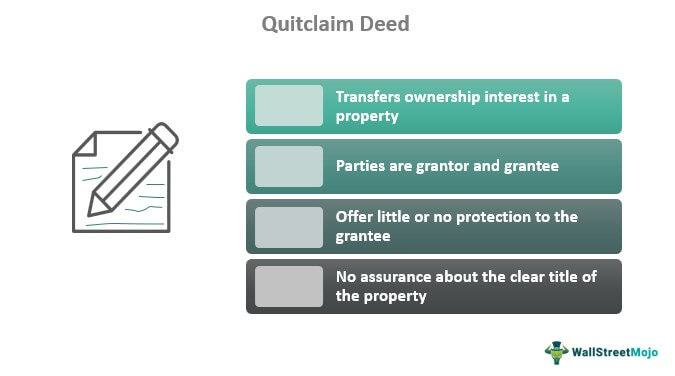

In today's fast-paced digital world, various sectors like real estate and finance have witnessed remarkable transformations. Technological advancements and data-driven decision-making have significantly influenced the operational frameworks and transactional dynamics within these industries. Real estate property transfers and algorithmic trading in finance represent two distinct areas that intertwine in unexpected ways, driven by shared interests in optimization and efficiency.

For real estate investors, understanding how quitclaim deeds facilitate property transfer without guaranteeing title clearance is crucial. Quitclaim deeds offer a streamlined method for transferring property ownership, particularly when trust exists between parties, such as family members or among divorcing spouses. However, this simplicity comes at a cost, as such deeds do not provide assurances about the property title's state, potentially leading to unforeseen challenges for the grantees.



Conversely, algorithmic trading has revolutionized the financial markets by allowing for automated, efficient, and high-frequency trading operations. Traders utilize sophisticated algorithms to analyze data, execute trades at rapid speeds, and improve market outcomes without direct human intervention. This shift towards algorithms has profoundly altered market dynamics and trading strategies on a global scale, leading to greater efficiency and liquidity in financial markets.

This article examines the intricate intersection between real estate property transfer through quitclaim deeds and the evolution of algorithmic trading. Understanding the interplay between legal frameworks in real estate and technological innovations in finance highlights the transformative potential and challenges these sectors face in a rapidly evolving digital environment.

## Table of Contents

## Understanding Real Estate Property Transfer

Real estate property transfer is a legal process that involves shifting ownership of a property from one party to another. This process is fundamental in transactions where property rights change hands, and it ensures that the buyer gains lawful ownership. The transfer can occur through different legal instruments, with quitclaim deeds being among the most straightforward and frequently used methods in specific scenarios.

Quitclaim deeds are legal documents by which a property owner, known as the grantor, transfers any interest they may have in a property to another person, known as the grantee. Unlike other deeds, quitclaim deeds do not include any warranties or guarantees regarding the validity of the title. Essentially, the grantor does not assure that the title is clear of encumbrances, liens, or legal claims. This is why quitclaim deeds are often preferred in circumstances where the transfer of property occurs between parties who know each other well and trust is established, such as between family members or divorcing spouses.

For example, in a common family scenario, a parent may use a quitclaim deed to transfer property ownership to a child. Another prevalent use is during a divorce, where one spouse may relinquish their interest in shared property to the other spouse as part of the settlement. Quitclaim deeds are also occasionally used to clear title defects—flaws or discrepancies in a property's title that must be resolved before ownership can be accurately established.

However, quitclaim deeds offer less protection compared to warranty deeds. In a warranty deed, the grantor guarantees that the title is free from defects and any encumbrances; if any issues arise, the grantor is legally responsible for rectifying them. This is not the case with quitclaim deeds, as they offer no such assurances.

Given the lack of guarantees, it is crucial for potential buyers to conduct thorough due diligence when dealing with properties transferred via quitclaim deeds. This may involve title searches or purchasing title insurance to mitigate any potential risks associated with unclear ownership. Buyers need to be aware of the implications of acquiring property through a quitclaim deed, as it means assuming greater responsibility and risk regarding the property's title.

## Exploring Quitclaim Deeds

A quitclaim deed is a straightforward legal instrument used to convey the grantor's interest in a property to a grantee without any guarantees regarding the property's title. The absence of warranties in quitclaim deeds means that the grantor does not assure the grantee of the property's title's validity or any encumbrances on it. This simplicity and lack of title guarantee make quitclaim deeds beneficial primarily in situations where the parties involved have a trusted relationship. Common use cases include transfers between family members, resolving property rights in cases of divorce, or clarifying title defects.

The key advantage of a quitclaim deed lies in its efficiency. The process of executing a quitclaim deed is generally faster and requires less legal formality compared to other deeds, such as warranty deeds or grant deeds, which involve extensive title research and guarantee the title's status. This expedited process is especially appealing for parties familiar with each other or in situations where the property's title is not in question.

However, the very simplicity that makes quitclaim deeds attractive also introduces potential legal risks. Since the deed offers no protections against title defects or claims from third parties, the grantee assumes all risks associated with the property's title. It is possible that unknown liens, claims, or defects could surface after the transfer, leaving the grantee with little recourse.

As a result, potential buyers engaging in transactions involving quitclaim deeds should perform rigorous due diligence. This might include conducting a thorough title search, purchasing title insurance, or consulting with legal experts to understand any potential risks or existing claims on the property. By conducting these preliminary checks, parties can mitigate the risks associated with transferring property via quitclaim deeds.

Effective use of quitclaim deeds requires knowledge of the specific scenarios where they are advantageous. For instance, if a property owner wishes to transfer rights to a spouse or family member without going through cumbersome legal procedures, a quitclaim deed can facilitate this efficiently. However, when dealing with unfamiliar parties or properties with a complex history, more protective instruments could be recommended.

Understanding these nuances is important for real estate transactions, as it helps involved parties to make informed decisions about the transfer method that best suits their circumstances.

## The Evolution of Algorithmic Trading

Algorithmic trading, commonly referred to as algo trading, employs the use of computer algorithms designed to execute trades with minimal or no human intervention. This technological advancement has significantly transformed the landscape of global financial markets over the past few decades.

The adoption of [algorithmic trading](/wiki/algorithmic-trading) can be attributed to its ability to leverage mathematical models, historical data, and rapid computation to optimize trading strategies and outcomes. These algorithms are programmed to identify market trends and execute orders at speeds unattainable by human traders. Algo trading executes trades at extremely high frequencies, often resulting in more favorable outcomes by capitalizing on market inefficiencies and price discrepancies.

At the core of algorithmic trading are strategies like high-frequency trading ([HFT](/wiki/high-frequency-trading-strategies)) and statistical [arbitrage](/wiki/arbitrage). High-frequency trading exploits the smallest price changes and, by making a large [volume](/wiki/volume-trading-strategy) of trades at a high speed, it aims to accumulate significant profits. Statistical arbitrage involves complex mathematical concepts and quantitative models to identify pricing inefficiencies between highly correlated securities, allowing traders to harness potential gains.

### Example: Utilizing Python for Algorithmic Trading

Consider an example using Python to demonstrate the basic framework of an algorithmic trading strategy. Below is a simple version of a moving average crossover strategy, commonly used in algorithmic trading:

```python
import pandas as pd

# Assume `df` is a DataFrame containing historical stock price data with a 'Close' column
def moving_average_crossover_strategy(df, short_window=40, long_window=100):
    signals = pd.DataFrame(index=df.index)
    signals['signal'] = 0.0

    # Create short simple moving average
    signals['short_mavg'] = df['Close'].rolling(window=short_window, min_periods=1, center=False).mean()

    # Create long simple moving average
    signals['long_mavg'] = df['Close'].rolling(window=long_window, min_periods=1, center=False).mean()

    # Create signals
    signals['signal'][short_window:] = np.where(signals['short_mavg'][short_window:]
                                               > signals['long_mavg'][short_window:], 1.0, 0.0)

    # Generate trading orders
    signals['positions'] = signals['signal'].diff()

    return signals

# Example call to the function
# signals = moving_average_crossover_strategy(df)
```

In this example, the strategy generates buy signals when a short-term moving average crosses above a long-term moving average, and sell signals when it crosses below. The simplicity and automation ability of algo trading make it a powerful tool for modern financial markets.

Overall, algorithmic trading supports various trading strategies and styles, enabling investors and institutions to maximize returns while minimizing risks. As technology continues to advance, the application of algorithmic trading is anticipated to grow even further, shaping the future of trading across different asset classes.

## Connection Between Real Estate and Algo Trading

The marriage of real estate and algorithmic trading reflects the influence of data and technology across various industries. Although these sectors seem distinct, they share an increasing dependency on automated systems and data-driven insights. Real estate investment trusts (REITs) are particularly emblematic of this intersection, as they utilize algorithmic trading to enhance portfolio management. By deploying advanced algorithms, REITs can execute trades at optimal moments, thus maximizing returns while minimizing risks. 

Algorithmic trading offers critical advantages such as speed and precision which are crucial for managing extensive real estate portfolios. The automation of trading processes means that adjustments to portfolios can be made almost instantaneously in response to market conditions. This capability is especially significant given the [volatility](/wiki/volatility-trading-strategies) and complexity of real estate markets. For instance, algorithms can be programmed to buy, sell, or hold assets based on predefined criteria such as market trends, interest rates, and economic indicators, thereby optimizing the timing and execution of trades.

Moreover, the integration of algorithmic trading in real estate ventures extends beyond simple transaction execution. It plays a pivotal role in developing data-driven insights that inform property market strategies. By analyzing vast datasets, algorithms provide nuanced understandings of market dynamics, helping investors evaluate pricing strategies and investment opportunities more effectively. For example, [machine learning](/wiki/machine-learning) models can predict future property values or identify emerging market trends, allowing investors to make evidence-based decisions.

The synergy between real estate and algorithmic trading empowers investors to adopt innovative strategies that are in line with modern technological advancements. For instance, digital platforms have emerged that enable micro-investments in real estate, democratizing access to this asset class. These platforms often rely on algorithmic systems to manage diverse investor portfolios efficiently, thereby lowering entry barriers and expanding market participation.

In sum, the connection between real estate and algorithmic trading is characterized by enhanced efficiency and strategic decision-making. As both fields continue to evolve, investors are poised to benefit from adopting integrated approaches that leverage the strengths of algorithmic processes in both finance and real estate markets.

## Challenges and Opportunities

Despite their benefits, real estate transactions executed via quitclaim deeds and algorithmic trading in financial markets present substantial challenges. For starters, quitclaim deeds, while efficient for certain contexts like intra-family transfers, inherently lack the title guarantees found in more comprehensive deeds, such as warranty deeds. This absence of title warranties poses legal risks, potentially exposing parties to unforeseen claims or disputes over property ownership. Consequently, it is imperative for investors to undertake rigorous due diligence. This includes verifying property history and conducting thorough title searches to mitigate risks.

In the domain of algorithmic trading, efficiency and speed are counterbalanced by the volatility such systems can introduce to financial markets. Algorithms executing trades in microseconds have the potential to amplify market fluctuations, leading to unpredictable swings. This necessitates robust risk management frameworks to safeguard against potential adverse outcomes. Traders and financial institutions must implement algorithms that not only optimize for performance but also incorporate safeguards, such as circuit breakers and stop-loss mechanisms, to maintain transactional integrity during periods of high volatility.

Opportunities, however, abound in leveraging data analytics to address these challenges. In real estate, data-driven insights can inform better property evaluations and investment choices, reducing the uncertainties associated with transactions lacking title guarantees. Investors can harness big data technologies for trend analysis, enabling them to respond proactively to market dynamics.

Similarly, in finance, the advancement of machine learning and [artificial intelligence](/wiki/ai-artificial-intelligence) offers sophisticated tools for identifying patterns and predicting market movements with greater accuracy. These tools can enhance algorithmic trading systems, allowing them to better adjust to and capitalize on prevailing market trends, balancing the dual goals of profitability and stability.

The convergence of data analytics and technological advancements necessitates that both the real estate and financial sectors continuously adapt to sustain growth. This involves embracing new technologies, investing in education and training, and developing infrastructure capable of supporting next-generation analytics and trading platforms. By doing so, stakeholders can not only mitigate inherent challenges but also unlock new avenues for growth and innovation.

## Conclusion

The intersection of real estate and finance is undergoing significant transformation, driven by the integration of technology. In this dynamic landscape, understanding quitclaim deeds and algorithmic trading is crucial for investors and stakeholders. Quitclaim deeds facilitate property transfers without the encumbrance of title guarantees, offering simplicity but requiring careful due diligence to avert legal pitfalls. On the financial front, algorithmic trading continues to revolutionize markets by enabling high-speed, data-driven decision-making, streamlining numerous investment processes.

Investors must navigate the unique challenges presented by each sector: quitclaim deeds demand rigorous scrutiny to mitigate the risks associated with title defects, whereas algorithmic trading requires robust risk management to handle potential market volatility. Yet, these challenges present opportunities; by employing data analytics, investors can mitigate risks and capitalize on trends, thereby optimizing their real estate and financial engagements.

The synergies between real estate and algorithmic trading are evident in the enhanced efficiency and data insights they offer, allowing investors to devise innovative strategies. This integration aids in more informed decision-making processes, influencing property pricing and investment strategies positively.

Adaptation and continuous learning are imperative for investors to maintain a competitive edge in these rapidly evolving markets. Embracing technological advancements and adopting a strategic approach will enable them to harness the full potential of both sectors, ensuring sustainable growth and prosperous outcomes.

## References & Further Reading

[1]: Aswath Damodaran. ["Investment Valuation: Tools and Techniques for Determining the Value of Any Asset, University Edition"](https://archive.org/details/investmentvaluat0000damo_n6k9). Wiley.

[2]: ["Real Estate Law"](https://www.forbes.com/advisor/education/law/what-is-real-estate-law/) by Marianne M. Jennings

[3]: Marcos López de Prado. ["Advances in Financial Machine Learning"](https://www.amazon.com/Advances-Financial-Machine-Learning-Marcos/dp/1119482089). Wiley.

[4]: David Aronson. ["Evidence-Based Technical Analysis: Applying the Scientific Method and Statistical Inference to Trading Signals"](https://www.amazon.com/Evidence-Based-Technical-Analysis-Scientific-Statistical/dp/0470008741). Wiley.

[5]: Stefan Jansen. ["Machine Learning for Algorithmic Trading"](https://github.com/stefan-jansen/machine-learning-for-trading). Packt Publishing.

[6]: Ernest P. Chan. ["Quantitative Trading: How to Build Your Own Algorithmic Trading Business"](https://www.amazon.com/Quantitative-Trading-Build-Algorithmic-Business/dp/0470284889). Wiley.