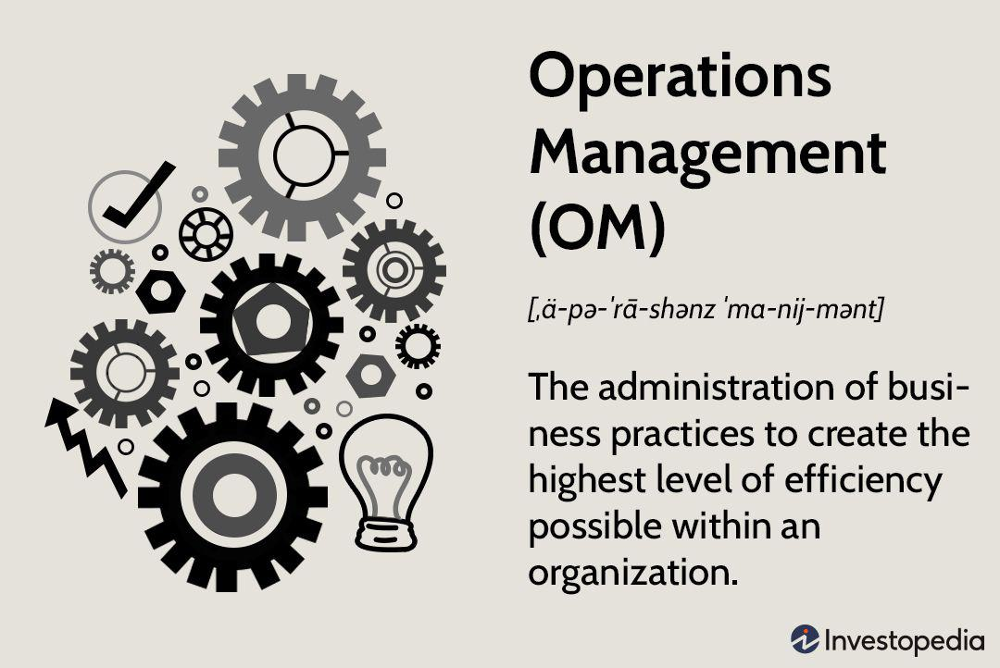

In the rapidly evolving world of finance, company structure and services play a pivotal role in shaping successful outcomes. The organization and management of financial services companies significantly impact operational efficiency and client satisfaction. Understanding the nuances of company structure within the financial services industry is essential for optimizing these aspects, leading to improved performance and strategic alignment.

Financial services companies are increasingly leveraging advanced technologies such as algorithmic trading to gain a competitive advantage. Algorithmic trading, which involves the use of computer algorithms to automate trading decisions, enhances speed and precision, allowing firms to capitalize on market opportunities more effectively. This technological advancement underscores the importance of a well-organized corporate structure that can support innovative practices and maintain a competitive edge in a fast-paced market.



FactSet, a prominent leader in financial data and analytics, provides a suite of valuable insights and tools that facilitate efficient company structuring and operational decision-making. By offering comprehensive data solutions, FactSet enables financial professionals to analyze market trends, assess financial performance, and enhance competitive positioning. These capabilities are crucial for organizations striving to ensure their structures are aligned with their strategic objectives and market conditions.

This article examines the complexities of company structure within financial services, emphasizing the contributions of FactSet and the transformative impact of algorithmic trading in modern financial markets. Understanding these elements is pivotal for financial services firms aiming to foster innovation, improve agility, and achieve long-term success in an ever-changing industry landscape.

## Table of Contents

## Understanding Company Structure in Financial Services

Company structure within financial services involves the systematic arrangement of departments and divisions to optimize organizational performance. This structure is essential for risk management and the achievement of strategic objectives. Financial institutions typically adopt various structures, including functional, divisional, or matrix models, to align with their unique business operations.

The functional structure organizes a company based on specialized departments such as marketing, finance, and operations. This allows for focused expertise and efficiency within each function. However, it may sometimes lead to communication silos, where departments operate independently, potentially hindering integrated decision-making.

In contrast, the divisional structure groups the organization based on products, services, or geographical locations. This model offers flexibility as each division can operate semi-independently, allowing for tailored strategies that cater to specific markets. A downside is that it can duplicate resources and efforts across divisions.

The matrix structure is a hybrid approach combining both functional and divisional structures. It encourages cross-functional collaboration and is designed to enhance flexibility and communication across departments. Despite its benefits, the matrix structure can lead to confusion and conflict due to dual reporting lines.

Effective company structuring balances flexibility with control and compliance. This balance is vital to address regulatory requirements and manage operational risks. A well-structured financial services firm facilitates better communication, optimizes workflow, and encourages innovation. Enhanced communication leads to quicker adaptation to market changes, while streamlined workflows improve operational efficiency. Additionally, fostering an environment of innovation enables financial services firms to maintain competitiveness in a rapidly evolving industry landscape.

Structuring in financial services, therefore, is a dynamic process that necessitates continuous assessment to align with strategic goals and market conditions. Adapting to changes in the regulatory environment and technological advancements ensures that these institutions remain agile and effective in delivering financial solutions.

## Role of Financial Services in Supporting Company Structure

Financial services are integral to the establishment and optimization of company structures, providing essential support across various operational domains such as investment, risk management, and financial advisory. These services form the foundational backbone that underpins organizational operations.

Corporate finance, a crucial component of financial services, plays a vital role in helping companies optimize their structural layout. It encompasses a range of activities including capital investment decision-making, acquisition strategies, and structuring financial resources to maintain operational efficiency. By effectively managing a firm’s capital structure, corporate finance ensures that companies are well-equipped to pursue growth opportunities while minimizing financial risks.

Asset management services further enhance structural efficacy by offering tailored investment solutions that align with an organization's financial objectives. These services involve managing investment portfolios to maximize returns, thus supporting the organization’s ability to meet financial commitments and capitalize on emerging market opportunities. By integrating asset management strategies into their operational frameworks, companies can enhance their financial stability and adaptability.

Consultancy services provide specialized advice and strategic insights, assisting companies in refining their organizational structures to better suit their long-term goals. These services guide organizations through complex financial landscapes, ensuring they are equipped to navigate regulatory changes and economic fluctuations. By leveraging consultancy expertise, firms can implement structural adjustments that enhance efficiency and competitive positioning.

Furthermore, financial planning services are essential for aligning company structures with long-term strategic goals and prevailing market conditions. These services involve the development of comprehensive financial plans that detail revenue projections, cost management strategies, and investment tactics. This alignment is crucial for ensuring that company structures remain adaptable and conducive to achieving strategic objectives.

Access to capital and advisory services facilitated by financial institutions enable companies to pivot their structures as needed. By providing the necessary funding and expert guidance, these services empower organizations to execute strategic changes that enhance operational capabilities and market responsiveness. Financial institutions play a pivotal role in ensuring that companies can access the resources required to sustain growth and competitiveness.

Overall, financial services enable companies to proactively address changes in the financial landscape and regulatory environment. By continuously adapting their structures to meet evolving demands, organizations can improve their resilience and uphold their competitive edge. This strategic agility is essential for sustaining long-term success in an increasingly dynamic market.

## FactSet's Role in Enhancing Financial Service Structures

FactSet is a pivotal player in enhancing the structural efficiency of financial services firms through its vast array of data and analytics tools. These resources support financial professionals by providing comprehensive insights essential for informed decision-making concerning company structure. One of the significant offerings of FactSet is its capability to deliver deep insights into market trends, financial performance, and competitive positioning, enabling firms to shape their strategic direction effectively.

FactSet's platforms are designed to assist in crucial areas such as risk management, portfolio analysis, and investment research. By providing accurate and timely data, FactSet helps organizations identify potential risks and opportunities within their portfolios, allowing for more effective structuring and repositioning of assets as necessary. This function is vital for maintaining a competitive advantage in constantly evolving financial markets.

Moreover, the advanced analytics offered by FactSet play a crucial role in strategic planning and execution. These tools empower companies to remain agile and competitive by providing actionable insights that drive strategic initiatives. Whether it's optimizing operational processes or developing new business strategies, FactSet ensures that financial service structures are well-equipped to adapt to market demands.

The integration of FactSet's tools within financial services operations significantly enhances efficiency and promotes data-driven decision-making. For instance, through its robust financial modeling and analysis capabilities, businesses can evaluate various scenarios and outcomes, leading to more strategic resource allocation and operational adjustments. This level of insight not only supports current structural needs but also anticipates future demands, allowing organizations to proactively respond to challenges and opportunities in the financial sector.

In essence, FactSet serves as a catalyst for improving the organizational frameworks of financial services firms, ensuring they leverage data effectively to sustain growth and competitive strength. The use of FactSet's comprehensive solutions reflects the growing emphasis on data analytics in refining company structures and propelling the financial industry towards greater efficiency and innovation.

## Algorithmic Trading: Revolutionizing Financial Services

Algorithmic Trading, a pivotal breakthrough in financial technology, has significantly reshaped financial services, proving essential for modern trading operations. This approach leverages sophisticated algorithms to automate trading strategies, offering unmatched speed and precision in the financial markets. By utilizing mathematical models to assess market conditions, algorithms can execute and adjust trades in real-time, outperforming human capabilities.

The primary advantage of [algorithmic trading](/wiki/algorithmic-trading) lies in its ability to reduce human error and trading costs while introducing high-frequency trading techniques. High-frequency trading ([HFT](/wiki/high-frequency-trading-strategies)) involves executing a large number of orders at extremely high speeds, a process only feasible through algorithms. The adoption of algo trading minimizes delays, allowing traders to capitalize on fleeting market opportunities.

Financial services companies have integrated algorithmic trading to handle complex trading strategies, thereby obtaining a competitive edge. These algorithms cater to various trading styles, from market-making and [arbitrage](/wiki/arbitrage) to trend-following strategies. For instance, in [statistical arbitrage](/wiki/statistical-arbitrage), algorithms make use of statistical models to identify and exploit pricing inefficiencies between securities. A simple example might involve creating a trading strategy to profit from the temporary mispricing using the following Python snippet:

```python
import pandas as pd
import numpy as np
from statsmodels.tsa.stattools import coint

# Load historical price data for two securities
data = pd.read_csv('price_data.csv')
S1 = data['Security1']
S2 = data['Security2']

# Check for cointegration
score, p_value, _ = coint(S1, S2)

if p_value < 0.05:
    print("Cointegration detected, potential arbitrage opportunity.")
else:
    print("No cointegration, hence no arbitrage opportunity.")
```

The integration of algorithmic trading within a company's structure allows for the development of more agile and responsive financial firms. Optimizing operation frameworks around technology facilitates quick adaptation to market changes and enhances overall efficiency. Furthermore, this synergy assists in refining decision-making processes, providing firms the agility required to thrive in competitive environments. As algorithmic trading continues to evolve, its strategic importance in bolstering financial service operations is undeniable, leading towards transformative improvements in how financial institutions function and compete.

## Impact of Algo Trading on Company Structure

Algorithmic trading has significantly impacted company structures, requiring organizational changes to support technological integration effectively. This shifting landscape is characterized by several critical adjustments that firms need to implement to capitalize on algorithmic trading's efficiencies and capabilities.

Primarily, firms must invest heavily in technology infrastructure and acquire skilled personnel capable of developing and managing complex trading algorithms. This emphasis on technology is crucial as algorithms drive trading decisions, execute orders, and analyze vast datasets in real-time. Consequently, a robust IT department becomes essential to maintain the technological frameworks necessary for algorithmic trading. IT specialists work on ensuring system scalability, security, and maintenance to support high-frequency and automated trading operations.

Moreover, the seamless execution and management of trading operations necessitate cross-departmental collaboration. Traditionally siloed departments, such as trading, risk management, and IT, must work closely to enhance operational efficiency. This collaboration includes sharing insights, aligning strategies, and integrating diverse technological tools. A unified approach allows for better communication, faster problem-solving, and more coordinated responses to market changes.

The adoption of algorithmic trading also influences regulatory compliance and risk management policies significantly. As algorithms can execute trades across global markets at high speeds, firms are compelled to adapt to various regulatory requirements, implementing robust compliance frameworks to mitigate legal risks. Efficient risk management systems become vital to manage the risks associated with automated trading, including potential system failures and market anomalies. Compliance teams work in tandem with IT and trading departments to ensure that all algorithmic trading activities are transparent and adhere to applicable regulations.

Overall, the integration of algorithmic trading necessitates a re-evaluation of company structures. By aligning organizational processes and frameworks with the technological demands of algorithmic trading, financial services firms can enhance their operational agility and maintain a competitive edge in rapidly evolving markets.

## Conclusion

The integration of innovative financial services and technologies is fundamentally altering company structures within the financial sector. FactSet's transformative analytics and the precision offered by algorithmic trading exemplify how swiftly modern financial services are evolving. These advancements necessitate that businesses continually reassess and refine their organizational frameworks to maintain a competitive edge in a rapidly changing environment.

Businesses that successfully understand and harness these innovations can achieve notable improvements in efficiency, profitability, and strategic outcomes. For instance, FactSet's analytics provide profound insights which enable firms to anticipate market trends and respond adeptly to financial landscapes. Simultaneously, algorithmic trading offers enhanced speed and accuracy, minimizing human error and reducing operational costs through automated processes.

As the financial industry continues its trajectory of rapid advancement, the relationship between organizational structure and financial services will remain a focal point for companies aiming for success. This ongoing interplay demands that businesses remain agile, fostering a culture of continuous improvement and adaptability. By doing so, companies not only enhance their structural efficiency but also better position themselves to capitalize on emerging opportunities and navigate challenges effectively.

In conclusion, the dynamic evolution of financial services technologies presents both opportunities and challenges for company structures. Firms that effectively integrate these technologies into their operations are better equipped to thrive in a competitive landscape, marking the importance of strategic innovation as a cornerstone of future success in the financial sector.

## References & Further Reading

[1]: ["Corporate Finance"](https://www.investopedia.com/terms/c/corporatefinance.asp) by Stephen Ross, Randolph Westerfield, and Jeffrey Jaffe

[2]: ["Financial Markets and Corporate Strategy"](https://www.amazon.com/Financial-Markets-Corporate-Strategy-Grinblatt/dp/0072294337) by Mark Grinblatt and Sheridan Titman

[3]: Aldridge, I. (2013). ["High-Frequency Trading: A Practical Guide to Algorithmic Strategies and Trading Systems"](https://www.wiley.com/en-us/High+Frequency+Trading%3A+A+Practical+Guide+to+Algorithmic+Strategies+and+Trading+Systems%2C+2nd+Edition-p-9781118343500). John Wiley & Sons.

[4]: Narang, R. K. (2013). ["Inside the Black Box: The Simple Truth About Quantitative Trading"](https://onlinelibrary.wiley.com/doi/book/10.1002/9781118267738). Wiley Finance.

[5]: "FactSet Research Systems Inc. 2022 Annual Report." FactSet. [Link to the report](https://www.cnn.com/2024/12/05/economy/us-jobs-report-november-preview/index.html) 

[6]: Hull, J. C. (2017). ["Options, Futures, and Other Derivatives"](https://www.semanticscholar.org/paper/Options%2C-Futures%2C-and-Other-Derivatives-Hull/89bdee500c8623864fc9eb7a471546aa713acc44). Pearson.