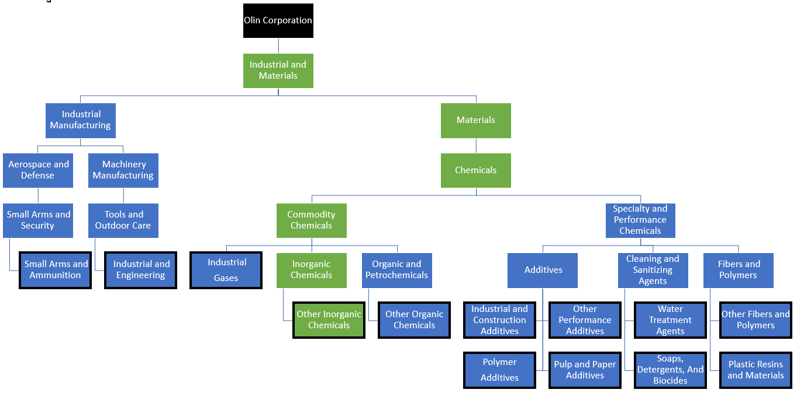

## Table of Contents

## What is FactSet?

FactSet is a company that provides financial data and software to people who work in finance, like investors and analysts. They help these people make smart decisions about where to put their money by giving them lots of information about companies, markets, and the economy. FactSet's tools let users look at data in different ways, make reports, and keep track of how their investments are doing.

The company started in 1978 and has grown a lot since then. Now, it serves clients all over the world, helping them with things like picking stocks, managing portfolios, and understanding market trends. FactSet is known for having a lot of data and for making it easy for users to find what they need quickly. This makes it a popular choice for people in the finance industry.

## When was FactSet founded and by whom?

FactSet was founded in 1978. The person who started it is Howard Wille.

Howard Wille saw a need for better financial data and tools. He wanted to help people in finance make better choices. So, he created FactSet to give them the information they needed.

## What are the main products and services offered by FactSet?

FactSet offers a lot of tools and information for people who work in finance. Their main product is a platform where users can find data about companies, markets, and the economy. This platform lets users look at data in many different ways. They can make charts, reports, and keep track of how their investments are doing. It's like a big library of financial information that helps people make smart decisions about where to put their money.

Another important service from FactSet is research. They have a team that looks at data and writes reports about what they find. These reports can help investors understand market trends and make better choices. FactSet also has tools for portfolio management. This means they help people who manage money decide which stocks to buy or sell. Their tools make it easier to see how different investments are doing and how they fit together.

FactSet also offers training and support. They teach people how to use their tools and answer questions when users need help. This makes it easier for people to get the most out of FactSet's products. Overall, FactSet is known for having a lot of data and for making it easy for users to find what they need quickly.

## How does FactSet gather and manage its data?

FactSet gathers its data from many different places. They get information from stock exchanges, companies that report their financials, news sources, and even government reports. FactSet has special agreements with these places to get the data quickly and accurately. They also use technology to collect data automatically, which helps them keep their information up to date. This way, they can give their users the latest numbers and news about companies and markets.

Once FactSet has the data, they organize it carefully. They put it into categories so it's easy to find. They also check the data to make sure it's correct. FactSet uses special software to manage all this information. This software helps them store the data safely and lets users search for what they need quickly. By keeping the data well-organized and accurate, FactSet makes sure their users can trust the information they get.

## Who are the primary customers of FactSet?

The main customers of FactSet are people who work in finance, like investors and analysts. These are people who need a lot of information to make decisions about where to put their money. They use FactSet's tools to look at data about companies, markets, and the economy. This helps them pick the best stocks and manage their investments well.

FactSet also serves big companies and financial institutions. These organizations use FactSet's services to help them make smart choices about their money. They might use FactSet's research reports to understand market trends or use the portfolio management tools to see how their investments are doing. Overall, FactSet's customers are anyone in finance who needs a lot of data to do their job well.

## What industries does FactSet primarily serve?

FactSet mainly serves the finance industry. This includes banks, investment firms, and hedge funds. These businesses use FactSet's tools to look at data about companies, markets, and the economy. This helps them make smart choices about where to put their money. For example, they might use FactSet to pick the best stocks or to manage their investments better.

FactSet also helps people who work in finance, like investors and analysts. These people need a lot of information to do their jobs well. They use FactSet's platform to find data quickly and easily. This helps them understand market trends and make better decisions about their investments. Overall, FactSet is very important for anyone in the finance world who needs a lot of data.

## How is FactSet structured corporately?

FactSet is a company that is structured to help people in finance. It has a main office in Norwalk, Connecticut, but it also has offices all over the world. This helps them serve customers in different countries. The company is led by a CEO and a team of executives who make big decisions. They have different departments like sales, technology, and research. Each department has its own leader who reports to the executives.

The company is also divided into different regions. Each region has its own team that knows the local markets well. This helps FactSet give good service to customers in different parts of the world. FactSet also has a board of directors. This group of people helps guide the company and make sure it is doing well. They meet regularly to talk about the company's plans and goals.

## What are the recent financial performance highlights of FactSet?

FactSet has been doing well in its recent financial reports. In the last year, the company's revenue grew by about 8%. This means they made more money from their services. Their earnings per share, which is how much profit they made for each share of their stock, also went up by around 10%. This shows that FactSet is not only making more money but also keeping more of it as profit.

The company has been successful in keeping its customers happy and adding new ones. FactSet's client retention rate, which shows how many customers stay with them, is very high at over 95%. This means most of their customers keep using their services. They also added new clients, which helped increase their revenue. Overall, FactSet's strong financial performance shows that they are doing a good job in the competitive world of financial data and software.

## How does FactSet integrate technology in its operations?

FactSet uses technology a lot in its work. They have a big platform where users can find and look at financial data. This platform uses special software to make it easy for people to search for information and make charts or reports. FactSet also uses technology to collect data from places like stock exchanges and news sources. They have agreements to get this data quickly and use special tools to make sure it's accurate and up to date.

Technology also helps FactSet serve its customers better. They have tools for managing investments, like picking stocks and tracking how they are doing. These tools use technology to help users see all their data in one place and make smart decisions. FactSet also uses technology to train people on how to use their platform and to answer their questions. This makes it easier for customers to get the most out of FactSet's services.

## What are the competitive advantages of FactSet over its rivals?

FactSet has a few big advantages over its competitors. One of the main ones is the amount and quality of data they have. FactSet collects information from a lot of different places, like stock exchanges and news sources. This means they can give their users a lot of detailed information quickly. They also check this data carefully to make sure it's correct, which makes their users trust them more. Another advantage is their platform. It's easy to use and lets people look at data in many different ways. This helps users make better decisions about where to put their money.

Another important advantage is FactSet's customer service. They have a high client retention rate, which means most of their customers keep using their services. This shows that people are happy with what FactSet offers. FactSet also helps their customers a lot. They provide training and support to make sure people can use their tools well. This makes it easier for users to get the most out of FactSet's products. Overall, FactSet's strong data, easy-to-use platform, and good customer service make them stand out from other companies in the finance industry.

## What are the major challenges and risks FactSet faces in the market?

FactSet faces a few big challenges in the market. One of the main ones is competition. There are other companies that offer similar financial data and software. These companies are always trying to make their products better and take customers away from FactSet. This means FactSet has to keep improving their services to stay ahead. Another challenge is keeping their data accurate and up to date. FactSet gets information from many different places, and it can be hard to make sure all of it is correct and current. If they make mistakes, their customers might not trust them as much.

Another risk for FactSet is technology. They rely a lot on their platform and software to help their customers. If there are problems with their technology, like if their website goes down or their software has bugs, it can make it hard for people to use their services. This can make customers unhappy and might cause them to go to other companies. FactSet also has to spend a lot of money on technology to keep it working well and to add new features. This can be expensive and risky if they don't see a good return on their investment.

## What are FactSet's strategies for future growth and expansion?

FactSet is planning to grow by adding new products and services. They want to make their platform even better by adding more data and new tools. This will help them keep their current customers happy and attract new ones. FactSet is also looking at new markets where they can offer their services. They think there are a lot of people in different countries who could use their tools to make smart decisions about their money. By expanding to these new places, FactSet can make more money and help more people.

Another part of FactSet's growth plan is to use technology better. They want to use new tech like artificial intelligence and machine learning to make their data even more useful. These technologies can help find patterns in the data that people might not see on their own. This can make FactSet's reports and tools more helpful to their customers. FactSet also plans to keep improving their customer service. They think that by helping their customers more, they can keep them happy and loyal. This will make it easier for FactSet to grow and do well in the future.

## References & Further Reading

[1]: ["Corporate Finance"](https://www.investopedia.com/terms/c/corporatefinance.asp) by Stephen Ross, Randolph Westerfield, and Jeffrey Jaffe

[2]: ["Financial Markets and Corporate Strategy"](https://www.amazon.com/Financial-Markets-Corporate-Strategy-Grinblatt/dp/0072294337) by Mark Grinblatt and Sheridan Titman

[3]: Aldridge, I. (2013). ["High-Frequency Trading: A Practical Guide to Algorithmic Strategies and Trading Systems"](https://www.wiley.com/en-us/High+Frequency+Trading%3A+A+Practical+Guide+to+Algorithmic+Strategies+and+Trading+Systems%2C+2nd+Edition-p-9781118343500). John Wiley & Sons.

[4]: Narang, R. K. (2013). ["Inside the Black Box: The Simple Truth About Quantitative Trading"](https://onlinelibrary.wiley.com/doi/book/10.1002/9781118267738). Wiley Finance.

[5]: "FactSet Research Systems Inc. 2022 Annual Report." FactSet. [Link to the report](https://www.cnn.com/2024/12/05/economy/us-jobs-report-november-preview/index.html) 

[6]: Hull, J. C. (2017). ["Options, Futures, and Other Derivatives"](https://www.semanticscholar.org/paper/Options%2C-Futures%2C-and-Other-Derivatives-Hull/89bdee500c8623864fc9eb7a471546aa713acc44). Pearson.