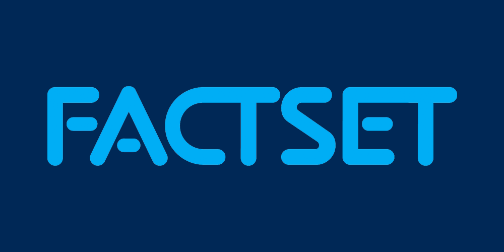

## Table of Contents

## What is FactSet?

FactSet is a company that provides financial data and software to people who work in finance, like investors and analysts. They help these people make smart decisions about where to put their money by giving them lots of information about companies, markets, and the economy. FactSet's tools let users look at data in different ways, make reports, and keep track of how their investments are doing.

The company started in 1978 and has grown a lot since then. Now, it serves clients all over the world, helping them with things like picking stocks, managing portfolios, and understanding market trends. FactSet is known for having a lot of data and for making it easy for users to find what they need and use it to make better financial choices.

## Who founded FactSet and when was it established?

FactSet was founded by Howard Wille and Charles Snyder. They started the company because they saw a need for better financial data and tools to help people in the finance world make smart choices.

The company was established in 1978. Since then, it has grown a lot and now helps people all over the world with their financial decisions.

## What are the main products and services offered by FactSet?

FactSet offers a bunch of tools and services that help people in finance do their jobs better. Their main product is a big database full of information about companies, markets, and the economy. People can use this data to look at how different companies are doing, see what's happening in the markets, and make smart decisions about where to invest their money. FactSet also has tools that let users make charts and reports easily, so they can share their findings with others or keep track of their investments.

Another important service FactSet provides is something called portfolio analytics. This helps people who manage investments see how well their portfolios are doing and make changes if they need to. FactSet's tools can show them how their investments are performing compared to others, and they can use this information to try to do better. They also offer tools for risk management, which helps people understand and manage the risks that come with investing.

Lastly, FactSet helps with research and analysis. They have tools that make it easier for people to do research on companies and markets, and they can use these tools to find new investment opportunities. FactSet also offers training and support to help people learn how to use their products and get the most out of them. This way, even if someone is new to using FactSet, they can quickly start using the tools to help with their financial work.

## How does FactSet gather and manage its data?

FactSet gathers its data from many different places. They get information from companies, stock exchanges, government agencies, and other sources. This data includes things like financial statements, stock prices, and economic reports. FactSet works hard to make sure the data is correct and up-to-date. They use special technology to collect and organize all this information, so it's easy for their users to find what they need.

Once FactSet has the data, they manage it carefully. They store it in big databases that are designed to handle a lot of information quickly. FactSet also makes sure the data is safe and secure, so only the right people can see it. They use special tools to clean and organize the data, making sure it's easy to understand and use. This way, when someone uses FactSet's tools, they can trust that the information they're seeing is accurate and helpful for making decisions.

## What industries does FactSet primarily serve?

FactSet mainly helps people who work in the finance industry. This includes big banks, investment firms, and people who manage other people's money. They use FactSet's tools to look at data about companies and markets, so they can make smart choices about where to invest. FactSet's services are also used by people who do research on companies and markets, helping them find new opportunities for their clients.

Another group that uses FactSet a lot is the asset management industry. These are the people who take care of big pools of money, like mutual funds or pension funds. They use FactSet to keep track of how their investments are doing and to make sure they're meeting their goals. FactSet's tools help them understand risks and make changes to their portfolios when they need to.

FactSet also serves other industries that need financial data and analysis. For example, companies in the technology and healthcare sectors might use FactSet to understand market trends and make strategic decisions. Even though FactSet's main focus is on finance, their tools can be helpful for anyone who needs to make decisions based on data about companies and markets.

## How can someone access FactSet's services?

To use FactSet's services, you usually need to work for a company that already has a subscription. Many big banks, investment firms, and asset managers pay for FactSet so their employees can use it. If you work at one of these places, you can log in to FactSet's website or use their special software on your computer. This gives you access to all their data and tools, which can help you do your job better.

If your company doesn't have a subscription, they can sign up for one. They'll need to talk to FactSet's sales team, who will help them choose the right plan and set everything up. Once the subscription is active, everyone at the company who needs to use FactSet can start doing so. FactSet also offers training to help new users learn how to use their tools effectively.

## What are the costs associated with using FactSet?

Using FactSet can cost a lot of money. The exact price depends on what kind of plan your company chooses and how many people will be using it. FactSet has different plans for different needs, so a big bank might pay more than a smaller investment firm. The cost can be thousands of dollars every month, and it can go up if you need more data or special features.

Besides the monthly fee, there might be other costs too. For example, if your company wants extra training for its employees, that could cost more. Also, if you need help from FactSet's support team a lot, there might be extra charges for that. It's important for companies to think about all these costs when deciding if FactSet is right for them.

## Can you explain how FactSet integrates with other financial tools and platforms?

FactSet works well with other tools and platforms that people in finance use. It can connect with popular software like Microsoft Excel and Bloomberg Terminal. This means you can take data from FactSet and use it in these other programs without any trouble. For example, if you're making a report in Excel, you can pull in the latest stock prices from FactSet right into your spreadsheet. This makes it easier to do your work because you don't have to switch between different programs all the time.

FactSet also has something called an API, which stands for Application Programming Interface. This lets other software talk to FactSet directly. So, if a company has its own special tools for managing investments, they can use FactSet's API to get data and use it in their own systems. This helps everything work together smoothly. By integrating with other tools and platforms, FactSet makes it easier for people to use all their favorite tools at the same time, without having to do a lot of extra work.

## What kind of analytics and reporting tools does FactSet provide?

FactSet has a lot of tools that help people look at data and make reports. These tools let you see how companies are doing, how markets are moving, and how your investments are performing. You can make charts and graphs easily, so it's simple to understand the information. FactSet also lets you compare different companies or see how your portfolio is doing compared to others. This helps you make smart choices about where to put your money.

Another important part of FactSet's analytics is something called portfolio analytics. This tool helps you keep track of your investments and see if they're doing well. You can look at how much risk you're taking and see if you need to make changes to your investments. FactSet's reporting tools also let you create detailed reports that you can share with others. This is helpful if you need to show your boss or clients how things are going. With these tools, you can quickly turn a lot of data into clear, useful information.

## How does FactSet ensure the security and privacy of its data?

FactSet takes security and privacy very seriously. They use strong security measures to keep their data safe. This includes things like encryption, which is like putting a secret code on the data so only people with the right key can read it. FactSet also has strict rules about who can see the data. Only people who need to use it for their work are allowed to access it. They also watch their systems all the time to make sure no one is trying to break in or steal information.

Another way FactSet protects data is by making sure it follows all the rules and laws about privacy. They work hard to make sure they're doing everything right, so their clients can trust them. FactSet also teaches their employees about how to keep data safe. They have training programs to help everyone understand the importance of security and how to handle data properly. By doing all these things, FactSet helps make sure that the information they have stays private and secure.

## What are some of the recent innovations or updates FactSet has introduced?

FactSet has been working hard to make their services even better. One of the recent updates they made is called FactSet Workstation. This is a new way for people to use FactSet's tools. It's easier to use and looks nicer than before. It helps people find the information they need quickly and do their work faster. FactSet also added more data to their database, so now users can see even more information about companies and markets.

Another big change is that FactSet has been using more artificial intelligence (AI) and machine learning. These are smart technologies that can help people find patterns in data and make better predictions. For example, FactSet's AI tools can help users see which companies might do well in the future or find risks they might not have noticed before. This makes it easier for people to make smart choices about their investments.

## How does FactSet compare to its competitors in terms of features and performance?

FactSet is a strong player in the financial data industry, and it competes with companies like Bloomberg, Refinitiv (now part of LSEG), and S&P Global Market Intelligence. One of FactSet's main strengths is its user-friendly interface and powerful analytics tools. People who use FactSet say it's easy to find the information they need and make reports quickly. FactSet also has a lot of data, which helps users get a full picture of companies and markets. Compared to some competitors, FactSet is known for being good at integrating with other tools like Excel, which makes it easier for people to use their own favorite software.

On the other hand, Bloomberg is famous for its real-time data and news, which can be a big advantage for people who need the latest information right away. Bloomberg's terminal is very popular, but some people find it harder to use than FactSet. Refinitiv, which used to be called Thomson Reuters Financial & Risk Business, has a lot of data too, but some users think FactSet's analytics are better. S&P Global Market Intelligence is strong in certain areas like credit ratings and risk management, but it might not have as many tools for portfolio analysis as FactSet. Overall, FactSet is a top choice for many in finance because of its balance of data, ease of use, and powerful tools, but each competitor has its own strengths that might be better for some users.

## References & Further Reading

[1]: ["Advances in Financial Machine Learning"](https://www.amazon.com/Advances-Financial-Machine-Learning-Marcos/dp/1119482089) by Marcos Lopez de Prado

[2]: ["Quantitative Trading: How to Build Your Own Algorithmic Trading Business"](https://books.google.com/books/about/Quantitative_Trading.html?id=j70yEAAAQBAJ) by Ernest P. Chan

[3]: ["Machine Learning for Algorithmic Trading"](https://github.com/stefan-jansen/machine-learning-for-trading) by Stefan Jansen

[4]: ["Evidence-Based Technical Analysis: Applying the Scientific Method and Statistical Inference to Trading Signals"](https://www.amazon.com/Evidence-Based-Technical-Analysis-Scientific-Statistical/dp/0470008741) by David Aronson

[5]: Bergstra, J., Bardenet, R., Bengio, Y., & Kégl, B. (2011). ["Algorithms for Hyper-Parameter Optimization."](https://dl.acm.org/doi/10.5555/2986459.2986743) Advances in Neural Information Processing Systems 24.